# KKE benchmark history

Written by `benchmarks/track.py` from the Benchmarks workflow on every push to `main`; don't edit by hand. What the numbers mean: [docs/BENCHMARKS.md](https://github.com/Khyretos/kk-engine/blob/main/docs/BENCHMARKS.md).

Latest: `c1360ad9c6` (2026-09-26T18:25:20Z) on AMD EPYC 7763 64-Core Processor                , llvmpipe (LLVM 20.1.2, 256 bits). 2 run(s) tracked.

Every run is on a shared GitHub runner (4 vCPUs, lavapipe software Vulkan), so single points wobble; look for steps that stay.

| Metric | Latest | Best | Runs |
|---|---:|---:|---:|
| `bench.audio_mix_32_voices_ms` | 0.0929 | 0.0927 | 2 |
| `bench.fracture_bake_cube_ms` | 7.29 | 7.20 | 2 |
| `bench.impact_synth_8_materials_ms` | 1.04 | 1.03 | 2 |
| `bench.lua_think_50_hooks_ms` | 0.2882 | 0.2832 | 2 |
| `bench.net_snapshot_256_bodies_ms` | 0.0885 | 0.0882 | 2 |
| `bench.particle_fluid_2000_ms` | 4.07 | 4.06 | 2 |
| `bench.rigid_crates_400_ms` | 1.60 | 1.59 | 2 |
| `bench.rigid_raycast_1000_ms` | 0.4960 | 0.4921 | 2 |
| `stress.crates.fps_avg` | 15.00 | 21.93 | 2 |
| `stress.crates.physics_avg_ms` | 0.4570 | 0.4453 | 2 |
| `stress.fps_1pct_low` | 8.84 | 16.28 | 2 |
| `stress.fps_avg` | 17.53 | 21.82 | 2 |
| `stress.frame_p99_ms` | 83.17 | 59.73 | 2 |
| `stress.impacts.fps_avg` | 12.44 | 17.26 | 2 |
| `stress.peak_rss_mb` | 283 | 251 | 2 |
| `stress.walk.fps_avg` | 26.69 | 27.20 | 2 |

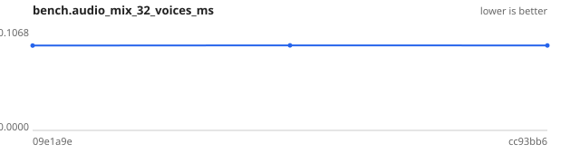

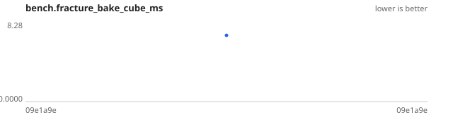

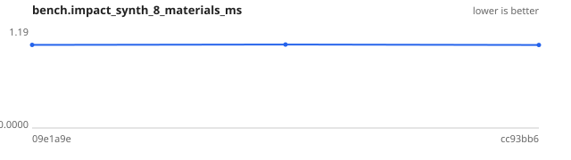

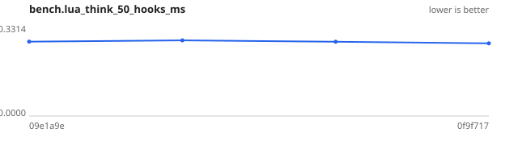

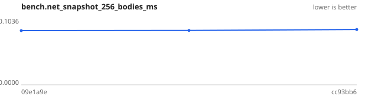

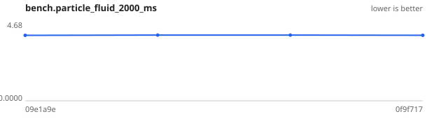

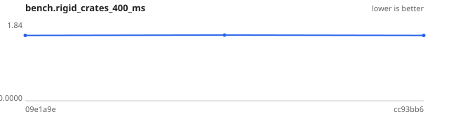

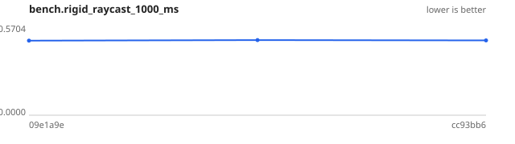

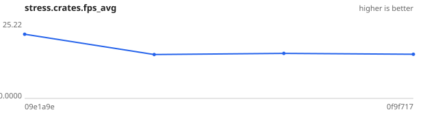

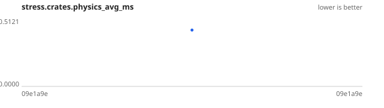

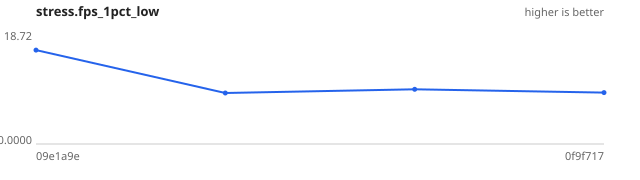

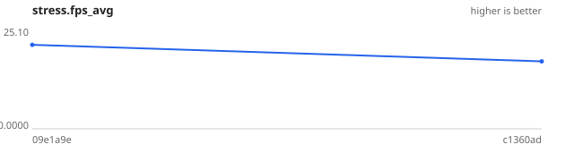

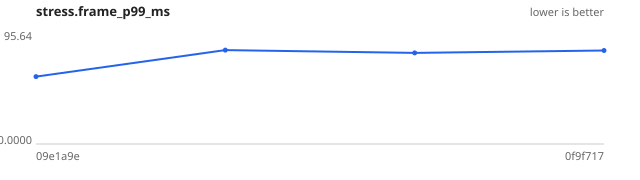

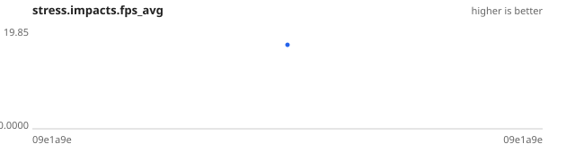

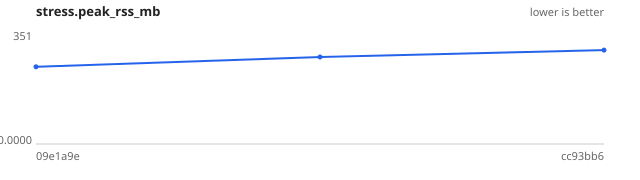

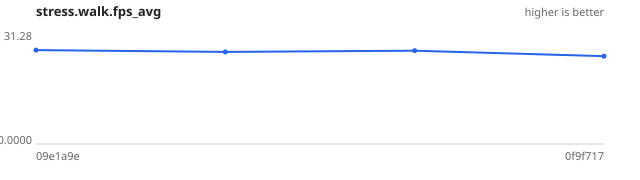
