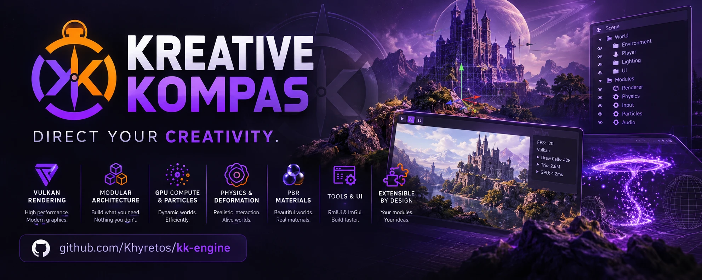

<p align="center">
  
</p>

<p align="center">
  <a href="https://github.com/Khyretos/kk-engine/actions/workflows/ci.yml"></a>
  <a href="LICENSE"></a>
  
  
  <a href="https://ko-fi.com/khyretos"></a>
</p>

#  Kreative Kompas Engine (KKE)

A modular, open-source Vulkan game engine in C++17, built from "lego
pieces": each library does one job, and every gameplay or rendering system
is a **Module** you plug into an `Application`. A game is a list of
`addModule<>()` calls.

KKE aims to be approachable for people scripting games in Lua and for
programmers writing C++ modules, while staying close to the hardware and
running on a single-core minimum spec.

> **KKE is AI-coded.** The code is written by Claude (Anthropic) working
> directly in this repo, in small slices that are built, run and verified
> (screenshots, logs, tests) before they count as done. Read it and question
> it like any codebase you didn't write yourself.

## Features

| Area | What you get |
|---|---|
| **Core** | Module system with a clear lifecycle, fixed-timestep loop, per-module fault isolation, pause/step debugging, async logging (spdlog), thread pool |
| **Rendering** | Vulkan (volk + VMA), PBR (Cook-Torrance), up to 4 lights, soft shadow maps, GPU particles, instancing, frustum culling, mip maps |
| **Physics** | Jolt rigid bodies, world collision and a character controller; AMD FEMFX deformable bodies with plasticity, material fracture and Voronoi breaking; jiggle physics for bones and soft bodies |
| **Simulation** | Particle liquids (PBF) with temperature, meltable voxel solids, Gerstner ocean with buoyancy |
| **Characters** | FBX/OBJ import (ufbx), skinning, animation blending, locomotion with vaulting, ledge hang and shimmy, ragdolls |
| **UI** | RmlUi (HTML/CSS-style game UI) on a custom Vulkan backend, Dear ImGui debug panels, player settings, Noto fonts with colour emoji |
| **Audio** | miniaudio output, own mixer, 3D sound, occlusion, synthesized impact sounds, a sound visualizer for deaf and hard-of-hearing players |
| **Input** | Rebindable actions for keyboard, mouse, gamepads (paddles, gyro), HOTAS and twin sticks, with hold/tap/double-tap/toggle triggers and chords |
| **Networking** | Host/join over ENet, LAN discovery, server-authoritative physics, lag/jitter/loss simulation |
| **Scripting** | Lua 5.4, Garry's Mod-style hooks and timers, hot reload, sandboxed |
| **Content** | `game.json` manifests, a marketplace index, level save/load, an asset catalog for Synty-style packs |

What is solid, partial or not started yet, system by system:
**[ROADMAP.md](ROADMAP.md)**. Known defects and their fixes:
**[BUGS.md](BUGS.md)**.

## Quick start

Linux (Debian/Ubuntu shown; Arch and troubleshooting are in
[docs/BUILDING.md](docs/BUILDING.md)):

```bash
sudo apt-get install -y build-essential cmake ninja-build git \
    libvulkan-dev vulkan-tools mesa-vulkan-drivers glslang-tools \
    libdrm-dev libxkbcommon-dev libx11-dev libxext-dev libxrandr-dev \
    libxcursor-dev libxi-dev libxinerama-dev libwayland-dev \
    libfreetype-dev pkg-config libudev-dev libdbus-1-dev

git clone https://github.com/Khyretos/kk-engine.git
cd kk-engine
cmake --workflow --preset default      # configure + build (CMake 3.25+)
cd build/bin && ./kke_demo
```

Every dependency is fetched from source by CMake, so the versions match on
every platform. Run demos from `build/bin/`: shaders, fonts and each game's
`game.json` are copied next to the executables.

| Preset | What it builds |
|---|---|
| `default` | Core engine with Jolt, Lua and networking; the smallest, fastest build |
| `everything` | Adds AMD FEMFX deformable physics and the GPU profiler |
| `everything-release` | `everything`, optimized (`RelWithDebInfo`) in `build-release/`; use this to judge performance |

Windows (MinGW cross build) and Android builds run in Docker
(`docker compose run --rm windows`); macOS and MSVC builds run on GitHub
Actions. Platform status: [docs/SCALING.md](docs/SCALING.md).

## Demos

| Executable | What it shows |
|---|---|
| `kke_demo` | The walkable showcase: an animated character in a small level using every system. WASD/Shift/Space to move, V for first/third person, F to shoot, E to push, F1 for engine panels. `KKE_NET=host` / `KKE_NET=join:<ip>` for multiplayer |
| `sandbox` | Browse your asset packs, build a level on a grid, save and load it, make props breakable and throw things at them |
| `physics_demo` | FEMFX deformable bodies, fracture and plasticity (needs the `everything` preset) |
| `melt_demo` | Pour lava on ice, wax, chocolate and aluminium and watch them melt |
| `sea_demo` | Drive a boat over the swell; foam floats, iron sinks |
| `jiggle_demo` | Jelly on a plate and soft-tissue bones on a jogging character |
| `synty_demo` | Synty POLYGON models loaded straight from FBX, skinned and animated |
| `rmlui_demo` | The game UI toolkit: menus, settings, inventory drag and drop, HUD, and a live input tester |
| `imgui_demo` | Dear ImGui's full widget demo |
| `kke_basics` | The original building-block demo: cube, grid, particles, orbit camera |

The character in `kke_demo` is Quaternius' Universal Animation Library
mannequin (CC0): put `UAL1_Standard.fbx` in `assets/animations/`, and
`UAL2.fbx` next to it for the real vault and climb clips. Demos
that use Synty packs need your own copy in `assets/synty/`; paid packs are
never part of this repo ([assets/README.md](assets/README.md)).

Every game opens with the 4.5-second Kreative Kompas logo intro. Any key
skips it, `app.setIntroEnabled(false)` turns it off, and `KKE_SKIP_INTRO=1`
skips it for one run.

## Writing a game

The quickest start is the starter template: `tools/new_game my_game`
copies it (a character you can walk, jump and climb with, and a level in
Lua), and [the tutorials](https://khyretos.github.io/kk-engine/tutorials/)
grow it into a small game ([Make your own game](docs/tutorials/getting-started.md)).
Under the hood a game is a list of modules:

```cpp
#include "kke/Application.h"
#include "kke/modules/GridModule.h"
#include "kke/modules/OrbitCameraModule.h"

int main() {
    kke::Application app("My Game", 1280, 720);
    app.addModule<kke::GridModule>();
    app.addModule<kke::OrbitCameraModule>();
    app.addModule<MyGameplayModule>();   // your own kke::Module
    app.run();
}
```

A module overrides the lifecycle hooks it needs (`init`, `update`,
`fixedUpdate`, `render`, `renderUi`, `onEvent`, `shutdown`) and finds other
modules with `app.getModule<T>()`. The `games/` folder has one working
example per system; Lua scripting is covered in
[docs/SCRIPTING.md](docs/SCRIPTING.md).

## Documentation

| Document | Contents |
|---|---|
| [Docs site](https://khyretos.github.io/kk-engine/) | Getting started, tutorials, guides and the Lua API reference, searchable |
| [ROADMAP.md](ROADMAP.md) | Current state of every system and the next gap in each |
| [BUGS.md](BUGS.md) | Every defect found, its cause and fix |
| [ACTION_PLAN.md](ACTION_PLAN.md) | Everything asked for, in priority order |
| [docs/BUILDING.md](docs/BUILDING.md) | Full build guide, system packages, troubleshooting |
| [docs/](docs/README.md) | Design notes per system: audio, input, movement, networking, scripting, optimization, scaling and more |
| [docs/HISTORY.md](docs/HISTORY.md) | The development log: how each system was built and verified |
| [AI_GUIDE.md](AI_GUIDE.md) | Rules for AI agents working on this codebase |

## Tests and CI

```bash
cmake --build build --target kke_tests && ./build/bin/kke_tests
```

CI builds on every push with warnings treated as errors and runs the unit
test suite plus a headless smoke test on lavapipe.

## Support

KKE is built by one person. If you want to help it exist,
[Ko-fi](https://ko-fi.com/khyretos) is the place. The plan for how KKE
reaches people is in [docs/GO_TO_MARKET.md](docs/GO_TO_MARKET.md), and open
work is tracked as [GitHub issues](https://github.com/Khyretos/kk-engine/issues)
by milestone.

## Licence

MIT, see [LICENSE](LICENSE). Vendored and fetched libraries keep their own
licences (for example `external/FEMFX/` and the fonts in `assets/fonts/`).
The Kreative Kompas logo and banner are the project's branding.
