# KKE benchmark history

Written by `benchmarks/track.py` from the Benchmarks workflow on every push to `main`; don't edit by hand. What the numbers mean: [docs/BENCHMARKS.md](https://github.com/Khyretos/kk-engine/blob/main/docs/BENCHMARKS.md).

Latest: `ab17e8c22b` (2026-09-28T05:35:13Z) on INTEL(R) XEON(R) PLATINUM 8573C, llvmpipe (LLVM 20.1.2, 256 bits). 97 run(s) tracked.

Every run is on a shared GitHub runner (4 vCPUs, lavapipe software Vulkan), so single points wobble; look for steps that stay.

| Metric | Latest | Best | Runs |
|---|---:|---:|---:|
| `bench.audio_mix_32_voices_full_ms` | 0.1515 | 0.1096 | 91 |
| `bench.audio_mix_32_voices_ms` | 0.0800 | 0.0614 | 97 |
| `bench.cloth_16x24_basic_ms` | 3.85 | 2.90 | 41 |
| `bench.cloth_16x24_full_ms` | 7.85 | 5.31 | 41 |
| `bench.cloth_1x32_basic_ms` | 0.4498 | 0.3282 | 41 |
| `bench.cloth_1x32_full_ms` | 0.9985 | 0.6111 | 41 |
| `bench.cloth_1x32_off_ms` | 0.4459 | 0.3291 | 41 |
| `bench.cloth_1x64_basic_ms` | 1.87 | 1.38 | 41 |
| `bench.cloth_1x64_full_ms` | 38.99 | 5.27 | 41 |
| `bench.cloth_cape_basic_ms` | 0.4185 | 0.3091 | 30 |
| `bench.cloth_cape_full_ms` | 7.72 | 4.63 | 30 |
| `bench.fracture_bake_cube_ms` | 6.71 | 4.63 | 97 |
| `bench.hair_1x100_straight_ms` | 0.1785 | 0.1071 | 36 |
| `bench.hair_1x160_braids_ms` | 0.4279 | 0.3009 | 18 |
| `bench.hair_1x160_cornrows_ms` | 0.0403 | 0.0327 | 18 |
| `bench.hair_1x200_3b_ms` | 0.4206 | 0.2830 | 21 |
| `bench.hair_1x200_4c_ms` | 0.2317 | 0.1610 | 21 |
| `bench.hair_1x200_bantu_ms` | 0.5683 | 0.3852 | 21 |
| `bench.hair_1x400_curly_ms` | 1.86 | 1.17 | 36 |
| `bench.hair_1x400_long_ms` | 0.9643 | 0.5540 | 36 |
| `bench.hair_8x200_long_ms` | 3.88 | 2.16 | 36 |
| `bench.impact_synth_8_materials_ms` | 1.34 | 0.9068 | 97 |
| `bench.lua_think_50_hooks_ms` | 0.2235 | 0.1408 | 97 |
| `bench.net_snapshot_256_bodies_ms` | 0.0935 | 0.0503 | 97 |
| `bench.particle_fluid_2000_ms` | 3.86 | 2.58 | 97 |
| `bench.rigid_crates_400_ms` | 1.47 | 0.9864 | 97 |
| `bench.rigid_raycast_1000_ms` | 0.4901 | 0.3228 | 97 |
| `stress.crates.fps_avg` | 12.48 | 22.85 | 97 |
| `stress.crates.physics_avg_ms` | 0.4603 | 0.2847 | 97 |
| `stress.fps_1pct_low` | 7.70 | 16.28 | 97 |
| `stress.fps_avg` | 12.48 | 23.34 | 97 |
| `stress.frame_p99_ms` | 97.38 | 57.86 | 97 |
| `stress.impacts.fps_avg` | 10.65 | 19.00 | 97 |
| `stress.peak_rss_mb` | 392 | 251 | 97 |
| `stress.walk.fps_avg` | 14.70 | 29.14 | 97 |

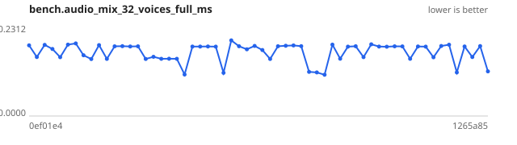

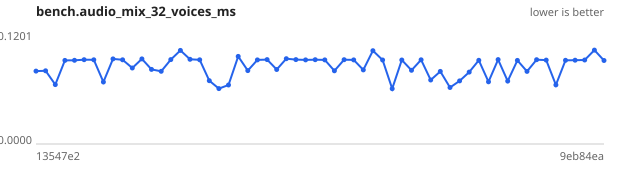

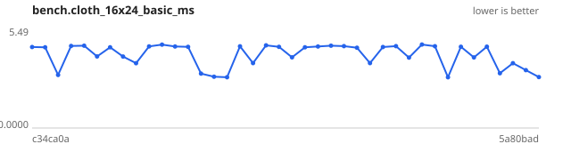

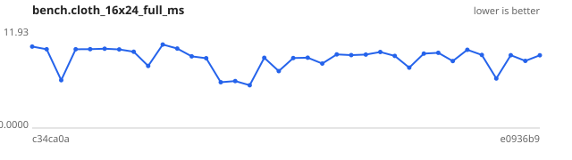

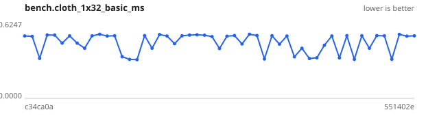

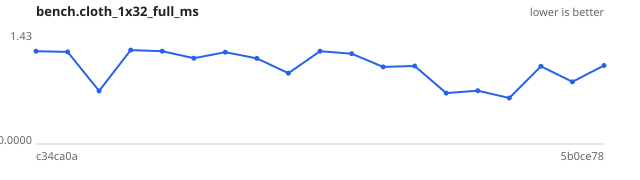

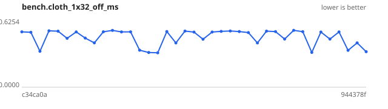

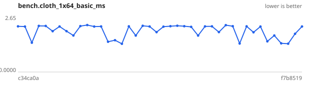

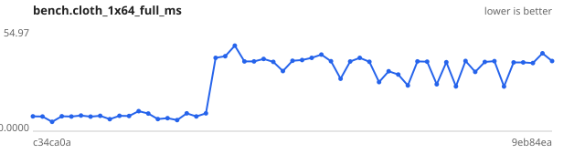

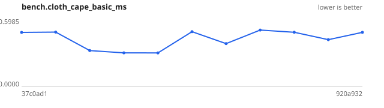

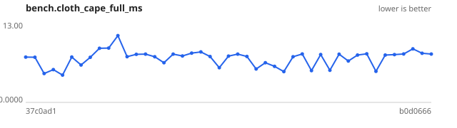

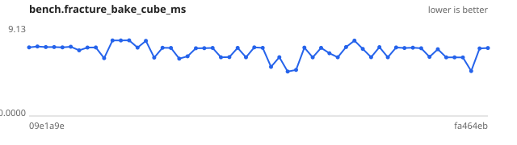

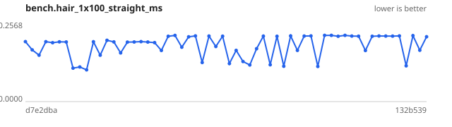

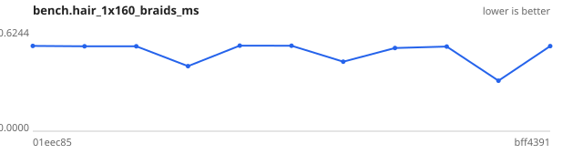

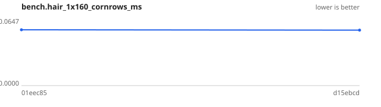

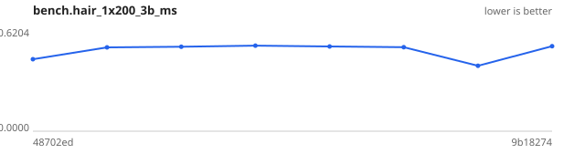

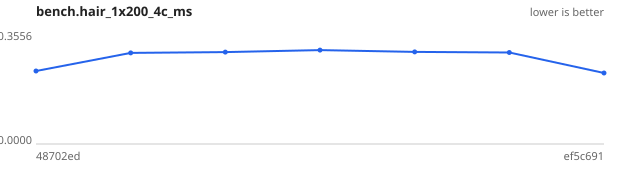

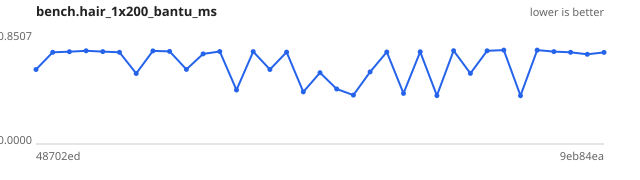

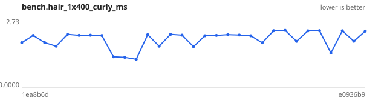

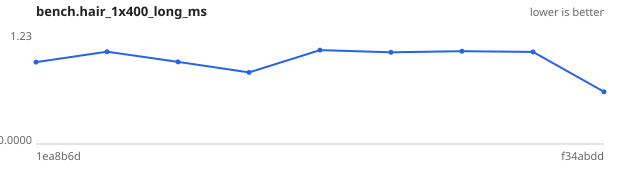

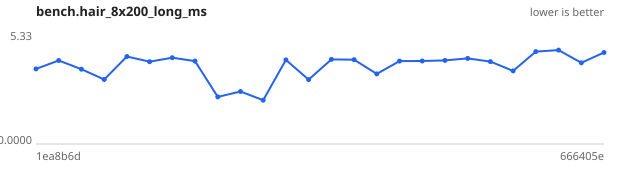

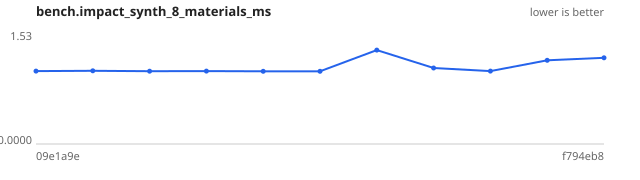

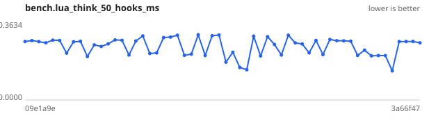

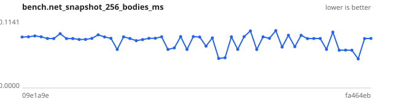

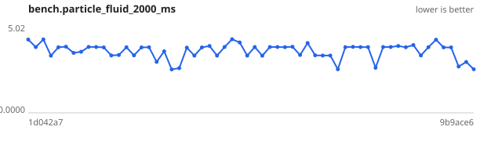

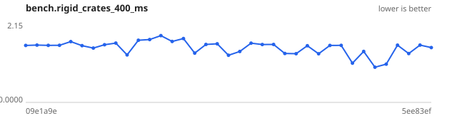

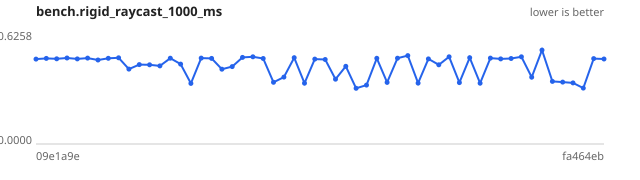

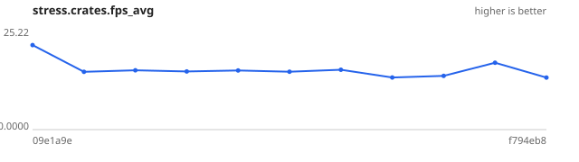

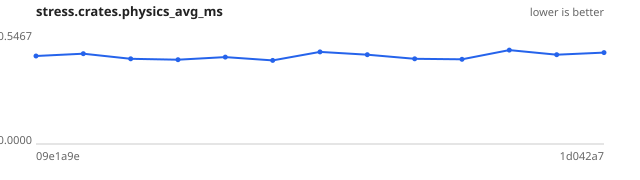

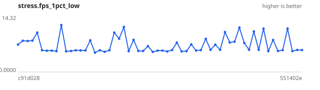

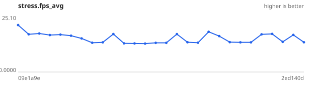

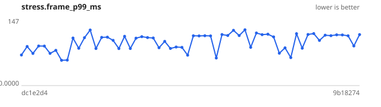

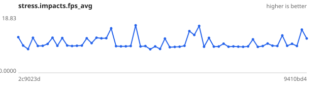

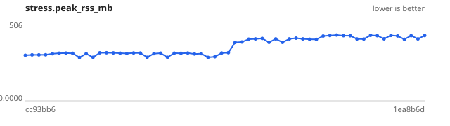

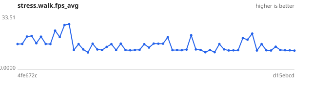
