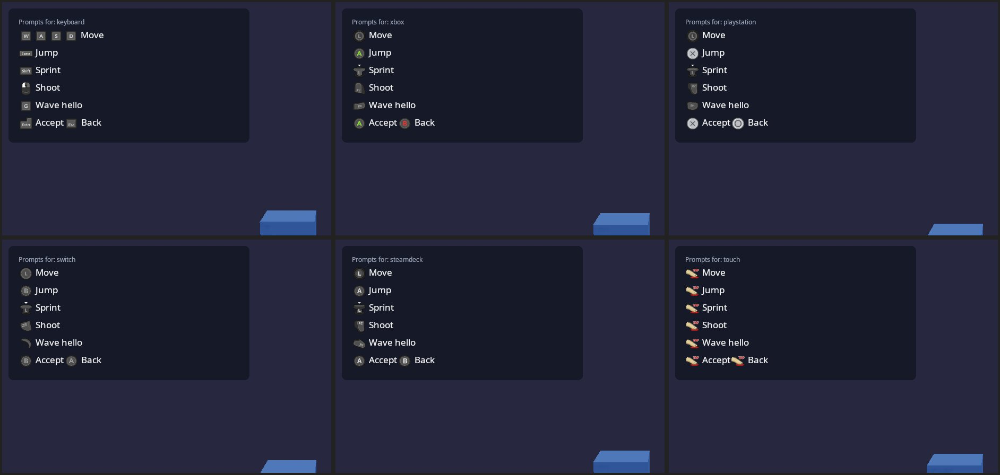

# Input

Everything a player presses goes through **actions** (`kke::InputMap`),
modelled on Escape from Tarkov's binding screen. Games never ask "is W
down?"; they ask "how much is `move`?", "was `jump` pressed?", "is
`crouch` on?". Players can bind **anything to anything**, any number of
times, and nothing is hardcoded except Esc (so nobody can lock themselves
out of the menu).

| Piece | What it does | Where |
|---|---|---|
| `kke::InputDevices` | Every keyboard, mouse, gamepad and raw joystick SDL sees; stable identities; sensors; rumble/LED; rebinding capture | `engine/include/kke/InputDevices.h` |
| `kke::InputMap` | Actions, bindings, triggers, chords, analog shaping, contexts, JSON | `engine/include/kke/InputMap.h` (pure logic, 13 tests) |
| `kke::InputModule` | Owns both, one map per local player, loads/saves `input.json`, standard character actions, left-handed preset, UI navigation actions, virtual test devices | `engine/include/kke/modules/InputModule.h` |
| Input screen | Live tester for every peripheral + the bindings editor | `rmlui_demo` → **Input** tab (`games/rmlui_demo/InputScreen.*`, `ui/input.rml`) |

## Bindings

A binding = a **source**, optional **modifiers**, a **trigger**, and shaping.

**Sources** (anything SDL reports): keyboard keys (by physical position,
named by your layout), mouse buttons 1-32, wheel up/down/left/right, mouse
motion X/Y, gamepad buttons (incl. paddles R4/L4/R5/L5, QAM/Share/Misc,
touchpad click), gamepad axes (whole or either half), raw joystick buttons,
axes (whole or half) and hat directions on **any** device (HOTAS, wheels,
pedals, button boxes), gyro pitch/yaw/roll, accelerometer, touchpad X/Y.

**Triggers** (per binding, so one key can do several things):

| Trigger | Fires | Example |
|---|---|---|
| Press | on the down edge; held while down | Jump |
| Release | on the up edge | throw on release |
| Hold | once held for `holdTime` (default 0.35 s); held until release | Tarkov hold-to-lean |
| Tap | on release if shorter than `tapTime` | reload |
| DoubleTap | second press within `doubleTapWindow` | quick reload (drop mag) |
| Continuous | the whole time (and analog value) | move, sprint (hold) |
| Toggle | each press flips it | crouch, sprint on L3 |

Rules that make this robust:
- **Tap waits for a double tap** only when that same input also has a
  DoubleTap binding, and fires when the window runs out. A double tap
  never also fires the single tap.
- **Tap + Hold on one key** work together (tap = toggle lean, hold = hold
  lean): the tap fires only if released before `tapTime`, the hold only
  after `holdTime`.
- **Chords**: modifiers are any sources that must be held (Ctrl+E, LB+A,
  a HOSAS "shift" button, a pedal). The most specific chord wins: while
  Alt is held, Alt+T fires and a plain T binding stays quiet.
- **Axes and buttons interchange**: half a stick or a trigger past its
  `threshold` presses a button action; keys drive axes with a `scale`
  (W = +1, S = -1 on `move.y`). Two keys held on one axis sum and clamp.
- **Shaping** on analog sources: `deadzone` (radial for stick pairs), a
  response `curve` (value^curve: >1 = finer near the centre), `invert`, and
  `scale` (sensitivity).
- **Contexts**: every action belongs to one ("game", "ui", "vehicle"...);
  disable a context and its bindings go silent (menus open, rebinding in
  progress, typing in a text field).
- **Conflicts** (same input, same modifiers, same trigger, two actions in
  one context) are shown in red but allowed: sometimes it's what you want.

## Devices and identical twins (HOSAS)

Each device gets a stable key:
`vendor:product` + serial number, or the **USB port** (Linux: the sysfs
topology, e.g. `pci0000:00/0000:00:14.0/usb1/1-2/1-2:1.0`, not
`/dev/input/eventN`, which changes between boots; Windows: the HID
instance path), or the path, or the name + an ordinal. Bindings to a raw
joystick name that device, so two identical sticks keep separate bindings.

Identical devices are grouped and numbered **#1/#2 by port**, so the same
stick stays #1 as long as it stays in the same USB port. In the Input
screen, touch a stick and its card lights up; give it a name ("Left
stick"); if you swapped ports, press **Swap twin** and the two trade names
and bindings. Names and swaps live in `input.json` under `devices`.

Gamepads are also raw joysticks, so buttons SDL doesn't map into its
standard layout (extra paddles on some pads) are still bindable as raw
buttons; the capture prefers the standard name when there is one.

**Steam Controller (2026)**: SDL 3.4 maps its R4/L4/R5/L5 as paddles and
QAM as Misc 1, with gyro. KKE turns on SDL's Steam HIDAPI driver
(`SDL_HINT_JOYSTICK_HIDAPI_STEAM`). If Steam Input is running for the game
you'll see "Steam Virtual Gamepad" instead (the real device is hidden by
Steam): turn Steam Input off for the game to use the gyro and paddles
directly.

## Rebinding (capture)

Click **+ Add** (or press A on it). Hold any modifiers first, press the
input, release: the last input pressed becomes the binding and the others
still held become its modifiers. Axis actions also accept moving the mouse,
moving a stick (binds both axes of it) or turning the controller (gyro).
Esc cancels. The button that opened the capture (pad A) is ignored until
released. While listening, the game and UI contexts are off so nothing
else reacts.

## Left-handed

`InputModule::mirrorKeyboard()` (the **Left-handed keys** button) moves
every keyboard binding to its mirror image across the keyboard: WASD ->
O K L ;, Q/E -> P/I, R -> U, Left Shift/Ctrl/Alt -> Right Shift/Ctrl/Alt,
1 -> 0. Left/right move directions are swapped back so left stays left.
Mouse and controller bindings are untouched (swap mouse buttons in the OS
as usual). Press again to mirror back. Or bind every action by hand.

## Controller navigation of menus

The "ui" context has `ui.up/down/left/right` (D-pad and left stick),
`ui.accept` (A), `ui.back` (B), `ui.prev/next` (LB/RB). `UiModule` turns
them into RmlUi focus moves and clicks (spatial navigation: RCSS
`nav: auto`, and `tab-index: auto` so Accept clicks), with key repeat
after 0.4 s. Keys aren't bound to ui.* by default because the keyboard
already reaches RmlUi directly (arrows, Enter, Tab, Esc); add them for a
custom layout. Back and prev/next are the game's to interpret.

## Button prompts

Prompts show a picture of the button to press, on the device the player
is actually using: Space on the keyboard, A on an Xbox pad, Cross on a
DualSense, B (same place) on a Switch pad, the Deck's own buttons on a
Steam Deck, a tap on a touch screen. Pick up another device and every
prompt changes by itself. The pictures are **Xelu's Free Controller &
Key Prompts** (CC0, by Nicolae "Xelu" Berbece; `assets/prompts/xelu/`,
imported by `tools/prompts/import_xelu.sh`).



| Piece | What it does | Where |
|---|---|---|
| `kke::ButtonPrompts` | Action or button -> glyph files and RmlUi markup; pure mapping, unit-tested | `engine/include/kke/ButtonPrompts.h`, `tests/test_button_prompts.cpp` |
| `InputModule::promptStyle(player)` | Which glyphs each player sees: follows the device they touched last | `kke/modules/InputModule.h` |
| `<prompt>` | RmlUi element for any document; redraws when the device changes | `UiModule` |
| `input.prompt`, `input.promptText`, `input.glyph`, `input.style`, `InputStyle` hook | The same for Lua | [SCRIPTING.md](SCRIPTING.md) |

**Which device.** A key, a mouse click or a real mouse push means
keyboard; a pad button, or a stick or trigger pushed past half, means that
pad's make (SDL's pad type; the Deck and the Steam Controller by their
USB ids; any pad SDL can't name gets Xbox glyphs); a finger on the screen
means touch. In split screen each player follows the devices assigned to
them. Phones start as touch, a Steam Deck as the Deck, everything else as
keyboard. `KKE_PROMPT_STYLE=xbox|playstation|switch|steamdeck|steamcontroller|keyboard|touch`
forces one (developer builds; screenshots); games can offer the same as a
setting with `InputModule::forcePromptStyle`.

**Which button.** A prompt for an action shows its binding for that
device, so rebinding changes the prompt: modifiers first (Ctrl + S), an
axis the keyboard drives shows its keys (W A S D), a stick shows the
stick. An action with nothing bound on that device shows nothing. `ui.*`
actions on the keyboard show the keys RmlUi answers to (Enter, Esc,
arrows, Tab). On touch, a Button action is a real on-screen button (see
"Touch screens") unless the game names a gesture for it
(`prompts().setTouchGesture("jump", "swipe_up")`). Buttons that
aren't actions have names: `a b x y` (by position, so `a` is Cross on a
DualSense and B on a Switch), `lb rb lt rt ls rs start back guide
dpad_up ... l4 r4 l5 r5`, `key:Space`, `mouse:left`, `touch:tap`
(`hold`, `double_tap`, `swipe_up`, `zoom_in`, ...).

In RML:

```html
<prompt action="jump" label="Jump"/>
<prompt button="a" label="Join"/>             <!-- "press A to join" -->
<prompt text="{jump} jump, hold {sprint} to run"/>
<prompt action="ui.accept" label="Ready" player="2"/>
```

In C++ (a HUD bound with `data-rml="hint"` instead of `{{hint}}`):

```cpp
auto* in = app.getModule<kke::InputModule>();
hud.hint = in->promptText("{move} move  ·  {jump} jump  ·  hold {sprint} to run");
// A pad that was just plugged in, before it belongs to anyone:
kke::PromptStyle s = kke::InputModule::promptStyleFor(device);
std::string join = in->prompts().rml(in->prompts().namedGlyphs(s, "a"), "Press to join");
```

Glyphs are 1.6em square, inline with the text. To make them bigger
without changing the text, give the images a font size:
`#hint img { font-size: 15dp; }` draws them 24dp high.
Keys without a picture (F13, `\`) are drawn as key caps
(`.kke-prompt-key`). The engine copies the keyboard (dark and light),
Xbox Series, PS5, Switch, Steam Deck, Steam Controller and gesture sets
next to every game; the pack's other sets (PS3/PS4, Xbox 360/One, Wii,
Stadia, Luna, VR, arrows) stay in the repository for games that want them.

## Touch screens

One finger is the mouse: SDL's touch-to-mouse emulation turns it into
mouse motion and left-button events, so ImGui, RmlUi and click/drag code
work with a finger unchanged. Two fingers are gestures:
`kke::TouchGestures` (`kke/TouchGestures.h`) turns raw
`SDL_EVENT_FINGER_*` into two-finger drag, pinch and twist, and
`OrbitCameraModule` uses them (drag turns the view, pinch zooms, twist
spins it). The sandbox's Play mode also plays with a gamepad as a
pointer; see docs/PLAY_TO_MAKE.md "Fingers and controllers".

In the touch style the prompts are the buttons: every Button action in a
hint (`<prompt action="fire" label="shoot"/>`, `promptText("{jump} jump")`,
`input.promptText` in Lua) is drawn as a coloured pill with its label on
it, and a finger on it holds that action down until it lifts
(`InputMap::setScreenButton`), several fingers several buttons. In
`promptText` the words after a placeholder, up to the next one or
punctuation (` · `, `,`, `;`, `|`, `.`, `:`, brackets, two spaces), are its
label; more than three words (or 22 letters) is a sentence, so the button
takes the action's own label and the sentence stays text beside it. An
action bound to a mouse button (select, order to the crosshair) means
"here, on the scene": on a touch screen that is a tap on the scene, so it
shows the tap picture, never a button. Each action
keeps one of five colours (its place among the map's actions), so buttons
next to each other differ. A press on a button is not also a click in
the game. Axes (move, look) keep their picture; an on-screen stick is
not there yet. `KKE_PROMPT_STYLE=touch` shows the buttons on a PC, where
the mouse presses them.

## Phone, PC and console

Menus are made for one kind of screen at a time, so a phone's menus don't
fight a PC's (`kke/UiProfile.h`, `Application::uiProfile()`):

| Profile | Chosen for | Standard margin |
|---|---|---|
| `phone` | the `android` and `ios` targets | 2.5% of the short side |
| `console` | `steam-deck`, `handheld-pc` (TVs, pads) | 5% (a TV's title-safe area) |
| `desktop` | everything else | none |

`KKE_UI_PROFILE=phone|desktop|console` picks one by hand (with
`KKE_WINDOW=720x1600` a PC shows a phone's layout).

- **Safe area.** Menus (RmlUi) and the F1 panels (ImGui's work area) keep
  to `Application::uiSafeRect()`: the system's safe area (a notch, rounded
  corners, the status and navigation bars, `SDL_GetWindowSafeArea`) shrunk
  by the profile's margin. Nothing a menu puts at `left: 0` or `bottom: 0`
  is cut off. The RmlUi context *is* that rectangle, so a point from SDL
  (window points) goes through `UiModule::toContext()` before it's compared
  with `GetAbsoluteOffset()`; `toPoints()` goes back.
- **Per-screen layouts.** Every document's body gets `kke-phone`,
  `kke-desktop` or `kke-console`, and `kke-portrait` or `kke-landscape`, so
  one RCSS file lays a menu out per screen:
  `body.kke-phone.kke-portrait .btn { width: 22%; }`. Lua reads the
  profile with `ui.profile()`.
- **One menu at a time on small screens.** On a phone or console the
  marketplace's game list folds into a "Games" button instead of sharing
  the screen with the game's own panel; the command demos' order bar
  drops its key line (its buttons are tapped) and stacks its hint under
  it.

## Split screen

`InputModule(path, players)` creates one map per player;
`assignDevices(player, {refs})` gives each player their devices. A binding
to "any gamepad" then means "any of *this player's* gamepads".

Drawing: `Application::views()` takes one camera per player, each drawn
into its part of the window (`kke/Viewports.h`: `splitScreen(1..4)`,
side by side or stacked for two, quarters for three and four, and
`pictureInPicture(corner)` for a small view over the others, like a map
or a rear-view mirror). Empty means the one camera over the whole
window, as before. Every module's `render()` runs once per view with
that view's camera, viewport and `RenderContext::viewIndex`; a module
that writes camera-dependent GPU data in `render()` keeps one copy per
view (ModelModule's culled instance lists, DebugDraw's camera-facing
lines). The UI overlay covers the whole window once. Limits: at most 4
views, and the screen-space liquid surface (`FluidSurface`, melt demo)
draws only without split screen.

In `kke_demo` (Split screen panel, or `KKE_SPLIT=2..4`): players 2-4 each
take the next controller, in the order they were plugged in; player 1
keeps the keyboard, mouse and every controller nobody else took. A
player without a controller runs the parkour lane on their own, so split
screen can be seen without any controllers. Extra players play in third
person without foot/hand IK (like network players). "Overhead view"
(`KKE_OVERHEAD=1`) adds a picture-in-picture of player 1 from above.

Games that start on a menu let the players join themselves instead:
`kke::LobbyModule` ([LOBBY.md](LOBBY.md)) seats each controller that
presses A, shows "press A to join" when one is plugged in, and assigns
the devices with `applyInput()`.

## Testing without hardware

`KKE_VIRTUAL_INPUT=hosas,pad` attaches two identical virtual flight sticks
and a virtual gamepad with gyro (SDL virtual joysticks; `pad,pad,pad`
attaches three gamepads); `KKE_VIRTUAL_INPUT_LATE=<s>:<spec>` plugs them
in s seconds in, to test hot-plugging;
`KKE_VIRTUAL_INPUT_ANIMATE=1` moves them (sticks sweep, buttons cycle,
gyro turns; the pad avoids menu buttons). CI runs every demo this way.
`KKE_VIRTUAL_PAD_SCRIPT="8:back,9:dpad_down,9.6:dpad_right,12:leftx=1,13:leftx=0"`
plays presses on the first virtual pad: `<seconds>:<button>` taps a
button for 0.3 s (the names ButtonPrompts knows: `a`, `back`, `lb`,
`dpad_down`, ...), `<seconds>:<button>*<hold>` holds it for `hold`
seconds (`5:a*1.5`), `<seconds>:<axis>=<value>` holds a stick or trigger
(`leftx`, `righty`, `rt`, ...) until the next change; a trigger's value
goes from 0 (let go) to 1 (pulled all the way). That drives a
game's menus and controls headless, for screenshots and checks.
`KKE_LEFT_HANDED=1` starts `kke_demo` mirrored.

## Files

`input.json` next to the game:

```json
{ "version": 1,
  "devices": { "aliases": { "231d:0200/port:...1-2:1.0": "Left stick" }, "swapped": {} },
  "players": [ { "version": 1, "bindings": [
      { "action": "jump", "source": { "kind": "key", "code": 44 }, "trigger": "press" },
      { "action": "reload.quick", "source": { "kind": "key", "code": 21 }, "trigger": "doubleTap" },
      { "action": "ammo.check", "source": { "kind": "key", "code": 23 },
        "modifiers": [ { "kind": "key", "code": 226 } ], "trigger": "press" } ] } ] }
```

JSON or YAML (`input.yml` works too, and stays YAML when the engine saves
it; see [DATA_FILES.md](DATA_FILES.md)). Written atomically (temp file +
rename). Unknown actions and malformed entries are skipped, never fatal;
actions a file doesn't mention keep their defaults (so a game update can
add actions without resetting anyone's bindings).
