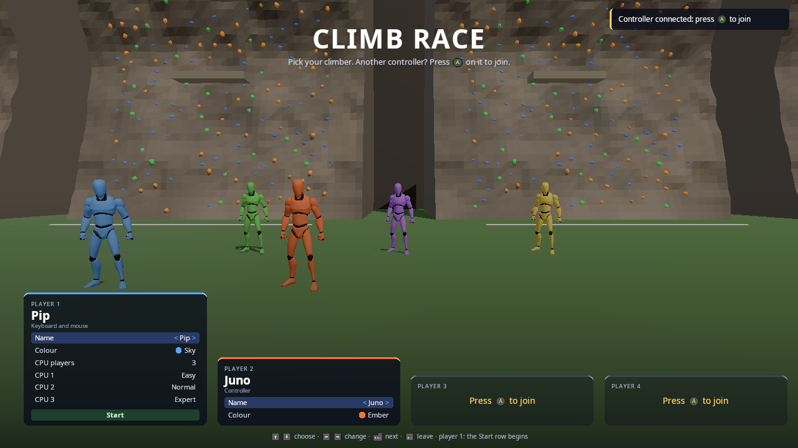

# The start menu: players join, pick a look, set the CPU players

`kke::LobbyModule` is the menu a local multiplayer game starts on. Every
controller that presses A joins, each player picks how they look, and
player 1 sets how many CPU players there are (0 to 5) and how good each one
is. During the game a controller that is plugged in gets a toast,
"Controller connected: press A to join", instead of a key or a command
turning split screen on. Climb Race (`games/climb_race`) uses it.



## How it plays

- **Player 1 is always in.** Until they press something they are "any
  device"; the first controller or key they press on becomes theirs
  ("press A or Enter").
- **Joining.** Any other controller pressing A (the south face button:
  Cross on a PlayStation pad) takes the next free seat, up to four. When
  player 1 is on a controller, Enter on the keyboard joins too. B (Esc)
  leaves the seat.
- **Picking.** Each seat has a cursor: up and down choose a row, left and
  right change it, A moves on. The rows are the game's look fields (Climb
  Race: name and colour). Player 1's card also has the game's settings:
  CPU players, the difficulty of each (Easy, Normal, Hard, Expert), any
  rows other modules add, and Start. Start on player 1's controller starts
  from any row.
- **Hot-plugging.** A controller plugged in shows a toast with its own
  button (Xelu glyphs, [INPUT.md](INPUT.md) "Button prompts"). One that
  belongs to a player and comes loose keeps its seat ("Juno's controller is
  unplugged") and carries on when it's back.
- **During the game** the menu is closed, but a free controller pressing A
  still joins. The game decides when they come in (Climb Race: the next
  race; the toast says so).
- Looks and settings are saved (`<game>_lobby.json`, or `.yml`: see
  [DATA_FILES.md](DATA_FILES.md)) when the game starts from the menu, and
  loaded next time. Controllers are not saved: they're claimed again.

## Using it in a game

```cpp
// main.cpp: after InputModule and UiModule
app.addModule<kke::LobbyModule>("my_game_lobby.json");

// the game's init()
m_lobby = app.getModule<kke::LobbyModule>();
kke::Lobby& l = m_lobby->lobby();
l.addLookField({ "name", "Name", { "Pip", "Juno", "Rook" }, {} });
l.addLookField({ "colour", "Colour", { "Sky", "Ember" }, { { 0.35f, 0.65f, 1.0f }, { 1.0f, 0.45f, 0.2f } } });
l.setCpuCount(1);                  // the default, before load()
m_lobby->load();                   // last time's looks and settings
m_lobby->setTitle("MY GAME", "Another controller? Press {a} on it to join.");

// every frame while the menu is up: draw the players behind it, then
if (l.takeStart()) {
    m_lobby->close();
    m_lobby->save();
    m_lobby->applyInput();         // one InputModule player per seat, on its own devices
    for (int seat : l.joinedSeats()) spawnPlayer(seat, m_lobby->playerOf(seat), l.seat(seat).look);
    for (int i = 0; i < l.cpuCount(); ++i) spawnCpu(l.cpuDifficulty(i));
}
// back to the menu
m_lobby->open();
```

- A look field with `id` `"name"` names the seat (`seatName`); a field
  with swatches colours the card's top edge.
- `setMaxCpus(0)` hides the CPU rows; `setDifficulties({...})` renames or
  adds levels (the game decides what each one means).
- `addOption({ id, label, choices, value, visible, onPress, onChange })`
  adds a row to player 1's settings, before Start: with choices it's a
  value (left / right), without it's an action (A presses it). Climb Race
  adds Online (Off / Join / Host), Game and Join this way
  (games/climb_race/Net.cpp, docs/NETWORKING.md "In Climb Race"). Set
  `visible` to show a row only when it applies; `setTitle` redraws them.
- `onJoin` / `onLeave` are called with the seat.
- The title and the subtitle take button prompts: `{a}`, `{start}`,
  `{jump}` (ButtonPrompts::format).
- `kke::Lobby` is pure logic (no window, no SDL), so it's unit-tested
  (`tests/test_lobby.cpp`); LobbyModule turns real devices into its
  presses and shows it with RmlUi.

## Testing without controllers

| Variable | Effect |
|---|---|
| `KKE_VIRTUAL_INPUT=pad,pad,pad` | Three virtual gamepads (one per `pad`) |
| `KKE_LOBBY_JOIN=<n>` | The first n controllers join as players 2.. at startup (player 1 takes the keyboard) |
| `KKE_VIRTUAL_INPUT_LATE=<s>:pad` | A gamepad plugged in s seconds in: the "press A to join" toast |

All three are developer switches: shipping builds ignore them.

```sh
cd build/bin
KKE_SKIP_INTRO=1 KKE_VIRTUAL_INPUT=pad,pad,pad KKE_LOBBY_JOIN=2 KKE_VIRTUAL_INPUT_LATE=12:pad ./climb_race
```

shows the Climb Race menu with three players, and the toast twelve
seconds in.
