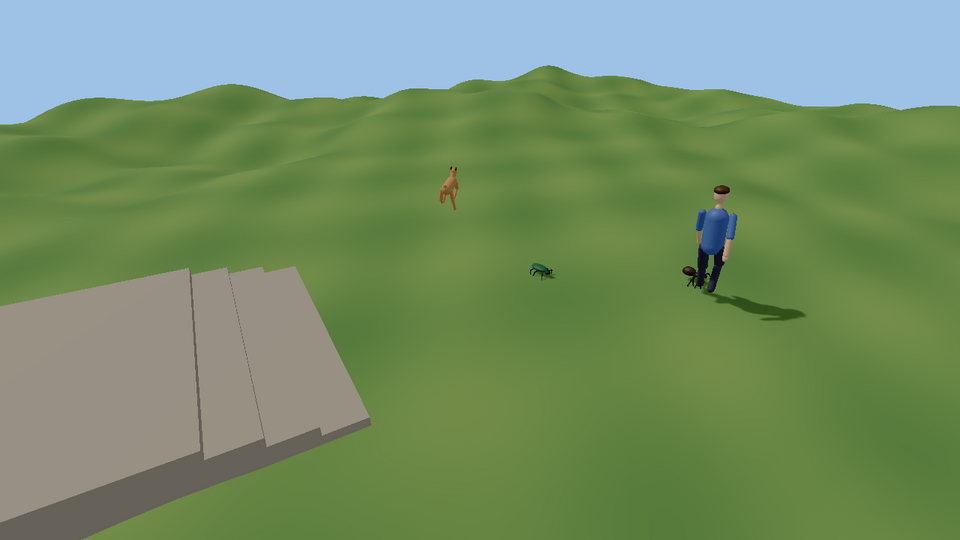

# Procedural animation

Motion worked out every frame instead of played back from a clip: feet that
find the ground, animals with any number of legs that walk, trot and gallop
without a single walk clip, heads that turn toward what they notice, and
bodies that stagger when hit and catch themselves (or don't).

> **Status (2026-09-27):** done: the engine side, the play-to-make blocks
> (Shove, Look at, Look away) and `games/procedural_demo` are on main and
> tested.

Everything lives in [`kke/ProceduralAnim.h`](../engine/include/kke/ProceduralAnim.h)
(the reference) on top of what was already there:

| Already in the engine | Where |
| --- | --- |
| Clips, blend spaces, crossfading state machine | `kke/Animator.h` |
| Two-bone IK, biped foot placement, retargeting | `kke/AnimRig.h` |
| Ragdolls (humanoid, quadruped), joint limits | `kke/Ragdoll.h`, [RAGDOLLS.md](RAGDOLLS.md) |
| Secondary motion (tails, ears, soft bodies) | `kke/JigglePhysics.h`, [JIGGLE.md](JIGGLE.md) |
| Locomotion controller (what moves the capsule) | `kke/Locomotion.h`, [MOVEMENT.md](MOVEMENT.md) |

Nothing here is new science. The algorithms are the standard published ones:
FABRIK for long chains (Aristidou & Lasenby 2011), the Raibert heuristic for
where a foot lands (Raibert 1986), gait phase tables from biomechanics
(Hildebrand; Alexander 1984, including the Froude number that tells every
animal when to change gait), and motor-driven active ragdolls exactly the way
Jolt's own `JPH::Ragdoll::DriveToPoseUsingMotors` does it (Jolt is already a
dependency; no new library was needed).

## The layers, in order

Every piece is a layer that takes a `kke::Pose` and changes it, with a weight
so it can fade in and out:

```
Animator (clips)                      or the rest pose, for a creature with no clips
  -> blendPosesMasked / addPose       upper body waves while the legs walk; additive flinch
  -> ProceduralGait + applyGait       procedural legs          (or LegPlacer: clip legs on hills)
  -> LookAt                           head / spine toward a target
  -> solveTwoBone / solveFabrik       hands on things, tails, tentacles
  -> JigglePhysics                    secondary motion
  -> ActiveRagdoll                    physics follows all of the above; hits push it off
```

## Legs for any animal: `ProceduralGait`

The controller (AI, player input, `kke::Locomotion`) moves the creature as a
point with a heading. `ProceduralGait` plans the footsteps: each foot stays
planted in the world until its turn in the gait, then swings in an arc to
where it will be needed next, found by asking the ground. The body rises and
settles with the terrain, pitches and rolls to its feet, bobs at push-off and
leans into turns.

```cpp
#include "kke/ProceduralAnim.h"

// A dog-sized quadruped: 0.8 m long, 0.3 m wide, hips 0.5 m up.
kke::ProceduralGait gait(kke::makeLegs(4, 0.8f, 0.3f, 0.5f));

auto ground = [&](const glm::vec3& from, glm::vec3& hit, glm::vec3& normal) {
    auto h = physics->physicsRaycast(from, {0, -1, 0}, 3.0f); // any IPhysicsWorld
    if (!h.hit) return false;
    hit = h.point; normal = h.normal; return true;
};

gait.reset(bodyWorld, ground);                                // once, and after teleports
// every frame, after the controller moved the body:
gait.update(bodyWorld, velocity, turnRateDegrees, ground, dt);
for (int i = 0; i < gait.legCount(); ++i) {
    const auto& f = gait.foot(i);                             // f.position, f.normal, f.planted
    if (f.landed) footstepAt(f.position);                     // sound and dust
}
glm::mat4 drawnBody = gait.bodyPose();                        // for the torso / pelvis
```

**Legs** are numbered front to back, left then right: a biped is L, R; a
quadruped FL, FR, BL, BR (the same order as `kke::QuadrupedBones`); six legs
L1, R1, L2, R2, L3, R3; eight likewise. `makeLegs(count, length, width,
hipHeight)` lays out mirror pairs; a `LegDesc` per leg (hip, rest foot, upper
and lower segment lengths, in body space: +Z forward, origin on the ground)
describes anything else.

**Gaits** (`kke::Gait`): walk, trot, pace, canter, gallop, bound, pronk,
tripod, wave, and `Auto`, which picks from speed with the Froude number
v²/(g·hip height): quadrupeds walk below 0.5, trot to 2.5 and gallop above;
bipeds walk then run; six and eight legs wave then run on tripods. Because the
thresholds are relative to leg length, a pug and a horse both change gait at
the right speed for their size. Gaits change mid-stride without feet
teleporting: a leg finishes its swing before the new timing takes over.

**Timing.** A cycle is between `cycleFast` and `cycleSlow` pendulum periods of
the leg (2π√(L/g)), and never so long that a foot would have to drag further
than `strideScale` × leg length. Standing still, feet that ended up far from
rest (`resettle`) step back under the body, one gait beat at a time.

### On a skeleton

For a rigged animal (the Quaternius farm animals, anything with
`QuadrupedBones` names) the same gait drives the bones:

```cpp
auto chains = kke::quadrupedLegChains(model);                 // FL, FR, BL, BR
kke::ProceduralGait gait(kke::legsFromSkeleton(model, chains, modelToBody));
int hips = /* index of "Hips" */;
// per frame:
kke::Pose pose = animSet.restPose();                          // or an Animator pose (idle, eat...)
kke::applyGait(model, pose, chains, hips, gait, instanceTransform);
```

`applyGait` moves the hips by the gait's body sway and puts every foot on its
planned spot with two-bone IK. Knees keep bending the way they bend at rest,
so front knees and hind hocks fold opposite ways.

### Clip legs on hills: `LegPlacer`

An animal with good walk and run clips doesn't need procedural legs, only
feet that meet the ground. `LegPlacer` is `FootPlacer` for any number of
legs: each foot keeps its animated height above the ground under it, the body
drops as far as the lowest foot needs and pitches / rolls to the slope, and
two-bone IK bends the legs.

```cpp
kke::LegPlacer legs(kke::quadrupedLegChains(model), hips);
legs.apply(model, pose, groundInModelSpace, dt, onGround ? 1.0f : 0.0f);
```

## Look-at and aim: `LookAt`

```cpp
kke::LookAt look = kke::LookAt::quadruped(model);   // Neck, Head
// or kke::LookAt::humanoid(model)                  // spine_02, spine_03, neck_01, head
glm::vec3 target = worldToModel * glm::vec4(player, 1);
look.apply(model, pose, noticed ? &target : nullptr, dt);
```

The turn is shared along the chain (more in the head, less in the spine),
limited (`maxYaw`, `maxPitch`) and smoothed (`speed`). A target further round
than `giveUpYaw` is dropped and the head comes back to forward rather than
snapping over the shoulder. For aiming, build a `LookAt` from any chain of
`Link{bone, share}` and pass the weapon's direction as `forward`.

## A person's arm: `solveHumanArm`

`solveTwoBone` bends a chain wherever its pole says and swings it the
shortest way, so a person's arm can end up reaching through its own back,
bending its elbow backwards or twisting its upper arm. For people, use
`solveHumanArm` ([kke/AnimRig.h](../engine/include/kke/AnimRig.h)): it
places the elbow by its swivel round the shoulder-hand line (Tolani,
Goswami & Badler 2000), starting from where an elbow hangs, and builds
each bone from its direction and the elbow's hinge, so the elbow only
bends forward. `ArmLimits` holds the joint ranges: the shoulder's (in the
chest's frame, so a turned torso turns it), the elbow's bend, the
forearm's twist, the wrist's bend and twist. A goal outside them is moved
to the nearest pose the arm can make, and the result says where the hand
went: attach what the hand holds to that.

```cpp
kke::HumanArm right = kke::makeHumanArm(model, rightArm, leftArm); // once
kke::ArmGoal goal;
goal.hand = targetModelSpace;
goal.handRotation = gripRotation;  // optional: the forearm and wrist turn it as far as they go
goal.elbowToward = poleModelSpace; // optional: leans the elbow, within ArmLimits::swivel
kke::ArmResult held = kke::solveHumanArm(model, pose, right, goal);
```

Tennis holds its racket this way (the racket follows the hand) and Climb
Race puts its hands on holds with it. Both use the overload that also
knows the body (`kke/BodyShape.h`: the arm goes round the torso, head and
legs, never through them) and hold things by the palm with the fingers
closed on them (`kke/Equipment.h`); [EQUIPMENT.md](EQUIPMENT.md) explains
both.

## Long chains: `solveFabrik`

Two-bone IK (`kke::solveTwoBone`, or `solveHumanArm` for people's arms) is exact for arms and most legs. Tails,
necks, tentacles and three-segment insect legs use FABRIK:

```cpp
kke::IkChain tail = kke::findIkChain(model, "Tail1", "Tail4");
kke::solveFabrik(model, pose, tail, targetModelSpace, &pole);
```

`fabrikPoints` does the same on bare joint positions (creatures drawn from
primitives), and `kneePosition` gives the knee of a two-segment limb.

## Layering clips: `blendPosesMasked`, `addPose`

```cpp
kke::BoneMask upper = kke::boneMask(model, {"spine_01"});        // spine and everything above
kke::blendPosesMasked(walkPose, wavePose, upper, 1.0f, pose);    // walk + wave
kke::addPose(pose, flinchPose, flinchFirstFrame, {}, 0.7f, pose); // additive flinch on top
```

## Active ragdoll: hit reactions and balance

A ragdoll whose joints have motors, driven toward the animation: at full
strength it looks exactly like the clip; a hit weakens the muscles around the
body that was hit (and, less, the joints next to them), knocks the balance,
and both recover over time. Too far off balance (the torso leaning more than
`fallTilt` from where the clip has it, or the pelvis sinking by `fallDrop`)
and it goes limp, lies there for `getUpDelay`, then blends back to the clip.

```
Animated --hit()--> Active --steady for calmSeconds--> GettingUp --> Animated
                      \--off balance--> Fallen --getUpDelay--/
```

```cpp
kke::ActiveRagdoll active(desc);                            // desc from buildHumanoidRagdoll / buildQuadrupedRagdoll
// when something hits the character:
if (!active.physical()) handle = ragdolls->createRagdoll(desc, velocity);
active.hit(body, push);
ragdolls->pushRagdollBody(handle, body, push);
// every frame:
active.setTargets(binding, animatedBoneWorld);              // where the clip has the bones
std::vector<glm::mat4> bodies;
ragdolls->ragdollBodyTransforms(handle, bodies);
active.update(dt, bodies);
if (active.physical()) ragdolls->driveRagdoll(handle, active.drive());
else if (handle) { ragdolls->destroyRagdoll(handle); handle = 0; }
// skin from poseFromRagdoll(...) while physical(); in GettingUp blend with
// blendPoses(ragdollPose, animatedPose, active.getUpBlend()).
```

`IRagdollPhysics::driveRagdoll` is implemented by the Jolt module
(`RigidBodyModule`): swing-twist and hinge motors in position mode, torque
limited by strength (`torquePerKg` × the heavier body's mass at full
strength), plus an optional pull on a few bodies straight to their targets
(`assistBodies` and `assist`: the pelvis, and the chest too on four legs,
with gravity fed forward so it doesn't sag) that is what keeps a hit
character on its feet and goes away when balance is lost. It is applied
before every physics step, so it holds the same at 20 fps as at 144. FEMFX ragdolls have no motors: there
`driveRagdoll` returns false and characters simply go limp.

## On any model: `ModelModule::setPoseModifier`

A skinned model playing a clip can have a procedural layer on top: the
modifier gets the clip's pose as model-space bone matrices each frame and
changes them, and that is what is skinned and what `boneWorld()` returns.
`poseFromModel` turns the matrices into the per-bone pose the layers here
take (and `poseToModel` back):

```cpp
models.setPoseModifier(instance, [&](std::vector<glm::mat4>& bones, float dt) {
    kke::Pose pose = kke::poseFromModel(model, bones);
    look.apply(model, pose, &targetInModelSpace, dt);
    bones = kke::poseToModel(model, pose);
});
```

It is skipped while a ragdoll (`setBoneWorldOverride`) drives the skeleton.

## Driven by the AI

`kke::ai::Agent` ([AI.md](AI.md)) already says what each animal wants, so a
rig reads it rather than keeping its own state:

| Agent field | Drives |
| --- | --- |
| `position`, `yaw`, `velocity` | `ProceduralGait::update(body, velocity, turnRate, ground, dt)`: the body frame from position and yaw, the gait (walk, trot, gallop) from the speed |
| `anim` | the layer on top: `eat`/`drink`/`sniff` lower the head (`LookAt` at the ground in front), `rest` lowers the body (`GaitSettings`), `attack` is a lunge, `alert` holds still and looks |
| `hasLookAt`, `lookAt` | `LookAt::apply` (neck and head), `nullptr` when `hasLookAt` is false |
| `enabled = false` | ragdolled: hand the body to `ActiveRagdoll` and give it back on `Animated` |

Turn rate is the change in `yaw` over the frame. A hit on an animal is
`ActiveRagdoll::hit`; while it is `physical()` set `enabled = false` so the
AI doesn't steer a body it doesn't control.

## Play-to-make

Following [PLAY_TO_MAKE.md](PLAY_TO_MAKE.md), the same blocks are open at the
node and Lua levels, and the Simple level gets them through its recipes:

| Node ("People") | Lua | What happens |
| --- | --- | --- |
| "Shove" | `play.stagger(thing [, push])` | They stagger and try to keep their feet (joint motors toward the pose they had); a big shove (about 4 m/s and up) still knocks them over, and they get up again by themselves where they landed. `FellOver` / `StoodUp` fire as usual. The bat still knocks them flat, even mid-stagger. |
| "Look at" | `play.lookAt(thing [, at])` | They keep turning head and upper spine toward `at`: a thing (followed as it moves), a place (`Vec`, Lua), or you (the camera) when left out. Works on top of whatever clip they play. |
| "Look away" | `play.lookAway(thing)` | Back to looking ahead, smoothly. |

A world without joint motors (a FEMFX-only build) makes Shove an ordinary
knock-over, and Look at returns false; neither is an error, so a graph made
in one build runs in any.

## Trying it

`games/procedural_demo` (no Synty assets needed): a spider, a beetle, a dog
and a person, built from generated skeletons with no clips at all, walk over
hills and a flight of steps. Click the ground and everyone comes to the
flag; click the dog or the person to hit them (Shift for a hard hit that
knocks them down; they get up again); click a bug and it runs off. 1 / 2 / 3
make the dog walk, trot or gallop, 0 lets it pick by speed. See its
[README](../games/procedural_demo/README.md) for the `KKE_PROC_*` switches.



In the sandbox, `play.stagger` and `play.lookAt` work on placed people
(from a node graph or a Lua script).

## Tests

`tests/test_procedural_anim.cpp`: gait tables (diagonal pairs trot together,
duty factors), Froude gait changes, feet staying planted while in stance,
steps landing on raised ground, body pitch on a slope, look-at limits and
give-up, FABRIK reach and bone lengths, masked and additive blending, the
active ragdoll state machine, and the Jolt motor drive holding a limb on
target, a ball joint reaching its target, and a motor-driven character
staying up where a limp one falls (`tests/test_jolt_ragdoll.cpp`). The play
blocks are covered in `tests/test_node_graph.cpp`
(`ShoveAndLookAtWorkWithAnyWorld`).
