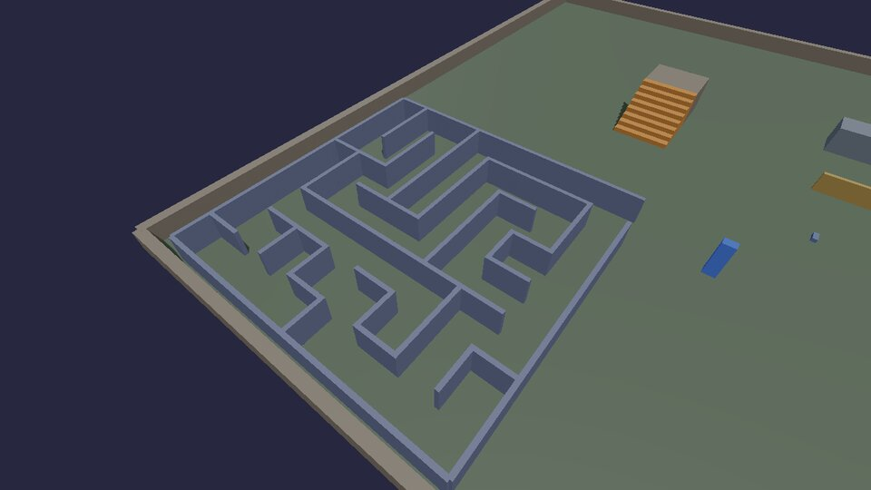
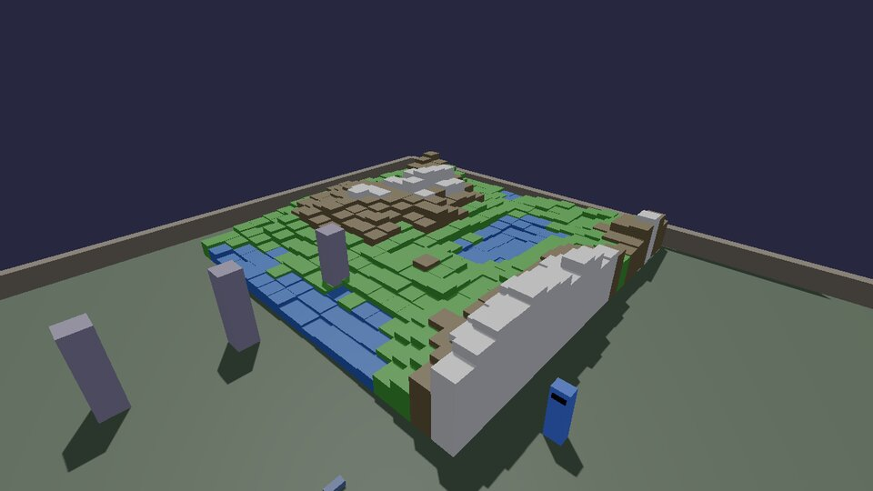
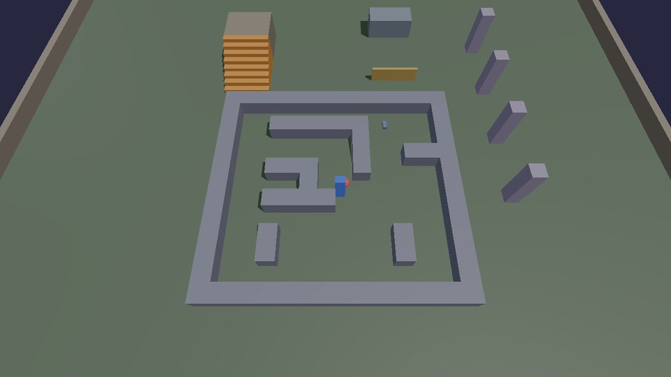
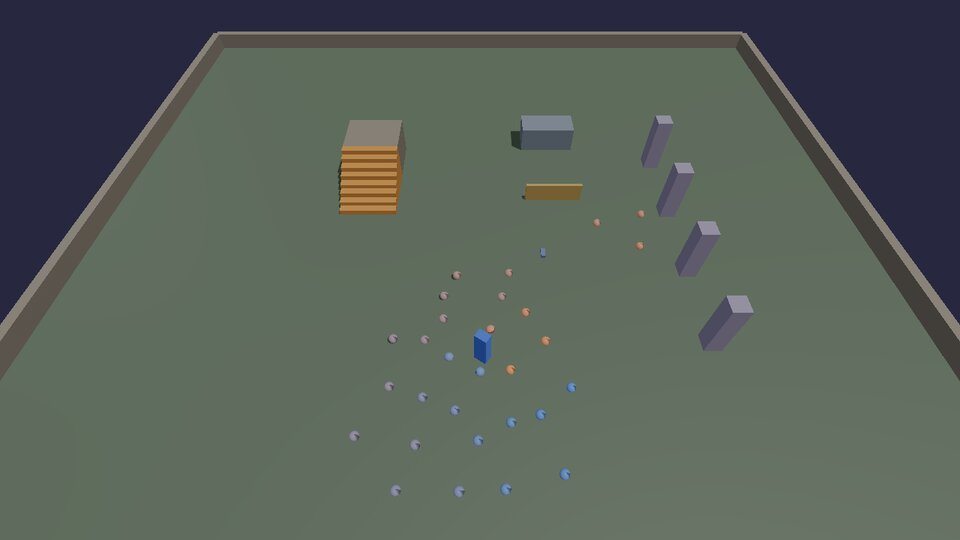

# Algorithms

Classic game algorithms, each in one Lua file you can read top to bottom:
a maze generator, terrain from noise, A* pathfinding and flocking. They
build with physics boxes and balls so you can walk into the result.

## Maze generation

The **recursive backtracker** (a depth-first search): start in a corner,
step to a random neighbour you haven't visited, knocking down the wall
between, and when every neighbour is visited, back up until one isn't.
The result has exactly one path between any two cells. **M** makes a new
one; the entrance faces where the player starts.



```lua title="maze.lua"
--8<-- "docs/cookbook/recipes/maze.lua"
```

[Download maze.lua](recipes/maze.lua){ .md-button }

- The "recursion" is a list used as a stack: `table.insert` pushes,
  `table.remove` pops. It never runs out of stack however big the maze.
- `math.randomseed(seed)` makes the same seed give the same maze: handy
  for levels you want to share as a number.
- Each cell only draws its east and south wall; the outer walls close the
  rest. That avoids placing every inside wall twice.

## Terrain from noise

**Value noise** gives smooth random numbers across the ground: a random
height at each whole-number point, eased between them. Adding a few layers
of it, each twice as detailed and half as strong (**fractal noise**, or
fBm), looks like hills. Height picks the colour: water, grass, rock,
snow. **N** makes a new landscape.



```lua title="terrain.lua"
--8<-- "docs/cookbook/recipes/terrain.lua"
```

[Download terrain.lua](recipes/terrain.lua){ .md-button }

- `lattice` is a hash: the same grid point always gives the same number,
  so the terrain doesn't depend on the order it's built in.
- `smooth` (smoothstep) is what hides the grid: without it, the slopes
  have visible creases at every grid line.
- Squaring the height before using it flattens the valleys and sharpens
  the peaks. Try `h ^ 3`, or `1 - math.abs(2 * h - 1)` for ridges.

## A* pathfinding

A* finds the shortest way around walls. It explores cells cheapest-first,
where a cell's cost is the steps taken to reach it plus a guess at the
steps left. As long as the guess never overestimates (here: the Manhattan
distance, which ignores walls), the first path it finds to the goal is a
shortest one. The red ball re-plans twice a second as you move, and the
yellow dots show its plan.



```lua title="astar.lua"
--8<-- "docs/cookbook/recipes/astar.lua"
```

[Download astar.lua](recipes/astar.lua){ .md-button }

- The map is text, so you can draw a level in the file. `#` is a wall.
- Picking the lowest `f` by looking through every open cell is fine for
  a few hundred cells; for big maps use a binary heap.
- To allow diagonal steps, add the four diagonal directions with a cost of
  1.414 and use the octile distance as the guess.
- Following the path is the [patrol](moving.md#a-patrol) recipe with the
  path as its waypoints.

## Flocking

Craig Reynolds' **boids** (1986): each ball looks only at its neighbours
and follows three rules. **Separation**: don't crowd them. **Alignment**:
head the way they're heading. **Cohesion**: move toward their middle.
Together they flock like birds or fish. These also keep inside a pen and
drift after you.



```lua title="flocking.lua"
--8<-- "docs/cookbook/recipes/flocking.lua"
```

[Download flocking.lua](recipes/flocking.lua){ .md-button }

- The weights (1.5, 0.5, 0.4) set the character: more separation is a
  loose swarm, more cohesion a tight school, more alignment a stream.
- Every boid reads every other one, so 30 boids is 870 checks a frame.
  For hundreds, put them in a grid of cells and only check the
  neighbouring cells.

Next: [animation and IK](animation.md).
