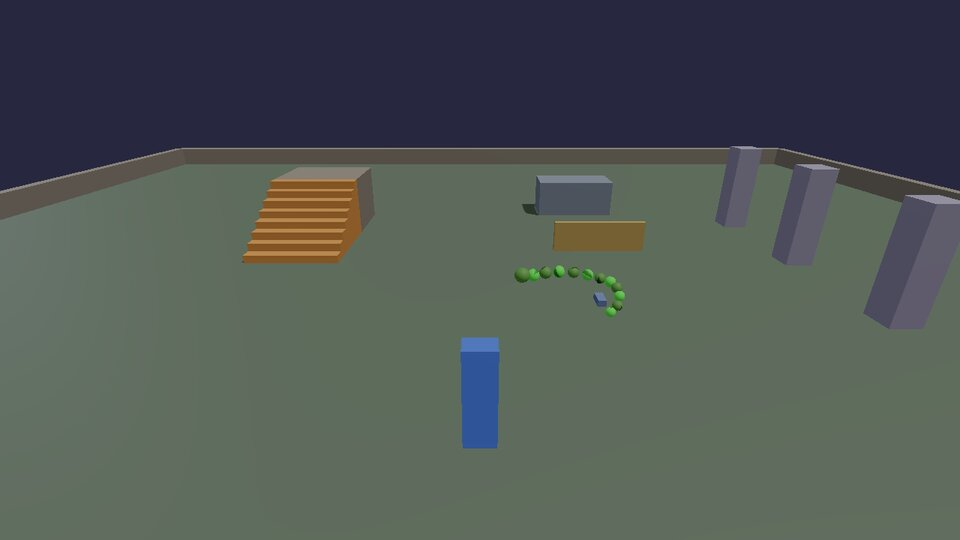
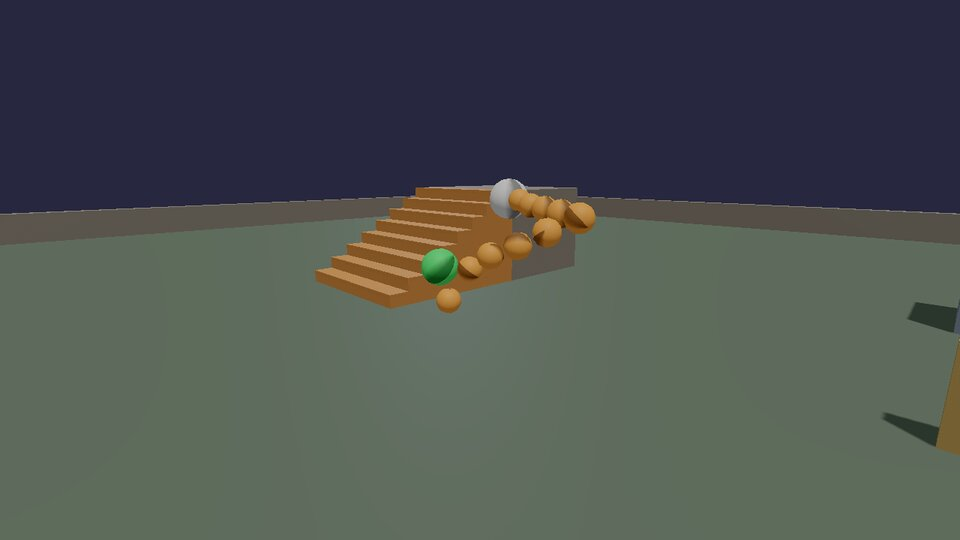
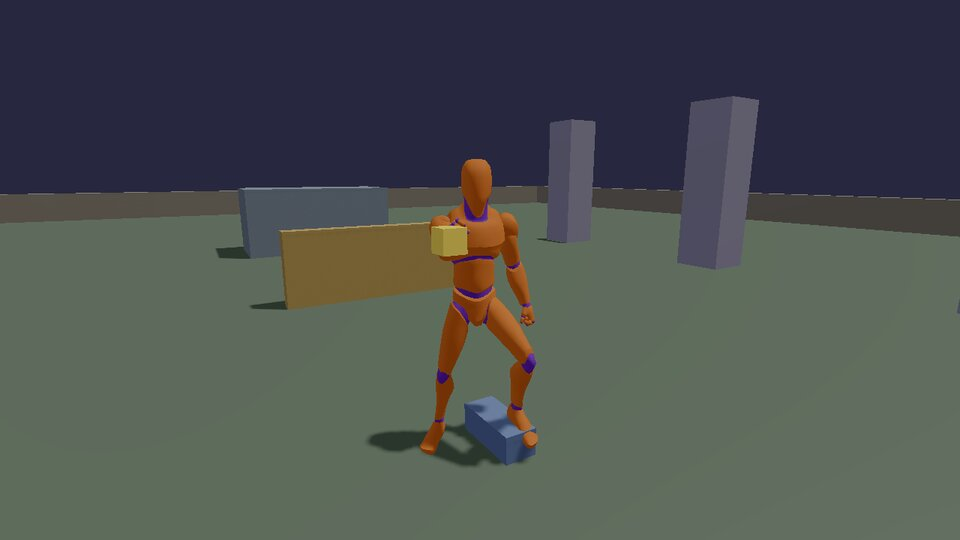
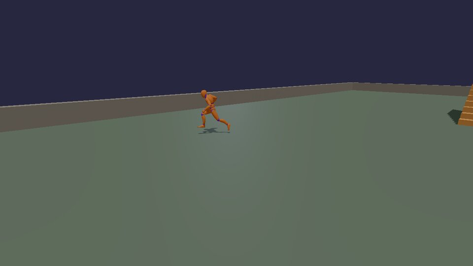

# Animation and IK

Two kinds of animation meet in a game. **Authored** animation is clips an
artist made (walk, jump, wave), played and blended. **Procedural**
animation is motion worked out while the game runs: a head turning to look
at you, a hand reaching for a door handle, feet finding the stairs, a
tail swinging behind. The best-looking characters are both: clips first,
procedural touches on top.

The first two recipes are Lua with plain balls, so you can see the maths
move. The rest is C++ in the cookbook game, on a real skeleton: the
mannequin from Quaternius' [Universal Animation Library](https://quaternius.com/packs/universalanimationlibrary.html)
(CC0), which ships with the engine (`assets/animations/UAL1_Standard.fbx`).

## Follow the leader

No clips at all. The head follows a figure eight; every segment is pulled
to a fixed distance behind the one in front, so the body winds along the
path the head took; and a sine wave running down the body makes it bob.



```lua title="caterpillar.lua"
--8<-- "docs/cookbook/recipes/caterpillar.lua"
```

[Download caterpillar.lua](recipes/caterpillar.lua){ .md-button }

The same constraint makes tails, tentacles, ropes, snakes and trains. Run
it from the tail back toward the head as well, pinning the last segment,
and you have **FABRIK**, a popular IK method for long chains.

## Two-bone IK, in Lua

**Inverse kinematics** answers "where do the joints go so the hand ends
up there?". For two bones (upper and lower arm, thigh and shin) there's
an exact answer: the three sides of the triangle shoulder-elbow-hand are
known (two bone lengths and the distance to the target), so the **law of
cosines** gives the angle at the shoulder. A **pole** point says which
way the elbow bends; without one, the elbow could be anywhere on a
circle.



```lua title="ik_arm.lua"
--8<-- "docs/cookbook/recipes/ik_arm.lua"
```

[Download ik_arm.lua](recipes/ik_arm.lua){ .md-button }

When the target is out of reach, the distance is clamped to the arm's
length, so the arm points straight at it instead of breaking.

## On a skeleton: the mannequin

The cookbook game's `Mannequin` module (`games/cookbook/Mannequin.cpp`)
has two mannequins. One walks round a circle, speeding up and slowing
down. The other stands with one foot on a step, reaches for a floating
orb and turns its head to look at you.



Poses are per-bone translation, rotation and scale (`kke::Pose`), in each
bone's parent's space. The order every frame is: the `Animator` plays and
blends clips into a pose, the procedural steps change that pose, and
`poseToLocals` hands it to the renderer.

### Blend spaces

A **1D blend space** puts clips along one number, here speed: idle at 0,
walk at 1.4 m/s, jog at 3.2. Setting the parameter to the character's
speed blends the two nearest clips, at a shared phase so the feet land
together instead of sliding.



```cpp title="games/cookbook/Mannequin.cpp"
--8<-- "games/cookbook/Mannequin.cpp:blend"
```

Each frame the speed rises and falls, a spring smooths it, and the blend
space follows:

```cpp title="games/cookbook/Mannequin.cpp"
--8<-- "games/cookbook/Mannequin.cpp:walker"
```

Beyond blend spaces the `Animator` has clip states that crossfade
(`play(state, fade)`), non-looping states that report when they're done
(`finished()`), and root motion. The showcase game (`games/showcase/`)
drives its whole character with one, from idle to vaulting.

### Finding the bones

IK works on named chains of bones. `findChain` looks them up by name;
the head's forward axis is worked out once from the rest pose, because
every skeleton points its bones differently:

```cpp title="games/cookbook/Mannequin.cpp"
--8<-- "games/cookbook/Mannequin.cpp:rig"
```

### 1. Feet on the ground

`kke::FootPlacer` casts a ray down from each foot, lowers the pelvis if
one foot must go lower than the capsule's floor, bends the legs with
two-bone IK so each foot lands on what's under it, and tilts it to match
a slope. It works in the model's own space, so the ray's results are
turned into it:

```cpp title="games/cookbook/Mannequin.cpp"
--8<-- "games/cookbook/Mannequin.cpp:feet"
```

### 2. A hand on a target

The engine's two-bone IK is the Lua recipe above, on real bones:

```cpp title="games/cookbook/Mannequin.cpp"
--8<-- "games/cookbook/Mannequin.cpp:ik"
```

The last argument is the weight: 0 leaves the animated pose, 1 is the
full solve. Fading it in and out over a few frames is what makes a hand
reach for a ledge and let go without popping (the showcase does exactly
that when vaulting).

### 3. Looking at you

A look-at is one rotation: from where the head faces now to where the
target is, limited to what a neck can do. A spring smooths the target so
the head doesn't snap when you move quickly.

```cpp title="games/cookbook/Mannequin.cpp"
--8<-- "games/cookbook/Mannequin.cpp:look"
```

The last line is the one piece of bone maths worth remembering: to turn a
bone by a rotation given in model space, turn its local rotation by that
rotation as seen from its parent.

## The helpers

Both come from `games/cookbook/Procedural.h`, and the unit tests check
them (`Cookbook.SpringArrivesWithoutOvershootAtAnyFrameRate`,
`Cookbook.TurnTowardsStopsAtTheLimit`):

```cpp title="games/cookbook/Procedural.h"
--8<-- "games/cookbook/Procedural.h:spring"
```

A critically damped spring is the most useful smoothing there is: camera
follow, UI slides, look targets, speed changes. Unlike "move 10% of the
way each frame" it behaves the same at any frame rate.

```cpp title="games/cookbook/Procedural.h"
--8<-- "games/cookbook/Procedural.h:turn"
```

## More in the engine

- **Jiggle physics** (hair, tails, soft parts): `kke::JiggleRig`, a Verlet
  chain on top of the pose. [Jiggle physics](../JIGGLE.md).
- **Ragdolls**: [Ragdolls](../RAGDOLLS.md), from limp to getting back up.
- **Retargeting** one skeleton's clips onto another (the mannequin's clips
  on a Synty character): `kke::matchBones` and `retargetAnimations` in
  `kke/AnimRig.h`.
- **Locomotion**: [Movement](../MOVEMENT.md), how the character decides
  what to do, and which animation goes with it.

Next: [physics](physics.md).
