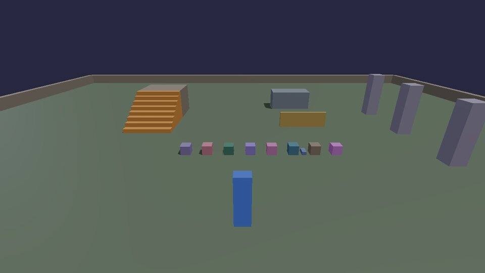

# Sound

KKE's sounds are mostly **synthesized from impacts**: a body with a sound
material hits something, and the engine makes the right thump, clink or
crack, louder for a harder hit, placed in 3D where it happened, muffled
behind walls. A script's job is to say what things are made of.

## Sound materials

One crate of every material, dropped in a row: listen to the difference.
**O** drops them again, **P** plays a metal ping in front of you.



```lua title="sounds.lua"
--8<-- "docs/cookbook/recipes/sounds.lua"
```

[Download sounds.lua](recipes/sounds.lua){ .md-button }

- `audio.materials()` is a table of name to id (`Stone`, `Wood`, `Metal`,
  `Glass`, ...). Pass the id as `material` when you make a body, and
  its hits make sound by themselves.
- `audio.impact(position, material, loudness)` plays one on demand, for
  things that aren't collisions: a footstep, a pickup, a bell.
- The `Contact` hook is how a script hears about hits too: `c.speed` is
  how hard, `c.materialA` and `c.materialB` what.

## Where the sound comes from

Everything is positioned in 3D relative to the camera, so the crates on
the left sound on the left. Sounds behind walls are quieter and duller
(occlusion, by raycast), and a room's size changes its reverb. Nothing to
set up: it's how `AudioModule` works. The settings players can change
(volume, the sound visualizer for deaf and hard-of-hearing players,
mono) are in the settings screen every starter game has.

[Audio](../AUDIO.md) covers the synthesis, spatialization, occlusion and
the optional Steam Audio backend; [Tutorial 4](../tutorials/04-sound.md)
adds materials and a pickup chime to the tutorial game.

Next: [multiplayer](networking.md).
