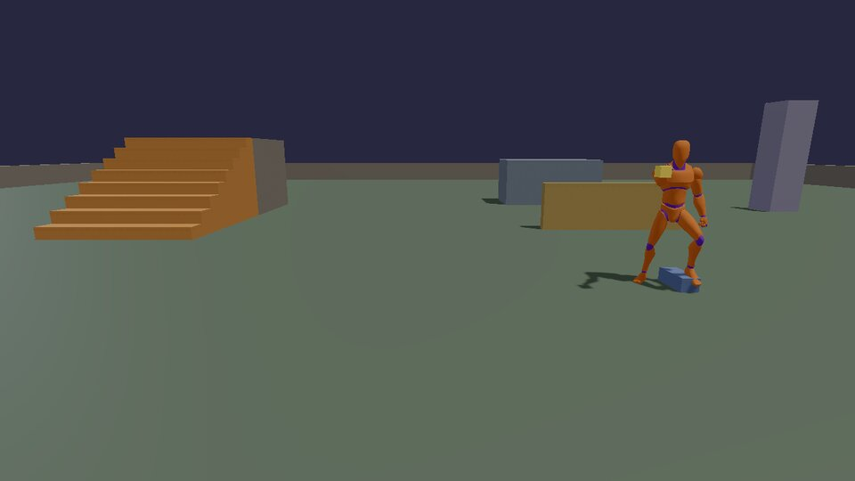
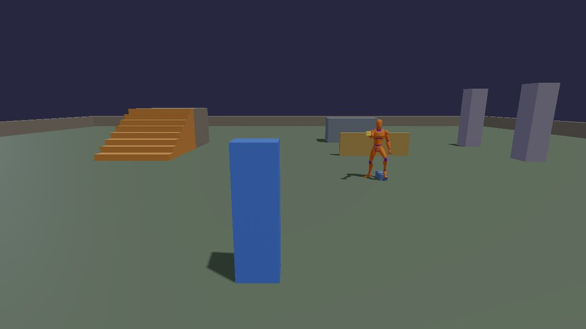
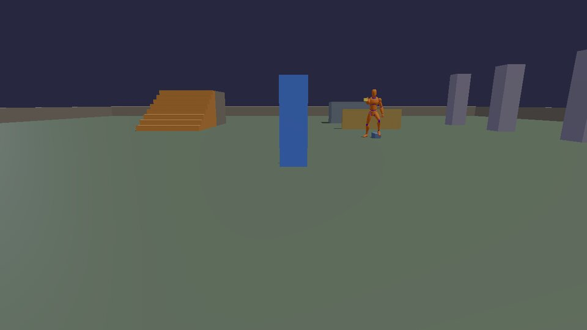
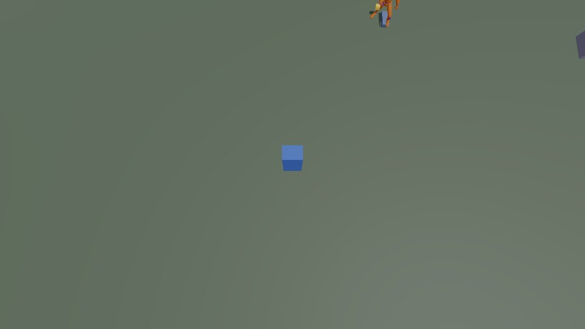
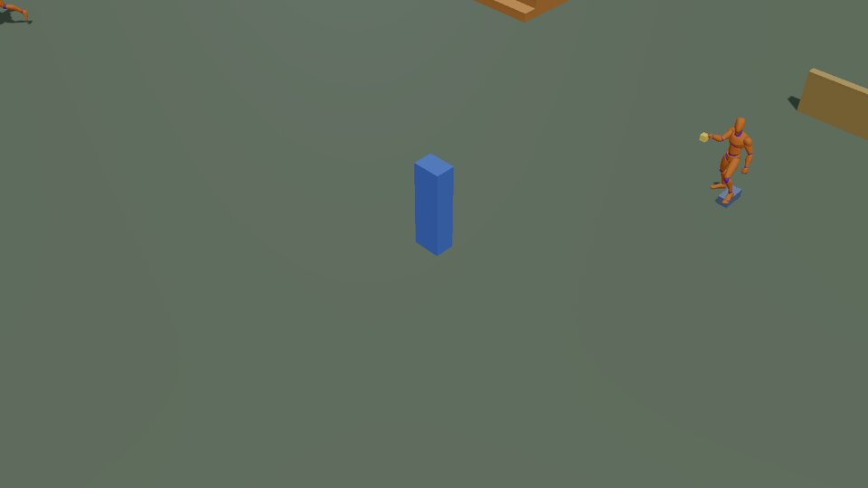
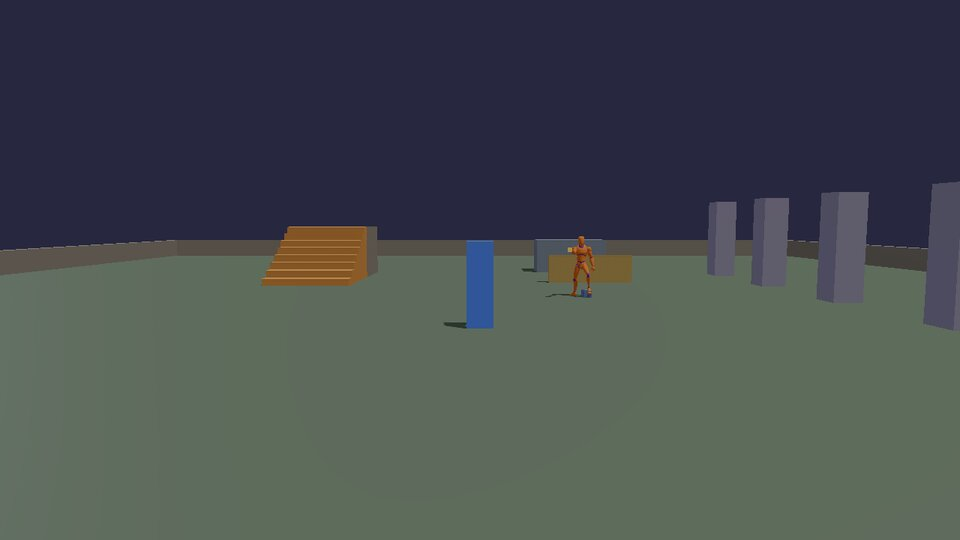
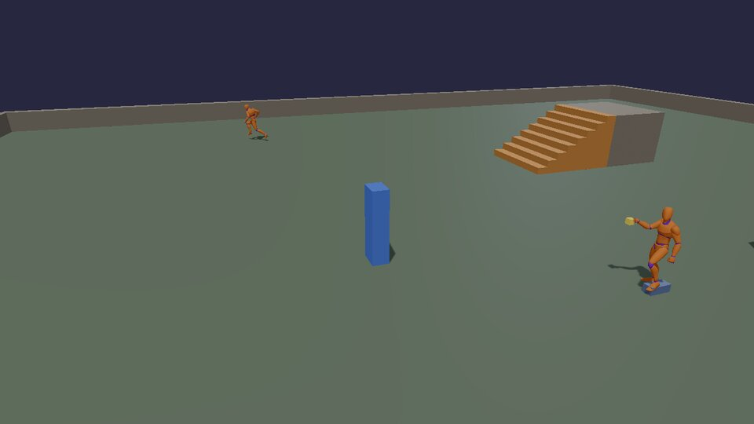
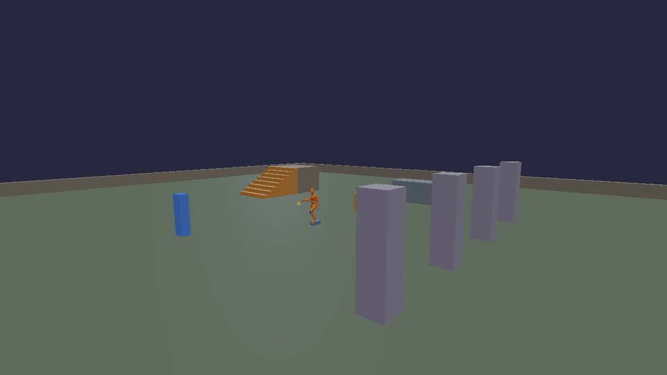

# Cameras

The camera decides what kind of game it feels like. The cookbook game has
the eight cameras most games use, and switches between them while you
play: **1** to **8** pick one, **Tab** (or View/Back on a pad) goes to the
next, **P** plays a camera path, **K** shakes.

```sh
cmake --build build --target cookbook && cd build/bin && ./cookbook
```

| | | |
|---|---|---|
|  **1. First person**: eyes at the head (shooters, horror) |  **2. Third person**: over the shoulder, never through walls |  **3. Orbit**: circles the character (inspecting, editors) |
|  **4. Top-down**: from above (twin-stick shooters, puzzles) |  **5. Isometric**: high and at 45° (strategy, action RPGs) |  **6. Side-on**: from the side, moving left and right (platformers) |
|  **7. Fixed**: on the wall, turning to watch (survival horror) |  **8. Cinematic**: a smooth path through keyframes (intros, cutscenes) | |

## How each one is made

A camera is just two points: where it is (`position`) and what it looks
at (`target`), plus a field of view. Every frame, the game sets them on
`app.camera()`. Four of the eight are modes of `kke::CameraRig`
(`engine/include/kke/CameraRig.h`); the other four are a few lines each.
This is the whole of it, from `games/cookbook/CookbookPlayer.cpp`:

```cpp title="games/cookbook/CookbookPlayer.cpp"
--8<-- "games/cookbook/CookbookPlayer.cpp:cameras"
```

- **Third person** is a spring arm, like Unreal's: a line from above the
  character's shoulders back to the camera. When something's in the way
  the arm shortens at once (you never see through a wall) and grows back
  smoothly. `m_rig.settings` has its length, the shoulder offset, the lag
  and the field of view.
- **First person** puts the camera at `settings.eyeHeight` and turns the
  character to face where you look (`m_loco->setFacing(m_rig.forward())`).
- **Orbit** and **cinematic**: `settings.orbitDistance` for the first,
  `m_rig.setCinematic(keyframes, loop)` for the second.

## Which way is forward?

With a camera that isn't behind the character, "push the stick up" has to
mean something else. In top-down, up on the stick is up on the screen;
in side-on, only left and right exist; with a fixed camera, up is away
from the camera. The cookbook's player works out forward per camera and
moves the character relative to that:

```cpp title="games/cookbook/CookbookPlayer.cpp"
--8<-- "games/cookbook/CookbookPlayer.cpp:forward"
```

## Cameras from Lua

The cookbook game gives scripts a `view` table: `view.mode(name)`,
`view.shake(amount)` and `view.path(keyframes, loop)`. Its
`scripts/cameras.lua` binds the number keys to them:

```lua title="games/cookbook/scripts/cameras.lua"
--8<-- "games/cookbook/scripts/cameras.lua:keys"
```

A camera path is a list of keyframes, each a position, a point to look at
and a time in seconds; the camera glides through them on a smooth curve
(Catmull-Rom):

```lua
--8<-- "games/cookbook/scripts/cameras.lua:path"
```

`view` isn't part of the engine: it's how any game can hand its own C++ to
Lua. The bindings are about thirty lines in `CookbookPlayer::registerLua`,
shown in [C++](cpp.md#your-own-lua-bindings).

## Screen shake

Shake sells an explosion or a heavy landing. Add "trauma" (0 to 1) when
something happens; each frame, turn the camera by a small smooth wobble
that grows with trauma squared (so little bumps stay little), and let
trauma fade. From Lua it's `view.shake(0.4)`; the [explosion](gameplay.md#explosions)
recipe uses it when it's there. The C++, on top of whichever camera is on:

```cpp title="games/cookbook/CookbookPlayer.cpp"
--8<-- "games/cookbook/CookbookPlayer.cpp:shake"
```

The wobble itself is smooth noise, not random jumps:

```cpp title="games/cookbook/Procedural.h"
--8<-- "games/cookbook/Procedural.h:shake"
```

Next: [gameplay](gameplay.md).
