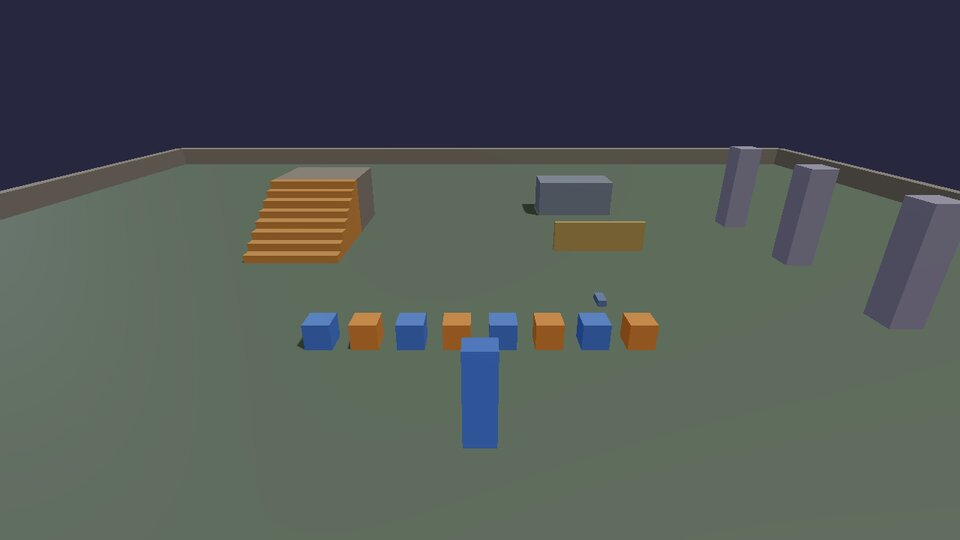
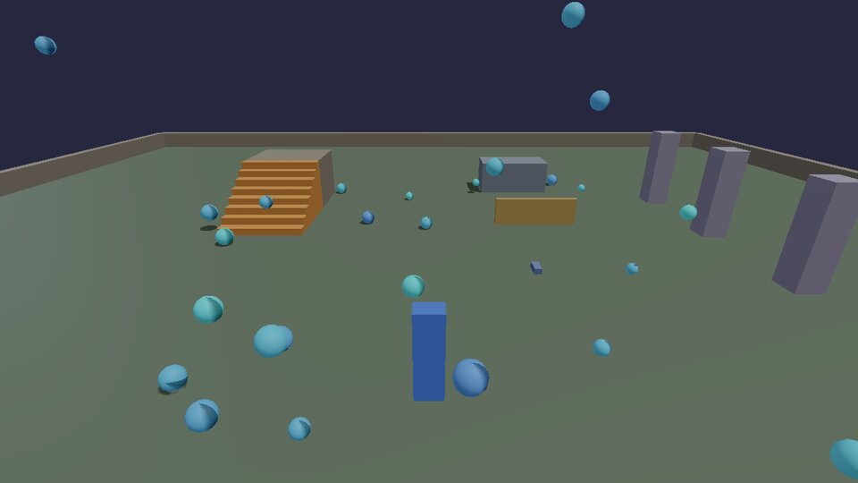
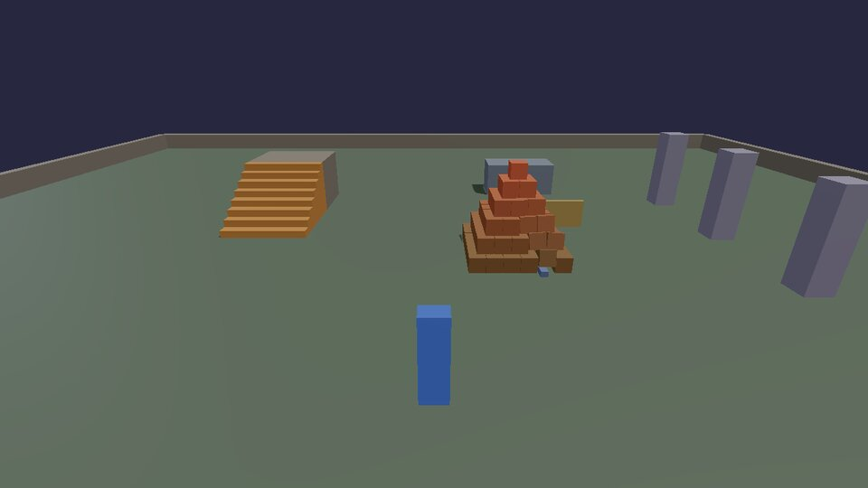

# First steps

Three small scripts that cover most of the Lua you'll ever need: values,
decisions, repetition, and doing something later. Save each into your
game's `scripts/` folder while the game runs; it runs straight away.
Press ++f1++ for the Scripts panel, where `print` output and any errors
show up, with the file and line.

## Hello, boxes

Variables, `if`, a loop, a function and a table, each doing something you
can see: a row of boxes in two colours, and a greeting in four languages.



```lua title="hello.lua"
--8<-- "docs/cookbook/recipes/hello.lua"
```

[Download hello.lua](recipes/hello.lua){ .md-button }

- `local` makes a variable belong to this file. Without it, it still only
  belongs to this script (each script has its own globals), but `local`
  is faster and says what you mean.
- `Vec(x, y, z)` is a position, a size or a colour. `y` is up; colours go
  from 0 to 1 (red, green, blue).
- `physics.box { ... }` takes a table of named settings. What you leave
  out gets a sensible default (a 50 cm box that falls).
- `..` joins text; `#list` is how long a list is; `ipairs` walks a list in
  order.

Change `count` to 20 and save: the old boxes go and the new row appears.
That's hot reload: everything a script made is removed before it runs
again, so nothing doubles up.

## Rain

A **timer** runs a function later, or again and again. This one drops a
ball five times a second at a random spot, keeps a list of them, and
removes the oldest so there are never more than 60.



```lua title="rain.lua"
--8<-- "docs/cookbook/recipes/rain.lua"
```

[Download rain.lua](recipes/rain.lua){ .md-button }

- `timer.Create(name, seconds, repetitions, fn)`: 0 repetitions means
  forever. `timer.Simple(seconds, fn)` runs once. `timer.Remove(name)`
  stops one.
- `math.random()` is a number from 0 to 1, so `math.random() * 16 - 8`
  is anywhere from -8 to 8.
- `table.insert(list, x)` adds to the end; `table.remove(list, 1)` takes
  the first one out (and gives it back, here straight to `physics.remove`).

## A pyramid, and a key to rebuild it

Loops inside loops build in two and three dimensions: layers, rows and
columns. **G** rebuilds the pyramid after you've knocked it over (walk
into it, or throw something at it from the [input](input.md) chapter).



```lua title="pyramid.lua"
--8<-- "docs/cookbook/recipes/pyramid.lua"
```

[Download pyramid.lua](recipes/pyramid.lua){ .md-button }

- `hook.Add("Think", id, fn)` runs `fn` every frame. The id names it, so
  hot reload can replace it instead of adding a second one.
- `input.define` makes a new action with a default key; players can
  rebind it. More in [Input](input.md).
- The crates are made 2% smaller than their spacing so they don't start
  pressed into each other (which would make them jump apart).

## Events you can hook

`Think` is one of several events. The full list, with what each one
passes, is in [Scripting in Lua](../SCRIPTING.md#the-api):

| Event | When |
|---|---|
| `Init` | once, after every script has loaded and the game has started |
| `Think` | every frame, with the frame time `dt` in seconds |
| `Tick` | 60 times a second exactly (physics-rate logic) |
| `Contact` | two bodies started touching (used in [Moving things](moving.md#launch-pad)) |
| `Break` | something breakable broke ([Physics](physics.md)) |
| `NetMessage` | a message from another player ([Multiplayer](networking.md)) |
| `Shutdown` | the game is closing |

Your own events work the same way: `hook.Run("GameOver", score)` calls
every `hook.Add("GameOver", ...)` in any script.

Next: [make your own controls](input.md).
