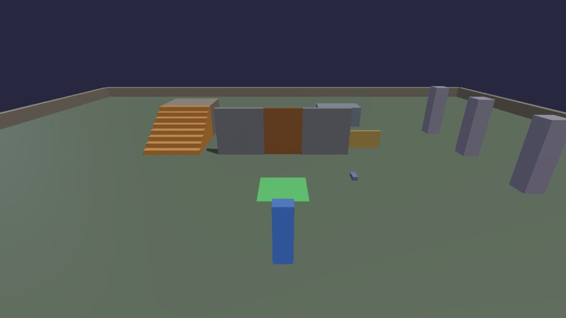
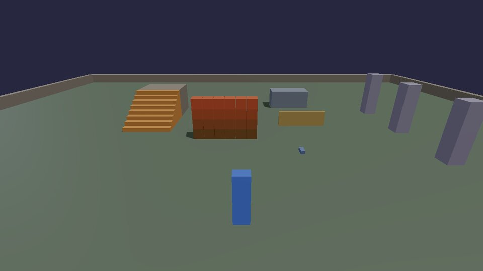
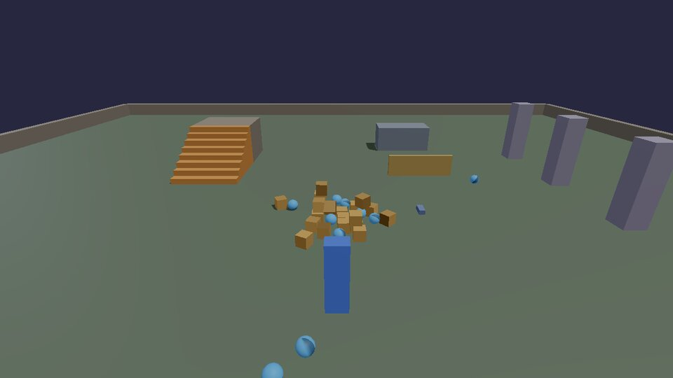
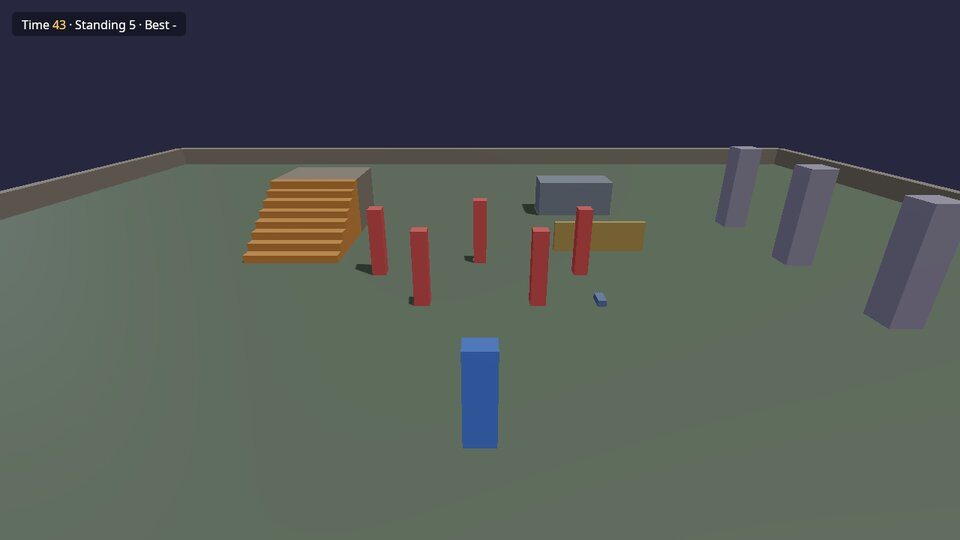

# Gameplay

Four recipes that turn a level into a game: something that reacts to
where you are, something you can do to the world, and a round with a goal,
a clock and a result.

## Trigger zones and doors

A zone is a box in space, and "is the player in it?" is six comparisons.
Remember whether they were in it last frame, and you know when they step
in and when they step out. Here the green square opens a door; stepping
off shuts it two seconds later.



```lua title="zone_door.lua"
--8<-- "docs/cookbook/recipes/zone_door.lua"
```

[Download zone_door.lua](recipes/zone_door.lua){ .md-button }

The same shape works for checkpoints (save where they are), traps (start
a timer), shops and cutscenes (switch the camera). `timer.Create` with a
name is what makes "shut it later, unless they come back" work: stepping
back in removes the pending timer by its name.

## Shooting with rays

A ray is a line tested against the world: where it hits, what it hits,
and the surface's direction there. `physics.raycast(from, direction,
distance)` from the camera along `camera.forward()` is "what am I looking
at?". Click (the standard `fire` action) to knock crates off the wall.



```lua title="shooter.lua"
--8<-- "docs/cookbook/recipes/shooter.lua"
```

[Download shooter.lua](recipes/shooter.lua){ .md-button }

- `physics.impulse(id, push, point)` pushes at a point, so a crate hit at
  the corner spins. Its size is momentum (mass × m/s), so heavy things
  move less.
- The hit also tells you `hit.normal` (which way the surface faces, for
  bullet holes and ricochets), `hit.distance` and `hit.material` (for the
  right sound).
- Rays are cheap; line-of-sight checks for enemies are the same call from
  their eyes to the player.

## Explosions

An explosion is a loop over what's near: push each thing away from the
centre, harder the closer it is. **B** blows up the heap; a new one comes
three seconds later.



```lua title="explosion.lua"
--8<-- "docs/cookbook/recipes/explosion.lua"
```

[Download explosion.lua](recipes/explosion.lua){ .md-button }

`if view then ... end` is how a script uses something only some games
have: tables exist only when the game has the module that provides them
(there's no `audio` without an AudioModule, no `view` outside the
cookbook game), and a missing table is `nil`.

## A whole round

Everything together: a goal (knock the pillars over), a clock, a HUD, a
win and a lose, a best time that's still there tomorrow, and a button to
play again.



```lua title="round.lua"
--8<-- "docs/cookbook/recipes/round.lua"
```

[Download round.lua](recipes/round.lua){ .md-button }

- **The HUD** is an RmlUi document: HTML-like markup with CSS-like styles.
  `ui.text(doc, id, text)` changes what an element says, `ui.class` adds
  or removes a class (here `hidden`, to show the button), and
  `ui.onClick(doc, id, fn)` runs `fn` when it's clicked. `pointer-events:
  none` on the body lets clicks go through to the game, except on the
  button. Press Esc to free the mouse and click it.
- **Saving**: `store.save(name, value)` and `store.load(name)` keep
  numbers, text and tables between sessions, in a small database next to
  the game ([Saving](../SCRIPTING.md#saving)).
- **Win or lose** is checked once per frame, and `playing` stops the
  round from ending twice.

[Tutorial 3](../tutorials/03-pickups.md) builds a coin pickup with a
score HUD step by step, and `games/first_lua_game/` is a complete small
game in one Lua file ([its walkthrough](../../games/first_lua_game/README.md)).

Next: [algorithms](algorithms.md).
