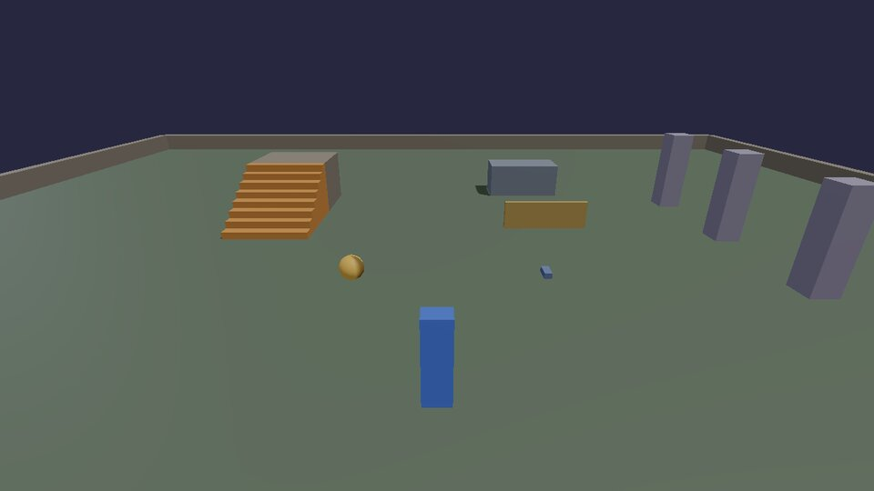

# Input

Games in KKE never ask "is W down?". They ask about **actions**: "was
`jump` pressed?", "how much `move`?". Each action has default keys and
buttons, and players can rebind all of them in the settings, controllers
and flight sticks included. The whole system is described in
[Input](../INPUT.md); these recipes are the parts you use every day.

## Your own action: hold to charge, release to throw

`input.define(id, label, key)` makes an action with a default key. Hold
**T** to charge, let go to throw a ball where the camera looks: harder
(and redder) the longer you held it.

```lua title="throw.lua"
--8<-- "docs/cookbook/recipes/throw.lua"
```

[Download throw.lua](recipes/throw.lua){ .md-button }

- `input.pressed(id)` is true for one frame when the action starts,
  `input.held(id)` for as long as it's on, and `input.value(id)` gives an
  analog value (a trigger pulled half way is 0.5).
- "Released" is "held last frame, not now": keep a variable (`charging`)
  that remembers last frame.
- Key names are SDL's: `"T"`, `"Space"`, `"Left Shift"`, `"Right Ctrl"`,
  `"Up"`, `"F5"`, `"Keypad 1"`.

## Toggles, and the standard actions

Every game made from the starter template already has the character
actions: `move`, `look`, `jump`, `sprint`, `walk`, `crouch`, `fire`,
`aim`, `interact` and `camera.toggle`, on keyboard and mouse and on a
controller. Scripts read them like their own. Here **L** switches a lamp
on and off, and holding sprint makes it glow brighter.



```lua title="toggle.lua"
--8<-- "docs/cookbook/recipes/toggle.lua"
```

[Download toggle.lua](recipes/toggle.lua){ .md-button }

## Binding in C++: pads, holds, chords and axes

In C++ you get everything the bindings screen can do. The cookbook game
adds its own controls in `games/cookbook/Bindings.h`: a button on both
keyboard and pad, a hold and a release on one key, a Ctrl chord, and an
axis driven by two keys and both triggers.

```cpp title="games/cookbook/Bindings.h"
--8<-- "games/cookbook/Bindings.h:bindings"
```

Call it from your module's `init`, after the standard actions, then save
them as the defaults the settings screen resets to:

```cpp
kke::InputMap& in = m_input->map(0); // player 0; split screen has more
kke::InputModule::defineCharacterActions(in);
cookbook::addCookbookBindings(in);
m_input->commitDefaults();
```

and read them in `update` the same way Lua does:

```cpp
if (in.pressed("camera.next")) nextCamera();
if (in.held("throw.charge")) charge += dt;
if (in.pressed("throw")) throwBall(charge);
zoom -= in.axis("zoom") * 4.0f * dt;              // -1 .. 1
const glm::vec2 move = in.axis2("move");           // stick or WASD, length up to 1
```

The unit test `Cookbook.BindingsDoWhatTheInputPageSays`
(`tests/test_cookbook.cpp`) presses these keys and buttons on a fake
keyboard and pad and checks each action does what this page says.

## Triggers at a glance

| Trigger | Fires | Good for |
|---|---|---|
| `Press` | on the way down, held while down | jump, interact |
| `Release` | on the way up | throw on release |
| `Hold` | after `holdTime` (0.35 s) held | charge, hold to lean |
| `Tap` | released within `tapTime` | quick actions sharing a key with a hold |
| `DoubleTap` | second press within 0.3 s | dodge, quick reload |
| `Continuous` | the whole time, with its analog value | movement, zoom, throttle |
| `Toggle` | each press flips it | crouch, walk |

What players change is saved in `input.json` next to the game; the
defaults stay in your code. Left-handed layouts, twin flight sticks and
rebinding screens are in [Input](../INPUT.md).

Next: [move things around](moving.md).
