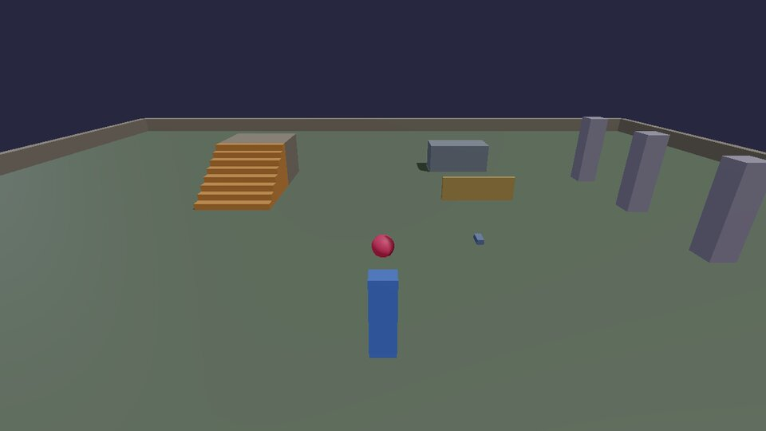
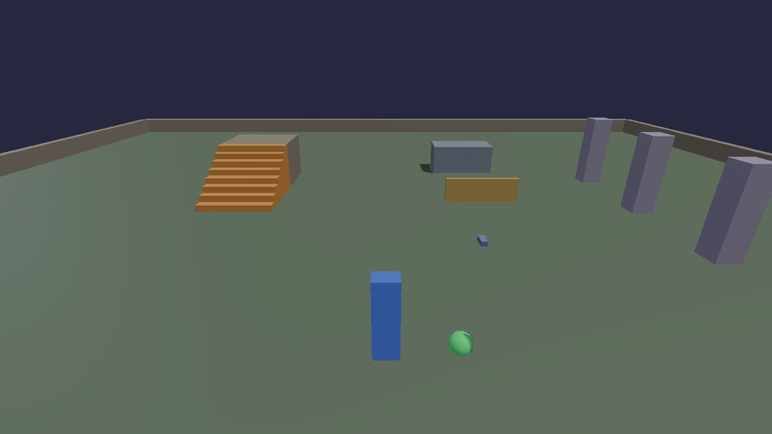
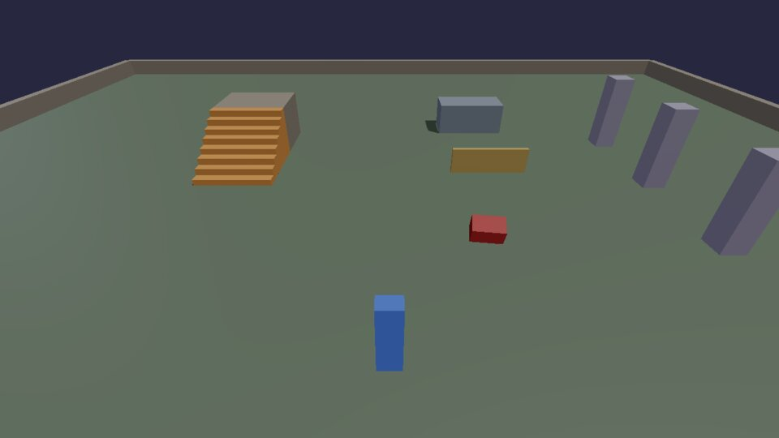
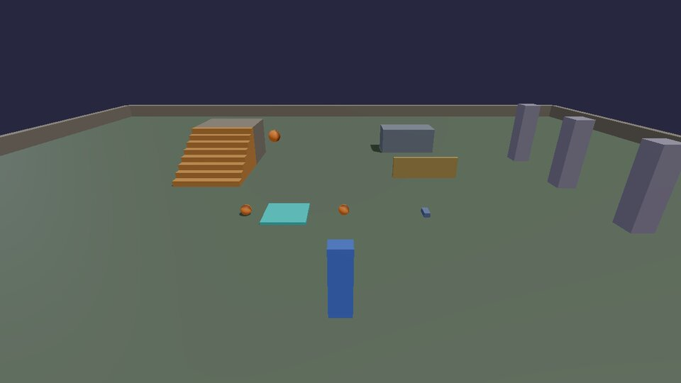

# Moving things

Two kinds of things move in a KKE game: **the character**, which walks,
runs, jumps, vaults and climbs under `kke::Locomotion`, and **physics
bodies**, which you move by giving them velocity and letting them roll,
bounce and collide for real.

## The character

The starter game's player is `PlayerModule` (C++). You tune how it moves
with `Locomotion`'s settings, in `PlayerModule::init`:

```cpp
auto& move = m_loco->settings();
move.runSpeed = 4.5f;        // m/s (default 3.6)
move.sprintSpeed = 8.0f;     // default 6.2
move.jumpSpeed = 6.5f;       // higher jumps (default 5.2)
move.airAcceleration = 8.0f; // more steering in the air (default 5)
move.coyoteTime = 0.2f;      // jump this long after running off an edge (default 0.12 s)
```

Every setting and its default is in `engine/include/kke/Locomotion.h`;
[Movement](../MOVEMENT.md) explains the ideas behind them (why turning
slows you down, why a jump pressed just before landing still counts).
[Tutorial 1](../tutorials/01-walk-around.md) walks through the player
module line by line.

From Lua, the starter game gives you `player.position()` (the feet),
`player.facing()` and `player.teleport(pos)`. Try
`player.teleport(Vec(-6, 2.1, -6))` in the Scripts panel console (++f1++).
Those three are the game's own bindings, not the engine's, and a game
adds them as its modules start, so use them inside hooks and timers (as
every recipe here does), not at the top of a file.

## A ball you steer

Moving a body is setting its velocity. This ball speeds up in the
direction of the arrow keys, relative to where the camera looks, and hops
with Right Ctrl.



```lua title="roll_ball.lua"
--8<-- "docs/cookbook/recipes/roll_ball.lua"
```

[Download roll_ball.lua](recipes/roll_ball.lua){ .md-button }

- `camera.forward()` points where the camera looks. Flattening it
  (`y = 0`) and normalizing it gives "forward along the ground"; the cross
  product with up gives "right".
- Adding to the velocity (instead of setting it) keeps the ball's
  momentum: it still rolls on when you let go, and bumps change its path.
- `Think` gets `dt`, the seconds since the last frame. Multiplying by it
  makes the push the same at 30 and at 240 frames per second.

## A pet that follows you

The classic "seek and arrive": head toward a target, slow down near it,
stop at a comfortable distance.



```lua title="pet.lua"
--8<-- "docs/cookbook/recipes/pet.lua"
```

[Download pet.lua](recipes/pet.lua){ .md-button }

Blending the velocity toward the wanted one (`blend`) instead of setting
it outright is what makes the pet curve smoothly instead of snapping to
each new direction. Raise the 8 for a snappier pet, lower it for a lazier
one.

## A patrol

Waypoints in a list, an index for the one it's heading to, and a pause at
each: the core of guards, moving platforms and delivery vans.



```lua title="patrol.lua"
--8<-- "docs/cookbook/recipes/patrol.lua"
```

[Download patrol.lua](recipes/patrol.lua){ .md-button }

`target % #WAYPOINTS + 1` counts 2, 3, 4, 1, 2, ... For a guard that goes
back the way it came (1, 2, 3, 4, 3, 2, ...), keep a direction of +1 or -1
and flip it at either end.

## Launch pad

The `Contact` hook fires when two bodies start touching, with both ids,
how hard they hit and where. Here, anything landing on the pad is thrown
up again.



```lua title="launch_pad.lua"
--8<-- "docs/cookbook/recipes/launch_pad.lua"
```

[Download launch_pad.lua](recipes/launch_pad.lua){ .md-button }

A script may only push bodies that scripts made. `pcall(f, ...)` calls
`f` and catches its error instead of stopping, so the pad quietly ignores
the level's own boxes.

## Moving a body to an exact place

Sometimes you want a body at an exact spot every frame (a platform on a
path, a part of something animated). Give it the velocity that gets it
there in one frame:

```lua
local function moveTo(id, target, dt)
  physics.setVelocity(id, (target - physics.position(id)) / math.max(dt, 1 / 240))
end
```

It still collides and pushes things on the way, which a teleport wouldn't.
The [animation](animation.md) recipes are built on this.

Next: [cameras](cameras.md).
