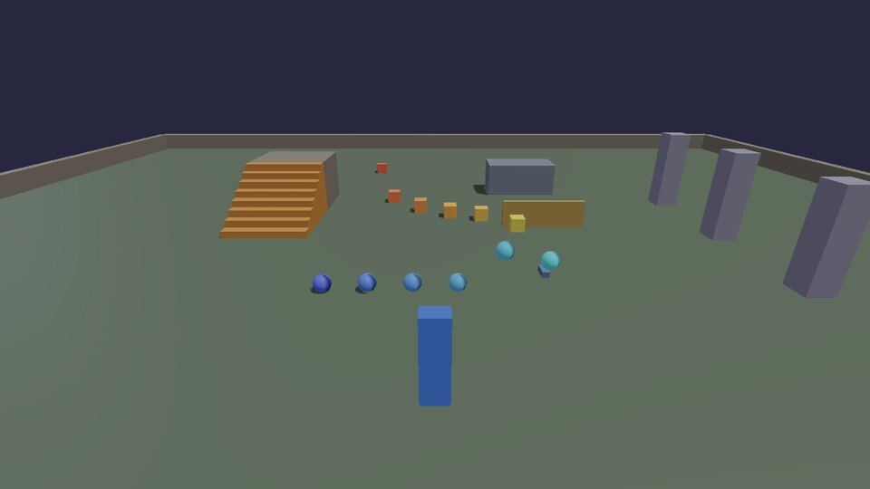

# Physics

Every box and ball a script makes is a rigid body in Jolt: it has mass,
it falls, it bounces, it pushes other things. The settings on
`physics.box` and `physics.sphere` decide how, and the same world is
there from C++ as `kke::RigidWorld`.

## Bounce and friction, side by side

Front row: balls from no bounce (`bounce = 0`) to very bouncy (0.9). Back
row: boxes given the same shove, from icy (`friction = 0.02`) to grippy
(0.82), sliding different distances. **R** drops them again.



```lua title="bounce.lua"
--8<-- "docs/cookbook/recipes/bounce.lua"
```

[Download bounce.lua](recipes/bounce.lua){ .md-button }

| Setting | Means | Default |
|---|---|---|
| `density` | kg per cubic metre: how heavy for its size (water is 1000, wood ~500, steel ~8000) | 500 |
| `bounce` | 0 = lands dead, 1 = bounces back as high as it fell | 0.1 |
| `friction` | 0 = ice, 1 = rubber; the lower of the two touching surfaces wins | 0.6 |
| `static` | never moves: floors, walls, platforms | false |
| `velocity` | starting velocity, m/s | 0 |
| `material` | a sound material, for impact sounds ([Sound](audio.md)) | none |

## Things that really break

With FEMFX (the `everything` preset, [Install and build](../BUILDING.md)),
`breakable.box` makes objects that bend, crack and shatter for real, into
pieces that are bodies of their own. **F** throws an iron ball at what
you're looking at.

```lua title="glass.lua"
--8<-- "docs/cookbook/recipes/glass.lua"
```

[Download glass.lua](recipes/glass.lua){ .md-button }

Materials (`glass`, `stone`, `wood`, `ice`, `iron`) set how much force it
takes and how it comes apart; `pattern` overrides the pattern
(`shards`, `voronoi`, `splinters`, `radial`). [Tutorial 2](../tutorials/02-break-things.md)
builds a whole shooting gallery of them; [Physics bridge](../PHYSICS_BRIDGE.md)
explains how the pieces hand over to Jolt.

## Physics from C++

`kke::RigidWorld` (`engine/include/kke/RigidWorld.h`) is what the Lua
`physics` table calls. The cookbook's `games/cookbook/PhysicsRecipes.h`
has the two things every game does with it, and the unit test
`Cookbook.CrateLandsWhereTheRaySaysTheGroundIs` runs them in a world of
their own:

```cpp title="games/cookbook/PhysicsRecipes.h"
--8<-- "games/cookbook/PhysicsRecipes.h:crate"
```

```cpp title="games/cookbook/PhysicsRecipes.h"
--8<-- "games/cookbook/PhysicsRecipes.h:ground"
```

In a game, the world belongs to `RigidBodyModule`
(`app.getModule<kke::RigidBodyModule>()->world()`), which steps it at 60
Hz and draws script bodies. Contacts come out of `frameContacts()` each
frame; the character controller (`addCharacter`) is what
[`Locomotion`](../MOVEMENT.md) drives. For a whole world of your own
(a server, a test, a tool), make a `RigidWorld` and call `step()`
yourself, as the test does.

## Other physics

- **Jiggle** (`kke::JiggleRig`): soft parts on a skeleton.
  [Jiggle physics](../JIGGLE.md).
- **Ragdolls** on Jolt and FEMFX. [Ragdolls](../RAGDOLLS.md).
- **Water**: an ocean with buoyancy (`sea_demo`), particle liquids and
  things that melt (`melt_demo`).
- **Performance**: how many bodies a single core can take, and what to
  do about it. [Optimization](../OPTIMIZATION.md).

Next: [sound](audio.md).
