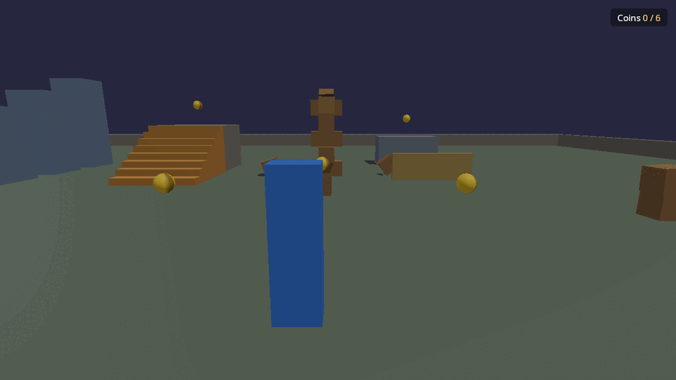

# Tutorials

Each tutorial builds on the game you made in
[Make your own game](getting-started.md), and ends with something working
you can keep. Code blocks are complete: paste them into a new file in your
game's `scripts/` folder and save while the game runs.

1. [Walk around](01-walk-around.md): how the player works, tuning how it
   moves, and shaping the level.
2. [Break things](02-break-things.md): throw balls, knock towers over, and
   shatter glass.
3. [Script a pickup](03-pickups.md): coins to collect, a score on screen,
   and your own Lua binding in C++.
4. [Add sound](04-sound.md): materials, impact sounds and a pickup chime.

Coming next: **invite a friend**, playing your game together over the
network, once player replication for script games lands
([#28](https://github.com/Khyretos/kk-engine/issues/28)).

Want more after these? `games/first_lua_game/` is a whole small game
(break the targets, with a timer and a results screen) in one Lua file,
with its own [walkthrough](../../games/first_lua_game/README.md).
