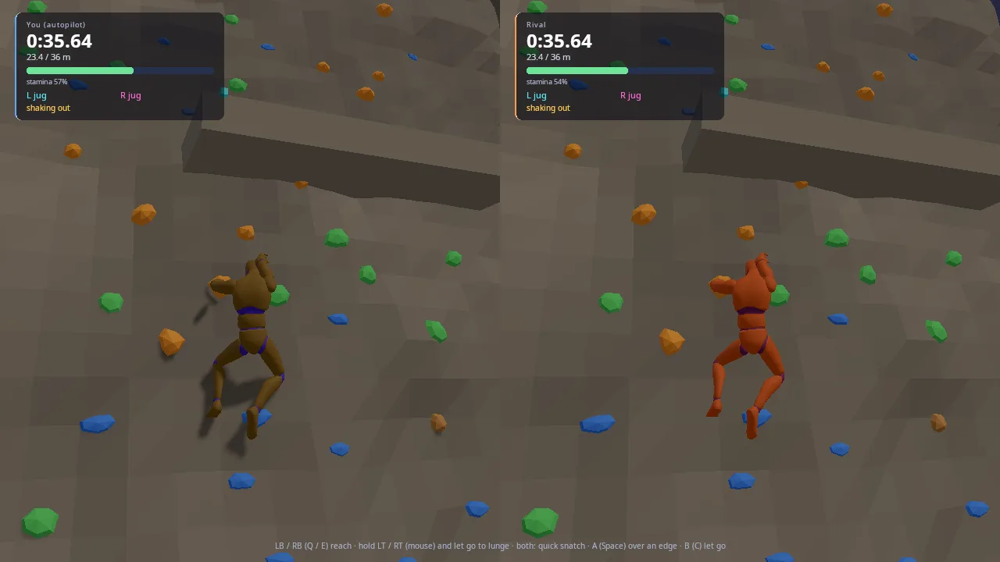
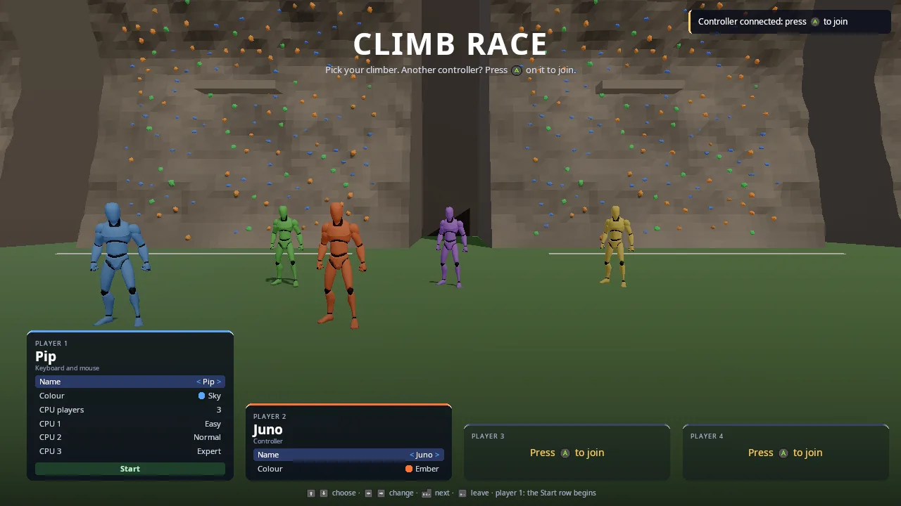
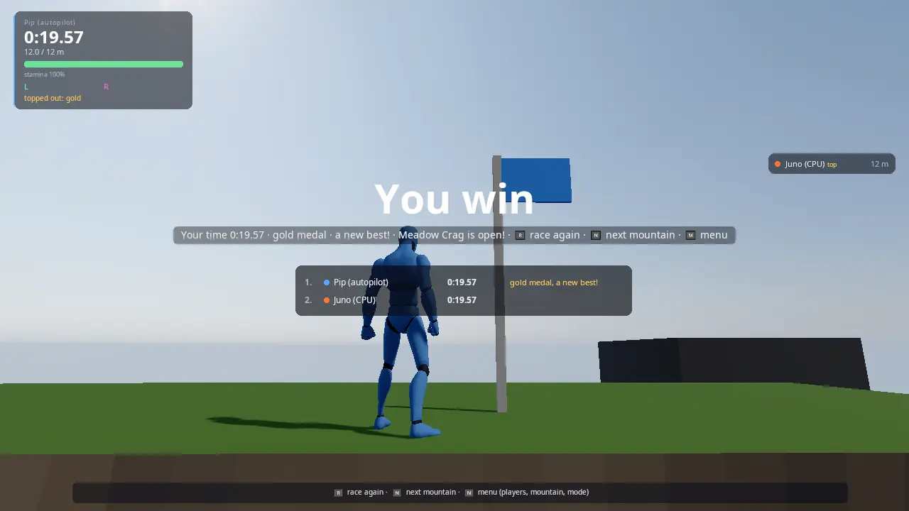
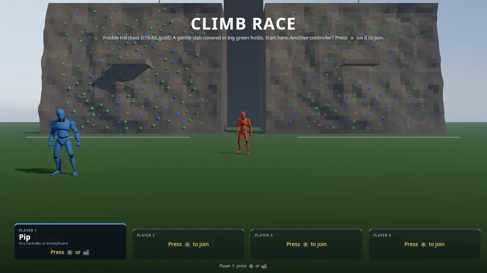
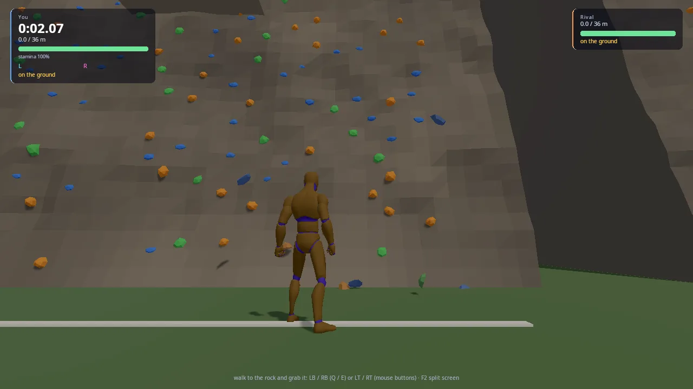
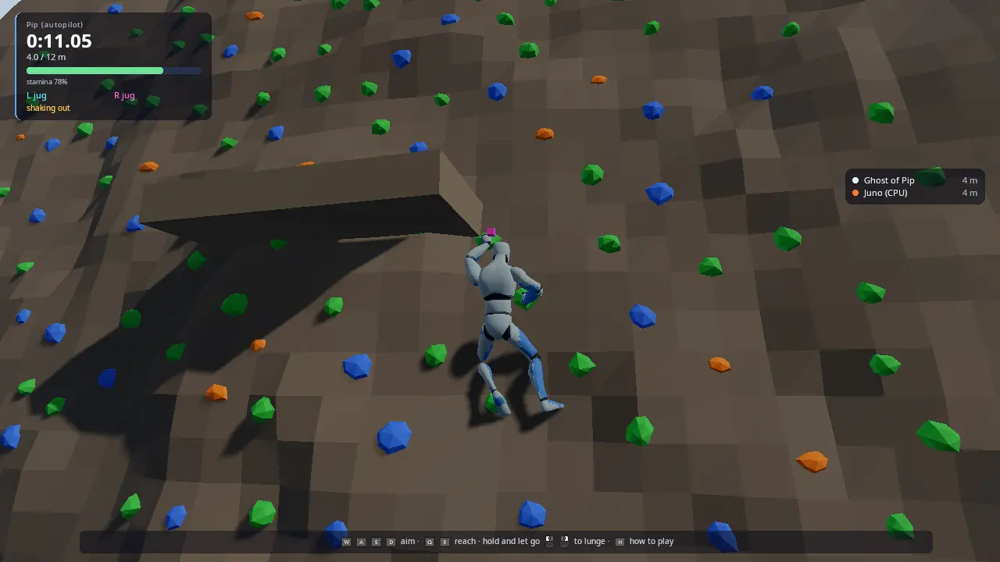
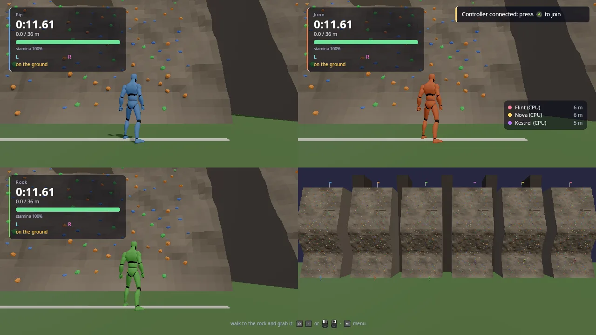

# Climb Race

A speed-climbing race up a generated mountain face. Every climber starts on
the ground in front of their own copy of the wall, side by side, like a
speed-climbing final. You walk to the rock, grab it and choose every hold
yourself: a trigger moves that hand, a bumper steps that foot, and jump
held and let go lunges. Stamina only comes back with both feet on holds
and runs out twice as fast on the arms alone, so keep your feet on and
rest on ledges. The first to mantle over the summit wins. There are
six mountains on a tour with medal times, four party modes, up to four
players in split screen, 0 to 5 CPU climbers, and online races with
several players per screen.

Climb Race is the engine's flagship game: the one that pulls the most
engine blocks together into something that plays like a finished game.
It is the starting point for any **menu-driven couch or online party
game** (a start menu where controllers join, split screen, CPU players,
a host who decides the round), for **races and time trials** (per-player
clocks, results, medals, saved best times, ghosts), for **games built from
data files** (a level is a small YAML file), and for **procedural
animation** (two-bone IK on all four limbs of an animated character, hands
that close on what they hold). [DESIGN.md](DESIGN.md) is the plan this
game was built from; this README is how the built game works.



## Run it

The executable is `climb_race` (`add_executable(climb_race ...)` in
[CMakeLists.txt](CMakeLists.txt)). It is built when `KKE_ENABLE_JOLT` is
on, which is the default (root `CMakeLists.txt`: the rock and the climbers
are Jolt bodies), so the `default` preset builds it:

```sh
cmake --workflow --preset default
cd build/bin && ./climb_race
KKE_SKIP_INTRO=1 ./climb_race     # skip the engine's logo intro
```

Run it from `build/bin`: the mountains (`mountains/*.yaml`), the HUD
(`ui/climb_hud.rml`) and the fonts are copied there by the build and found
next to the executable. The tour and the ghosts (see "Saving" below) are
saved next to the executable too; the menu, settings and controls files
are written relative to the folder you start it from.

It also needs `KKE_ENABLE_NET` (on by default): main.cpp always adds
`kke::NetModule`, and `engine/CMakeLists.txt` only compiles NetModule.cpp
when networking is on, so with `-DKKE_ENABLE_NET=OFF` the root
CMakeLists.txt leaves Climb Race out of the build.

The climbers' bodies are the UAL mannequin
(`assets/animations/UAL1_Standard.fbx`, see "Assets"). Without it the game
still runs and the climbers are grey blocks.

## Controls

On foot it plays like any third-person game. The hint line at the bottom
of the screen always says what to press next, with the button glyphs of
the device player 1 is using. All game bindings are defined in
`ClimbRaceModule::init` ([ClimbRaceModule.cpp](ClimbRaceModule.cpp)) and
can be rebound (they are saved in `climb_race_input.json`).

| On foot | Controller | Mouse and keyboard |
|---|---|---|
| Walk / run | left stick | WASD |
| Look | right stick | mouse (click the view first to capture it) |
| Sprint | click the left stick (toggle) | Left Shift (hold) |
| Walk slowly | click the right stick (toggle) | Left Alt (hold) |
| Jump | A | Space |
| Grab the rock | LT / RT | Q / E, or a mouse button |

| On the rock | Controller | Mouse and keyboard |
|---|---|---|
| Choose where a hand goes | left stick aims (the hold lights up cyan for the left hand, magenta for the right) | the crosshair picks a hold (a red marker means out of reach), or WASD aims |
| Move a hand to its lit hold | LT / RT | Q / E, or left / right mouse button |
| Step a foot onto its lit foothold (small flat marks) | LB / RB | Z / X |
| Lunge: hold, aim, let go (the longer, the further); then grab in time | hold A, then LT / RT | hold Space, then Q / E |
| Over an edge (both hands on it) | A | Space |
| Let go | B | C |

| Anywhere in a race | Controller | Mouse and keyboard |
|---|---|---|
| How to play | X | H |
| Race again (once you are done, or after the race) | Start | R |
| Next mountain | Y | N |
| Pause menu (settings, controls, main menu, quit) | Start while climbing, or Select | Esc |
| Back to the start menu (players, mountain, mode) | the pause menu's Main menu | M, or the pause menu |
| Developer panels (network, stats) | no controller binding | F1 |
| Ping the surroundings (hear the walls) | no controller binding (the D-pad moves through the menu) | G |
| Let go of the mouse | (none needed) | Esc (opens the pause menu too) |

The left side of the pad (and the left mouse button, Q, Z) is the left
hand and foot; the right side is the right ones. A tap of jump on the rock
does nothing (a lunge needs a short hold). `init` gives all four player maps
`InputModule::defineCharacterActions` (move, look, jump, sprint, walk and
the rest), clears the bindings of `fire`, `aim`, `interact` and `crouch`
(those buttons are the hands here) and of `camera.toggle` and `audio.ping`
(Q is a hand, so the ping moves to G; the right stick click walks), and adds `grab.left` / `grab.right`
(1D axes: the triggers with a 0.05 dead zone, the mouse buttons and Q / E;
pulled past half way is one reach), `foot.left` / `foot.right`, `letgo`, `race.again`, `race.new`, `menu`,
`panels` and `help`.

The start menu is `kke::LobbyModule`: every controller that presses A
joins, up and down pick a row, left and right change it, A moves on, B
leaves the seat. Enter on the keyboard joins when player 1 is on a
controller. See [docs/LOBBY.md](../../docs/LOBBY.md) for the full menu
controls.

## How it plays

### The start menu



The climbers stand in a row in front of the mountain, each above their
player's card. Up to four players join (split screen: side by side for
two, quarters for three and four; with three, the fourth quarter watches
the whole mountain). Each player picks a **Name** (Pip, Juno, Rook,
Kestrel, Nova, Flint, Wren, Ziggy, Scout, Bram), a **Colour** for their
top (Sky, Ember, Moss, Plum, Sun, Coral, Ice, Stone), a **Skin** tone
(nine, Porcelain to Ebony), and **Trousers** and **Shoes** colours. The
climber in the line-up changes as you pick ([docs/OUTFITS.md](../../docs/OUTFITS.md)).
With the POLYGON City Characters pack installed there is also a **Body**
row: the mannequin or one of eleven City people, who climb with the
mannequin's moves.
Players online show in an **Online in this game** panel and stand in the
line-up too, in the clothes they picked. Player 1's card also has:

- **CPU players**: 0 to 5, and the difficulty of each:

  | Difficulty | The CPU climber (`ClimbRaceModule::makeBrain`) |
  |---|---|
  | Easy | 1.0 s between moves, never lunges, rests below 55% stamina until 97% |
  | Normal | 0.6 s between moves, lunges when fresh |
  | Hard | 0.42 s between moves |
  | Expert | 0.26 s between moves, pushes on tired (rests below 35%, until 80%) |

- **Mountain**: the open mountains of the tour, then Random.
- **Mode**: Race, Rockfall, Elimination, Time trial.
- **Online**: Off, Join, Host (and, while joining, **Game** and **Join**).
- **Start**. Start on player 1's controller starts from any row.

A controller that presses A during a race gets a toast ("... joins the
next race: R to race again now") and is in from the next race. The
choices are saved in `climb_race_lobby.json` when the race starts from
the menu, and loaded next time.

A how-to-play screen opens before the first race (six cards: get on,
choose, reach, breathe, over the top, if you slip). Jump starts; the help
button shows it again at any time. Offline, the race waits while it is up.

### The race

A 3, 2, 1 countdown, then GO. Walk to the rock and grab it. On the rock:

- **Stamina** is the only thing on the HUD you manage. It drains faster on
  one hand, on crimps and slopers and on overhangs. With no feet on holds
  everything costs double. It comes back slowly but steadily with both
  feet planted and both hands on holds (faster on good holds, faster
  still with both hands on one hold), and fast when you stand on a ledge
  or the ground. At zero your grip goes and you fall.
- **Feet**: two small flat marks show where each foot can go (cyan left,
  magenta right). The bumpers step onto them. A foot left too far below
  as you climb comes off by itself. Small pale chips on the rock are
  footholds only.
- **Lunge**: hold jump, aim with the stick, let go. The marker turns gold
  on the hold you would catch. In the air, pull that hand's trigger in
  time or you fall.
- **Holds**: green = jug (easy), orange = crimp (tiring), blue = sloper
  (most tiring), the grey lips of ledges and the summit are edges (as good
  as a jug, and you can grab them anywhere along their length and mantle
  over them). Some holds are loose: they break off when a lunge catches
  them and fall down the face.
- **Matching**: both hands can share one hold, side by side (or one above
  the other on a tall one), which is how you swap hands on a big jug.
  Matching is cheap (half a reach), so it is also how you traverse: match,
  then lead with the other hand.
- **Each hand works its own side**: the body is split down the middle.
  Holds on your left are for the left hand, holds on your right for the
  right hand, and holds near the middle (between the shoulders) for
  either. A hand can cross in front of the chest a little past the other
  shoulder (`crossReach`, 0.3 m) only when the arm really reaches around
  the front, and never over the other hand's hold. Bots and online
  climbers follow the same rules (they live in `kke::Climber`).
- **Real arms**: the hands only go where the body can hang between them.
  A reach only offers holds the body can hang from with the other hand
  where it is. A lunge can go further; if a hand then ends up out of
  reach it cuts loose: grab again quickly.
- **No clipping**: the hips, chest, head and knees stay out of the rock
  and out of ledges. Under a ledge the head stays below it until you hold
  its lip.
- **Falling** puts you back on foot (Locomotion). After 0.35 s you can
  grab again.
- **Topping out**: both hands on the summit edge, then jump to mantle over.

The race ends when every player on this screen is done (or everyone is
done, in a race of CPU climbers only). A results list shows every
climber in finishing order: their time (or the height they reached), and
a note for a medal, a new best, "out", or how many times they fell.



### Mountains and the tour



Six mountains, easiest first, each with its own mood (sky and light). At
first only Pebble Hill (and Random) is open: finish a mountain, at any
speed, and the next one opens. Each mountain has three medal times; your
best time and best medal on each are saved and shown in the menu line
("Pebble Hill (best 0:24.10, silver)"). Medals are for players, not CPU
climbers; in split screen every player's finish counts.
`KKE_CLIMB_ALL=1` opens every mountain for testing (not saved).

| Mountain | Height | Medals (gold, silver, bronze) | What it's about |
|---|---|---|---|
| Pebble Hill | 12 m | 25, 35, 55 s | A gentle slab covered in big green holds. Start here. |
| Meadow Crag | 20 m | 40, 70, 110 s | Two ledges to rest on and a first steep wall. |
| Granite Tower | 36 m | 75, 115, 190 s | The classic face: slab, wall, then a big overhang. |
| Overhang Cove | 26 m | 40, 60, 100 s | Steep all the way. Big holds, but your arms burn. |
| Crumble Peak | 30 m | 80, 120, 200 s | Loose rock everywhere. Lunge and the hold may come with you. |
| Cloud Spire | 46 m | 100, 165, 275 s | The long one. Small holds, four ledges, pace yourself. |

**Random** is a new mountain every time (the generator's defaults on a new
seed). After a race, Y / N goes to the next open mountain, round again
after the last (on Random: another random one).

To make your own mountain, copy a file in `mountains/` (say
`pebble_hill.yaml` to `my_hill.yaml`), change its `name:` and a few
numbers, rebuild (the build copies `mountains/*` next to the executable)
and start the game: it is in the Mountain row once the tour opens it (or
at once with `KKE_CLIMB_ALL=1`). Every key is explained in
[Mountains.h](Mountains.h). A mistake (an unknown key, a number out of
range) is named in the log and the rest still loads. Online, the host's
mountain goes to everyone, even one only the host has.

### Party modes

Player 1's **Mode** row (the host's, online):

| Mode | Rules |
|---|---|
| Race | First over the summit wins. |
| Rockfall | Rocks tumble down every face at its climber. A hit costs 35 of 100 stamina ("hit by a rock!"). The higher the leader, the more rocks come. |
| Elimination | Every 30 seconds the lowest climber still in is out: they let go and watch. The last one climbing, or the first to the top, wins. |
| Time trial | Race the ghost of the best run on this mountain: a pale climber doing exactly what that run did, through player 1's face. Beat it and yours is the ghost next time. Offline only (online it is a Race). |

Medals and best times count in every mode. Every best run on a tour
mountain is kept as its ghost.




### Online

Race friends on another PC, or in a second window on the same PC. Each
machine can have up to four players on its own couch (split screen), and
everyone on every screen races everyone else.

**Host a race**

1. Start Climb Race. In player 1's card, go down to **Online** and press
   right twice, to **Host**. The line under the title says "Hosting on
   port 27960: 0 players online".
2. Wait for the others to join (a toast pops up for each), then press
   Start. The race goes to every screen.

**Join a race**

1. Start Climb Race on the other PC (or a second window). If it is the
   same PC, pick a different Name and Colour so you can tell yourselves
   apart.
2. Go down to **Online** and press right once, to **Join**. The **Game**
   row lists every Climb Race hosted on this network and on this PC, with
   its player count ("Pip (2/16)"); left / right picks one. The list is
   asked for again every 3 seconds.
3. Go down to **Join Pip** and press A (Enter). The line under the title
   says "Online, connected as player 2: the host starts the race".

**More players on a screen**: on either machine, another controller
presses A to join the card row, as offline, before or after going online.
Each is its own climber for everyone.

- The host decides the race: the mountain, who climbs which face, the CPU
  climbers (the host's, which everyone sees), when it starts, race again
  and next mountain. A joiner's CPU climbers stay home; its Start does
  nothing ("The host starts the race").
- The countdown waits until every machine has built the race (at most 8
  seconds), so everyone starts together.
- Each machine climbs its own players and sends where they are and where
  their hands and feet are; the others see them on the same holds. A loose
  hold that breaks and each finish go to everyone.
- Someone joining during a race is in from the next one (the host presses
  race again). The host leaving ends the race for everyone ("the host
  ended the game"); a joiner leaving takes only its climbers, and their
  face stays empty.
- Across PCs: allow UDP ports 27960 to 27975 on the host's firewall. Not
  on the same network? Use a join code
  ([docs/SERVER_HOSTING.md](../../docs/SERVER_HOSTING.md) "Join codes").

From a terminal (no menu), two windows on one PC:

```sh
KKE_NET=host KKE_NET_NAME=Pip ./climb_race
KKE_NET=join:127.0.0.1 KKE_NET_NAME=Rook ./climb_race    # a second terminal
```

The joiner's card says it is online; the host presses Start. Everything in
[docs/NETWORKING.md](../../docs/NETWORKING.md) "Try it" works here too
(`KKE_NET_LAG`, `KKE_NET_LOSS`, join codes). F1 opens the developer panels,
including the network panel (round trip, loss, who is on which screen).

## How it works

### Startup and the frame

[main.cpp](main.cpp) creates a 1280 x 720 `kke::Application`, sets the
`golden_hour` mood (each mountain sets its own later) and adds the modules
in this order:

| Module | Why |
|---|---|
| `SettingsModule("settings.json")` | graphics, audio and accessibility settings |
| `InputModule("climb_race_input.json")` | rebindable actions, one map per player |
| `RigidBodyModule` | Jolt: the rock, the ledges, loose holds, rocks, the climbers' capsules |
| `ModelModule` | the animated mannequins |
| `UiModule` | RmlUi: the HUD, the how-to-play screen, the start menu |
| `AudioModule` (panel hidden) | synthesised impacts and UI tones |
| `LobbyModule("climb_race_lobby.json")` | the start menu |
| `NetModule` (`gameId = "climb_race"`, `maxPlayers = 16`) | online play |
| `climb_race::ClimbRaceModule` | the game |
| `StatsModule` (panel hidden) | frame stats for F1 |

The application sorts them so that each module's dependencies come
first (`Application::resolveInitOrder`) and calls `init` and, every
frame, `update` in that order.

`ClimbRaceModule` is one class split over several files by topic
(Lobby, Body, Hud, Net, Modes). Its `dependencies()` list says which
modules it needs (RigidBody, Input) and which it uses when present
(Model, UI, Lobby, Net, Audio): without the lobby it goes straight into a
race, without audio it is silent.

`ClimbRaceModule::init` then:

1. reads the `KKE_CLIMB_*` switches;
2. defines the input actions for all four player maps (see "Input");
3. builds the small marker cubes and the fallback body block;
4. `loadCharacter()` (Body.cpp): the mannequin, its IK chains and the body
   proportions the climbing logic uses;
5. `buildScenery()`: the meadow, one static Jolt box;
6. `loadMountainList()` and `loadProgress()`;
7. `setupLobby()` and `setupNet()`: the menu rows;
8. builds the chosen mountain with one face per climber, the racers and
   the HUD. Without an open menu it calls `startFromLobby()` at once.

The game runs as a small state machine, `Phase { Lobby, Countdown,
Racing, Finished }`. `ClimbRaceModule::update` each frame:

1. F1 toggles the developer panels.
2. `updateNet(dt)`: network events and the other machines' climbers.
3. In the **Lobby** phase: `updateLobby` (line-up, mountain preview) and
   `updateHud`, and nothing else.
4. Reads race again / next mountain / menu / help from every player.
5. The how-to-play screen, the menu, and restarts.
6. The countdown (a tick each second, a tone on GO).
7. The mouse crosshair's hold, from last frame's camera.
8. `updateRacer` for every racer played on this machine, then
   `recordRuns` (ghost recording), `updateGhosts` and `updateMode`.
9. The finish check: every player here done (or everyone done) ends the
   race; Elimination runs until one is left.
10. `animateBody` for every racer (local, remote and ghost).
11. `sendNet()`: our racers' poses.
12. Cameras and split-screen views, then `updateHud` and the rockfall test.
13. The `KKE_CLIMB_QUIT` report and quit timer.

`render` draws the meadow, each face's rock mesh, the loose holds and
rocks at their Jolt transforms, and the hold markers of players on the
rock. `renderShadow` draws the same into the shadow map.

### The mountains

A mountain is a data file in [mountains/](mountains/), read by
`loadMountains` in [Mountains.cpp](Mountains.cpp) through `kke::datafile`
(YAML or JSON; `pebble_hill.yaml` and `pebble_hill.json` count as one
mountain, and the newer file wins). Each key maps to a field of the
engine's rock generator, `kke::ClimbWallDesc`
([kke/ClimbWall.h](../../engine/include/kke/ClimbWall.h)):

| Key | ClimbWallDesc field | Range |
|---|---|---|
| `seed` | `seed` | 0 to 1e9 |
| `height` | `height` | 6 to 80 m |
| `ledges` | `ledges` | 0 to 8 |
| `overhang` | `maxOverhang` | 0 to 35 degrees |
| `slab` | `maxSlab` | 0 to 35 degrees |
| `holds` | `density` | 0.4 to 3 per square metre |
| `jugs` / `crimps` | `jugBias` / `crimpBias` | -0.5 to 1.5 |
| `loose` | `looseChance` | 0 to 0.6 |
| `step` | `routeStep` | 0.6 to 1.3 m |

`name`, `about`, `order`, `mood` and `medals` (three times, gold first)
belong to the game. `mountainFromJson` checks every key against a list:
an unknown key or an out-of-range number becomes a line in `problems`
(clamped, not fatal), and `loadMountainList` logs each one as a warning.
The mountains are sorted by `order`, then by file name.

`kke::ClimbWall::generate` ([ClimbWall.cpp](../../engine/src/ClimbWall.cpp))
turns the desc into a face, in three steps, with its own xorshift random
generator (never `std::` distributions, whose output differs between
standard libraries), so the same seed makes the same rock on every
machine:

1. **Surface**: the face is split into bands 6 to 10 m tall, each with one
   lean. The first band is a slab or vertical, one band past 40% of the
   height is always an overhang (the crux), and the last leans back. The
   lean is blended across band edges, integrated into a depth profile
   (`z` grows by `tan(lean)` per metre), and value noise adds small
   bumps and large ribs, calmed near the ground and the lip.
2. **Ledges**: spread evenly up the face with some jitter, their back
   inside the rock and their front 0.9 m clear of it.
3. **Holds**: the ledge and summit edges first; then the **line**, a
   zigzag of steps no longer than `routeStep` from the ground to the
   summit that passes every ledge (so every mountain is climbable); then
   jugs at arm's height above each ledge; then random holds kept at
   least `spacing` apart. The kind of each hold follows the lean (more
   jugs on overhangs, more crimps on slabs) plus `jugBias` / `crimpBias`.

`tests/test_climb_mountains.cpp` checks that every shipped mountain loads
without problems and that `kke::ClimbBot` tops out on each.

`ClimbRaceModule::buildMountain(lanes)` ([ClimbRaceModule.cpp](ClimbRaceModule.cpp))
generates the wall once and copies it into one `Lane` per climber, 20 m
apart and centred on x = 0 (`kLaneX = 10`). For each lane it makes:

- one static Jolt **mesh body** from `ClimbWall::buildMesh()` (the rock
  with every fixed hold on it), friction 0.9;
- a static **box body** per ledge;
- one `DynamicMeshRenderer` with the rock, the ledges, a start line
  3.5 m out, a summit flag and a dark gully box to the next face;
- a **convex hull body per loose hold**, kinematic (fixed in place) until
  it breaks, with density 2600 kg/m3 (rock) and a little bounce.

`keyOf(mountain)` is a string of the id and every generator knob. The
game only rebuilds when that key (or the number of faces) changes, so
moving the cursor in the menu does not regenerate the same rock twice.
Old lanes are handed to `renderer().retire()`, which frees their GPU
buffers once the frames still drawing them are done.

`useMountain` applies the mountain's mood with `Application::setMood`.
`Random` is `randomMountain(seed)`: the generator's defaults (which are
Granite Tower's numbers) on `KKE_CLIMB_SEED` (default 7), and each "next
mountain" adds 1 to the seed.

### The climber

The climbing itself is engine logic, `kke::Climber`
([kke/Climber.h](../../engine/include/kke/Climber.h)): pure maths with no
physics, unit-tested in `tests/test_climb_wall.cpp`. It knows the wall,
each hand's hold, each foot's hold, the hips and stamina. The game gives
it a `Climber::Input` each frame (an aim, a reach press per hand, a step
press per foot, jump held, an optional hold picked outright per hand and
per foot, let go) and reads back the state.

How a move works:

- **Aim**: the stick direction on the wall picks, for each hand, the best
  hold within reach (`aimTarget(hand)`); the game draws a marker on it.
- **Reach** (trigger): up to `span` (1.55 m) from the other hand's hold,
  0.42 s, costs 1.5 stamina (double with no feet on).
- **Feet** (bumper): `footTarget(foot)` is the best foothold under the
  hips on that foot's side within `legReach`; a step takes 0.25 s and
  costs 0.4. A planted foot too far from its hip comes off (`slipped()`).
- **Lunge** (jump held, then let go): the charge fills in 0.75 s; below
  15% a release does nothing. The hips fly 0.35 to 1.35 m the way the
  stick points, rising for about 0.3 s to the dead point, then drop. Hands
  and feet leave the rock (`lunged()`). A trigger pressed while
  `aimTarget(hand)` (the gold marker) is a hold catches it; nothing caught
  0.4 s after the dead point is a fall. Costs 6 to 16. A loose hold caught
  breaks: the hand closes on nothing and the game gets `brokeHold()`.
- **Two hands on one hold**: they sit side by side, `handWidth` (9 cm)
  apart; on a lip each hand grabs where it reached.
- **Sides** (`onItsSide(hand, point, hips)`, `crossesOver(hand, hold)`):
  a hold counts as on a hand's side up to `shoulderHalf + crossReach`
  past the middle, measured along the wall. Past the other shoulder the
  arm is measured around the front of the chest, so a far cross is out of
  reach. `canHang` and `usable` refuse holds that break these rules, and
  `ClimbBot` traverses by matching.
- **Mantle**: both hands on the same edge and pushing up. `mantleLedge()`
  says which ledge (-1 = the summit, which is the finish).

**Stamina** (`Climber::updateStamina`): with both feet planted and both
hands holding (and not reaching), it comes back at `feetRecover` (2.5 per
second) times the holds' grip (0.4 to 1), 1.35 times that with both hands
on one hold, half under an overhang past 10 degrees. Otherwise it drains:
the two-hand rate (1.5) or the one-hand rate (4.0), divided by the average
grip of the held holds (jug and edge 1.0, crimp 0.6, sloper 0.45), raised
2% per degree of overhang, lowered 40% by one planted foot, and doubled
(`handsOnly`) with no feet on. Standing on the ground or a
ledge, the game calls `recover(30, dt)` (`kRestRate`). At zero the
climber falls. `knock(cost)` takes stamina at once (Rockfall).

**The body follows the hands**: the hips hang under the hands, never so
far from a hold that the arm on it cannot reach, and a hand whose hold
ends up out of reach lets go (`cutLoose()`). The reach numbers
(`armReach`, `shoulderUp`, `shoulderHalf`, `hipHalf`, `legReach`,
`handLength`) are measured from the mannequin's skeleton in
`loadCharacter()` and logged at startup ("climber proportions from the
skeleton: ..."), so every hold the logic lets a hand take is one the IK
can reach:

```cpp
// A straight arm reaches the knuckles over a hold; keep a little
// bend in it so the elbow never locks.
cs.armReach = arm * 0.98f;
cs.handLength = m_handRig[0].knuckles;
cs.shoulderUp = shoulder.y - pelvis.y;
cs.shoulderHalf = std::abs(shoulder.x - pelvis.x);
cs.hipHalf = std::abs(hip.x - pelvis.x);
cs.legReach = leg * 0.95f;
```

### A racer: from input to movement

Each climber is a `Racer` ([ClimbRaceModule.h](ClimbRaceModule.h)): a Jolt
character capsule, a `kke::Locomotion` for being on foot, a
`kke::Climber` for the rock, a `kke::ClimbBot` if it is a CPU, a
`kke::CameraRig`, a model instance and an `Animator`, plus race state
(time, falls, medal, out, ghost, online ids).

`updateRacer` ([ClimbRaceModule.cpp](ClimbRaceModule.cpp)) reads a
`RacerInput` from `readPlayer` (a person) or `readBot` (a CPU), then:

- **On the rock**: jump with both hands on holds becomes "aim up and
  reach", which mantles on an edge. `Climber::update` runs. The capsule
  is kinematic and moved to `climber.feet()` each frame. On `Fell`, the
  capsule goes back to Locomotion (teleported to the feet, pushed gently
  off the rock), `regrab` blocks grabbing for 0.35 s (`kFallRegrab`) and
  `falls` counts up. On `Topped` over the summit, the racer is finished:
  winner if first, a tone, `netFinished` and `recordFinish`.
- **On foot**: `Locomotion::update` walks, jumps and catches ledges.
  Standing (the `Ground` state, which includes ledges) recovers stamina.
  A grab press while on the ground, in the air or hanging from a ledge
  calls `Climber::start(feet)`, which takes the best holds within reach
  above; if it succeeds the capsule turns kinematic.

`readPlayer` maps the stick to both jobs at once: on foot it is a move
relative to the camera, on the rock it is the aim (x right, y up). A
mouse player (a seat whose lobby device is not a pad) aims with the
crosshair when WASD is let go: `crosshairHold` finds the hold nearest the
view ray, between 0.5 and 14 m away, and marks it out of reach when
neither hand's `reachNow` covers the distance from the other hand's hold.

### CPU climbers

A CPU climber is a `Racer` with `bot = true` and a `kke::ClimbBot` brain
(engine code, [Climber.cpp](../../engine/src/Climber.cpp)). On the rock
`ClimbBot::think` produces the same `Climber::Input` a person would:
it follows `ClimbWall::line()` hand over hand, matches holds, plans a
few moves ahead when it needs a way round, steps its feet onto
footholds before each hand move, lunges past a hold when fresh (charging
just enough that the hold it planned is in reach at the top, then
catching it), stops to rest with its feet on when tired (below `restAt`,
70%), always gets onto ledges, and mantles at the top. Because it drives the same `Climber`, it obeys the same stamina and
reach rules as you.

Off the rock, `readBot` does the rest: on the ground it walks to the foot
of its line (sprinting when more than 3 m away), faces the rock and
grabs; on a ledge (feet above 1 m) it stands until stamina is back to
`restUntil` and at least 0.6 s have passed, then grabs.

The difficulty only changes four `ClimbBot` numbers (`makeBrain`): `pause`
between moves, `lunges`, `restBelow` and `restUntil` (table in "How it
plays"). `KKE_CLIMB_BOT_PAUSE` overrides the pause for every CPU.

### The body: animation and IK

[Body.cpp](Body.cpp) draws each climber as the UAL mannequin. At load it
makes a grey copy of the orange model (joint materials kept dark) so the
per-climber tint from the menu multiplies cleanly, finds the arm and leg
chains (`kke::findChain`), the pelvis, a `kke::FootPlacer`, and each
hand's finger bones.

Each racer's `Animator` has six states: a `move` blend space (idle, walk
1.6, jog 3.6, sprint 6.2 m/s), `jump`, `fall`, `land`, `hang` (the idle
clip slowed, its upright torso) and `top` (a crouch while mantling).

`bodyInput(racer)` gathers what the body is drawn from into one
`BodyInput`: from the local `Climber` and `Locomotion`, or, for a remote
climber or a ghost, from the `netrace::Pose` received. `animateBody` then
works only from that `BodyInput`, which is why a remote climber looks the
same as a local one. Per frame:

1. Pick the animation state (on the rock: `hang`, or `top` past 45% of a
   mantle; on foot: Locomotion's state) and update the animator.
2. On the ground, `FootPlacer` puts the feet on the surface (ray casts
   down through Jolt).
3. Blend weights for arms and legs ease in and out (`1 - exp(-12 dt)`),
   so getting on and off the rock is smooth. The arms fade out late in a
   mantle, the legs earlier.
4. Move the pelvis to the climber's hips.
5. **Arms, up to four passes**: `kke::solveHumanArm` puts each wrist
   where the hand's grip on its hold says (the knuckles on the hold's
   upper front, the wrist a hand's length below), with the elbow leaning
   down and out from the rock, and turns the hand onto its hold, all
   within a person's joint ranges (the elbow never bends backwards, the
   forearm and wrist twist only so far). It is the body-aware solve
   ([docs/EQUIPMENT.md](../../docs/EQUIPMENT.md)): the arm never goes
   through the chest, neck or legs; the elbow swings round, the head leans
   away from an arm reaching past it, and the hand gives way at most 8 cm.
   If a held hand is still short of its hold, or an arm is still against
   the body (a hand crossing in front of the face), the pelvis moves by
   the average miss and back off the rock, the legs re-solve, and the
   arms solve again.
6. **Legs**: two-bone IK puts each ankle a little out from and above its
   foothold, knees toward the rock and out ("like a frog").
7. **Hands**: each hand is turned (in step 5) so the fingers point along
   the hold with the thumb toward the body, and `kke::wrapFingers` curls
   each finger, knuckle first, until it touches the hold (a ball for a
   jug or sloper, a thin capsule for a crimp, a lip for an edge) or the
   rock, within a person's finger ranges. A hand in the air closes
   loosely. A travelling hand opens and closes over the last 20% of its
   move.

With `KKE_CLIMB_QUIT`, the game measures the distance from the middle
knuckle to the held hold on every frame and logs the average and worst
at the end: a regression check for the IK. The git history records the
average going from 12 cm to 2.5 cm when the body proportions were taken
from the skeleton.

### Cameras and split screen

Each person's racer has a `kke::CameraRig` in third-person mode. On foot
the arm is 4 m with a 0.45 m shoulder offset; on the rock it moves to
`m_climbCamera` (4.6 m, `KKE_CLIMB_CLOSEUP`), centred, and after 0.8 s
without looking around it settles behind the climber, pitched 12 degrees
up the face. The rig ray-casts through Jolt so it never goes through the
rock.

Player 1's camera is the application camera. With more players, the
frame builds `Application::views()` from `kke::splitScreen(count, true)`
([kke/Viewports.h](../../engine/include/kke/Viewports.h)): side by side
for two, quarters for three and four. With three, a fourth view
(`m_overview`) watches the whole mountain from in front, rising with the
leader. In the lobby a fixed camera looks at the line-up; each climber
stands where a ray through its card's screen position meets the meadow.



### The start menu (Lobby.cpp)

`setupLobby` ([Lobby.cpp](Lobby.cpp)) adds the look fields (`name`,
`colour`, `skin`, `trousers`, `shoes`, all but the name with swatches),
sets one CPU by default, adds the
**Mountain** option and (in `setupModes`) the **Mode** option, then
`load()`s last time's choices. `onJoin` during a race sets
`m_rosterChanged` and shows the toast.

`wantedRoster()` turns the lobby into a list of `Entry`: the joined seats
first, then the CPUs, which take the names and colours nobody picked
(and, on a host, not the names of online players). `updateLobby` rebuilds
the racers when the seats change, re-dresses them when looks change
(`dress` in Body.cpp: one `kke::dressModel` copy of the mannequin per
outfit, the ghost stays a tinted mannequin), and
rebuilds the mountain behind the line-up when the Mountain row changes,
so the menu is a live preview.

`startFromLobby` saves the menu, closes it, builds the final roster (plus
a ghost entry in Time trial), makes one face per climber, calls
`LobbyModule::applyInput()` (one `InputModule` player per seat, each on
its own devices) and `resetRace()`. `resetRace` puts the loose holds back,
places every racer at the start line in front of the first hold of the
line, makes fresh climbers and brains, and calls `startMode()`.

`KKE_CLIMB_LOBBY=0`, `KKE_CLIMB_AUTOPILOT=1` and `KKE_CLIMB_ROCKFALL=1`
close the menu at startup, with `KKE_CLIMB_CPUS` CPUs on Hard.

### Party modes (Modes.cpp)

[Modes.cpp](Modes.cpp) holds all four modes. `chosenMode()` reads
`KKE_CLIMB_MODE` (case-insensitive) or the Mode row. `startMode()` clears
rocks, seeds the rock random generator, resets the timers and loads the
ghost.

- **Rockfall**: each lane has a timer, first 3 s, then
  `(3.2 - 1.8 * high) * (0.8 to 1.2)` seconds, where `high` is the
  leader's height as a fraction of the mountain: 1.1 to 3.8 s between
  rocks. A rock (a dynamic Jolt box, 48 x 38 x 42 cm, density 2600) is
  spawned 6.5 to 8.5 m above the climber's hips (never above the summit
  plus 1 m), just off the rock and a little to one side, with a spin.
  Nothing spawns while the climber is under 1.5 m. A hit is a rock within
  0.75 m of the upper body moving down faster than 2 m/s: `knock(35)`, a
  1.2 s cooldown and 1.5 s of "hit by a rock!". Rocks live 9 s, at most
  40 at once, and each bounce (a velocity change over 2.5 m/s) knocks.
- **Elimination**: every 30 s (`kElimEvery`), while two or more are
  still in, the lowest is `eliminate`d: `out` makes the climber let go
  and watch. When one is left and nobody has topped out, they win.
- **Time trial**: see "Ghosts".

The seed is `round * 2654435761 + mountain seed + 1`, where `round` is
the host's race number online, so every machine rolls the same random
numbers. Each machine counts hits only on its own climbers.

### Ghosts (Ghost.h, Ghost.cpp)

A `Ghost` ([Ghost.h](Ghost.h)) is a list of `kke::net::NetPlayerState`,
one every 0.05 s (20 a second), in the mountain's own space (the lane
offset subtracted), so it can be played back on any face. The pose it
records is exactly the one online play sends (`poseOf` in Net.cpp), so
one encoder serves both.

- **Recording**: `recordRuns` records every local player on a tour
  mountain while racing. A slow frame fills the gap with copies.
- **Saving**: when a finish is a new best (`recordFinish`), the run is
  written to `climb_race_ghosts/<mountain id>.ghost`, through a temporary
  file and a rename, so a crash never leaves half a file. The format is
  the engine's bit stream: a magic number, a version, the name, the time
  and the samples (at most half an hour).
- **Playing back**: in Time trial `startFromLobby` adds a ghost entry. It
  is a remote-style racer on lane 0 (player 1's face, its body passes
  through yours). `updateGhosts` sets its pose from `Ghost::at(raceTime)`:
  the feet move smoothly between samples, the limbs ride along. When the
  race clock passes the ghost's time it finishes. With no saved ghost it
  is invisible and counts as finished ("No ghost yet: set a time and it
  races you next time").

### Progress and medals (Progress.h, Progress.cpp)

`Progress` ([Progress.h](Progress.h)) is a map from mountain id to
`{ best, medal, finishes }`. `finish()` updates the best time, the best
medal and the finish count, and reports whether it opened the next
mountain. `isOpen(tour, i)` is true for the first mountain, for every
mountain with `openAll`, and for any mountain whose previous one has at
least one finish. `medalFor` returns the first medal time the run beats
(gold, silver, bronze).

`recordFinish` only counts seats on this screen (not CPUs, not other
screens' players). On Random there are no records: only a session best
(`m_best`). After a finish the game saves the file, and if a mountain
opened it refreshes the Mountain row and plays a tone.

### Saving

| File | What | Where |
|---|---|---|
| `climb_race_progress.json` (or `.yml`) | best time, medal, finishes per mountain | next to the executable, or `KKE_CLIMB_PROGRESS` |
| `climb_race_ghosts/<id>.ghost` | the best run per mountain | next to the progress file |
| `climb_race_lobby.json` (or `.yml`) | the menu's looks and settings | LobbyModule |
| `climb_race_input.json` | rebound controls | InputModule |

Progress is read and written with `kke::datafile::loadPath` / `saveFile`
([docs/DATA_FILES.md](../../docs/DATA_FILES.md)). A damaged progress file
is logged and the tour starts again.

### The HUD (Hud.cpp, ui/climb_hud.rml)

The HUD is one RmlUi document, [ui/climb_hud.rml](ui/climb_hud.rml), on
a data model called `climb` built in `buildHud()` ([Hud.cpp](Hud.cpp)).
C++ fills plain structs, and the document lays them out:

- `players`: one panel per person, placed at the top-left of their
  split-screen view (`x`, `y` in percent from `kke::splitScreen`): name,
  race clock, height ("12.3 / 36 m"), a stamina bar (green over 50%,
  amber over 25%, red below and blinking when low on the rock), what
  each hand is doing ("reaching", "power 60%", "jug", "free") and a
  status line ("pumped", "shaking out", "resting on a ledge", ...).
- `rivals`: every climber without a seat (CPUs, online players, the
  ghost), highest first.
- `results`: the finish list, sorted by finished first, then time, then
  "not out" before "out", then height.
- `banner`, `sub`, `hint`: the big middle text, its sub line and the hint
  line at the bottom.
- `howto`: shows the how-to-play sheet.

`updateHud` rebuilds each list every frame but only marks a variable dirty
when its content changed, so RmlUi does not relayout for nothing. The
text uses button prompts: `{grab.left}` in a string becomes the glyph
of that action on the device player 1 is using
(`InputModule::promptText`), and the RML uses `<prompt action="..."/>`
the same way.

```cpp
hint = onEdge(0) && onEdge(1)       ? prompt("{jump} pull yourself up onto the edge")
     : c.flying()                   ? prompt("Grab! {grab.left} {grab.right} catch the hold before you fall")
     : freeHand                     ? prompt("A hand let go: {move} aim and {grab.left} {grab.right} grab again, quick!")
     : c.feetPlanted() == 0         ? prompt("No feet on: your arms tire twice as fast  ·  {foot.left} {foot.right} step onto the lit footholds")
```

The hold markers are not part of the HUD: they are small 3D cubes drawn in
`render()` on the aimed hold (cyan left, magenta right, gold and growing
on the hold a lunge would catch, red for an out-of-reach crosshair hold),
and small flat marks on each foot's next foothold in the same colours.

### Networking (Net.cpp, NetRace.h, NetRace.cpp)

Online play is built on `kke::NetModule`
([docs/NETWORKING.md](../../docs/NETWORKING.md), "In Climb Race"). The
model is **each machine simulates its own climbers, the host decides the
race**.

**Players**: every lobby seat is a network player. `syncNetPlayers`
makes the first seat NetModule's own player and the others local players
(`addLocalPlayer(slot, name, colour)`, up to `kMaxLocalPlayers` = 8 per
machine). On the host the CPU climbers are local players too, so everyone
sees them. The look travels as the player's "character" string
(`"look:2.4.6.7.6|#5aa6ff"`, `netrace::characterText`) and is sent again
whenever it changes (protocol 10's Profile message), so a new pick shows
on every screen at once. Other screens' players stand in the start menu's
line-up and fill its Online panel; a rock that hits a climber is sent
(`kEventHit`) so everyone sees the flash.

**Settings on NetModule**: `standIns = false` (the game draws other
players itself, so NetModule makes no capsules for them) and
`checkMoves = false` (the host's wall check reads a mantle over an edge
as going through the rock; the speed limits still apply).

**The menu rows**: Online (Off / Join / Host) calls `host()`, `leave()`
or `searchLan()`. While Join is picked, `updateNet` asks the LAN again
every 3 s and fills the Game row from `lanGames()` (only Climb Race
games). Join calls `join(address, port)`.

**Game events** ([NetRace.h](NetRace.h)), kinds from `0x4300`:

| Event | Direction | Payload |
|---|---|---|
| `kEventSetup` | host to all | the whole mountain (every generator float bit for bit), round, mode, and a seat list: player id, lane, CPU flag, name, tint |
| `kEventReady` | client to host | "I built round N, these players are at the line" |
| `kEventGo` | host to all | everyone is ready: start the countdown |
| `kEventFinish` | owner to host, relayed | player id, round, time |
| `kEventLoose` | owner to host, relayed | lane, hold, push |
| `kEventOut` | host to all | Elimination: this player is out |

A race online goes like this:

1. The host's `resetRace` bumps `m_round`. `updateNet` notices a round it
   has not sent and calls `sendSetup()`. It then holds the countdown
   (`m_netHold`) until every remote racer's machine has sent Ready.
2. A client's `onNetEvent` decodes Setup (only from player 0, the host),
   and `applySetup` builds the same faces in the same order, marks its
   own players by their ids, resets the race and sends Ready.
3. When all are ready, or after 8 s, the host sends Go and every
   countdown runs.
4. Every frame `sendNet()` sets each local racer's `NetPlayerState` from
   `poseOf(racer)`. `updateNet` reads each remote player's state back
   with `netrace::fromState`, moves its kinematic capsule and keeps the
   jump and landing flags from state changes, so its animation plays.
5. Finishes and broken loose holds are events; the host relays them.
   Each event carries the round number, so a late one from the last race
   is ignored.

**The pose** goes in the standard `NetPlayerState`: feet, velocity, yaw,
a state byte (Locomotion's state 0 to 6, or 8 = climbing, 9 = mantling),
a finished flag, speed, mantle progress and fall height. The hands, feet
and hips go in its 32-byte `extra` field, relative to the feet:

```cpp
// NetPlayerState::extra (32 bytes): hands and feet relative to the feet,
// +-4 m at 1 mm (4 x 39 bits); the hips, +-2 m at 2 mm (33 bits); each
// hand's rock normal (octahedral, 2 x 7 bits), grip (4 bits) and whether
// it's on the rock and on a hold (2 bits). 229 bits, 29 bytes.
```

The normals use octahedral encoding (a unit vector folded onto a square,
two small numbers instead of three floats).

**Leaving**: if our role drops to offline (the host left, or we were
turned away) the remote racers are removed and the game goes back to the
menu with a toast. A remote player who disappears from `remotePlayers()`
is removed and their face stays empty.

`KKE_CLIMB_WAIT=n` makes a host start by itself once n players have
joined, for tests with nobody at the keyboard.

### Sound

The game ships no sound files. `sound()` calls
`AudioModule::playImpact(position, material, intensity)`, which
synthesises a hit on an audio material, and `tone()` calls
`playEarcon`, the engine's UI tones ([docs/AUDIO.md](../../docs/AUDIO.md)):

| Event | Sound |
|---|---|
| A hand catches a hold | Stone, 0.18 |
| A loose hold breaks | Stone, 0.8 |
| A climber falls | Dirt, 0.5 |
| A Rockfall rock bounces | Stone, by how hard it bounced |
| A rock hits a climber | Stone, 1.0 |
| Each countdown second | `Earcon::Tick` |
| GO | `Earcon::Activate` |
| A player on this screen tops out | `Earcon::ToggleOn` |
| Someone is out (Elimination) | `Earcon::Back` |
| A mountain opens | `Earcon::Activate` |

## Design decisions

- **One identical face per climber, side by side.** `buildMountain` copies
  one generated wall into every lane. Nobody blocks anybody, a time on a
  face means the same thing for every climber, and online there are no
  collisions to settle (which is why `standIns` is off). DESIGN.md frames
  it as a speed-climbing final.
- **The climbing is pure logic, the body is drawn from it.**
  `kke::Climber` has no physics (its header says so); the capsule is
  moved kinematically to `feet()` while climbing and handed back to
  `Locomotion` on a fall or a top-out. The logic is unit-tested without a
  window, and what you see is exactly what the climber holds.
- **The logic knows the body's proportions.** Commit "Climb Race: hands
  sit on their holds" records the reason: with the reach measured from
  the mannequin, the hips never hang where an arm cannot reach, a long
  lunge cuts the lower hand loose, and the hands went from 12 cm off
  their holds on average to 2.5 cm.
- **The body is drawn from a `BodyInput`, never from the climber
  directly.** A local climber, a remote one and a ghost all go through
  `animateBody` the same way; only `bodyInput()` differs. One pose
  builder (`poseOf`) feeds both online play and ghost recording (commit
  "Time trial").
- **Mountains are data files, not code.** DESIGN.md's pillar 4 ("Made
  from data"): anyone can copy one and change a few numbers. Mistakes are
  reported and clamped instead of refusing the file, so a typo never
  stops the game.
- **Every mountain is climbable by construction.** The generator draws the
  line first, with steps no longer than `routeStep`, then fills in the
  rest; `step` is clamped to 1.3 m because (comment in Mountains.cpp)
  "longer than an arm span and the line isn't climbable any more". A test
  has the bot climb every shipped mountain.
- **Deterministic generation, and the mountain sent whole.** The
  generator avoids `std::` distributions (comment in ClimbWall.cpp: their
  output differs between standard libraries), and the Setup event
  carries every generator float bit for bit (`exact()` in NetRace.cpp),
  so a joiner builds the host's rock even from a file only the host has.
- **The host decides, each machine climbs its own.** Clients never
  simulate someone else's climber; they pose it from what arrives. Only
  the host decides who is out in Elimination. This keeps the host's job
  small and every player's own climbing free of lag.
- **The countdown waits for every machine.** Building a race takes each
  machine its own time; Ready/Go (with an 8 s limit) makes everyone
  start together.
- **Online is Join first, then Host.** A comment in Net.cpp: with the
  order Off, Join, Host, pressing right twice to reach Host passes a
  harmless LAN search, not a game others would see.
- **CPU difficulty is four numbers on one bot.** `makeBrain` only changes
  pause, lunging and rest thresholds on the same `ClimbBot`, so every CPU
  climbs by the same rules as a player and the levels are easy to tune.
- **Medals are for players only**, set from bot runs (DESIGN.md: medal
  times from ClimbBot runs at Normal, Hard and Expert). A CPU winning
  earns nothing, and in split screen each player earns their own.
- **The ghost climbs through player 1's face.** A ghost entry does not
  add a lane (`faces()` skips it), so Time trial needs no extra rock.
- **No sound files.** Every sound is synthesised by the engine's audio
  (impacts on audio materials, earcons), so the game ships nothing to
  license or load.
- **Old GPU buffers are retired, not destroyed.** Commit "Climb Race
  flagship" records Vulkan validation errors when an online race was set
  up; lanes now go through `renderer().retire()` so frames in flight can
  finish drawing them.

## Tuning

| What | Where | Effect |
|---|---|---|
| Mountain knobs (`height`, `ledges`, `overhang`, `slab`, `holds`, `jugs`, `crimps`, `loose`, `step`) | `mountains/*.yaml` | the shape and difficulty of a mountain |
| `medals: [gold, silver, bronze]` | `mountains/*.yaml` | the medal times, in seconds |
| `order:` | `mountains/*.yaml` | tour order; the next mountain opens after this one |
| `span`, `lungeSpan`, `reachTime`, `quickTime`, `lungeTime`, `chargeTime` | `kke::Climber::Settings` ([Climber.h](../../engine/include/kke/Climber.h)) | how far and fast hands move |
| `drainTwoHands`, `drainOneHand`, `overhangDrain`, `footRelief`, `shakeOut`, move costs | `kke::Climber::Settings` | how fast stamina goes and comes back |
| `kRestRate` (30) | ClimbRaceModule.cpp | stamina per second standing on a ledge or the ground |
| `kFallRegrab` (0.35 s) | ClimbRaceModule.cpp | how soon after a fall you can grab again |
| `kLaneX` (10), `kStartOut` (3.5) | ClimbRaceModule.cpp | lane spacing (half), start line distance from the rock |
| `pause`, `lunges`, `restBelow`, `restUntil` per difficulty | `makeBrain`, ClimbRaceModule.cpp | how good each CPU level is |
| `kElimEvery` (30 s) | Modes.cpp | time between eliminations |
| `kRockHit` (35), `kRockLife` (9 s), `kMaxRocks` (40), rock timer formula | Modes.cpp | how dangerous Rockfall is |
| `m_climbCamera` (4.6 m), on-foot arm (4 m) | ClimbRaceModule.h / .cpp | camera distance |
| `m_mouseSensitivity` (0.12 deg/px), `m_stickSpeed` (200 deg/s) | ClimbRaceModule.h | look speed |
| `Ghost::kStep` (0.05 s) | Ghost.h | ghost sample rate (file size vs smoothness) |
| `kSearchEvery` (3 s), 8 s ready limit | Net.cpp | LAN search rate, how long the host waits |

Switches (environment variables), for demos, headless runs and tests:

| Variable | Effect |
|---|---|
| `KKE_CLIMB_MOUNTAIN=<name>` | Which mountain: its file name (`crumble_peak`) or name, or `random`. A closed one is put in the row anyway. |
| `KKE_CLIMB_MODE=<mode>` | `race`, `rockfall`, `elimination` or `time trial`, whatever the menu says. |
| `KKE_CLIMB_ALL=1` | Every mountain open, whatever the saved tour says (not saved). |
| `KKE_CLIMB_PROGRESS=<file>` | Where the tour is saved (default `climb_race_progress.json` next to the executable). |
| `KKE_CLIMB_SEED=<n>` | Random, on that seed (default 7, Granite Tower's rock). |
| `KKE_CLIMB_LOBBY=0` | No menu: straight into a race, you and `KKE_CLIMB_CPUS=<n>` CPU climbers (default 1, on Hard). |
| `KKE_CLIMB_AUTOPILOT=1` | No menu, and you climb by yourself too (`kke::ClimbBot`). |
| `KKE_CLIMB_BOT_PAUSE=<s>` | Every CPU climber's breath between moves (default: from its difficulty). |
| `KKE_CLIMB_ROCKFALL=1` | No menu; every loose hold on the first face comes off two seconds in; where they land is logged at 14 s. |
| `KKE_CLIMB_QUIT=<s>` | Quit after that long, logging every climber's height every 5 s and, at the end, how far the hands sat from their holds. |
| `KKE_CLIMB_INTRO=0/1` | Force the how-to-play screen off or on (off by default in autopilot, quit and rockfall runs). |
| `KKE_CLIMB_CLOSEUP=<m>` | How far behind you the camera sits on the rock (default 4.6; 1.5 to check the grip). |
| `KKE_NET=host` / `KKE_NET=join:ADDRESS` | Host, or join a host, at startup. `KKE_NET_NAME=<name>` is player 1's name. |
| `KKE_CLIMB_WAIT=<n>` | Hosting: start by itself once n players have joined online. |
| `KKE_LOBBY_JOIN=<n>` | With `KKE_VIRTUAL_INPUT=pad,pad`: n controllers join the menu at startup ([docs/LOBBY.md](../../docs/LOBBY.md)). |

For example, this races you (on autopilot) and a Hard rival to the top of
Granite Tower and quits after 110 s:

```sh
KKE_SKIP_INTRO=1 KKE_CLIMB_MOUNTAIN=granite_tower KKE_CLIMB_AUTOPILOT=1 KKE_CLIMB_QUIT=110 ./climb_race
```

## Engine features it uses

| Feature | Header / module | Doc |
|---|---|---|
| Generated climbing walls | `kke::ClimbWall` ([kke/ClimbWall.h](../../engine/include/kke/ClimbWall.h)) | |
| Climbing logic, climbing bot | `kke::Climber`, `kke::ClimbBot` ([kke/Climber.h](../../engine/include/kke/Climber.h)) | |
| Character movement (walk, jump, ledge hang) | `kke::Locomotion` ([kke/Locomotion.h](../../engine/include/kke/Locomotion.h)) | [MOVEMENT.md](../../docs/MOVEMENT.md) |
| Rigid bodies, character capsules, ray casts | `kke::RigidWorld`, `RigidBodyModule` | [cookbook/physics.md](../../docs/cookbook/physics.md) |
| Third-person camera | `kke::CameraRig` ([kke/CameraRig.h](../../engine/include/kke/CameraRig.h)) | |
| Split screen | `kke::splitScreen`, `Application::views()` ([kke/Viewports.h](../../engine/include/kke/Viewports.h)) | |
| Skinned models, tint | `ModelModule` | |
| Animation states and blend spaces | `kke::Animator`, `kke::AnimationSet` | [PROCEDURAL_ANIMATION.md](../../docs/PROCEDURAL_ANIMATION.md) |
| Two-bone IK, foot placement | `kke::solveTwoBone`, `kke::FootPlacer` ([kke/AnimRig.h](../../engine/include/kke/AnimRig.h)) | [PROCEDURAL_ANIMATION.md](../../docs/PROCEDURAL_ANIMATION.md) |
| Start menu, seats, CPU players | `kke::Lobby`, `LobbyModule` | [LOBBY.md](../../docs/LOBBY.md) |
| Rebindable input, button prompts | `InputModule`, `InputMap` | [INPUT.md](../../docs/INPUT.md) |
| RmlUi HUD with a data model | `UiModule` | |
| Online play, LAN search, game events | `NetModule`, `kke::net` ([kke/modules/NetModule.h](../../engine/include/kke/modules/NetModule.h)) | [NETWORKING.md](../../docs/NETWORKING.md) |
| Bit-packed serialisation | `kke::net::WriteStream` / `ReadStream` (kke/net/BitStream.h) | [NETWORKING.md](../../docs/NETWORKING.md) |
| Synthesised impacts and UI tones | `AudioModule::playImpact`, `playEarcon` | [AUDIO.md](../../docs/AUDIO.md) |
| Moods (sky, light, fog) | `Application::setMood` | [MOODS.md](../../docs/MOODS.md) |
| YAML / JSON data files | `kke::datafile` ([kke/DataFile.h](../../engine/include/kke/DataFile.h)) | [DATA_FILES.md](../../docs/DATA_FILES.md) |
| Developer switches | `kke::dev::env` (kke/DevTools.h) | [ANTI_CHEAT.md](../../docs/ANTI_CHEAT.md) |

## Assets

- **No Synty packs.** Nothing in Climb Race loads a Synty file.
- **The climbers**: the UAL mannequin, `assets/animations/UAL1_Standard.fbx`
  (Quaternius' Universal Animation Library, CC0; see
  [docs/DEPENDENCIES.md](../../docs/DEPENDENCIES.md)). It is found at
  runtime in `assets/animations/` (or `KKE_ANIMATIONS_DIR`). Its clips
  used: `Idle_Loop`, `Walk_Loop`, `Jog_Fwd_Loop`, `Sprint_Loop`,
  `Jump_Start`, `Jump_Loop`, `Jump_Land`, `Crouch_Idle_Loop`, and
  `Hang_Idle` if present. Without the file the log says "animation library
  not found ... the climbers are blocks" and each climber is drawn as a
  grey block with a dark visor; the climbing logic then uses the default
  1.8 m person proportions.
- **Generated**: the rock, holds, ledges, rocks, markers and meadow are
  meshes made in code.
- **UI**: `ui/climb_hud.rml`, the shared theme
  `games/rmlui_demo/ui/theme.rcss`, and the Noto Sans fonts from
  `assets/fonts/` (all copied by CMakeLists.txt).
- **Moods**: `assets/moods/*.yaml` (`golden_hour`, `morning`,
  `clear_day`, `sunset`, `overcast`, `misty_morning`).
- **Sound**: none; all synthesised.

## Make a game like this

1. **Pick the parts you need.** Climb Race is C++ (there is no Lua in it),
   so start by copying the folder: `cp -r games/climb_race games/my_race`.
   Rename the executable in its CMakeLists.txt, add
   `add_subdirectory(games/my_race)` to the root CMakeLists.txt (inside
   an `if(KKE_ENABLE_JOLT)` like Climb Race's), and change the `gameId`
   in main.cpp so your game does not show up in Climb Race's LAN list.
   `tools/new_game` is for Lua games made from the starter template; use
   it instead if your game does not need C++.
2. **Keep the frame shape.** The `Phase` state machine, `resetRace`,
   `startFromLobby` / `backToLobby` and the per-racer struct with its own
   camera rig and input map work for any round-based game with several
   players. Replace `updateRacer` with your own movement.
3. **Keep the lobby as is.** Change the look fields and the options in
   `setupLobby`; `wantedRoster()` is the one place that turns menu choices
   into players. Read [docs/LOBBY.md](../../docs/LOBBY.md).
4. **Levels as data.** Copy the Mountains.h pattern: a struct, a
   `fromJson` that reports problems instead of failing, a folder loaded
   with `kke::datafile`, and a `keyOf` so you only rebuild on change.
5. **Draw from one input struct.** If you will ever go online or record
   replays, write your character's look into one struct (`BodyInput`,
   `netrace::Pose`) and draw only from it. Then remote players and
   ghosts cost nothing extra.
6. **Online last, but plan for it.** Copy the Setup / Ready / Go / Finish
   pattern from NetRace.h and Net.cpp. Put a round number in every event
   and drop old ones. Read [docs/NETWORKING.md](../../docs/NETWORKING.md).
7. **Test headless.** Give your game switches like `KKE_CLIMB_AUTOPILOT`
   and `KKE_CLIMB_QUIT`, so a bot can play it to the end and the log says
   what happened. Put pure logic (like Mountains.cpp and Progress.cpp)
   in files a unit test can compile, as `tests/CMakeLists.txt` does.

Pitfalls the code shows:

- Read developer switches through `kke::dev::env`, not `std::getenv`, so
  a shipping build ignores them ([docs/ANTI_CHEAT.md](../../docs/ANTI_CHEAT.md)).
- Do not destroy GPU meshes while frames may still draw them: hand them
  to `renderer().retire()`.
- `defineCharacterActions` binds many keys; clear the ones you reuse
  (Climb Race clears `fire`, `aim`, `interact` and `crouch`) and check for
  overlaps with engine actions such as `audio.ping` (Q, d-pad down).
- Mark RmlUi variables dirty only when they change; rebuilding lists every
  frame is fine, relayout every frame is not.
- A generator shared between machines must not use `std::` random
  distributions or send rounded floats.

## Files

| File | What is in it |
|---|---|
| [main.cpp](main.cpp) | The modules, their order, the NetModule config |
| [ClimbRaceModule.h](ClimbRaceModule.h) | The game class: `Lane`, `Racer`, `BodyInput`, `Entry`, phases, modes, HUD structs, every member |
| [ClimbRaceModule.cpp](ClimbRaceModule.cpp) | init and input actions, building mountains and lanes, `resetRace`, CPU brains, `updateRacer`, cameras, the frame, rendering, sounds, the rockfall test |
| [Body.cpp](Body.cpp) | The mannequin: loading, body proportions, animation states, `bodyInput`, IK for arms, legs, hands and fingers |
| [Lobby.cpp](Lobby.cpp) | The start menu: look fields, Mountain row, roster, line-up, start, back to menu, tour progress saving and `recordFinish` |
| [Modes.cpp](Modes.cpp) | Race, Rockfall, Elimination, Time trial: rocks, eliminations, ghost playback and recording |
| [Hud.cpp](Hud.cpp) | The RmlUi data model and what fills it each frame |
| [Net.cpp](Net.cpp) | Online: menu rows, players, Setup / Ready / Go, events, remote climbers, `poseOf` |
| [NetRace.h](NetRace.h), [NetRace.cpp](NetRace.cpp) | The wire format: event kinds, `Pose`, `Setup`, `Finish`, `Loose`, `Ready` and their bit-packed encoding |
| [Mountains.h](Mountains.h), [Mountains.cpp](Mountains.cpp) | The mountain file format (every key documented), loading, medals |
| [Progress.h](Progress.h), [Progress.cpp](Progress.cpp) | The tour: records, unlocking, save and load |
| [Ghost.h](Ghost.h), [Ghost.cpp](Ghost.cpp) | Recording, saving, loading and playing back a run |
| [mountains/](mountains/) | The six tour mountains as YAML |
| [ui/climb_hud.rml](ui/climb_hud.rml) | The HUD and the how-to-play sheet |
| [CMakeLists.txt](CMakeLists.txt) | The executable and the files copied next to it |
| [game.json](game.json) | The marketplace listing (id, title, description, tags) |
| [DESIGN.md](DESIGN.md) | The plan: pillars, mountains, tour, party modes, milestones, later |
