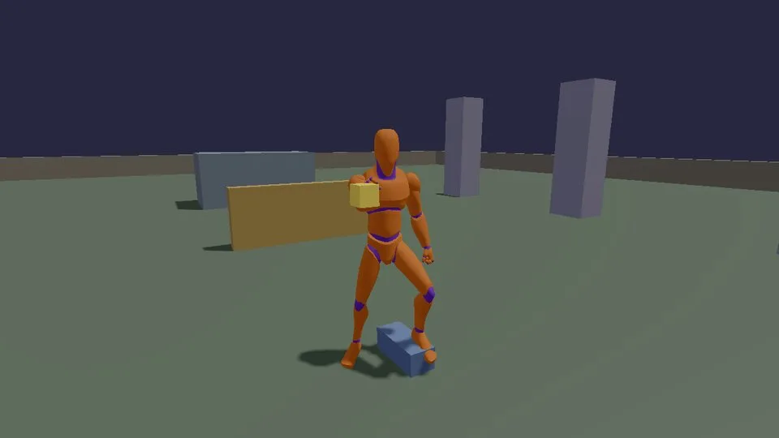

# The cookbook game

The C++ half of the [cookbook](../../docs/cookbook/index.md). It is the
starter template's setup (the same level, the same character) plus the
eight camera types most games use, switchable while you play, screen
shake, and two animated UAL mannequins: one walking round a circle on a
blend space, one standing with a head that looks at you, a hand that
reaches for a floating yellow ball and feet planted on a step. The
player is the same mannequin, animated (the starter game's `PlayerBody`).

It is the reference for **choosing a camera** (shooter, action game,
top-down, isometric strategy, platformer, fixed-camera horror, cutscenes)
and for **procedural animation on a real skeleton** (blend spaces,
look-at, two-bone IK, foot placement). The docs include regions of these
files word for word, and CI builds and runs it, so the recipes cannot
quietly go stale.



## Run it

The executable is `cookbook` (`set(GAME_NAME cookbook)` in
[CMakeLists.txt](CMakeLists.txt)). The root CMakeLists.txt builds it
with the starter template, when `KKE_ENABLE_JOLT` and `ENGINE_ENABLE_LUA`
are on (the default):

```sh
cmake --build build --target cookbook
cd build/bin && ./cookbook
KKE_SKIP_INTRO=1 ./cookbook              # skip the engine's logo intro
KKE_COOKBOOK_VIEW=topdown ./cookbook     # start on that camera
KKE_COOKBOOK_MANNEQUINS=0 ./cookbook     # no mannequins
```

`KKE_COOKBOOK_VIEW` takes `first`, `third`, `orbit`, `topdown`, `iso`,
`side`, `fixed` or `cinematic`.

## Controls

Click the view to take the mouse (Esc lets it go). Movement is the
engine's standard character actions, as in the starter game.

| Action | Keyboard and mouse | Controller |
|---|---|---|
| Move (forward depends on the camera, see below) | WASD | left stick |
| Look | mouse | right stick |
| Jump / vault / climb | Space | A |
| Sprint | Left Shift (hold) | click the left stick (toggle) |
| Walk | Left Alt (hold) | push the left stick part of the way (the speed follows the stick) |
| Pick a camera | 1 to 8 | D-pad right cycles through them |
| Next camera | Tab | D-pad right |
| First or third person | V | click the right stick |
| Zoom the camera arm in / out | X / Z | RT / LT (analog) |
| Play a camera path over the stairs | P | d-pad up |
| Shake the camera | K | d-pad left |
| Show or hide the guide card | H | d-pad down |
| Pause: settings, button remapping, quit | Esc | Start or View / Back |
| Developer panels | F1 | none: a developer tool, keyboard only |

[Bindings.h](Bindings.h) also defines `throw.charge` / `throw` (hold Q,
release Q) and `level.reset` (Ctrl+R) as examples for
[docs/cookbook/input.md](../../docs/cookbook/input.md); nothing in this
game acts on them.

## How it plays

There is no goal: it is a playground. Walk around the starter level
(stairs, a fence, a climbing block) plus four pillars to look past, and
switch cameras to feel what each does to the same scene. The walking
mannequin circles at (-11, 0, 9); the standing one is at (3, 0, 1), next
to where you start.

A card in the corner ([scripts/guide.lua](scripts/guide.lua)) says what
the game is, and changes as you walk: next to the standing mannequin it
explains the ball (arm IK), the head (look-at) and the step (foot
placement); at the walker, the blend space; at the pillars, the cameras;
at the stairs and the fence, moving. It always lists the camera buttons.
H or the d-pad down hides it. The docs' screenshots leave it out
(run_recipes.py copies the scripts without it).

## How it works

### Startup and the frame

[main.cpp](main.cpp) makes a 1280 x 720 application called "KKE
Cookbook", sets the `playful` mood and adds: `SettingsModule`,
`InputModule("input.json")`, `RigidBodyModule`, `ModelModule`,
`UiModule`, `AudioModule` (panel hidden), `ScriptModule` (scripts from the
source folder when it exists, else the copy next to the executable, as
in the starter template), `cookbook::CookbookPlayer`,
`cookbook::Mannequin` and `StatsModule`.

### The cameras (CookbookPlayer)

[CookbookPlayer.cpp](CookbookPlayer.cpp) is the starter template's
`PlayerModule` with a `View` enum of eight cameras. A camera is two
points and a field of view: every frame the module sets `position`,
`target` and `fovDegrees` on `app.camera()`. `setView` picks a
`kke::CameraRig` mode for the four the rig does itself; the other four
are placed by hand in `update`:

| View | How it is made |
|---|---|
| `first` | `CameraRig::Mode::FirstPerson`: eyes at the head; the character turns with the view and its body is not drawn |
| `third` | `CameraRig::Mode::ThirdPerson`: a spring arm that ray-casts through Jolt so it never goes through walls |
| `orbit` | `CameraRig::Mode::Orbit`: circles the character; look turns it |
| `cinematic` | `CameraRig::Mode::Cinematic`: a smooth path through keyframes; by default a looping 18 s tour set in `init` |
| `topdown` | 11 m above the feet and 2 m back (a slight tilt so walls read as walls), fov 50 |
| `iso` | 9, 11, 9 m from the feet at 45 degrees, fov 30 (a narrow lens: almost no perspective) |
| `side` | 12 m out along +Z at chest height plus 1 m, fov 50; the stick only moves left and right |
| `fixed` | bolted at `fixedCameraAt` (9, 5, 9), turning to watch the chest, fov 50 |

**Which way is forward.** `moveForward()` answers that per camera, so the
stick feels right in each: the rig's forward for the rig cameras, "up on
the screen" (-Z) for top-down, away from the camera diagonally for iso,
nothing for side-on (the right vector becomes +X), and away from the
wall camera for fixed.

**Screen shake** is "trauma" from 0 to 1 that fades by 0.9 a second.
`shakeOffset(trauma, time)` in [Procedural.h](Procedural.h) turns it into
yaw, pitch and roll in degrees: a few sines at unrelated rates (smooth,
not random jumps), scaled by trauma squared so small bumps stay small. It
is applied on top of whichever camera is active by turning `target` and
`up`:

```cpp
const glm::vec3 wobble = shakeOffset(m_trauma, m_time);
const glm::vec3 look = cam.target - cam.position;
const glm::vec3 side = glm::normalize(glm::cross(look, glm::vec3(0, 1, 0)));
glm::mat4 turn = glm::rotate(glm::mat4(1.0f), glm::radians(wobble.x), glm::vec3(0, 1, 0));
turn = glm::rotate(turn, glm::radians(wobble.y), side);
cam.target = cam.position + glm::vec3(turn * glm::vec4(look, 0.0f));
```

**Zoom** changes the rig's arm length by the `zoom` axis, clamped to 1.5
to 8 m.

### The Lua side (view.*and player.*)

`registerLua()` adds:

| Lua | Does |
|---|---|
| `view.mode(name)` | switches camera (an unknown name is a Lua error listing the valid ones); `view.mode()` returns the current one |
| `view.shake(amount)` | adds trauma (default 0.5) |
| `view.path(keys, loop)` | a cinematic path: `{ {pos = Vec(..), target = Vec(..), time = 0}, ... }`, at least two keys; switches to `cinematic` |
| `player.position()`, `player.teleport(pos)`, `player.facing()` | the same as the starter template, so recipes run in both games |

[scripts/cameras.lua](scripts/cameras.lua) uses them: it defines actions
`view.first` to `view.cinematic` on keys 1 to 8, P plays a three-key path
over the stairs and returns to third person after 6.5 s
(`timer.Simple`), and K adds 0.4 trauma.
[scripts/level.lua](scripts/level.lua) is the starter level plus four
pillars at x = 10 and the 18 cm step under the standing mannequin's foot.

### The mannequins (Mannequin)

[Mannequin.cpp](Mannequin.cpp) loads `UAL1_Standard.fbx` once, builds an
`AnimationSet` (the clips as poses) and spawns two instances, each with
its own `Animator`:

- **The walker**: a 1D blend space `move` (idle at 0, walk at 1.4, jog
  at 3.2 m/s). Its wanted speed rises and falls
  (`1.6 + 1.6 * sin(0.35 t)`), `springTowards` smooths it, the blend
  parameter is set to the speed, and it moves round a 3 m circle by arc
  length (`angle += speed / radius * dt`), facing along it.
- **The stander** plays the idle clip, then poses on top of it, in
  model space, in three steps:
  1. `kke::FootPlacer` casts a ray down from each foot through Jolt and
     plants it (one foot lands on the step).
  2. `kke::solveHumanArm` puts the right palm on the near side of the
     ball, which drifts in a slow figure eight to the mannequin's right
     (never across the body or down at the hips); the elbow bends only
     forward, leans out and down, and the shoulder lifts its collarbone
     when the hand goes high, as a person's does.
  3. The head looks at the camera: a spring smooths the look point,
     `turnTowards` limits the turn to 60 degrees, and the model-space
     turn is converted to the head bone's local rotation
     (`local' = parent^-1 * turn * parent * local`).

`springTowards` in [Procedural.h](Procedural.h) is a critically damped
spring solved exactly (after Daniel Holden's "Spring-It-On"), so it moves
the same at 30 and 240 frames per second.

### Where the docs quote the code

Regions between `// --8<-- [start:name]` and `// --8<-- [end:name]` are
pulled into the docs pages by name (for example
`--8<-- "games/cookbook/Mannequin.cpp:blend"` in
[docs/cookbook/animation.md](../../docs/cookbook/animation.md)). Rename
or remove a marker and the page breaks, so edit the code, not the
markers.

### How recipes are run and screenshotted

[tools/docs_site/run_recipes.py](../../tools/docs_site/run_recipes.py)
runs every Lua recipe in `docs/cookbook/recipes/` for a few seconds each
and fails on any script error (CI runs it under Xvfb, in the step
"Cookbook recipes run headless"):

- Normally each recipe is copied, with the starter template's
  `game.lua`, into a temporary scripts folder and run in `starter_game`
  (`KKE_SCRIPTS_DIR` points at it).
- With `--shots` it runs in `cookbook` instead, with this game's
  `level.lua`, `KKE_COOKBOOK_MANNEQUINS=0`, and an extra script that
  holds the camera still with `view.path` (two keyframes at the same
  place). ImageMagick (`import -window root`) grabs the screen after a few seconds and saves a
  960 x 540 JPEG to `docs/cookbook/media/`.
- Each camera type is captured with `KKE_COOKBOOK_VIEW=<name>`
  (`camera-<name>.jpg`), and the two mannequins from fixed cameras
  (`mannequin.jpg`, `walker.jpg`).

```sh
tools/docs_site/run_recipes.py --bin build/bin            # run them all
tools/docs_site/run_recipes.py --shots maze.lua camera:iso  # re-shoot two
```

The header-only helpers ([Bindings.h](Bindings.h),
[Procedural.h](Procedural.h), [PhysicsRecipes.h](PhysicsRecipes.h)) are
also compiled into `tests/test_cookbook.cpp`, which checks that the
bindings do what the input page says, the spring arrives without
overshoot at any frame rate, shake grows with trauma squared,
`turnTowards` stops at its limit and `dropCrate` lands where
`groundBelow` says the ground is.

## Design decisions

- **Recipes are tested, not just written.** The header comment in
  main.cpp: the docs quote this code and CI runs it. Snippet markers,
  `run_recipes.py` and `test_cookbook.cpp` make a stale recipe a failed
  build.
- **The same level and the same `player.*` as the starter game**, so a
  Lua recipe that works in one works in the other, and the screenshots
  show the level readers have.
- **Four cameras are rig modes, four are a few lines by hand.** The
  comment in `setView`. The hand-made ones show that a camera is only a
  position and a target.
- **Forward depends on the camera** (`moveForward`), because a stick that
  means "camera forward" in a top-down or side-on view feels wrong.
- **Shake is trauma squared over smooth noise** (comment in Procedural.h,
  after Squirrel Eiserloh's GDC talk): small bumps stay small and the
  view never jumps.
- **Helpers are header-only and pure** (Procedural.h, PhysicsRecipes.h),
  so the unit tests run exactly the code the docs quote.
- **Mannequins can be switched off** (`KKE_COOKBOOK_MANNEQUINS=0`), so
  Lua recipe screenshots show only the recipe.

## Tuning

| What | Where | Effect |
|---|---|---|
| Camera placements and fovs | `CookbookPlayer::update` | what each view looks like |
| `fixedCameraAt` (9, 5, 9) | CookbookPlayer.h | where the fixed camera hangs |
| the default cinematic keyframes | `CookbookPlayer::init` | the looping tour |
| trauma decay (0.9 per second), `maxDegrees` (6) | `update`, `shakeOffset` | how long and how hard shakes are |
| zoom rate (4 m/s), 1.5 to 8 m | `update` | the camera arm |
| `standAt`, `circleAt`, `circleRadius` | Mannequin.h | where the mannequins are |
| blend speeds (0, 1.4, 3.2) | `Mannequin::init` | where idle, walk and jog meet |
| look-at limit (60 degrees), spring half-lives | `updateStander` | how far and how fast the head turns |

## Engine features it uses

| Feature | Header / module | Doc |
|---|---|---|
| Camera modes, cinematic paths | `kke::CameraRig` ([kke/CameraRig.h](../../engine/include/kke/CameraRig.h)) | [cookbook/cameras.md](../../docs/cookbook/cameras.md) |
| Character movement | `kke::Locomotion` | [MOVEMENT.md](../../docs/MOVEMENT.md) |
| Binding keys, pad buttons, axes and chords in C++ | `InputModule`, `kke::InputMap` | [cookbook/input.md](../../docs/cookbook/input.md), [INPUT.md](../../docs/INPUT.md) |
| Lua bindings from C++ | `kke::ScriptVM::registerFunction` | [cookbook/cpp.md](../../docs/cookbook/cpp.md), [SCRIPTING.md](../../docs/SCRIPTING.md) |
| Skinned models | `ModelModule` | |
| Blend spaces, clip states | `kke::Animator`, `kke::AnimationSet` | [cookbook/animation.md](../../docs/cookbook/animation.md) |
| Arm IK, foot placement | `kke::solveHumanArm`, `kke::FootPlacer` ([kke/AnimRig.h](../../engine/include/kke/AnimRig.h)) | [PROCEDURAL_ANIMATION.md](../../docs/PROCEDURAL_ANIMATION.md) |
| Jolt bodies and ray casts from C++ | `kke::RigidWorld` | [cookbook/physics.md](../../docs/cookbook/physics.md) |

## Assets

- The mannequin: `assets/animations/UAL1_Standard.fbx` (Quaternius'
  Universal Animation Library, CC0; see
  [docs/DEPENDENCIES.md](../../docs/DEPENDENCIES.md)), found in
  `assets/animations/` or `KKE_ANIMATIONS_DIR`. Clips used: `Idle_Loop`,
  `Walk_Loop`, `Jog_Fwd_Loop`. Without it the log says
  "assets/animations/UAL1_Standard.fbx not found: no mannequins" and the
  rest of the game runs.
- No Synty packs. The level is Lua boxes; the player is the same
  mannequin (two boxes when the file is missing).

## Make a game like this

1. Make your game from the starter template (`tools/new_game my_game`).
2. For a different camera, copy the case you want from
   `CookbookPlayer::update` into your `PlayerModule::update`, and copy
   `moveForward()` so the stick matches it.
3. For a Lua-switchable camera, copy `registerLua()`'s `view.*`
   functions into your `PlayerModule::registerLua`.
4. For an animated character, copy the loading and blend-space code from
   `Mannequin::init`, and draw it at your capsule's feet instead of the
   block (kke_demo and Climb Race do this).
5. Read [docs/cookbook/cameras.md](../../docs/cookbook/cameras.md) and
   [docs/cookbook/animation.md](../../docs/cookbook/animation.md).

Pitfalls:

- Set the field of view in every camera case: the hand-placed cameras
  set their own, and the rig cameras reset it to the rig's setting.
- Pose on top of the animated pose, in model space, in order: feet,
  then IK, then look-at. Convert a model-space turn to the bone's local
  rotation through its parent, as `updateStander` does.
- Keep the `--8<--` markers when you edit files the docs quote.

## Files

| File | What is in it |
|---|---|
| [main.cpp](main.cpp) | The modules and where scripts are read from |
| [CookbookPlayer.h](CookbookPlayer.h), [CookbookPlayer.cpp](CookbookPlayer.cpp) | The player, eight cameras, screen shake, `view.*` and `player.*` |
| [Mannequin.h](Mannequin.h), [Mannequin.cpp](Mannequin.cpp) | The walker (blend space) and the stander (feet, hand IK, look-at) |
| [Bindings.h](Bindings.h) | `addCookbookBindings`: C++ input binding examples |
| [Procedural.h](Procedural.h) | `springTowards`, `shakeOffset`, `turnTowards` |
| [PhysicsRecipes.h](PhysicsRecipes.h) | `dropCrate`, `groundBelow`: Jolt from C++ |
| [scripts/cameras.lua](scripts/cameras.lua) | Keys 1 to 8, the camera path (P), shake (K) |
| [scripts/level.lua](scripts/level.lua) | The starter level, pillars, the mannequin's step |
| [scripts/guide.lua](scripts/guide.lua) | The card that says what you're looking at |
| [../template/PlayerBody.cpp](../template/PlayerBody.cpp) | The player's animated mannequin, shared with the starter game |
| [CMakeLists.txt](CMakeLists.txt) | The executable and files copied next to it |
