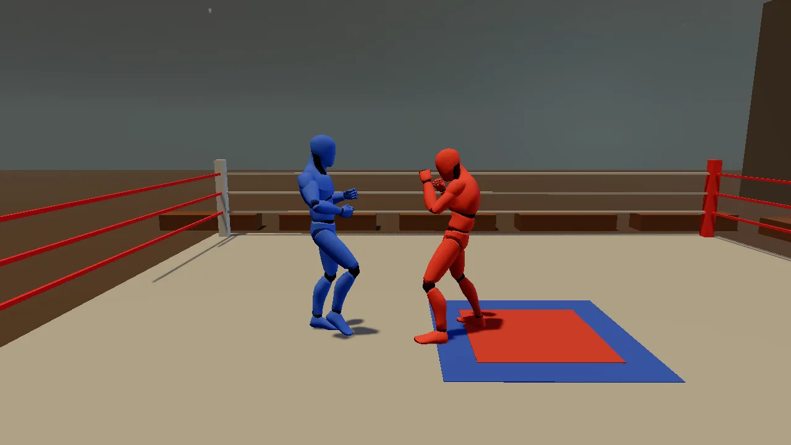

# Duel

A one-on-one fist fight in a boxing ring under gym lights. You are the
blue corner; the red corner is a sparring bot, or a second player on the
same machine. It is best of three rounds. A round ends on a knockout, or
after 90 seconds, when the healthier fighter takes it. You jab, throw a
slow uppercut, knee through a guard, block (a block raised just in time is
a parry) and dodge, and every one of those costs stamina.

The demo teaches the melee core (`kke::Combatant` and `kke::CombatWorld`,
[docs/COMBAT.md](../../docs/COMBAT.md)), a bot whose tactics are data on
the engine AI core ([docs/AI.md](../../docs/AI.md)) while its reflexes stay
in C++, Jolt ragdoll knockdowns that blend back into a get-up clip,
a boxer's stance and guard made with kke::CharacterIk on top of plain clips, and local two-player input with device
assignment. Start here for a fighting game, a boxing or wrestling game,
any one-on-one melee, or any game where an animation has to last exactly
as long as a rule says.



## Run it

The executable is `duel` (`add_executable(duel ...)` in
[CMakeLists.txt](CMakeLists.txt)). The root `CMakeLists.txt` only adds the
demo when `KKE_ENABLE_JOLT` is on, which is the default.

```bash
cmake --build build --target duel
cd build/bin
./duel
KKE_SKIP_INTRO=1 ./duel          # skip the logo intro
KKE_DUEL_BOTS=1 KKE_DUEL_QUIT=60 ./duel   # watch two bots for a minute, with a log
```

| Variable | Effect |
|---|---|
| `KKE_DUEL_LEVEL=easy\|normal\|hard` | the bot's reaction time, block and parry rates, aggression (default `normal`) |
| `KKE_DUEL_BOTS=1` | both corners are bots (a demo that plays itself, rematches on its own) |
| `KKE_DUEL_QUIT=<s>` | quit after that many seconds, logging a tally at 5 s and every 10 s after |
| `KKE_DUEL_SEED=<n>` | the bots' dice (default 1) |
| `KKE_ANIMATIONS_DIR` | where to look for `UAL1_Standard.fbx` and `UAL2.fbx` |
| `KKE_ASSETS_DIR` | also searched for `Universal Animation Library 2/Unity/UAL2.fbx` |

Rebindings are saved to `duel_input.json` (the name passed to
`InputModule` in [main.cpp](main.cpp)).

## Controls

All bindings are made in `DuelModule::init` ([DuelModule.cpp](DuelModule.cpp))
and are rebindable actions in the "Fight" and "Match" groups.

| Action | Player 1 keyboard / mouse | Player 2 keyboard | Controller (either player) |
|---|---|---|---|
| Move (you always face the opponent) | WASD | arrow keys | left stick |
| Punch: jab, then cross, then hook when pressed again within about a second (`duel.light`) | J / left mouse | numpad 1 | X (west) |
| Uppercut: slow, knocks down (`duel.heavy`) | K / right mouse | numpad 2 | Y (north) |
| Knee up close, front kick from further; breaks a guard (`duel.kick`) | L | numpad 3 | B (east) |
| Block, held; just before the hit it parries (`duel.block`) | Left Shift | numpad 0 | RB or LT |
| Dodge (`duel.dodge`) | Space | numpad Enter | A (south) |
| Next round / rematch (`duel.again`) | R | none | Start |
| Second player takes the red corner, or hands it back (`duel.two`) | F2 | none | the pause menu (Select) |
| Pause menu: settings, controls, quit | Esc | none | Start (during a round) or Select |
| Developer panels (`panels`) | F1 | none | no controller binding yet |

Notes from the code:

- Button names are positions (SDL's `WEST`, `NORTH`, `EAST`, `SOUTH`), so
  on a PlayStation pad X is Square, Y is Triangle, B is Circle, A is Cross.
  The HUD's prompts show the right glyph for the device each player last
  touched (`InputModule::promptText`).
- The fight starts from `InputModule::defineCharacterActions`, then clears
  the bindings of the actions a boxer does not use (jump, sprint, fire,
  look and so on), including `voice.talk`, since the duel has no voice
  chat. `audio.ping` (Q, D-pad down) keeps its engine default and plays
  the AudioModule's accessibility ping.
- During the between-rounds pause only player 1's `duel.again` skips the
  wait; at the end of the match either player's does.

## How it plays

- **Rounds.** Each round opens with a 2 second intro ("Round N", then
  "Fight!" after 1.2 s). A knockout (health to zero) ends the round at
  once. At 90 s (`kRoundTime`) the fighter with more health takes it; a
  tie goes to blue (`h0 >= h1`). The first to two round wins takes the
  match. Between rounds the next one starts after 3.5 s, or after 1 s if
  player 1 presses `duel.again`. After the match, `duel.again` starts a new
  one; with `KKE_DUEL_BOTS=1` it restarts by itself after 4 s.
- **Stamina.** Every attack and every dodge spends stamina up front; with
  too little, it does not start. Stamina comes back after a short pause,
  slower while blocking.
- **Blocking.** A block facing the punch takes a little chip damage and
  costs stamina. At zero stamina the guard breaks and the blocker is
  stunned for long. The knee has no chip damage but costs a blocker 45
  stamina, so it is the guard breaker.
- **Parry.** A block raised within 0.15 s of the hit (`parryWindow`)
  parries it: no damage, and the attacker is stunned for 0.8 s.
- **Poise and knockdowns.** Every hit wears down poise (45 for a fighter).
  At zero the fighter goes down as a ragdoll and gets back up about 2.2 s
  later. The uppercut does 40 poise damage, so two landed uppercuts in a
  row floor anyone.
- **Two players.** F2 (or Two players in the pause menu) gives the red corner to a second player.
  With two controllers each player gets one; with one controller it goes
  to player 2 and player 1 keeps the keyboard; with none, both share the
  keyboard on different keys. Press it again to hand red back to the bot.

The strikes start from the engine presets in
[Combat.cpp](../../engine/src/Combat.cpp); `DuelModule::attackNamed`
makes the cross, hook and kick from them. A press during a strike is kept
for 0.35 s and thrown as soon as the fighter can act, so a combo flows.

| Attack | Windup / active / recovery (s) | Damage | Stamina | Poise damage | Other |
|---|---|---|---|---|---|
| Jab (`light()`) | 0.28 / 0.12 / 0.32 | 10 | 12 | 18 | 15% chip through a block |
| Cross | 0.3 / 0.12 / 0.32 | 12 | 13 | 21 | reach 1.05 m |
| Hook | 0.34 / 0.12 / 0.38 | 15 | 15 | 26 | reach 0.9 m, 24 guard damage |
| Uppercut (`heavy()`) | 0.55 / 0.16 / 0.5 | 24 | 26 | 40 | knockback 4 m/s, sweeps |
| Knee (`kick()`) | 0.32 / 0.12 / 0.4 | 6 | 14 | 26 | no chip, 45 guard damage; closer than 1.05 m |
| Front kick | 0.4 / 0.12 / 0.45 | 9 | 16 | 26 | reach 1.45 m, knockback 3.5 m/s; needs the full UAL 1 |

## How it works

### Startup and the frame

[main.cpp](main.cpp) creates the `Application`, sets the mood
`arena_night` (`assets/moods/arena_night.yaml`: the night sky, lights and
crickets ambience) and adds the modules in this order:

1. `SettingsModule` (`settings.json`)
2. `InputModule` (`duel_input.json`)
3. `RigidBodyModule` (Jolt: the ring, the fighters' capsules, ragdolls)
4. `ModelModule` (the skinned fighters)
5. `UiModule` (RmlUi, the HUD)
6. `AudioModule`, its debug panel hidden
7. `duel::DuelModule`, the game
8. `StatsModule`, its panel hidden

`DuelModule::dependencies()` declares RigidBody and Input as required and
Models as optional (without it the fighters are blocks).

`DuelModule::init` reads the environment, binds the controls for two
players, loads the mannequin (`loadCharacter`), loads the bot species from
`data/boxer.yml`, builds the ring (`buildArena`), spawns both fighters,
builds the HUD, starts in one-player mode and starts the match.

`DuelModule::update` then runs, every frame:

```cpp
if (m_phase == Phase::Fight) thinkAi(dt);
updateFighter(m_fighters[0], m_fighters[1], dt);
updateFighter(m_fighters[1], m_fighters[0], dt);
for (const kke::HitEvent& e : m_combat.step(dt)) onHit(e);
for (int i = 0; i < 2; ++i) animateBody(m_fighters[i], m_fighters[1 - i], dt);
updateCamera(dt);
updateHud();
```

Before that it handles F1, F2 and the phase machine (Intro, Fight,
RoundOver, MatchOver). The order matters: intentions first, then the
combat rules resolve hits, then the bodies are posed from the new combat
state, then the camera and HUD read the result.

### A fighter

`DuelModule::Fighter` (in [DuelModule.h](DuelModule.h)) holds everything
about one corner: its `kke::CombatantId` in the `CombatWorld`, its Jolt
character (`RigidWorld::CharacterId`, radius 0.3 m, height 1.8 m), its
facing, a knockback velocity still being applied (`push`), its round wins,
its model instance and `Animator`, its ragdoll, and the `Intent` for this
frame. An `Intent` is the same struct for a player and a bot:

```cpp
struct Intent {
    glm::vec2 move{0.0f};   // x = right (the fighter's own), y = toward the opponent
    bool light = false, heavy = false, kick = false, dodge = false;
    bool block = false;
};
```

Because the player and the bot fill the same struct, the rest of the code
never asks who is driving.

`updateFighter` does this for each fighter:

1. **Get the intent.** During the Fight phase, from `SparringBot::think`
   for a bot or `readPlayer` for a player; otherwise an empty intent.
2. **Face the opponent.** The facing turns toward the other fighter with
   exponential smoothing (`1 - exp(-rate * dt)`, rate 14, or 6 during a
   windup so a telegraphed punch can still be tracked a little). It does
   not turn while the attack is Active or in Recovery: "a committed punch
   goes where it was aimed", so a dodge to the side makes it miss.
3. **Tell the combat core.** `Combatant::place(feet, facing)`, then
   `attack(light/heavy/kick)`, `dodge()` and `setBlocking()`.
4. **Footwork.** The intent's move turns into a velocity that depends on
   the combat state:

   | State | Velocity |
   |---|---|
   | Idle | wish × 2.2 m/s (1.0 while blocking) |
   | Windup | 0.5 m/s forward plus 0.4 × wish: stepping into it |
   | Active | 1.2 m/s forward |
   | Recovery | 0.4 × wish |
   | Dodging | 5.5 m/s, fading to 40% over the dodge; back, or sideways, never forward |
   | Stunned, Knockdown, Dead | none, only knockback |

5. **Knockback and spacing.** `push` is added and decays with
   `exp(-7 dt)`. If the fighters are closer than 0.72 m (`kMinGap`), any
   closing speed is removed, and below 90% of that they are pushed apart,
   so they never walk through each other (unless the other one is down).
6. **Move the body.** The velocity goes to the Jolt character with
   `setCharacterInput`. A fighter on the ground gets no input.
7. **Get up.** A downed fighter that is still alive calls `getUp` after
   1.3 s (`kRagdollTime`).

### Reading a player

`readPlayer` turns the stick into the fighter's own frame. The stick is
screen space: up means "away from the camera". It becomes a world
direction using the camera's flattened forward and right, and then that
is projected onto the fighter's right and facing. So pushing the stick
toward the opponent on screen always walks toward the opponent, whichever
side of the ring the camera is on.

```cpp
const glm::vec3 world = camRight * m.x + camFwd * m.y;
const glm::vec3 right = glm::normalize(glm::cross(f.facing, glm::vec3(0, 1, 0)));
it.move = glm::vec2(glm::dot(world, right), glm::dot(world, f.facing));
```

Attacks and the dodge use `pressed` (one frame on the press), the block
uses `held`.

### Two players and devices

Both players have their own `InputMap` (`m_input->setPlayers(2)`).
Player 2's map clears `move` and rebinds it to the arrow keys and the left
stick, plus the number pad for the fight actions. Both maps get the same
controller bindings.

`setTwoPlayers` decides who listens to which device with
`InputModule::assignDevices` (an empty list means "all devices"). In
one-player mode both maps listen to everything; red is a bot, so its map
is never read. In two-player mode the keyboard and mouse go to both (the
keys differ), and the gamepads are split: two pads, one each; one pad,
player 2's. `update` calls `setTwoPlayers(true)` every frame while two
players are on, so a controller plugged in or pulled out mid-fight is
picked up.

### The combat rules and hits

`m_combat` is a `kke::CombatWorld`. Each fighter is added in its own team
with `CombatStats::fighter()` (100 health, 100 stamina, 45 poise, parry
window 0.15 s, knockdown 2.2 s). `CombatWorld::step(dt)` advances every
`Combatant`'s state machine (Idle, Windup, Active, Recovery, Stunned,
Dodging, Knockdown, Dead), checks each active strike's sphere against the
other capsules, and returns `HitEvent`s. `onHit` reacts to each outcome:

| Outcome | What the duel does |
|---|---|
| Hit | adds the push to the target, counts a landed hit |
| Blocked | adds the push, counts a block for the defender |
| GuardBroke | adds the push, counts a guard break |
| Parried | pushes the attacker back 1.5 m/s, counts a parry |
| Knockdown | `knockDown` with the push × 1.6 plus 1 m/s up |
| Killed | `knockDown` with push × 2 plus 1.5 m/s up; the attacker wins the round |

The game never computes damage itself. It only moves bodies and plays
animations; the rules are all in `kke::Combatant`.

### Knockdowns and getting up

`knockDown` hands the skeleton to physics:

1. It takes the model's current bone world matrices (`boneWorld` times
   the instance transform).
2. `kke::buildHumanoidRagdoll(m_rigData, world, 75.0f, &missing)` builds a
   75 kg ragdoll description that matches the pose (it names the bone it
   could not find, if any).
3. `bindSkeletonToRagdoll` records how each bone sits on its body.
4. `IRagdollPhysics::createRagdoll` spawns it with 30% of the push as its
   starting velocity, then `pushRagdollBody` gives the torso and head the
   full push and the pelvis 30%: "the head and chest take the blow; the
   legs go out from under".

While it lies there, `animateBody` skins the model from the ragdoll every
frame with `poseFromRagdoll` and `setBoneWorldOverride`.

`getUp` runs after 1.3 s. It reads the ragdoll's pelvis, clamps it 0.5 m
inside the ropes, teleports the Jolt character there, takes the lying pose
as `getUpFrom`, destroys the ragdoll and plays the get-up clip. For the
next 0.45 s `animateBody` blends from the lying pose into the animated
pose with `kke::blendPoses`, so the fighter does not snap from the floor
into a standing clip. 1.3 s on the ground plus the 0.9 s get-up clip
(`kGetUpTime`) equals the combat core's 2.2 s `knockdownTime`, so the body
is up when the rules say it can act. A knockout (health zero) never calls
`getUp`: the fighter stays down.

The ragdoll comes from `kke::bestRagdollPhysics(app.findCapability<kke::IRagdollPhysics>())`.
Without one (or without the mannequin) there is no ragdoll: the combat
rules still knock the fighter down, they just stay standing on screen.

### Bodies and animation

[Body.cpp](Body.cpp) owns the look.

**Loading** (`loadCharacter`). `kke::findAssetFolder("assets/animations",
{"KKE_ANIMATIONS_DIR"}, ...)` finds `UAL1_Standard.fbx`. The mannequin is
orange; the code copies its `ModelData`, makes every material light grey
(joints dark) and adds the copy as `duel/fighter`, so
`ModelModule::setTint` can colour the corners blue and red (the tint
multiplies). If `UAL2.fbx` is found (next to UAL 1, or at
`$KKE_ASSETS_DIR/Universal Animation Library 2/Unity/UAL2.fbx`), its
clips are added with `kke::appendClipsByBoneName` (loaded with
`allowNoMeshes`, since that file has only a skeleton and clips). The full
UAL 1 (`UAL1.fbx`, the "Universal Animation Library" pack) adds its
`Kick`, `Dodge_Left/Right`, `Hit_Stomach` and `Celebration` the same way;
clips the rig already has are skipped.

**States** (`setupBody`). Each fighter gets an `Animator` with states
picked by name, with fallbacks when UAL 2 is missing:

| State | Clip (UAL 2 first, then the UAL 1 fallback) | Length |
|---|---|---|
| idle | `Idle_Loop` | loop |
| fwd, back, left, right | `Walk_Fwd/Bwd/L/R_Loop`, else `Walk_Loop` | loop at 1.4× |
| jab | `Punch_Jab` | 0.72 s |
| cross | `Punch_Cross` | 0.74 s |
| hook | `Melee_Hook`, else `Punch_Cross` | 0.84 s |
| uppercut | `Melee_Uppercut`, else `Punch_Cross` | 1.21 s |
| knee | `Melee_Knee`, else `Kick`, else `Punch_Cross` | 0.84 s |
| kick | `Kick` (only with the full UAL 1) | 0.97 s |
| dodge, dodge_l, dodge_r | `Walk_Bwd_Loop`; `Dodge_Left/Right`, else the side walks | dodge time + 0.15 / 0.25 s |
| hit_high, hit_low, hit_stomach, hit_hard | `Hit_Head`, `Hit_Chest`, `Hit_Stomach`, `Hit_Knockback` | the attack's `hitStun` |
| get_up | `LayToIdle`, `KipUp`, else `Crouch_Idle_Loop` | 0.9 s |
| win | `Celebration`, `Dance_Loop`, `Yes`, else `Idle_Loop` | loop |

The `timed` helper sets the playback speed to `clipDuration / seconds`, so
the clip lasts exactly as long as the rule:

```cpp
auto timed = [&](const char* state, int clip, float seconds) {
    const float speed = clip >= 0 && seconds > 0.0f ? s.duration(clip) / seconds : 1.0f;
    return a.addClipState(state, clip, false, speed);
};
```

The leading `|` in names like `"|Idle_Loop"` matters: clip names in the
FBX are `Armature|Idle_Loop`, and `AnimationSet::find` matches the first
clip that contains the text, so the bar anchors the match to the start of
the clip's own name.

**The state machine** (`animateBody`). The `Combatant`'s state picks the
clip, and only on entering a state (`state != f.lastState`): Windup plays
the attack's own clip, Stunned plays the hit clip that fits the blow (the
head for punches, the stomach for a knee or kick, knockback for an
uppercut or a stun over 0.5 s), Dodging plays the dodge to the side the
stick pointed. In Idle the
fighter's velocity, split into forward and sideways parts, picks the walk
clip once it is above 0.35 m/s, after any strike or flinch clip has
finished. The match winner dances.

**The stance and the guard** (on top of the clip). The mannequin's idle
and walks stand up straight, so while the fighter is free (Idle, not
getting up, not the match winner) `animateBody` poses a boxer over them:
the pelvis drops 8 cm, `spine_01` turns 14 degrees so the left (lead)
shoulder is forward, `spine_02`, `spine_03` and `neck_01` lean in and tuck
the chin. Each turn is about a model-space axis, written onto the bone's
local rotation as `r * (inverse(boneWorld) * delta * boneWorld)`. Then a
`kke::CharacterIk` per fighter does the rest: the hands go to the face
(the lead one further out, both higher and closer when blocking) as human
arms that stay out of the body, the feet stay on the canvas (so the lower
hips bend the knees), and the body leans into its footwork. The weight
(`f.guard`) eases toward 0.7 relaxed or 1.0 blocking, faster going up
(rate 22) than down (rate 8), and the stance fades with it, so strikes
and hit reactions play their clips unfought.

When `UAL1_Standard.fbx` is missing, `m_charModel` stays 0 and
`render`/`renderShadow` draw each fighter as a grey box with a dark visor
(`m_block`), rotated to the facing.

### The ring

`buildArena` builds the whole gym from boxes. Each visible box goes into
one vertex list (`appendBox`, 24 flat-shaded vertices per box) uploaded
once into a `kke::DynamicMeshRenderer`; each solid one is also a static
Jolt box (`RigidWorld::add` with `Motion::Static`). The canvas top is at
y = 0; the ring is 8.4 m across inside the ropes (`kRing` 4.2 is half of
it). The ropes are drawn as thin boxes but collide as four 1.6 m tall
walls just outside them, so fighters and ragdolls alike stay in. The
benches and back wall are only drawn. A comment notes that no two faces
share a plane (the apron top sits under the canvas) to avoid z-fighting.

### The sparring bot

The bot is two layers ([SparringBot.h](SparringBot.h),
[SparringBot.cpp](SparringBot.cpp)).

**Tactics on the AI core.** `m_ai` is a `kke::ai::AiWorld`. At init it
loads the `boxer` species from [data/boxer.yml](data/boxer.yml).
`syncAi` (at every round start) adds a bot as an agent and a player as an
actor (perceived, never steered), each in its own team, and gives a bot
the mood `{boldness 0.9, curiosity 0, aggression = skill, sociability 0}`.
Every Fight frame, `thinkAi`:

1. sets each fighter's transform in the AI world,
2. calls `SparringBot::sense`, which sets the inputs the species scores
   on: `stamina`, `health`, `foe_open` (the foe is in Recovery or
   Stunned), `foe_guard` (the foe blocks) and `patience`,
3. runs `AiWorld::update(dt)`,
4. turns each `AiEvent::Attack` (in reach, cooldown over) into
   `SparringBot::strike()`.

The species' utility actions decide the style:

| Action | Behaviour | Wins when |
|---|---|---|
| punish (weight 2.2) | fight | the foe is open and it has stamina above 12% |
| breathe (1.8) | flee | its stamina is low (logistic around 25%) and it feels threatened |
| press (1.2) | fight | it is hostile, has stamina, and patience is low |
| circle (1.0) | watch | patience is high and it feels threatened |
| idle (0.1) | idle | nothing else scores |

`patience` drifts: every 1.2 to 3.2 s it is re-rolled as
`roll() * (1.3 - aggression)`, so an aggressive bot waits less.

**Footwork** (`SparringBot::think`). The AI core's
`Agent::desiredVelocity` is projected onto the fighter's right and
facing and divided by the walk speed, giving the same `Intent.move` a
stick would. Two tactics adjust it: `circle` strafes and holds about
1.8 m away; `breathe` stops backing up once it is 2.7 m away, so it does
not run into the ropes.

**Reflexes in C++.** When the foe enters Windup, the bot decides once:
dodge (only for slow attacks, windup over 0.45 s), block, and whether that
block is a parry, each rolled against its skill. It acts only after its
reaction time and when within 2.2 m. A parry is timed by raising the block
when `foe.windupLeft()` is under 80% of the parry window. When the AI core
says strike, it picks the punch: the knee if the foe has blocked at least
twice lately and is blocking now, the uppercut if the foe's poise is under
45% (or, half the time, if the foe is stunned), a kick now and then at
the edge of reach (over 1.25 m), else a punch, which goes through the
same jab, cross, hook chain as a player's. A short random
cooldown follows.

| Level | Reaction (s) | Block chance | Parry chance | Aggression |
|---|---|---|---|---|
| easy | 0.18 | 0.3 | 0.05 | 0.35 |
| normal | 0.1 | 0.6 | 0.3 | 0.55 |
| hard | 0.05 | 0.85 | 0.5 | 0.75 |

### The camera

`updateCamera` is a side-on fighting-game camera. It looks at the
midpoint of the two fighters, 1.05 m up, from the side of the line between
them. The distance is `max(4.2, separation × 1.25 + 2.6)`, so both stay in
frame. Position and distance ease with `1 - exp(-4 dt)`. If the fighters
swap sides, the camera stays on the side it is already on instead of
swinging across the ring (it flips `m_camSide` when the new side vector
points away from where the camera is).

### The HUD

[Hud.cpp](Hud.cpp) and [ui/duel_hud.rml](ui/duel_hud.rml). `buildHud`
creates an RmlUi data model called `duel` with a `Corner` struct per
fighter (name, health, stamina, wins, note, low) plus `banner`, `sub`,
`hint` and `round`, then loads the document. Health and stamina are
strings like `"73%"`, bound straight to the bars' widths with
`data-style-width`. `updateHud` builds the new values each frame and calls
`DirtyVariable` only when something changed. The note under a bar says
"down!", "guard broken", "stunned", "blocking" or "winded". Below 25%
health the `low` class makes the bar red and blink. The hint line and the
banner go through `InputModule::promptText`, which turns `{duel.light}`
into the button glyph for the device that player last used.

### Headless runs

With `KKE_DUEL_QUIT` set, `update` logs, at 5 s and every 10 s after,
each fighter's health, stamina, wins, and tally (landed, blocked, parried,
guard breaks, knockdowns) plus the bot's current tactic, then pushes an
`SDL_EVENT_QUIT` when the time is up. With `KKE_DUEL_BOTS=1` this is a
self-playing balance test. CI starts `duel` for 8 seconds as part of the
headless smoke run.

## Design decisions

- **The rules live in the engine, not the game.** Timing, stamina,
  blocking, parries and poise are `kke::Combatant`; the duel only feeds it
  intents and reacts to `HitEvent`s. COMBAT.md describes the core as
  "game-agnostic melee" that "knows nothing about input, animation or AI",
  which is why the Goblin Horde reuses it with the same presets.
- **One `Intent` struct for players and bots.** A bot and a player fill
  the same fields, so `updateFighter` has one code path, and two bots
  (`KKE_DUEL_BOTS`) or two players need no special cases.
- **Tactics as data, reflexes as code.** The bot's choice of plan is the
  AI core's utility scoring over `data/boxer.yml`; blocks, parries and
  dodges stay in `SparringBot.cpp`. The header says why: they "are about
  frame timing, not choices". Commit c20b3ec moved the tactics to the AI
  core so the fighter's style can be changed by editing the YAML.
- **Clips are stretched to the rules.** Every attack and hit clip plays
  exactly as long as its `AttackDesc` says (`timed`). The rule decides the
  timing; the animation only illustrates it, so tuning a number never
  leaves an animation out of sync.
- **No turning during a committed swing.** The code comment: "a committed
  punch goes where it was aimed". This is what makes side dodges work.
- **Ragdoll time plus get-up clip equals the knockdown time.** 1.3 s +
  0.9 s = 2.2 s, the `knockdownTime` of `CombatStats::fighter()`, as the
  comment on `kGetUpTime` says ("Combatant's knockdown covers it").
- **Blend out of the ragdoll.** The get-up starts from the pose the
  ragdoll left (`poseFromRagdoll`) and blends into the clip over 0.45 s
  instead of snapping.
- **The stance is procedural, not a clip.** UAL has no boxing stance
  clip, so bone turns and `kke::CharacterIk` make one on top of any idle
  or walk clip.
- **A grey copy of the mannequin, tinted.** Tint multiplies the base
  colour, so a grey base takes blue and red cleanly where the orange
  original would not.
- **Everything works with less.** No UAL 2: UAL 1's punches stand in. No
  mannequin: boxes. No ragdoll capability: fighters stay standing. No
  species file: an error in the log and the bot stands still. The demo
  still starts in CI with no optional assets.
- **The ring is code, not a scene.** Boxes built in `buildArena`, so the
  demo needs no Synty packs (docs/SCENES.md lists it as "No Synty
  packs").

## Tuning

| What | Where | Effect |
|---|---|---|
| `kRing` 4.2 | [DuelModule.cpp](DuelModule.cpp) | half the ring's width; bigger gives more room to circle |
| `kStart` 1.7 | DuelModule.cpp | each corner's start distance from the middle |
| `kMinGap` 0.72 | DuelModule.cpp | closest the fighters' centres may get |
| `kWalk` 2.2, `kBlockWalk` 1.0, `kDodgeSpeed` 5.5 | DuelModule.cpp | footwork speeds in m/s |
| `kRagdollTime` 1.3 | DuelModule.cpp | time on the ground before the get-up (keep it + `kGetUpTime` = `knockdownTime`) |
| `kRoundTime` 90 | DuelModule.cpp | round length before the decision |
| facing rates 14 and 6 | `updateFighter` | how fast fighters square up (lower is easier to side-step) |
| push decay 7 | `updateFighter` | how long knockback slides |
| ragdoll mass 75, push multipliers 1.6 and 2.0 | `knockDown`, `onHit` | how far a knockdown throws the body |
| `kGetUpTime` 0.9, blend 0.45 s | [Body.cpp](Body.cpp) | get-up clip length and the blend out of the ragdoll |
| guard targets 0.22 m, 0.55 / 1.0, rates 22 / 8 | `animateBody` | where the hands sit and how fast the block goes up |
| camera `4.2`, `1.25`, `2.6`, rate 4 | `updateCamera` | how far back the camera sits and how fast it follows |
| `Skill` per level | `SparringBot::skillFor` | reaction, block, parry, aggression |
| actions, weights, curves, `attackRange`, `attackCooldown` | [data/boxer.yml](data/boxer.yml) | the bot's style; `attackRange` 0.45 plus both radii is the 1.15 m punch reach |
| attack presets, `CombatStats::fighter()` | [engine/src/Combat.cpp](../../engine/src/Combat.cpp) | damage, stamina costs, parry window, poise (shared with other games) |

To change one fighter's stats without touching the engine, pass your own
`CombatStats` to `m_combat.add` in `spawnFighters`, or build an
`AttackDesc` from a preset and change fields (as the Goblin Horde does
with `slash()` and `swipe()`).

## Engine features it uses

| Feature | Header / module | Doc |
|---|---|---|
| Melee rules: attacks, stamina, blocks, parries, poise | `kke/Combat.h` (`Combatant`, `CombatWorld`, `AttackDesc`, `CombatStats`) | [COMBAT.md](../../docs/COMBAT.md) |
| Utility AI, steering, Attack events | `kke/ai/AiWorld.h` | [AI.md](../../docs/AI.md) |
| Species from YAML | `AiWorld::loadSpecies` | [AI.md](../../docs/AI.md), [DATA_FILES.md](../../docs/DATA_FILES.md) |
| Character controller, static boxes | `kke/RigidWorld.h`, `RigidBodyModule` | [MOVEMENT.md](../../docs/MOVEMENT.md) |
| Ragdolls built from a pose, skinned back | `kke/Ragdoll.h`, `IRagdollPhysics` | [RAGDOLLS.md](../../docs/RAGDOLLS.md) |
| Clip states, blending, two-bone IK, pose blending | `kke/Animator.h`, `kke/AnimRig.h` | [PROCEDURAL_ANIMATION.md](../../docs/PROCEDURAL_ANIMATION.md) |
| Skinned models, tints, bone overrides | `ModelModule` | [SCENES.md](../../docs/SCENES.md) |
| Rebindable actions, two players, device assignment, button prompts | `InputModule`, `kke/InputMap.h`, `kke/ButtonPrompts.h` | [INPUT.md](../../docs/INPUT.md) |
| HUD with data bindings | `UiModule` (RmlUi) | [INPUT.md](../../docs/INPUT.md) (prompts) |
| Mood: sky, light, ambience | `Application::setMood` | [MOODS.md](../../docs/MOODS.md) |
| Finding assets on this machine | `kke/AssetCatalog.h` (`findAssetFolder`) | [SCENES.md](../../docs/SCENES.md) |
| Box meshes drawn from code | `kke/SphereImpostors.h` (`DynamicMeshRenderer`) | |

## Assets

No Synty packs.

- **Fighters:** Quaternius' Universal Animation Library mannequin (CC0),
  `assets/animations/UAL1_Standard.fbx`, which is in the repository (not in
  release downloads, see [DEPENDENCIES.md](../../docs/DEPENDENCIES.md)).
  Clips used from it: `Idle_Loop`, `Walk_Loop`, `Punch_Jab`, `Punch_Cross`,
  `Hit_Head`, `Hit_Chest`, `Jump_Start`, `Crouch_Idle_Loop`, `Dance_Loop`,
  as fallbacks where UAL 2 is missing.
- **Melee clips (optional):** Universal Animation Library 2, `UAL2.fbx`,
  from `assets/animations/` or `$KKE_ASSETS_DIR/Universal Animation Library 2/Unity/`.
  Clips used: `Melee_Hook`, `Melee_Uppercut`, `Melee_Knee`,
  `Hit_Knockback`, `LayToIdle`, `Walk_Fwd_Loop`, `Walk_Bwd_Loop`,
  `Walk_L_Loop`, `Walk_R_Loop`. Missing: an info line in the log and UAL
  1's punches stand in.
- **Mannequin missing:** a warning ("the fighters are blocks") and each
  fighter is a grey box with a visor. The fight works the same.
- **HUD:** `ui/duel_hud.rml`, the shared `theme.rcss` from
  `games/rmlui_demo/ui/`, and the Noto Sans and Noto Color Emoji fonts
  (SIL Open Font License), all copied next to the executable by
  [CMakeLists.txt](CMakeLists.txt). Button glyphs are Xelu's CC0 prompts.
- **Mood:** `assets/moods/arena_night.yaml`.
- **The ring, gym and benches** are boxes built in code.

## Make a game like this

1. **Copy the folder.** `cp -r games/duel games/my_fight`, rename the
   target and namespace (`duel` to `my_fight`), and add
   `add_subdirectory(games/my_fight)` inside an `if(KKE_ENABLE_JOLT)` block
   in the root `CMakeLists.txt`. `tools/new_game` makes Lua-only games from
   `games/template`; a C++ melee game starts from this folder instead.
2. **Change the moves first.** Build your attacks from the presets:
   `kke::AttackDesc a = kke::AttackDesc::heavy(); a.name = "sweep"; a.height = 0.3f;`.
   Give each one a clip state with `timed(...)` so the clip matches its
   length, and map it in `animateBody`'s Windup case by `currentAttack().name`.
3. **Change the fighters' bodies.** Pass your own `CombatStats` to
   `m_combat.add`. For a different character, load it in `loadCharacter`
   and retarget UAL clips onto it the way the Goblin Horde's `loadHero`
   does (`matchBones`, `retargetAnimations`).
4. **Tune the bot in data.** Edit [data/boxer.yml](data/boxer.yml): add an
   action, change a weight or a curve, add an input and set it in
   `SparringBot::sense`. Keep timing reactions (blocks, parries) in C++.
5. **Replace the ring.** Swap `buildArena` for your own level (a scene
   file, or `command_kit::Scenery`-style pack models with box colliders).
   Keep walls solid so ragdolls stay in.
6. **Add rules on top.** Rounds, timers and scoring are the `Phase`
   machine in `update`; that is where a best of five, a ring-out or a
   super meter would go.
7. **Read next:** [COMBAT.md](../../docs/COMBAT.md),
   [AI.md](../../docs/AI.md), [RAGDOLLS.md](../../docs/RAGDOLLS.md),
   [INPUT.md](../../docs/INPUT.md).

Pitfalls the code shows:

- Keep the facing still during Active and Recovery, or every attack
  tracks the target and dodging becomes useless.
- Call `Combatant::place` every frame before `CombatWorld::step`, or hits
  are tested against last frame's positions.
- When a ragdoll takes over, stop driving the character controller (the
  duel sends an empty `CharacterInput`) and clear the bone override
  (`setBoneWorldOverride(model, {})`) when the round resets.
- The HUD model's fields must never become empty strings for style
  bindings; the duel always writes a percentage.
- Two-player device splits change when controllers come and go, so
  refresh the assignment (the duel does it every frame).

## Files

| File | What is in it |
|---|---|
| [main.cpp](main.cpp) | The application, the mood and the module list |
| [DuelModule.h](DuelModule.h) | The module, `Intent`, `Fighter`, phases, HUD structs |
| [DuelModule.cpp](DuelModule.cpp) | Controls, the ring, fighters, two-player devices, AI glue, rounds, hits, knockdowns, get-up, camera, headless report |
| [Body.cpp](Body.cpp) | Loading the mannequin, UAL 2 and the full UAL 1, clip states, the animation state machine, the stance and guard, the get-up blend |
| [SparringBot.h](SparringBot.h) | The bot's skill levels and interface |
| [SparringBot.cpp](SparringBot.cpp) | AI inputs, footwork from the AI core, block/parry/dodge reflexes, punch choice |
| [Hud.cpp](Hud.cpp) | The RmlUi data model and its per-frame update |
| [ui/duel_hud.rml](ui/duel_hud.rml) | The HUD layout and style |
| [data/boxer.yml](data/boxer.yml) | The bot's species: utility actions and considerations |
| [game.json](game.json) | Marketplace manifest (id, title, tags, modules) |
| [CMakeLists.txt](CMakeLists.txt) | The executable and the runtime files copied next to it |
