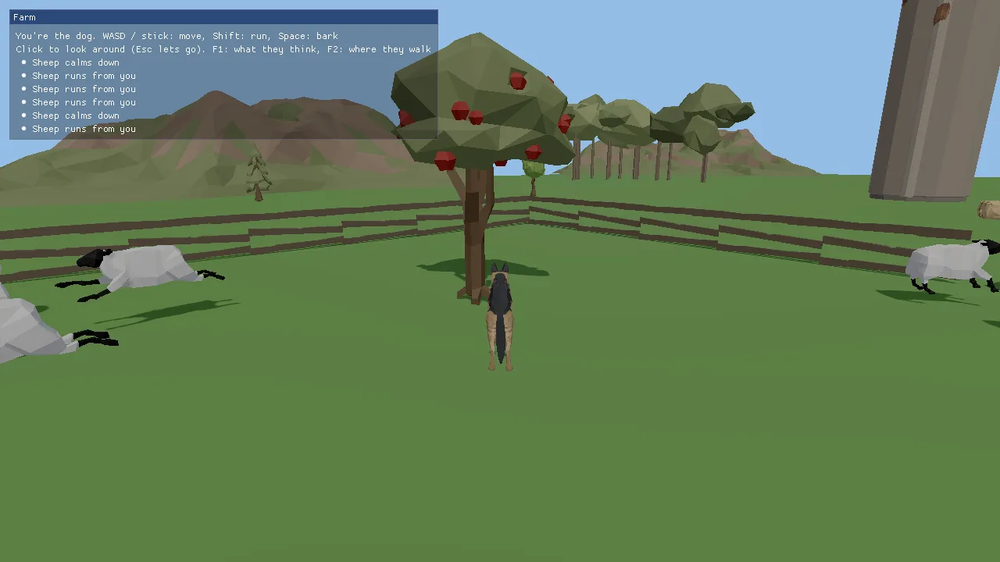

# Farm demo: you are the dog

You play a German Shepherd on a farm. Every other animal lives its own life
on the engine's AI core ([docs/AI.md](../../docs/AI.md)):

- **Sheep** graze in their meadow. Run at them and they bolt as a flock,
  regroup, and calm down once you are gone.
- **Cows** in the pasture are curious and come over to look at you.
- **Pigs** root around their pen and wander to the hay pile.
- **Horses** in the north field spook and gallop off.
- **The fox** in the woods keeps its distance.

A bark is a noise that every animal in range hears. Fences, the barn and
the trees are obstacles on a navmesh (Recast/Detour) built from the level
itself when it loads. You can also teach the animals by example: show one
what to do in a moment like this, then let its whole species learn from
what you showed.

This demo is the starting point for any game where creatures act on their
own: wildlife, herding, stealth (being seen and heard), a zoo or farm sim,
or a world that feels alive around the player. The game code is small on
purpose (one module, about 570 lines): the AI core does the thinking, and
the game only places animals, feeds it the player's position and copies the
result onto models.



## Run it

```sh
cmake --build build --target farm_demo
cd build/bin && ./farm_demo
```

The executable is `farm_demo` ([CMakeLists.txt](CMakeLists.txt)). It is
always built: the root `CMakeLists.txt` adds it with no `KKE_ENABLE_*`
guard. The build copies `scenes/farm.scene.json` next to the executable;
without that file the farm does not start (see "The level" below).

| Variable | Effect |
|---|---|
| `KKE_SKIP_INTRO=1` | skip the logo intro |
| `KKE_ASSETS_DIR=/path/to/packs` | where the packs are (default `assets/synty/`; `KKE_SYNTY_DIR` also works) |
| `KKE_FARM_AUTOPILOT=1` | the dog runs a lap through the meadow and barks by itself (headless checks, screenshots) |
| `KKE_FARM_DEBUG=1` | start with the F1 panel open |
| `KKE_FARM_NAV=1` | start with the navmesh drawn |
| `KKE_FARM_LINEUP=1` | one of each animal in a row, all facing +X, with their AI off (a check that every model faces its yaw) |

Any value other than empty or `0` turns a switch on (`envOn` in
[FarmModule.cpp](FarmModule.cpp)).

## Controls

| Action | Keyboard and mouse | Controller |
|---|---|---|
| Move | WASD | left stick |
| Run | hold Left Shift | click the left stick (toggles) |
| Look around | move the mouse after a left click captures it | right stick |
| Bark | Space | A (south) |
| Show what the animals think (F1 panel) | F1 | View / Back |
| Draw the navmesh | F2 | no controller binding yet |
| Next lesson (graze, rest, investigate, watch, regroup, flee, wander) | Tab | D-pad right |
| Show the nearest animal the lesson | E | Y (north) |
| Let every species that was shown something learn | L | D-pad up |
| Quit | Esc | none |

All of these are rebindable actions in the `InputModule`; the user's
bindings are saved to `farm_input.json`. Esc releases the mouse in
`FarmModule::onEvent`, but the window also closes on Esc, because the farm
never calls `window().setQuitOnEscape(false)` (see "Make a game like this").

## How it plays

There is no goal, score or end. You walk around and watch how each species
reacts to you. The small panel in the top left (Dear ImGui) lists the
controls, the current lesson, and the last six things that happened ("sheep
runs from you", "cow comes to see you", "Woof!"). F1 adds one line per
animal from `AiWorld::describe`: its action, score, fear, hunger and
animation.

Teaching: press Tab until the lesson you want shows, walk within 10 m of an
animal, press E. That records one example for its species. Press L and every
species with examples trains a small neural network on them; the log shows
how many examples it learned from and how many it now gets right.

## How it works

### Startup and the frame

[main.cpp](main.cpp) builds the app and adds modules in this order:

1. `InputModule("farm_input.json")`: actions and bindings.
2. `ModelModule`: loads and draws the farm, the animals and the dog.
3. `farm::FarmModule`: the game ([FarmModule.h](FarmModule.h)).
4. `StatsModule` with its panel hidden.

It also sets the mood `clear_day`, a far plane of 300 m and a 55 degree
field of view. `FarmModule::init` then does four things in order:
defines the input actions, sets up the third-person camera rig, calls
`loadLevel()`, `buildNavMesh()` and `setupAi()`.

Each frame, `FarmModule::update`:

1. Clamps `dt` to 0.1 s so a hitch never teleports anyone.
2. Reads the toggle actions (F1, F2, Tab, E, L).
3. `updatePlayer(dt)`: moves the dog, handles the bark, tells the AI where
   the dog is.
4. `m_ai.update(dt)`: every animal perceives, updates its needs, decides and
   moves (skipped in lineup mode).
5. Turns `m_ai.takeEvents()` into log lines.
6. Copies each agent's position, yaw and `anim` onto its model.
7. `updateCamera(dt)`.

`render` draws the ground quad and, when on, the navmesh; `renderUi` draws
the ImGui panel.

### The level

`loadLevel()` reads `scenes/farm.scene.json` from the executable's folder
with `kke::SceneFile::load`. If that fails, the error goes to the panel and
`init` stops: no navmesh, no AI, no animals. The scene also sets the mood,
the sun and the ambient light.

The grass is one quad the size of the scene's `ground.size` (170 x 170 m),
drawn by a `DynamicMeshRenderer`. The buildings, fences and trees come from
**POLYGON Farm**: `kke::findAssetFolder` looks for `assets/synty` (or
`KKE_ASSETS_DIR` / `KKE_SYNTY_DIR`), `AssetCatalog::scan` indexes it, and
if `SM_Bld_Barn_01` is found, `kke::loadScene` places every object. Missing
single assets are logged as warnings. The list of objects is in
[docs/SCENES.md](../../docs/SCENES.md#farm-demo-scenesfarmscenejson).

### The navmesh

`buildNavMesh()` gathers triangles and hands them to
`kke::ai::NavMesh::build`:

- the ground quad;
- for each scene object with collision, the triangles of its placed
  instance. It walks `m_scene.objects` in the same order `loadScene`
  placed them (grid objects take `gridCount.x * gridCount.y` instances),
  so the n-th instance belongs to the n-th cell;
- objects marked `Collision::Box` (the trees) get only a thin box around
  the trunk: 18% of the model's width and depth, full height. The comment
  says it: "the trunk is what's in the way, not the canopy". Using the
  whole model would block the ground under every crown.

```cpp
kke::ai::NavMeshSettings s;
s.cellSize = 0.25f;
s.agentRadius = 0.35f;
s.agentHeight = 1.0f;
s.agentMaxClimb = 0.3f;
```

One navmesh serves every species, sized for a sheep-to-dog animal. The
build time and polygon count go to the log and the F1 panel. Without POLYGON
Farm the mesh is only the ground, so everything walks on open grass.

### The animals

`setupAi()` starts from the built-in species (`sheep`, `cow`, `pig`,
`horse`, `fox`) and changes one thing on each, `homeRadius`, so they stay
in their fields:

```cpp
auto tweak = [&](const char* id, float homeRadius) {
    kke::ai::Species s = *m_ai.species(id);
    s.homeRadius = homeRadius;
    s.actions.clear();
    m_ai.defineSpecies(s);
};
tweak("sheep", 11.0f);
```

`actions.clear()` makes `defineSpecies` rebuild the default action list for
the changed species ([docs/AI.md](../../docs/AI.md), "Actions").

It then:

- registers the player as an **actor** of species `dog` (id 1). An actor is
  perceived but never moved by the AI. Every farm species already has an
  attitude to dogs, so no extra rules are needed.
- adds a `water` place (radius 2.2 m) at every `SM_Prop_Trough_01` and a
  `grain` place (2.0 m) at every `SM_Prop_Hay_Pile_01` in the scene. The
  graze and drink actions find food and water through these.
- spawns herds with a small seeded random generator (an LCG with seed 7),
  so the farm looks the same every run: 14 sheep, 5 cows, 4 pigs, 3 horses
  and 1 fox, each around a centre point. `spawnAnimal` snaps each start to
  the navmesh with `nearestPoint`.

The `AiWorld` itself is seeded with 2026 (`m_ai{ 2026 }` in the header),
which makes the decisions repeatable too.

### Models and clips

`makeLook` loads one model per species the first time it is needed and
remembers it in `m_looks`:

- Sheep, cow, pig and horse are **Quaternius' Farm Animals** FBX files,
  scaled down (0.23, 0.3, 0.2, 0.28) because the files are "made a few
  metres tall".
- The dog and the fox both come from **POLYGON Dogs**
  `Unity_SK_Animals_Dog_01`. That file holds every breed on one skeleton;
  `loadDog` keeps only the meshes whose material name starts with
  `GermanShepherd_` or `Fox_`. The fox is drawn at 0.8 scale.

POLYGON Dogs keeps its animations in separate files. `appendClip` loads each
animation-only FBX and copies it onto the dog's skeleton **by bone name**;
bones the file does not move stay at their rest pose. Ten clips are named
after the AI's `anim` values: `idle`, `walk`, `run`, `eat`, `drink`, `sniff`,
`bark`, `alert` (the tail wag), `attack` (a bite) and `rest` (sleeping).

`showAnim` plays the right clip only when the name changes. It asks
`kke::ai::clipForAnim` (`kke/ai/Clips.h`), which finds a clip by name for
each model, and falls back to hopping on `Jump` when there is no walk clip
(the Quaternius sheep and pigs only have Idle and Jump). `attack` and
`bark` play once; everything else loops.

### The player's dog

`updatePlayer` is a plain kinematic controller, no physics body:

1. `move` (a 2D axis) is turned into a direction relative to the camera
   (`m_rig.forward()` and `m_rig.right()`).
2. The wanted speed is 3.2 m/s walking or 7 m/s holding `sprint`.
3. The velocity eases toward it: `m_vel += (want - m_vel) * (1 - exp(-8 dt))`.
   The `exp` form gives the same feel at any frame rate.
4. `NavMesh::moveAlongSurface` slides the step along the walkable surface,
   so the dog cannot walk through fences either. The real velocity is then
   worked out from where it actually ended up.
5. The dog turns toward its velocity at up to 540 degrees a second.
6. A bark (0.9 s cooldown) calls `m_ai.makeNoise({ m_pos, 25.0f, kPlayer, 0 })`:
   a noise heard 25 m away.
7. `m_ai.setTransform(kPlayer, m_pos, m_vel, m_yaw)` tells the AI where the
   dog is and how fast it goes. Fear of a fast dog comes from this velocity.
8. The clip is `bark` for the first half second of a bark, then `run`
   above 4.5 m/s, `walk` above 0.3 m/s, else `idle`.

The autopilot replaces steps 1 and 6 with a route of seven points, six
seconds each, sprinting on legs 1 to 4 and barking once on leg 2.

### The camera

A `kke::CameraRig` in third-person mode: pivot 0.9 m up, arm 5.5 m, no
shoulder offset, pitched 14 degrees down. The mouse turns it only while
captured (left click captures, Esc releases); the right stick
(`look.rate`) always turns it, at 140 degrees a second across and 70% of
that up and down. The rig's collision callback returns the full distance,
so the camera never pulls in. In autopilot the rig swings behind the dog.

Note the two yaw conventions: the dog and the AI use 0 = +Z, while the rig
uses 0 = -Z, hence `m_rig.yaw = 180.0f - m_yaw` in `loadLevel`.

### Events and the log

After `AiWorld::update`, `takeEvents()` returns what happened. The farm
turns four kinds into log lines: `Scared` by the player, `Calmed`,
`ActionChanged` to `investigate` the player, and `Attack`. It keeps the
last six.

### Teaching by example

- `teachNearest()` finds the closest animal within 10 m and calls
  `m_ai.teach(id, lesson)`. This stores the numbers that animal's
  considerations read right now, plus the lesson, as one example for its
  species. It fails ("can't") when the species has no such action.
- `learnAll()` calls `m_ai.learn(id)` for every species with examples. It
  trains a genann network and returns an accuracy, which the log shows as
  a percentage.

The theory, the weights and how the learned policy mixes with instinct are
in [docs/AI.md](../../docs/AI.md), "Teaching by example".

## Design decisions

- **The AI core decides, the game only shows it.** `FarmModule` has no
  animal logic at all. Every behaviour (flocking, fleeing, curiosity,
  grazing) is a built-in species. docs/AI.md calls the demo "the whole core
  in one small game", and the same species run the sandbox's animal blocks.
- **Built-in species with one tweak, not new species.** The only farm rule
  is `homeRadius`, so the animals stay in their fields. Everything else is
  whatever `builtinSpecies()` says, which keeps the demo honest as a test of
  the defaults.
- **The navmesh is built from the scene itself** at load, not authored or
  cached. Moving a fence in `farm.scene.json` changes where animals can
  walk with no extra step. `NavMesh::save`/`load` exist for levels where the
  build is too slow.
- **Tree trunks, not tree shapes, block the navmesh**, as the comment in
  `buildNavMesh` explains.
- **The player's dog is kinematic and slides on the navmesh**, with no
  physics body. The farm has no physics module at all; `moveAlongSurface`
  keeps the dog out of fences with the same data the animals use.
- **The player is an actor of species `dog`.** Every species already has an
  attitude to dogs, so the player gets the right reactions for free.
- **Seeded everything** (world seed 2026, herd seed 7): the same farm and
  the same decisions every run, so autopilot runs and screenshots repeat.
- **Dog clips are copied by bone name** from animation-only files. The
  first farm commit added `allowNoMeshes` to `loadModel` for this, so
  clip-only FBX files (POLYGON Dogs animations) load as skeletons.
- **A missing POLYGON Farm is logged at info, not warning.** Commit 34fadf2
  says why: it is the normal case in CI and for anyone without the packs,
  and the panel already says so. A pack that is there but missing one asset
  still warns.
- **The HUD is Dear ImGui**, a developer-style panel, not an RmlUi game UI.

## Tuning

| What | Where | Value | Raising it |
|---|---|---|---|
| Dog walk / run speed | `updatePlayer` | 3.2 / 7 m/s | faster dog, animals scare sooner (fear reads your speed) |
| Dog acceleration | `updatePlayer`, `exp(-8 dt)` | 8 | snappier starts and stops |
| Dog turn rate | `updatePlayer` | 540 deg/s | quicker turns |
| Bark range | `makeNoise`, loudness | 25 m | animals further away hear it |
| Bark cooldown | `m_barkTimer = 0.9f` | 0.9 s | fewer barks |
| Home radius per species | `setupAi`, `tweak(...)` | sheep 11, cow 13, pig 3.5, horse 14, fox 18 m | they roam further from their start |
| Herd sizes and centres | `setupAi`, `herd(...)` | 14 / 5 / 4 / 3 / 1 | more animals (more CPU in perception) |
| Water / grain place radius | `setupAi`, `addPlace` | 2.2 / 2.0 m | they drink or graze from further away |
| Model scales | `makeLook`, `specs[]` | 0.2 to 0.3 | bigger animals |
| Navmesh cell size, agent radius | `buildNavMesh` | 0.25 m, 0.35 m | coarser mesh, faster build, gaps close up |
| Teach range | `teachNearest`, `bestDist` | 10 m | show from further away |
| Camera arm, pitch | `init`, `m_rig.settings` | 5.5 m, -14 deg | wider view |
| Mouse / stick look speed | `m_mouseSensitivity`, `m_stickSpeed` | 0.15, 140 | faster look |

Species values themselves (speeds, senses, temperament) are data: change
them in a JSON or YAML file with `AiWorld::loadSpecies`
([docs/AI.md](../../docs/AI.md), "Species").

## Engine features it uses

| Feature | Header / module | Doc |
|---|---|---|
| AI core: species, perception, needs, utility decisions, events | `kke/ai/AiWorld.h` | [AI.md](../../docs/AI.md) |
| Navmesh (Recast/Detour) | `kke/ai/NavMesh.h` | [AI.md](../../docs/AI.md#navigation) |
| Teaching by example (genann) | `kke/ai/Learning.h` | [AI.md](../../docs/AI.md#teaching-by-example) |
| Clip choice per `anim` | `kke/ai/Clips.h` | [AI.md](../../docs/AI.md) |
| Scene files and loading | `kke/SceneFile.h`, `kke/SceneLoader.h` | [SCENES.md](../../docs/SCENES.md) |
| Asset packs and catalog | `kke/AssetCatalog.h` | [SCENES.md](../../docs/SCENES.md) |
| Models, clips, instances | `kke/modules/ModelModule.h`, `kke/ModelAsset.h` | |
| Rebindable input | `kke/modules/InputModule.h` | [INPUT.md](../../docs/INPUT.md) |
| Third-person camera | `kke/CameraRig.h` | (header comments) |
| Moods (sky, light) | `Application::setMood` | [MOODS.md](../../docs/MOODS.md) |
| Debug meshes | `DynamicMeshRenderer` (`kke/SphereImpostors.h`) | |

## Assets

None of these are in the repository. Put each pack in `assets/synty/` (a
symlink to a shared cache works) or point `KKE_ASSETS_DIR` at the folder
that holds them. `tools/fetch_assets.sh POLYGON_Farm POLYGON_Dogs` downloads
the two Synty packs from the owner's share (it needs `KKE_SHARE_HASH`).

| Pack | Files | Used for |
|---|---|---|
| **POLYGON Farm** (Synty) | the 60 objects of `scenes/farm.scene.json` ([list](../../docs/SCENES.md#farm-demo-scenesfarmscenejson)) | the level |
| **POLYGON Dogs** (Synty) | `Unity_SK_Animals_Dog_01` (GermanShepherd and Fox parts); clips from `Animations/`: `Locomotion/_POLYGON_Dog_Locomotion_Standing/Walking/Running.fbx`, `Actions_Standing/_POLYGON_Dog_Action_Standing_Eat/Drink/Sniff/Bark/TailWag.fbx`, `Attack/_POLYGON_Dog_Attack_Bite.fbx`, `Sleep/_POLYGON_Dog_Sleep_Idle.fbx` | the player and the fox |
| **Farm Animals Animated by Quaternius** (CC0) | `Sheep`, `Cow`, `Pig`, `Horse` | the livestock |

What happens when a pack is missing:

- **No POLYGON Farm:** the panel says so, the level is a bare green field,
  and the navmesh is only the ground. The AI still runs.
- **No POLYGON Dogs:** the dog and the fox have no model. You still move
  (the camera follows an invisible dog) and the fox still lives. A missing
  clip file logs a warning and that clip is skipped.
- **No Quaternius animals:** those agents still run in the AI (F1 lists
  them) but nothing is drawn for them.
- **No packs at all:** you see the grass and the panel only.

## Make a game like this

1. Start from this folder: copy `games/farm_demo` to `games/<your_game>`,
   rename the executable in `CMakeLists.txt`, the namespace `farm` and the
   class `FarmModule`, and give `game.json` a new `id` and `title`. Add
   `add_subdirectory(games/<your_game>)` to the root `CMakeLists.txt` (or
   to `games/my_games.cmake`, which `tools/new_game` uses). If your game is
   mostly Lua, start with `tools/new_game <name>` instead and add the AI
   from C++ later.
2. Call `app.window().setQuitOnEscape(false)` in `init` if Esc should only
   release the mouse (the farm does not, so Esc quits).
3. Make your level a scene file ([docs/SCENES.md](../../docs/SCENES.md))
   and mark what blocks walking with `collision`. The navmesh follows.
4. Pick species. Use the built-in ones, tweak one field like `setupAi`
   does, or write your own in YAML and load them with
   `AiWorld::loadSpecies`. Read [docs/AI.md](../../docs/AI.md) "Species" and
   "Actions" before writing actions.
5. Add places (`addPlace`) for anything a need should find: food, water,
   beds.
6. Register the player with `addActor` and a species the animals already
   have feelings about, and call `setTransform` with a real velocity every
   frame. A zero velocity makes a sprinting player look calm to the AI.
7. React to `takeEvents()`: play a sound on `Heard`, deal damage on
   `Attack` (the AI never deals damage itself).
8. Check it: run with `KKE_FARM_DEBUG=1` style panels of your own
   (`AiWorld::describe`) and a headless autopilot so the game can be checked without anyone playing.

Pitfalls the code shows:

- Keep the navmesh agent size close to your smallest walker. A big
  `agentRadius` closes gaps in fences that small animals should get through.
- Models may face a different way than +Z. `Look::yawOffset` is there for
  that, and `KKE_FARM_LINEUP=1` is the quick visual check.
- Quaternius sheep and pigs have no walk clip; `clipForAnim` makes them hop.
  Check each model's clips before blaming the AI.

## Files

| File | What is in it |
|---|---|
| [main.cpp](main.cpp) | the app, the mood and camera settings, the module list |
| [FarmModule.h](FarmModule.h) | the module class, its data (animals, looks, dog state, lessons) |
| [FarmModule.cpp](FarmModule.cpp) | input actions, level and navmesh, species and herds, dog, camera, teaching, ImGui panel |
| [CMakeLists.txt](CMakeLists.txt) | the `farm_demo` executable, copies `game.json`, the scene file and shaders |
| [game.json](game.json) | the marketplace entry (id, title, tags, modules) |
| [../../scenes/farm.scene.json](../../scenes/farm.scene.json) | the level: objects, spawn, sun, ground |
