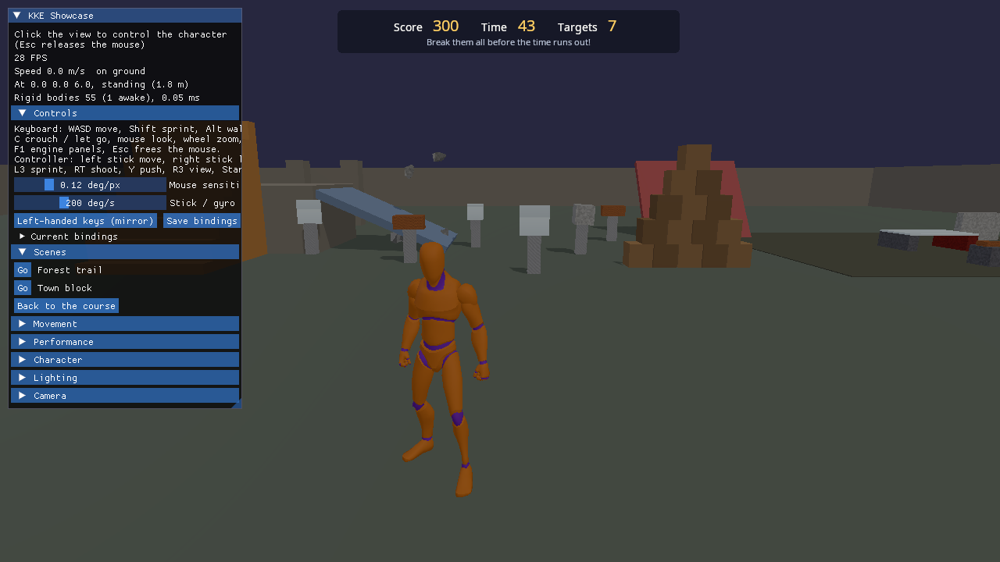

# Your first game in Lua: break the targets

A complete little game, written only in Lua, that runs inside kke_demo:
eight breakable targets on pedestals, 45 seconds, a score, a HUD and a
results screen with a "Play again" button. No C++ and no rebuild.

## Play it

1. Build kke_demo (see docs/BUILDING.md). The two files in `scripts/` are
   copied next to it, into `bin/scripts/`.
2. Run `kke_demo`, click the view to take control, and press **T**.
3. Shoot the targets with the left mouse button. Each one is worth points
   and gives you two more seconds.

To change the game while it runs, point the demo at this folder:
`KKE_SCRIPTS_DIR=<repo>/games/first_lua_game/scripts ./kke_demo`, edit
`targets.lua`, save, and it reloads by itself.

## How it works

Read `scripts/targets.lua` from top to bottom; it's about 150 lines.

- **Settings first:** `ROUND_SECONDS`, `TARGETS` and the `KINDS` table
  (material, size, points). Change a number, save, press T again.
- **A key:** `input.define("targets.start", "Start break-the-targets", "T")`
  makes an action that also shows up in the rebinding screen.
- **The HUD** is `scripts/targets_hud.rml`, an RmlUi document (HTML-like
  markup with CSS-like styles). `ui.load` opens it, `ui.text` fills in the
  numbers, `ui.class` turns the red "low time" style and the results panel
  on and off, and `ui.onClick` runs `start` when "Play again" is clicked.
- **Targets** are real FEMFX breakables: `breakable.box{pos, size,
  material}` with `material = "glass"`, `"stone"`, `"wood"` or `"ice"`.
  The pedestals are `"iron"`, which never breaks.
- **Scoring** happens in the `Break` hook, which the engine runs when a
  breakable the script made comes apart. `audio.impact` plays the matching
  sound where it broke.
- **The clock** is `timer.Create("targets.clock", 0.1, 0, fn)`: a timer
  that repeats forever until `timer.Remove` stops it.
- **Sharing:** the best score and the target positions go into `shared`,
  the one table every script can read (each script's own globals are
  private). Another script can start a round with
  `hook.Run("TargetsStart")`.

## Where to go next

- The full API is in [SCRIPTING.md](../../docs/SCRIPTING.md): models and
  animation (`models.*`), whole scenes (`scene.*`), Jolt bodies
  (`physics.*`) and multiplayer (`net.*`, `sv_` scripts).
- Try: a moving target (`timer.Create` + `breakable.remove` and respawn),
  a combo multiplier, or a Synty prop as a trophy on the results screen
  (`models.load("SM_Prop_Trophy_01")`, if you have the pack).
