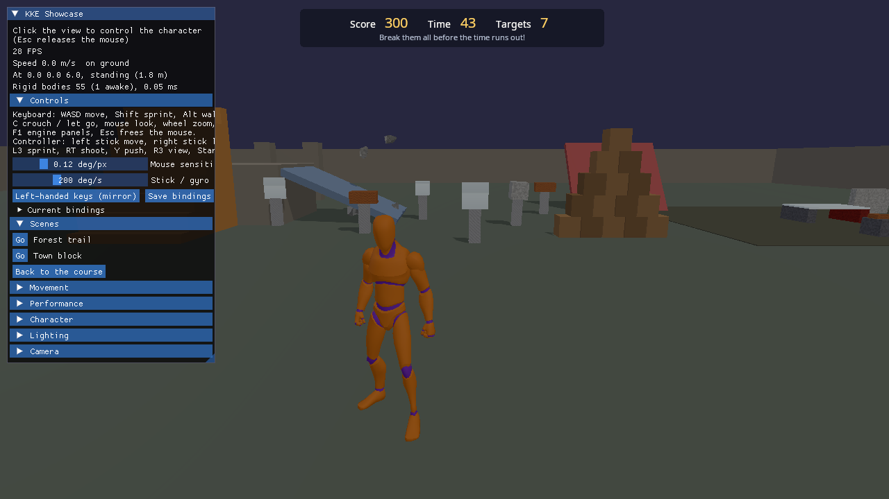

# Your first game in Lua: break the targets

A complete little game, written only in Lua, that runs inside kke_demo:
eight breakable targets on iron pedestals, 45 seconds, a score, a HUD and
a results screen with a "Play again" button. No C++ and no rebuild.

It is the starting point for **small arcade games made only of scripts**:
shooting galleries, time attacks, score chasers, any "start a round, beat
the clock, see your score" game. It shows the whole loop of a game in one
148-line file: settings, an action to start, a HUD, spawning, a clock,
scoring from an engine event, a results screen and a saved best score.



## Run it

The two files in `scripts/` are not a game of their own: they are copied
into kke_demo's `bin/scripts/` folder by
[games/showcase/CMakeLists.txt](../showcase/CMakeLists.txt) (when
`ENGINE_ENABLE_LUA` is on), and kke_demo's `ScriptModule` runs every
script there.

The targets are FEMFX breakables and the demo's shot is a FEMFX ball, so
this game needs the FEMFX build: the `everything` preset
(`KKE_ENABLE_FEMFX=ON`, see [docs/BUILDING.md](../../docs/BUILDING.md)).
In the default build kke_demo has no `breakable` table, and pressing T
gives a script error in the log and the Scripts panel.

```sh
cmake --workflow --preset everything
cd build/bin && ./kke_demo
KKE_SKIP_INTRO=1 ./kke_demo       # skip the engine's logo intro
```

To change the game while it runs, point the demo at this folder (kke_demo's
own `toys.lua` is then not loaded):

```sh
KKE_SCRIPTS_DIR=<repo>/games/first_lua_game/scripts ./kke_demo
```

Edit `targets.lua`, save, and it reloads by itself.

## Controls

Click the view to take control of the mouse.

| Action | Keyboard and mouse | Controller |
|---|---|---|
| Start a round (or start again) | T | d-pad right |
| Shoot | left mouse button (hold: 4 shots a second) | RT |
| Play again (results screen) | click the button, or T | d-pad right |

Moving and looking are kke_demo's own controls (WASD and the mouse, or
the sticks); see [games/showcase/README.md](../showcase/README.md).

## How it plays

1. Press T. Eight targets appear in an arc in front of where you look,
   7 to 13 m away, each on an iron pedestal (iron never breaks).
2. Shoot them. Each broken target scores its points plus 5 for every
   whole second left, and adds 2 seconds to the clock.
3. The round ends when the clock reaches 0 ("Time!") or every target is
   down ("All targets down!"). The results show the score, how many
   targets for how many shots (accuracy), and your best score.

| Target | Material | Size (m) | Points |
|---|---|---|---|
| Glass pane | glass | 0.7 x 0.7 x 0.06 | 150 |
| Stone block | stone | 0.55 cube | 100 |
| Wooden beam | wood | 0.8 x 0.35 x 0.35 | 120 |
| Ice block | ice | 0.5 cube | 80 |

The four kinds repeat in that order across the eight targets.

## How it works

Read [scripts/targets.lua](scripts/targets.lua) from top to bottom; it
is 148 lines. Here is what each part does and which engine table it uses
(the full API is in [docs/SCRIPTING.md](../../docs/SCRIPTING.md)).

### The frame

The script has no loop of its own. ScriptModule runs the file once when
it loads it (which defines everything and registers hooks), then calls
the hooks: `Think` every frame, `Break` when a breakable the script made
comes apart, and the timer's function every 0.1 s during a round. A
small state machine in the local `state` (`idle`, `playing`, `done`)
decides what those hooks do.

### Settings first

`ROUND_SECONDS`, `TARGETS`, `BONUS_SECONDS` and the `KINDS` table
(material, sound, size, points) are at the top. Change a number, save,
press T again.

### A key

```lua
input.define("targets.start", "Start break-the-targets", "T", "dpad_right")
```

This makes an action with a keyboard key and a controller button. It
shows up in the rebinding screen like any other action. The `Think` hook
reads it with `input.pressed("targets.start")`, and counts a shot on
every press of kke_demo's own `fire` action.

### The HUD

The HUD is [scripts/targets_hud.rml](scripts/targets_hud.rml), an RmlUi
document (HTML-like markup with CSS-like styles). `ui.load` opens it and
returns a handle; `ui.text(hud, id, text)` fills in the numbers,
`ui.class(hud, id, class, on)` turns the red "low time" style (under 10
seconds) and the results panel on and off, `ui.rml` puts a button
picture in the hint line, and `ui.onClick(hud, "again", start)` runs
`start` when "Play again" is clicked. The `<prompt action="..."/>` tags
in the document show the key or pad button of whatever device the
player is holding, and redraw by themselves when it changes. The body has
`pointer-events: none` so clicks go through to the game; only the results
panel takes them.

Every `ui.*` call is guarded (`if hud then ... end`), so the game still
runs, without a HUD, in a build with no UI.

### Targets

`start()` places them in an arc: it takes `camera.forward()` flattened
onto the ground, a side vector at right angles to it, and
`camera.target()` as the origin, then puts target `i` at
`(i - 4.5) * 1.6` m to the side and `7 + ((i * 7) % 5) * 1.5` m out. Each
is two FEMFX breakables:

```lua
local pedestal = breakable.box { pos = at + Vec(0, 0.45, 0), size = Vec(0.3, 0.9, 0.3), material = "iron", cells = Vec(1, 3, 1) }
local id, why = breakable.box { pos = top, size = kind.size, material = kind.material }
```

`breakable.box` returns an id, or nil and a reason (the script prints it
and carries on). The ids go in the `targets` table (id to kind and
position) and the `pedestals` list, so `clear()` can remove everything
the last round made with `breakable.remove`.

### Scoring

The engine checks every frame whether a script's breakable came apart and
then runs the `Break` hook with its id. The hook looks the id up in
`targets`; if it is a live target during a round it adds the points and
the time bonus, plays `audio.impact(pos, sound, 1.0)` where it broke, and
marks it `false` (counted, but kept in the table so `clear()` still
removes its pieces). The last target ends the round.

### The clock

```lua
timer.Create("targets.clock", 0.1, 0, function() ... end)
```

A named timer that fires every 0.1 s and repeats forever (0 repetitions
means no limit) until `finish()` calls `timer.Remove("targets.clock")`.
Each tick takes 0.1 from `timeLeft` and refreshes the HUD.

### Saving

The best score survives quitting: `store.load("targets.best", 0)` when
the script starts (0 the first time), `store.save("targets.best", best)`
when a round beats it. It lands in `save/scripts.db` next to the game (a
SQLite file, [docs/STORAGE.md](../../docs/STORAGE.md)).

### Sharing with other scripts

Each script's globals are private. The best score and the target
positions go into `shared`, the one table every script can read.
`hook.Add("TargetsStart", ...)` lets another script (or the console)
start a round with `hook.Run("TargetsStart")`.

## Design decisions

- **Lua only.** The game is scripts on top of kke_demo, so it needs no
  build step and shows that a whole game loop fits in Lua (AGENTS.md:
  "Lua first").
- **Score from the engine's `Break` event, not from hits.** The script
  never ray casts: it scores when the physics says a target broke, so
  what counts is what you see.
- **Ids stay in the table after a break** (`targets[id] = false`), so the
  next round's `clear()` removes the broken pieces too (the comment in
  `Break` says so).
- **Guards for optional modules.** `hud`, `store` and `audio` are checked
  before use, so the script survives a build without them. (`breakable`
  is not guarded: see "Run it".)
- **Sharing on purpose.** Globals are per script; `shared` and `hook.Run`
  are the two doors between scripts (commit "Lua v2: per-script
  globals").

## Tuning

| What | Where | Effect |
|---|---|---|
| `ROUND_SECONDS` (45) | targets.lua | round length |
| `TARGETS` (8) | targets.lua | how many targets |
| `BONUS_SECONDS` (2) | targets.lua | time added per target |
| `KINDS` | targets.lua | material, sound, size and points of each kind |
| `math.floor(timeLeft) * 5` | `Break` hook | the speed bonus per target |
| `7 + ((i * 7) % 5) * 1.5`, `1.6` | `start()` | how far out and how far apart targets stand |
| `timeLeft < 10` | `refresh()` | when the clock turns red |

## Engine features it uses

| Feature | Lua table | Doc |
|---|---|---|
| Actions with keys and pad buttons | `input.define`, `input.pressed` | [SCRIPTING.md](../../docs/SCRIPTING.md), [INPUT.md](../../docs/INPUT.md) |
| RmlUi documents and button prompts | `ui.load`, `ui.text`, `ui.class`, `ui.rml`, `ui.onClick` | [SCRIPTING.md](../../docs/SCRIPTING.md) |
| FEMFX breakables and the `Break` hook | `breakable.box`, `breakable.remove` | [SCRIPTING.md](../../docs/SCRIPTING.md), [PHYSICS_BRIDGE.md](../../docs/PHYSICS_BRIDGE.md) |
| Timers and hooks | `timer.Create`, `timer.Remove`, `hook.Add`, `hook.Run` | [SCRIPTING.md](../../docs/SCRIPTING.md) |
| Impact sounds | `audio.impact` | [AUDIO.md](../../docs/AUDIO.md) |
| The camera | `camera.forward`, `camera.target` | [SCRIPTING.md](../../docs/SCRIPTING.md) |
| Saving | `store.load`, `store.save` | [SCRIPTING.md](../../docs/SCRIPTING.md) "Saving", [STORAGE.md](../../docs/STORAGE.md) |
| Sharing between scripts | `shared` | [SCRIPTING.md](../../docs/SCRIPTING.md) |

## Assets

None of its own: the targets and pedestals are FEMFX boxes made from
material presets, the sounds are synthesised impacts, and the HUD uses
kke_demo's fonts. No Synty packs.

## Make a game like this

1. For a new game, start from the starter template instead of kke_demo:
   `tools/new_game my_game` (see [games/template](../template/README.md)).
   Copy `targets.lua` and `targets_hud.rml` into
   `games/my_game/scripts/`.
2. The starter game defines the `fire` action (left mouse, RT) but
   nothing shoots when you press it: add a shot from a recipe in
   [docs/cookbook/recipes](../../docs/cookbook/recipes/) such as
   `shooter.lua` (which uses `fire`) or `throw.lua`.
3. Without the FEMFX build, swap `breakable.box` for `physics.box`
   bodies and score from your own rule (a body knocked off its pedestal,
   a zone entered).
4. Keep the shape: settings at the top, `start()`, `finish()`, a
   `refresh()` that writes the HUD, a state variable, and hooks that only
   act in the right state.
5. Check it headless with `tools/check_game my_game` (it prints OK or
   FAILED).

Pitfalls:

- Keep every id you create, so the next round can remove it; a script
  can only change what it made itself.
- Name timers and hooks with a prefix (`targets.clock`, `targets.hit`) so
  they do not clash with another script's.
- `input.pressed("fire")` counts presses, not the shots kke_demo fires
  while the button is held, so the accuracy shown assumes one click per
  shot.

## Files

| File | What is in it |
|---|---|
| [scripts/targets.lua](scripts/targets.lua) | The whole game: settings, input, HUD updates, spawning, clock, scoring, saving |
| [scripts/targets_hud.rml](scripts/targets_hud.rml) | The HUD and results panel (RmlUi) |
| [screenshot.png](screenshot.png) | The picture above |
