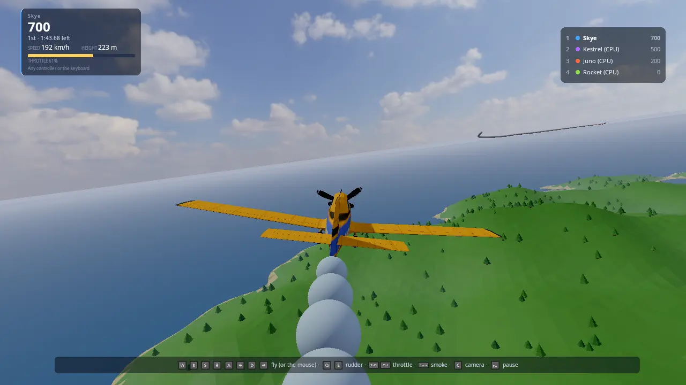

# Flying

Stunt planes over a generated island. Race through a course of rings,
score loops, rolls, inverted flight and low passes against the clock,
shoot each other down over a town in a dogfight, or fly wherever you
like. Every flight starts on the runway: open the throttle, roll, and
the plane lifts off once it is fast enough. Up to four people
play on one screen (split screen), more online, with up to five CPU
pilots. Every player flies with the device they picked: a gamepad, the
keyboard and mouse, or a flight stick, and can move to any other free
one from the pause menu at any time.

It is the starting point for **vehicle games that move fast in three
dimensions** (flight, space, boats: a small pure-maths model stepped at a
fixed rate, chase and cockpit cameras that lean with the craft), for
**games where each player chooses their controller** (flight sticks next
to gamepads and the keyboard, swapped mid-game without touching anyone
else's), and for **arcade scoring** (tricks recognised from how the
vehicle moved, chained for a multiplier), and for **arcade combat**
(guns with a little aim help, damage sent over the network, planes that
dent, burn and break up).



## Run it

The executable is `flying_demo` ([CMakeLists.txt](CMakeLists.txt)). It is
built when `KKE_ENABLE_NET` is on, which is the default: main.cpp always
adds `kke::NetModule` for online flights. It needs no Jolt and no art:

```sh
cmake --workflow --preset default
cd build/bin && ./flying_demo
KKE_SKIP_INTRO=1 ./flying_demo    # skip the engine's logo intro
```

Run it from `build/bin`: the HUD (`ui/flying_hud.rml`), the theme and the
fonts are copied there by the build. The start menu, settings and controls
are saved as `flying_lobby.json`, `settings.json` and `flying_input.json`
in the folder you start it from.

With Synty's **POLYGON Stunt Plane** pack (see "Assets") the planes are
that plane in four paint jobs, propellers turning and control surfaces
moving. Without it they are planes built from boxes in each pilot's
colour, and a line on the screen says how to add the pack.

Switches for demos and tests (developer builds):

| Variable | What it does |
|---|---|
| `KKE_FLY_LOBBY=0` | Straight into a flight, no start menu |
| `KKE_FLY_MODE=race\|stunts\|free\|dogfight` | The mode |
| `KKE_FLY_ISLAND=<seed or name>` | The island (`random` for a new one each time) |
| `KKE_FLY_CPUS=<0..5>` | How many CPU pilots |
| `KKE_FLY_AUTOPILOT=1` | Player 1 is flown by the CPU pilot too (and no start menu) |
| `KKE_FLY_QUIT=<s>` | Quit after that long, logging where every plane is every 5 s |
| `KKE_FLY_STUNT_TIME=<s>` | The length of a Stunts round (default 120) |
| `KKE_FLY_WAIT=<n>` | Online host: start the flight once n players have joined |
| `KKE_FLY_BENCH=pileup` | Crash benchmark: every plane flies head-on into the others at full speed, again every 7 s. With `KKE_BENCHMARK=30` it records frame times; `kke_benchmark` runs it as `flying_pileup` |
| `KKE_NET=host`, `KKE_NET=join:ADDRESS`, `KKE_NET_NAME=<name>` | Online without the menu ([NETWORKING.md](../../docs/NETWORKING.md)) |
| `KKE_LOBBY_JOIN=<n>` | The first n controllers already plugged in join the start menu |
| `KKE_VIRTUAL_INPUT=hosas,pad` | Two virtual flight sticks and a virtual gamepad, no hardware needed ([INPUT.md](../../docs/INPUT.md)) |

## Controls

Every binding is defined in `FlyingModule::defineActions`
([Players.cpp](Players.cpp)) and can be rebound (F1, Input panel); the
hint line at the bottom shows the buttons of the device you fly with.

| | Gamepad | Keyboard and mouse | Flight stick |
|---|---|---|---|
| Pitch (pull back: nose up) | left stick up/down | S / W (or the arrows), or move the mouse | stick back/forward |
| Roll | left stick left/right | A / D (or the arrows), or move the mouse | stick left/right |
| Rudder | LB / RB | Q / E | twist the stick |
| Throttle | RT up, LT down | Left Shift up, Left Ctrl down | the throttle lever |
| Smoke on/off (Dogfight: fire) | A or B | Space or F, left mouse button | trigger (button 1) |
| Camera: chase, cockpit, far | Y | C | button 2 |
| Wheel brakes (on the ground) | X | B | button 3 |
| Look around | right stick | hold the right mouse button and move | the hat |
| Pause, change controller, settings | Start or Back | Esc | button 4 |
| After a flight: again / start menu | A / Back | Enter or R / M | trigger / - |

The mouse is a stick that centres itself: move it forward and the nose
goes down, let go and the stick drifts back to the middle. The keyboard
eases the controls over a third of a second, so a tap is a small
correction, not a full deflection.

A flight stick's axes are "Axis 1" (roll), "Axis 2" (pitch), "Axis 3"
(twist) and "Axis 4" (the lever) of the raw joystick: the usual layout
of a Thrustmaster, Logitech or VKB stick. Rebind them in the Input panel
if yours differs.

## How it plays

### The start menu

The start menu is the engine's `kke::LobbyModule` ([LOBBY.md](../../docs/LOBBY.md)).
Each person joins with their device: A on a gamepad, Enter on the
keyboard, or the trigger on a flight stick (this game turns flight sticks
on with `setFlightSticks(true)`; other games keep them out of their
menus). Each player picks a **name**, a **colour** (their smoke, their
HUD and the built plane) and a **paint** job (the Synty plane's four
textures). Player 1 also sets:

| Row | Choices |
|---|---|
| CPU players | 0 to 5, each Rookie, Pilot, Ace or Legend |
| Mode | Race, Stunts, Free flight, Dogfight |
| Island | Palm Key, Twin Bays, Gull Rock, Harbour Isle, Cloud Cape, Random |
| Laps | 1, 2, 3 (Race) |
| Rings | Big (18 m), Normal (14 m), Tight (10 m) (Race) |
| First to | 5, 10, 20 kills (Dogfight) |
| Sky | Day, Morning, Golden hour, Sunset, Stormy (a [mood](../../docs/MOODS.md)) |
| Online | Off, Join, Host |

Behind the menu the planes already fly round the island.

### Taking off

Every mode starts on the runway, two by two, engines idling. Open the
throttle and roll: past about 97 km/h the nose lifts by itself and the
plane flies. That's all there is to it; pull back to climb sooner.

A plane can't hang on its propeller: point the nose straight up and the
engine pulls less and less, the plane slows, and it tips over into a
dive. Climb at an angle instead.

### Race

After take-off, head for the first ring. The next
ring for you is drawn gold, and an arrow at the top of your view points
to it. Fly through the rings in order, the right way; after the last ring
of the last lap you have finished. The HUD shows your place, lap, ring,
speed, height and throttle; the standings are on the right.

### Stunts

Two minutes to score. The game recognises what your plane did
([Stunts.cpp](Stunts.cpp)):

| Trick | How | Points |
|---|---|---|
| Loop | the nose all the way round, pulling up | 500 |
| Outside loop | the same, pushing down | 800 |
| Roll | all the way round the nose | 200 |
| Inverted | upside down for 2 s or more | 60 a second |
| Knife edge | on a wing tip for 2 s or more | 80 a second |
| Low pass | under 15 m above the ground, over 40 m/s, 1 s or more | 150 + 100 a second |

Tricks within 3 s of each other chain: the second counts x1.5, the third
x2, and so on. A crash costs 300 and breaks the chain.

### Free flight

Take off and go where you like. Land again on the runway or any flat
field, gently: coming down faster than 6 m/s or tilted more than 25
degrees is a crash.

### Dogfight

Take off from the airfield beside a town of houses, shops and towers,
and shoot the others down. The first to the kill target (5, 10 or 20)
wins; after five minutes the most kills wins. The guns fire eleven
rounds a second; a plane near the ring of your sight is led for you.
Seventeen hits bring a plane down, and a shot-down plane counts as a kill
for whoever hurt it last in the ten seconds before. Your health bar is
in your panel, a mark flashes on your sight when you hit, and the feed
says who shot down whom. Planes come back 850 m from the town, as far
from the others as they can be, and bullets can't hurt them for 3 s.
Buildings stop bullets, and flying into one is a crash.

### Collisions

Planes bump off each other. Meet faster than 18 m/s and both explode: a
fireball, smoke and pieces of the plane falling away. A slower bump
dents both planes where they touched, and in a dogfight it costs health.
A collision counts as a crash, not a kill.

### Crashing

Hit the ground, the sea, a hill or a building and the plane explodes; 2.5 s later
you are back in the air: in a race at the last ring you passed, otherwise
above where you went down. Fly more than 4.2 km out to sea and you are
put back over the island too.

### Changing controller

Press pause (Start, Back, Esc, or the stick's fourth button). The menu is run
by whoever pressed it, with their own device. The **Controls** row shows
the device you fly with; left and right go through the others that are
plugged in, **skipping any another player holds**, and the list under it
says who holds what. Choose it and you fly with that one from now on. It
only changes this screen: online players see nothing of it. (Two copies
of the game on one PC both read every device; keeping them apart is up
to you.)

Offline the pause stops the flight; online the flight goes on around you,
and the CPU pilot flies your plane until you're back.

The pause menu's **Settings** row opens the menus every KKE game shares
(`kke::GameShellModule`, [GAME_SHELL.md](../../docs/GAME_SHELL.md)):
display, sound, look speed and simple button remapping.

### Online

Player 1 sets **Online** to Host, or to Join and picks a game found on
the network (or on this PC). Everyone at each screen flies. The host's
flight is everyone's: its island, mode, laps, rings, sky, and its CPU
pilots.

## How it works

### Startup and the frame

[main.cpp](main.cpp) adds the modules: Settings, Input, Models, UI, Audio,
Lobby, Net, then `flying::FlyingModule` and Stats. `FlyingModule::init`
([FlyingModule.cpp](FlyingModule.cpp)) defines the controls, loads the
Synty plane, sets up the start menu and the online rows, builds the HUD
and the engine sound, and builds the island behind the menu.

Each frame, `update()`:

1. `updateNet()` reads the network (Net.cpp).
2. In the start menu, `updateLobby()` keeps the line-up in step with the
   menu and flies the planes round the island.
3. In a flight: the pause menu, the countdown, every plane's step
   (`updatePilot`), the results, the cameras and split screen, the engine
   sound, the HUD.

### The flight model (Flight.h, Flight.cpp)

A pure-maths model with no engine types, so it is unit-tested
([tests/test_flight.cpp](../../tests/test_flight.cpp)). `step()` turns the
plane by the controls (rates scaled by how much air flows over the
surfaces, so a slow plane is sluggish), then adds thrust, lift from the
angle of attack (it peaks at 16 degrees; past that the wing stalls),
induced and parasitic drag, a side force that kills sideways sliding,
weathervaning into the airflow, and gravity. On the ground the wheels roll
with friction and brakes and the rudder steers the tail wheel. Each step
is at most 1/120 s (updatePilot splits a frame).

### The island, the town and the rings (Course.h, Course.cpp, Combat.h, World.cpp)

`Island(seed)` is a height function: rolling hills, a mountain, a flat
runway strip in the middle and a coast falling to the sea 1.5 km out.
`World.cpp` builds it into one flat-shaded mesh (a 24 m grid) with
about 1400 low-poly trees and a sea sheet. `Town` (Combat.h) places the
hangar and the control tower beside the runway and, for Dogfight, a
district west of it: 70 m blocks, towers near the middle and houses
further out. Towers and plain houses are boxes built in code; with
Synty's POLYGON Town pack the houses are its houses and shops. The town
is a list of boxes on a 40 m grid, so a plane or a bullet asks it
`touches` or `blocks` in a few lookups. The
rings (`Island::rings`) go round the island at heights smoothed so each
climb and dive between them can be flown, each facing the way you arrive.
`throughRing()` checks a plane's step crosses the ring's plane inside it.

### CPU pilots (Course.h RingPilot, Flight.h steerToward)

`steerToward` flies to a point the way a pilot does: bank to turn, pull
to climb, hold a cruise speed with the throttle, pull up when the ground
gets close. `RingPilot` picks the point: lined up in front of the ring, a
point just past its centre; beside or past it, first a point 450 m in
front so the plane can turn in. The skill (Rookie to Legend) changes the
cruise speed and how hard they fly. They keep 30 m from each other, and a
CPU pilot that hasn't made a ring for 45 s is put back on the course. In
Stunts they circle the island, looping and rolling every 30 s. In a
dogfight each picks the nearest plane in front of it, flies to where it
will be, fires when it is near the sight and keeps above the rooftops.

### Guns, damage and explosions (Combat.h, Combat.cpp, Damage.cpp)

A plane is a set of spheres (`planeShape`: nose, cockpit, tail and a
row along each wing), scaled to its span. `planesTouch` finds where two
planes came closest over the frame, not only where they ended up, so
two planes meeting head on at 100 m/s can't pass through each other
between frames. `bulletHits` tests a bullet's step against the spheres.
Bullets are points moving at 480 m/s, drawn as tracers.

Each screen tests its own planes and bullets. Damage to a plane another
screen flies is added up and sent as one `Damage` event every 0.12 s
(Net.cpp); that screen applies it, and when its plane goes down it sends
`Down`, so every screen shows the same kill once. Dents are sent as
`Dent` events. A dent moves the vertices near the hit inwards
(`ModelModule::setDeformedVertices`, as the racing demo's cars do).
Explosions are the engine's `kke::ParticleEffects`: fire, smoke and
sparks, drawn in `renderTranslucent`, plus pieces of the plane that fall
and tumble.

### The plane's art (Planes.cpp)

`loadArt()` finds the pack with `kke::findAssetFolder` and
`kke::AssetCatalog` (only `POLYGON_StuntPlane` is scanned), loads
`SM_Veh_Plane_Stunt_01`, and splits its meshes by name into the body, the
propeller, the ailerons, elevators, rudder and the pilot's stick (the
crop-spraying kit is left out). Each part becomes its own model, turned
on its hinge (a surface's front edge) every frame by the controls
(`poseArt`). The nose is found from where the propeller is. The four
paint jobs are the pack's texture variants (`setTextureOverride`).

### Smoke

`updateTrail` drops a puff every 1.5 m flown behind the tail (along the
way since last frame, so a slow frame leaves no gaps). Puffs grow and
whiten over 7 s and drift up. They are drawn as lit spheres
(`kke::SphereImpostorRenderer`), one draw for every plane's smoke; a puff
right in front of a camera is left out so the chase camera doesn't fly
through a wall of smoke.

### Cameras and split screen

One camera per player at this screen, laid out with `kke::splitScreen`
(with three players the fourth quarter follows the leader from above).
The chase camera sits behind and above the plane in the plane's own
frame, smoothed, and leans only halfway into a bank so the horizon still
says which way is up; upside down it follows the plane. The cockpit
camera is at the pilot's seat. Look (right stick, hat, mouse) turns the
view around the plane and springs back when let go.

### Players and controllers (Players.cpp, engine Lobby, LobbyModule)

Each lobby seat is one `InputModule` player whose map listens only to
that seat's device (`LobbyModule::applyInput`). A gamepad also shows up
as a joystick to SDL, so a flight stick's axes and buttons are their own
actions (`stick.*`), read only for a player whose device is a stick
(`pressedBy`, `heldBy`). The lever sets the throttle when it moves, so it
doesn't fight the buttons while it rests.

The pause menu's Controls row calls `kke::Lobby::setSeatDevice(seat,
device)`, which refuses a device another seat holds (tested in
[tests/test_lobby.cpp](../../tests/test_lobby.cpp)); the LobbyModule then
gives the seat's input map the new device.

### Online (Net.cpp, FlyNet.h, FlyNet.cpp)

The same shape as Climb Race: this screen's players are NetModule's
player and local players, the host's CPU pilots are the host's local
players. Each plane goes out every frame as a `NetPlayerState`: position,
velocity, and in `extra` its attitude, throttle, smoke, guns firing,
crashed, lap, ring, finish time, stunt score, health, kills and deaths, so every screen can draw it and rank
it with no other messages. The host's `Setup` event starts each flight
everywhere. The server's movement limits are raised to a stunt plane's
speeds (`NetModule::movementLimits`), and remote planes turn smoothly to
the newest attitude.

### The HUD (Hud.cpp, ui/flying_hud.rml)

An RmlUi data model: a panel per player in the corner of their view,
the arrow to the next ring, the last trick, the health bar, the gun
sight and hit mark, the standings, the countdown,
results and the pause menu. Only what changed is marked dirty.

### Sound

The engines are one live `kke::AudioStream`: each local plane's engine is
a buzzing note (a propeller's blades chopping the air) whose pitch follows
the throttle and speed, mixed and pushed a tenth of a second ahead.
Rings, tricks, the countdown and the finish are earcons; a crash is a
synthesised impact.

## Design decisions

- **An arcade model, not a simulator.** Controls bite by airspeed, the
  wing stalls, the plane slides and weathervanes: enough to fly loops and
  feel a stall, forgiving enough to play with a gamepad on a sofa.
- **Flight sticks are opt-in in the lobby.** A game that doesn't expect
  them shouldn't let a joystick join its menu, so `LobbyModule` only
  seats them after `setFlightSticks(true)`.
- **Device swaps are local.** Which device flies which plane never goes
  over the network, so a swap can't upset anyone online.
- **Planes collide.** A fast meeting is an explosion and a slow one a
  dent, and neither counts as a kill, so ramming isn't a way to win.
- **Take-off is one step.** Every flight starts on the runway, and the
  plane lifts off by itself once it is fast enough: the feel of a
  take-off without having to learn one.
- **A little aim help.** Hitting a turning plane with a gamepad is hard;
  the guns lead a target near the sight, so a player who gets behind
  someone gets the kill.

## Tuning

| What | Where |
|---|---|
| Thrust, stall speed, top speed, turn rates, lift, drag | `FlightSettings` in [Flight.h](Flight.h) |
| Ring count and sizes | `FlyingModule::readSettings` in [FlyingModule.cpp](FlyingModule.cpp), the Rings row in [Players.cpp](Players.cpp) |
| Ring heights, how steep the course is | `Island::rings` in [Course.cpp](Course.cpp) (`kSlope`) |
| Trick points, chains | [Stunts.cpp](Stunts.cpp) |
| Respawn time, how far out to sea, the lost-CPU time | constants at the top of [FlyingModule.cpp](FlyingModule.cpp) |
| Camera distance and lean | `FlyingModule::updateCamera` |
| Smoke | `kTrailLife`, `kPuffSpacing` and `rebuildTrails` in [Planes.cpp](Planes.cpp) |
| Take-off speed, how steep a climb the engine holds | `rotateSpeed`, `steepThrust` in [Flight.h](Flight.h) |
| Guns, damage, explosion speed, shield | constants at the top of [Damage.cpp](Damage.cpp) |
| The town | `Town` in [Combat.cpp](Combat.cpp) |

## Engine features it uses

- [The start menu](../../docs/LOBBY.md): `kke::LobbyModule`, `kke::Lobby::setSeatDevice`
- [Input](../../docs/INPUT.md): per-player maps, gamepads, flight sticks, rebinding, button prompts
- [Networking](../../docs/NETWORKING.md): `kke::NetModule`, local players, game events
- Split screen ([INPUT.md](../../docs/INPUT.md)): `Application::views()`, `kke::splitScreen`
- [Moods](../../docs/MOODS.md): the Sky row
- [Synty packs](../../docs/SCENES.md): `kke::AssetCatalog`, `kke::loadModel`, texture variants
- RmlUi HUD, `kke::DynamicMeshRenderer`, `kke::SphereImpostorRenderer`, `kke::AudioStream`
- `kke::ParticleEffects` (explosions), `ModelModule::setDeformedVertices` (dents), `AudioModule::playImpact`

## Assets

- **POLYGON Stunt Plane** (Synty, not in the repo): `SM_Veh_Plane_Stunt_01`
  from `SourceFiles/FBX/`, with `Polygon_Plane_Texture_01` to `_04`.
  Found in `assets/synty/` next to the executable or under
  `KKE_ASSETS_DIR`. Without it the planes are built from boxes.
- **POLYGON Town** (Synty, not in the repo, optional): Dogfight's houses,
  `SM_Bld_House_Preset_01` to `_11`, `SM_Bld_Shop_01` to `_03` and
  `SM_Bld_Church_01`. Without it the houses are boxes.
- Everything else (island, trees, hangar, tower, office towers, rings,
  smoke, explosions) is built in code. The sky is the mood's CC0 Poly Haven picture.

## Make a game like this

1. Copy `games/flying_demo` to `games/<yours>`, rename the target in its
   CMakeLists.txt and add `add_subdirectory(games/<yours>)` to the root
   CMakeLists.txt.
2. Change the vehicle: `FlightSettings` for another plane, or replace
   `step()` in Flight.cpp with your own model (a hovercraft, a spaceship)
   and keep the rest.
3. Change the world: `Island` is only a height function; ring courses
   come from `Island::rings`, or place your own `Ring`s.
4. Change the scoring: StuntTracker is a small state machine over the
   plane's attitude; add tricks in `StuntTracker::update`.
5. Keep the controller handling: `defineActions`, the lobby's
   `setFlightSticks(true)` and the pause menu's `setSeatDevice` work for
   any vehicle.

## Files

| File | What's in it |
|---|---|
| [main.cpp](main.cpp) | The application and its modules |
| [FlyingModule.h](FlyingModule.h) | The game module, the pilots, the HUD model |
| [FlyingModule.cpp](FlyingModule.cpp) | The flight: start, countdown, steps, rings, crashes, results, cameras, engine sound, drawing |
| [Flight.h](Flight.h), [Flight.cpp](Flight.cpp) | The flight model and the CPU pilot's steering (pure, tested) |
| [Course.h](Course.h), [Course.cpp](Course.cpp) | The island, the rings, ring pilot (pure, tested) |
| [Stunts.h](Stunts.h), [Stunts.cpp](Stunts.cpp) | Trick recognition and scoring (pure, tested) |
| [FlyNet.h](FlyNet.h), [FlyNet.cpp](FlyNet.cpp) | What goes over the network (pure, tested) |
| [World.cpp](World.cpp) | Building the island, the town, the sea and the rings |
| [Combat.h](Combat.h), [Combat.cpp](Combat.cpp) | Plane shapes, collisions, bullets, the town (pure, tested) |
| [Damage.cpp](Damage.cpp) | Collisions, dents, explosions, guns, kills |
| [Planes.cpp](Planes.cpp) | The Synty plane in parts, the built plane, the smoke |
| [Players.cpp](Players.cpp) | Controls, the start menu, reading players and CPU pilots, the pause menu |
| [Net.cpp](Net.cpp) | Online: host, join, the setup, planes in and out |
| [Hud.cpp](Hud.cpp), [ui/flying_hud.rml](ui/flying_hud.rml) | The HUD and the pause menu |
| [game.json](game.json) | The marketplace entry |
