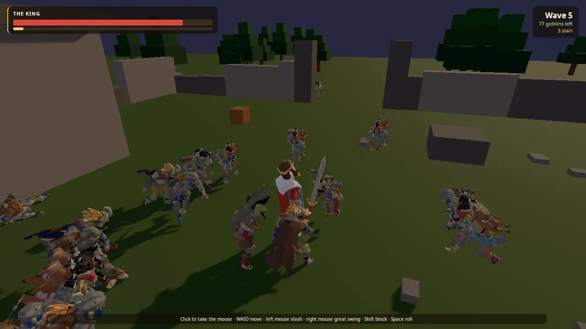

# Goblin Horde

Hold the old fort on the hill against waves of goblins. You are the king
with his sword, seen over the shoulder. The goblins come in through the
four gateways; the nearest few go at you while the rest circle and jeer,
waiting their turn. Each kill shakes the wave's nerve, and when it breaks
the last of them run for the trees. Every wave is bigger. Between waves you
get your breath and some health back. When your health runs out, the fort
is overrun.

The demo teaches crowd AI on the engine AI core
([docs/AI.md](../../docs/AI.md)), one-against-many melee on `kke::Combat`
([docs/COMBAT.md](../../docs/COMBAT.md)), Synty SIDEKICK modular
characters merged and simplified for crowds (`kke/Sidekick.h`,
`kke/MeshLod.h`), pooled instances, capped Jolt ragdolls, a Recast
navmesh around ruins, a procedural hit flinch that needs no clip, and
clips retargeted from one skeleton to another. Start here for a hack and
slash game, a wave survival or tower-defence-with-a-hero game, or any game
with dozens of enemies on screen at once.



## Run it

The executable is `goblin_horde` (`add_executable(goblin_horde ...)` in
[CMakeLists.txt](CMakeLists.txt)). The root `CMakeLists.txt` adds it only
when `KKE_ENABLE_JOLT` is on, which is the default.

```bash
cmake --build build --target goblin_horde
cd build/bin
./goblin_horde
KKE_SKIP_INTRO=1 ./goblin_horde                     # skip the logo intro
KKE_HORDE_BOT=1 KKE_HORDE_QUIT=60 ./goblin_horde    # the king fights alone for a minute, with a report
```

| Variable | Effect |
|---|---|
| `KKE_HORDE_BOT=1` | the king fights by himself (attract mode, headless runs) |
| `KKE_HORDE_WAVE=<n>` | start (and restart) at wave n |
| `KKE_HORDE_MAX=<n>` | goblins alive at once, at most (default 60) |
| `KKE_HORDE_VARIANTS=<n>` | goblin looks loaded, 1 to 16 (default 5; fewer loads faster) |
| `KKE_HORDE_LOD=<ratio>` | share of each goblin's triangles to keep, 0.02 to 1 (default 0.2) |
| `KKE_HORDE_RAGDOLLS=<n>` | ragdolls at once (default 12; 0 = the dead just topple) |
| `KKE_HORDE_HERO=<asset>` | another POLYGON Fantasy Characters model as the king |
| `KKE_HORDE_QUIT=<s>` | quit after that long, with a report every 10 s |
| `KKE_ASSETS_DIR`, `KKE_SYNTY_DIR` | where the Synty packs are (else `assets/synty`) |
| `KKE_ANIMATIONS_DIR` | where `UAL1_Standard.fbx` and `UAL2.fbx` are (else `assets/animations`) |

Rebindings are saved to `horde_input.json` (the name given to
`InputModule` in [main.cpp](main.cpp)).

## Controls

Bound in `HordeModule::init` ([HordeModule.cpp](HordeModule.cpp)), on top
of the engine's `defineCharacterActions` (move and look).

| Action | Keyboard / mouse | Controller |
|---|---|---|
| Move (relative to the camera) | WASD | left stick |
| Look | mouse, once the view has the mouse | right stick |
| Take the mouse | left click on the view | |
| Free the mouse | Esc | |
| Slash: quick, catches two or three in front (`horde.slash`) | left mouse / J | X (west) |
| Great swing: slow, costly, everything around you flies (`horde.heavy`) | right mouse / K | Y (north) |
| Block, held; just before the claw lands it parries (`horde.block`) | Left Shift | RB or LT |
| Roll (`horde.roll`) | Space | A (south) |
| Try again after being overrun (`horde.again`) | R | Start |
| Developer panels (`panels`) | F1 | no controller binding yet |

Notes from the code:

- Esc does not quit this game: `setQuitOnEscape(false)`, because Esc lets
  go of the mouse.
- The click that takes the mouse also slashes when the developer panels
  are hidden (`doSlash` checks `m_captured || !debugUi().visible()`).
- Button names are positions (SDL's `WEST`, `NORTH`, `SOUTH`), so on a
  PlayStation pad X is Square, Y is Triangle, A is Cross. The hint line
  shows the glyphs of the device last used.
- `audio.ping` (Q, D-pad down) and `voice.talk` (B key) keep their engine
  defaults from `defineCharacterActions`; Q plays the AudioModule's
  accessibility ping.

## How it plays

- **Waves.** Each wave starts with a 2.5 s banner ("Wave N", "M goblins
  are coming"); goblins already start arriving during it. They spawn one
  every 0.12 s, the first after 1.5 s, 20 to 26 m out beyond a random
  gateway, until the wave's `atOnce` limit (and `KKE_HORDE_MAX`) is
  reached; as they die, more come until the wave's total is spent.
- **Clearing a wave.** When every goblin of the wave is dead or has fled,
  the wave is beaten: you heal 40% of your maximum health and get the
  `breather` (4 s) before the next wave.
- **Morale.** The wave shares one morale value, 0 to 1. Each kill takes
  0.07 off, it comes back 0.04 a second, and once the whole wave has
  spawned and only a few are left (at most 2, or an eighth of the wave)
  it is held at 0.1. Below 0.15 the banner says "They're breaking!", and
  goblins switch to `break`: they run, and a runner more than 30 m from
  the centre is gone.
- **Waiting their turn.** Only the `attackers` nearest goblins (4, from
  `waves.yml`) go at you. The rest hang back in rings a few metres out,
  jeering, and step in as the ones in front fall.
- **Losing.** At zero health the fort is overrun. The banner shows the
  wave and the kills; `horde.again` (after 1.5 s) starts over from the
  first wave (or `KKE_HORDE_WAVE`). The bot restarts on its own after 5 s.
- **After the list.** [data/waves.yml](data/waves.yml) lists six waves.
  After the last, it repeats the last wave with 1.5× the goblins each time,
  15% more health per extra wave and 3% more speed (capped at 1.6×).

The king's moves and the goblins' claw, all built on the engine presets:

| Attack | Windup / active / recovery (s) | Damage | Stamina | Poise dmg | Reach | Other |
|---|---|---|---|---|---|---|
| Slash (`slash()`) | 0.14 / 0.14 / 0.26 | 16 | 10 | 14 | 1.25 m ahead, radius 0.85 | sweep: hits everyone in the sphere |
| Great swing (`greatSwing()`) | 0.4 / 0.22 / 0.45 | 34 | 32 | 40 | centred on him, radius 2.3 | sweep, knockback 7 m/s |
| Goblin swipe (`swipe()`) | 0.45 / 0.14 / 0.5 | 5 | 0 | 9 | 0.75 m ahead, radius 0.45 | 10% chip, 7 guard damage |

The king has 260 health, 120 stamina (regenerating 40 a second), 120
poise, an 80° block angle, a 0.45 s roll for 16 stamina, and gets up
after 1.6 s. A goblin is `CombatStats::grunt()`: 30 health (times the
wave's `health`), 12 poise, knocked down for 1.8 s.

## How it works

### Startup and the frame

[main.cpp](main.cpp) creates the `Application`, sets the `sunset` mood
(`assets/moods/sunset.yaml`: a low orange sun and long shadows) and adds:

1. `SettingsModule` (`settings.json`)
2. `InputModule` (`horde_input.json`)
3. `RigidBodyModule` (Jolt: the ruins, the king, ragdolls)
4. `ModelModule` (the king, the sword, the goblins)
5. `UiModule` (RmlUi, the HUD)
6. `AudioModule`, its panel hidden
7. `horde::HordeModule`, the game
8. `StatsModule`, its panel hidden

`HordeModule::init` binds the controls, sets up the `CameraRig`, loads the
goblin species from `data/goblin.yml`, loads the waves, builds the arena
and its navmesh, loads the king and the goblin looks, spawns the king,
builds the HUD and starts the first wave. It logs how many goblin looks
loaded and their average triangle count before and after simplifying.

`HordeModule::update` runs, every frame (with `dt` capped at 0.05 s):

1. F1 toggles the developer panels.
2. The phase machine (Intro, Fighting, Cleared, Overrun): spawning, the
   end of a wave, the breather, the game over.
3. Morale recovers or is held low.
4. `updateHero`: input (or the bot), attacks, footwork.
5. `updateGoblins`: AI inputs, `AiWorld::update`, strikes, movement,
   the dead.
6. `m_combat.step(dt)` and `onHit` for each `HitEvent`.
7. `animateHero` and `animateGoblin` for each goblin.
8. `updateCamera` and `updateHud`.
9. Timing for the headless report.

### The arena and the navmesh

`buildArena` builds everything from boxes: a 120 m meadow, the fort's
four walls (26 m square, `kFort` 13 is half) broken into stretches 2 to
4.5 m long and 1 to 2.8 m tall with a 4.4 m gateway in the middle of each,
taller gate posts, the watchtower stump, a well, crates, rubble and 70
pines outside the walls (none within 6 m of a gateway's path). A fixed
seed (11) makes the ruins the same every run. Each box goes into one
`DynamicMeshRenderer`; the solid ones are also static Jolt boxes; the
ones goblins must avoid are also stored in `m_obstacles` as
`(x, z, half x, half z)`.

The same vertices and indices then build a Recast navmesh:

```cpp
kke::ai::NavMeshSettings ns;
ns.cellSize = 0.3f;
ns.agentRadius = 0.35f;
ns.agentHeight = 1.3f;
if (m_nav.build(pts, idx, ns, &error)) m_ai.setNavMesh(&m_nav);
```

So the AI core's paths go round walls through the gateways with no level
annotation at all. If the build fails, the goblins walk straight.

### The goblins' minds

The `goblin` species in [data/goblin.yml](data/goblin.yml) has three
utility actions (plus a near-zero `idle`):

| Action | Behaviour | Scores high when |
|---|---|---|
| charge (1.5) | fight | it senses the king (`hostile`), is not `crowded`, and morale is above about 0.3 |
| wait_turn (1.2) | watch | it is `crowded`, senses the king, and morale holds |
| break (2.0) | flee | morale is below about 0.22 and it feels a `threat` |

`hostile` and `threat` come from the AI core's own perception (sight 80
m, all round). The game sets the other inputs every frame at the top of
`updateGoblins`:

- It sorts the living goblins by distance to the king. The nearest
  `attackers` get `crowded = 0`, the rest `crowded = 1`.
- A waiting goblin's `waitRadius` is `3.2 + 0.8 × sqrt(rank - attackers)`,
  so the queue fans out in rings with the next in line closest.
- `morale` is the wave's shared value (1 when the king is dead), and
  `health` the goblin's own fraction.

The species also sets `flocks: true` (`flockRadius` 2.5): the core keeps
the mob together and moving as one. `hostileTo: [hero]` makes them enemies
of the king, who is an actor of the `hero` species (id 1): perceived, never
moved by the AI. `attackRange` 0.45 plus both radii makes the core fire an
`Attack` event from about 1.1 m, with 1.4 s between a goblin's attacks.

### The goblins' bodies

The AI core decides; `updateGoblins` moves. Goblins are not Jolt bodies:
each one is a position, a velocity and a knockback `push`, moved in code.
Per living goblin:

1. **Strike.** An `Attack` event sets `strike`; if the goblin can act,
   the king is alive and within 1.6 m, it turns to him and starts
   `swipe()`.
2. **Where it wants to go.** Idle and `wait_turn`: toward its
   `waitRadius` around the king, drifting sideways (left or right by
   agent id parity). Idle otherwise: the AI core's
   `desiredVelocity × speedScale`. Windup: a slow step in (0.6 m/s).
   Other states: stand.
3. **Move.** Velocity eases toward that at rate 10; `push` decays with
   `exp(-5 dt)`; position += (velocity + push) × dt, flat on y = 0.
4. **Collide cheaply.** Each obstacle box, grown by 0.3 m, pushes the
   goblin out along the shallower axis. A goblin is never closer than
   0.7 m to the king.
5. **Face.** At the king while winding up, striking, or within 4 m (unless
   fleeing), else along its velocity, turning at rate 10.
6. **Report back.** `Combatant::place` and `AiWorld::setTransform`, so the
   combat core and the AI core both see where it really is.
7. **Hurt flash.** A hit tints it red (`2.2, 0.6, 0.5`), fading at 5 per
   second.

Then the dead are aged: after 5 s the ragdoll is destroyed and the body
freezes where it lies, after 7 s it sinks at 0.35 m/s, and at 9 s it is
released. Runaways past 30 m are released at once.

### Crowd cost: merging, simplifying, pooling

`loadGoblins` in [Goblins.cpp](Goblins.cpp):

1. Finds the asset folder (`findAssetFolder("assets/synty", {"KKE_ASSETS_DIR", "KKE_SYNTY_DIR"})`),
   then walks `SIDEKICK_Goblin_Fighters` and `ANIMATION_Goblin_Locomotion`
   inside it: every `.sk` file under a `GoblinFighters` path, and the six
   clip files by exact name under a `Sidekick` path.
2. Loads the six clips as animation-only models (`allowNoMeshes`).
3. Keeps the first `KKE_HORDE_VARIANTS` `.sk` files in sorted order, and
   loads them **in parallel** with `std::async`, each on its own thread:
   `readSidekickCharacter` reads the part list, `loadSidekickCharacter`
   merges about thirty part meshes onto one skeleton (skipping `Tongue`,
   `Teeth`, `EyebrowLeft`, `EyebrowRight`: "too small to see in a
   crowd"), and `simplifyModel(full, ratio, so)` with `acrossSeams` and
   `prune` cuts it to 20% of its triangles. Only the GPU upload
   (`ModelModule::add`) happens back on the main thread.
4. Gives each look its own rig (bones plus clips appended by bone name,
   one clip per file renamed to a tag like `|swipe`), its `AnimationSet`,
   the yaw that turns its forward to +z, and its `spine_01` bone for the
   flinch (found with `canonicalBoneName`, so naming differences between
   rigs do not matter).

Instances are pooled per look. `spawnGoblin` takes a hidden instance from
the look's `free` list if there is one, else spawns a new one;
`releaseGoblin` hides it, clears its bone override and puts it back. A
wave of 150 goblins therefore never creates more instances than were
ever alive at once.

Ragdolls are capped. `killGoblin` turns the dead goblin into a 30 kg
ragdoll (`buildHumanoidRagdoll`, `bindSkeletonToRagdoll`, `createRagdoll`
with its running velocity plus the blow, then the blow on torso and head).
When `KKE_HORDE_RAGDOLLS` (12) are already down, the oldest one's physics
is destroyed first and that body lies still (`m_ragdolled` is a queue,
oldest first). If the skeleton cannot make a ragdoll, the cap drops to 0
("same skeleton every time: don't ask again") and the dead topple over by
rotating 85° in 0.4 s instead. `ModelModule` skins visible instances on
the worker threads (commit ec94fc4).

### Goblin animation

`animateGoblin` sets the transform (position, yaw, and a random size
0.72 to 0.86) and picks a clip from the combat state:

- Windup plays `swipe`, stretched to the swipe's 1.09 s.
- Idle or Stunned, once any swipe has finished: speed divided by scale
  picks `sprint` above 4.2 m/s, `run` above 2.2, `walk` above 0.35, else
  `menace` for a waiting goblin or `idle`.

A living goblin that was hit gets the flinch on top.

### The procedural flinch

[Flinch.h](Flinch.h) is one function, `applyFlinch`, used on the goblins
(which have no hit clips) and the king alike. It rotates the `spine_01`
bone in model space around the axis `cross(up, awayFromBlow)` by up to
`maxDegrees × amount`, so the upper body tips away from the hit and
everything above the spine follows. The rotation is converted into the
bone's parent space first, so it works whatever the rig's bone
orientations are:

```cpp
const glm::quat turn = glm::angleAxis(glm::radians(maxDegrees) * amount, axis);
...
b.r = glm::normalize(glm::inverse(parentRot) * turn * parentRot * b.r);
```

The caller sets `amount` to 1 on a hit and fades it: goblins 30° fading
at 3.5 a second, the king 14° fading at 4.

### The king

[Hero.cpp](Hero.cpp).

**Loading** (`loadHero`). The clips come from `UAL1_Standard.fbx` plus
`UAL2.fbx` when present (the sword attacks, block, knockback, get-up). The
body comes from POLYGON Fantasy Characters: an `AssetCatalog` scan limited
to that pack (`onlyPacks`; the commit notes this took start-up from 48 s to
2 s against a big shared cache), then `KKE_HORDE_HERO` if set, else
`SK_Character_Male_King`, `SK_Character_Male_Rouge_01`,
`SK_Character_Male_Peasant_01`. The UAL clips are retargeted onto the
Synty skeleton with `kke::matchBones` and `kke::retargetAnimations` (the
log says how many bones matched). Without the pack the king is the UAL
mannequin recoloured gold; without UAL 1 he is a gold box.

**The sword.** `SM_Prop_SwordOrnate_01` from the same pack is its own
model instance. At load, the code works out a grip matrix `m_grip` that
puts the blade (+Y in the sword model) along the king's forward, 7 cm past
the right hand along the forearm, in the rest pose. Every frame the sword's
transform is `instance × handBone × m_grip`, so it follows every swing.

**States** (`spawnHero`). A 1D blend state `move` over ground speed
(`Sword_Idle` at 0, `Walk_Loop` 1.4, `Jog_Fwd_Loop` 3.4, `Sprint_Loop`
5.5), plus timed clip states for two slashes (alternating), the great
swing, block, roll, hit, down, get-up and death. Each attack clip is
stretched to its `AttackDesc` length, as in the Duel.

**Moving and fighting** (`updateHero`). The stick is turned into a world
direction from the camera rig's forward and right. The slash has a soft
lock: it faces the nearest living goblin within 3.5 m that is roughly in
front (`dot > 0.2`), else straight ahead. The great swing is centred on
him, so it does not aim. A roll turns him to the stick direction. Footwork
per state: Idle runs at 4.6 m/s (1.6 blocking) and turns toward the stick
unless blocking; Windup and Active step forward (1.4 m/s for a slash, 0.3
for the great swing); Dodging rolls at 6.5 m/s; other states stand.
Knockback `push` decays with `exp(-6 dt)`. The result drives the Jolt
character.

**The bot** (`heroBot`, with `KKE_HORDE_BOT=1`). It holds the middle of
the fort, stepping out only for a goblin near the centre; it uses the
great swing when three or more goblins are within 2.2 m and it has
stamina, slashes the nearest within 1.9 m, and blocks when a goblin
within 1.6 m is winding up. It produces a stick vector in camera space,
exactly like a player.

### The camera

A `kke::CameraRig` in `ThirdPerson` mode: arm 5 m, pivot 1.7 m, field of
view 60°, pitch -18°. The mouse turns it while captured (0.12 degrees per
unit); the right stick at 160° a second (70% of that vertically).
`CameraRig::update` gets a ray-cast function on the Jolt world, so the
camera pulls in instead of going through a wall. In bot mode it swings
slowly behind the king.

### The HUD

[Hud.cpp](Hud.cpp) and [ui/horde_hud.rml](ui/horde_hud.rml): an RmlUi data
model `horde` with the king's health and stamina (percent strings bound to
bar widths), a `low` flag that makes the health bar blink under 25%, the
wave, goblins left (alive plus still to spawn), kills, a banner and a hint
line. Values are dirtied only when they change. The hint is prompt text:
it offers "take the mouse" on keyboard before the mouse is captured, and
"Esc frees the mouse" after.

### The headless report

With `KKE_HORDE_QUIT` set, every 10 s the log shows the wave, goblins
alive, kills, the king's health, the average and worst frame time, and the
time spent in goblin minds and movement (`updateGoblins`) and in
animation. `KKE_HORDE_BOT=1 KKE_HORDE_QUIT=60` is a repeatable performance
run. CI starts `goblin_horde` for 8 seconds in its headless smoke run.

## Design decisions

- **Minds are data, bodies are code.** The species file decides *what*
  each goblin wants (charge, wait, run); the game decides how it moves and
  when a swipe really starts. Changing behaviour is a YAML edit and a
  restart, no rebuild.
- **The crowd takes turns.** Only `attackers` goblins go in; the rest
  `wait_turn`. The game computes `crowded` from a distance sort and feeds
  it to the utility scoring, so the rule is simple in code and still reads
  as a choice in the AI.
- **One morale for the wave.** Kills lower it for everyone, so a good
  streak visibly breaks the mob, and the last stragglers flee instead of
  being hunted down one by one.
- **Goblins are not physics bodies.** They move kinematically with a box
  push-out and a navmesh. Only the king is a Jolt character, and goblins
  become Jolt bodies only as ragdolls, up to a cap. The header lists the
  crowd-cost measures: simplification, pooling and capped ragdolls.
- **Simplify once at load, in parallel.** Each look is merged and cut to
  20% once, on its own thread, not per instance. `KKE_HORDE_LOD` and
  `KKE_HORDE_VARIANTS` trade looks against load time.
- **Pool and recycle.** Instances are hidden and reused, never destroyed
  mid-game, so a big wave does not churn GPU resources.
- **Ragdolls are capped, oldest first.** A ragdoll is the expensive part of
  a death; past the cap, the oldest body stops simulating and lies still,
  which is invisible in a fight.
- **A flinch without clips.** The goblin pack has no hit reactions, so a
  spine rotation stands in (the comment in Flinch.h: "no clip needed,
  which is why it works on the goblins ... and the king alike").
- **Clips from one library on another character.** UAL's sword clips are
  retargeted onto the Synty king by bone name, and the Sidekick goblins
  take the Goblin Locomotion clips by bone name, instead of authoring
  clips per character.
- **Scan only the pack needed.** `CatalogScanOptions::onlyPacks` for the
  king (48 s to 2 s against a shared cache, per commit ec94fc4).
- **Missing packs are normal.** Without packs the waves still come
  (invisible goblins, a gold mannequin or box king); a missing asset
  folder logs at info, not as a warning (commit 34fadf2), because it is the
  normal case in CI.
- **Soft lock on the slash only.** The quick slash snaps to the nearest
  goblin in front, which makes a crowd fight readable on a controller;
  the great swing is a circle around the king and needs no aim.

## Tuning

| What | Where | Effect |
|---|---|---|
| `attackers`, `breather` | [data/waves.yml](data/waves.yml) | how many goblins fight at once; rest between waves |
| each wave's `goblins`, `atOnce`, `speed`, `health` | data/waves.yml | size, density and toughness of each wave |
| `runSpeed`, `attackRange`, `attackCooldown`, `flockRadius`, `senses` | [data/goblin.yml](data/goblin.yml) | how fast and how often goblins attack, how tight the mob is |
| action weights and curve midpoints | data/goblin.yml | when they charge, wait or break |
| morale -0.07 per kill, +0.04/s, straggler rule | `HordeModule::update`, `onHit` | how quickly waves break |
| heal 40% on a cleared wave | `HordeModule::update` | how forgiving the game is |
| `swipe()` | [Goblins.cpp](Goblins.cpp) | goblin damage, telegraph time (windup 0.45 s), reach |
| `slash()`, `greatSwing()` | [Hero.cpp](Hero.cpp) | the king's damage, reach, stamina costs |
| king's `CombatStats` | `spawnHero` | health 260, stamina 120, poise 120, roll |
| `kRun` 4.6, `kBlockWalk` 1.6, `kRollSpeed` 6.5 | Hero.cpp | the king's speeds |
| soft-lock range 3.5 m | `updateHero` | how far the slash reaches for a target |
| `waitRadius` formula | `updateGoblins` | how far the queue stands |
| goblin size 0.72 to 0.86, speed ±15% | `spawnGoblin` | variety in the crowd |
| 5 s ragdoll, 7 s sink, 9 s release | `updateGoblins` | how long bodies stay |
| `kFort` 13, `kGateHalf` 2.2 | [HordeModule.cpp](HordeModule.cpp) | fort size, gateway width |
| navmesh `cellSize` 0.3, `agentRadius` 0.35 | `buildArena` | path precision and clearance |
| arm 5, pivot 1.7, fov 60, `m_mouseSensitivity` 0.12, `m_stickSpeed` 160 | `init`, [HordeModule.h](HordeModule.h) | the camera |
| `KKE_HORDE_MAX`, `KKE_HORDE_LOD`, `KKE_HORDE_VARIANTS`, `KKE_HORDE_RAGDOLLS` | environment | the performance budget |

## Engine features it uses

| Feature | Header / module | Doc |
|---|---|---|
| Utility AI, perception, flocking, steering, Attack events | `kke/ai/AiWorld.h` | [AI.md](../../docs/AI.md) |
| Navmesh from level triangles | `kke/ai/NavMesh.h` (Recast/Detour) | [AI.md](../../docs/AI.md) |
| Melee rules, sweeping attacks, many combatants | `kke/Combat.h` | [COMBAT.md](../../docs/COMBAT.md) |
| Sidekick modular characters | `kke/Sidekick.h` | [COMBAT.md](../../docs/COMBAT.md) (crowds) |
| Mesh simplification | `kke/MeshLod.h` (meshoptimizer) | [COMBAT.md](../../docs/COMBAT.md) (crowds) |
| Clips by bone name, retargeting, pose helpers | `kke/AnimRig.h`, `kke/Animator.h` | [PROCEDURAL_ANIMATION.md](../../docs/PROCEDURAL_ANIMATION.md) |
| Ragdolls | `kke/Ragdoll.h`, `IRagdollPhysics` | [RAGDOLLS.md](../../docs/RAGDOLLS.md) |
| Character controller, static boxes, ray casts | `kke/RigidWorld.h`, `RigidBodyModule` | [MOVEMENT.md](../../docs/MOVEMENT.md) |
| Third-person camera with collision | `kke/CameraRig.h` | |
| Skinned instances, pooling by visibility, tints | `ModelModule` | [SCENES.md](../../docs/SCENES.md) |
| Finding and scanning asset packs | `kke/AssetCatalog.h` | [SCENES.md](../../docs/SCENES.md) |
| YAML or JSON data files | `kke/DataFile.h` | [DATA_FILES.md](../../docs/DATA_FILES.md) |
| Rebindable actions, button prompts | `InputModule`, `kke/ButtonPrompts.h` | [INPUT.md](../../docs/INPUT.md) |
| HUD | `UiModule` (RmlUi) | |
| Mood | `Application::setMood` | [MOODS.md](../../docs/MOODS.md) |

## Assets

Synty packs are never in the repository ([docs/SCENES.md](../../docs/SCENES.md)).
Put them in `assets/synty/` (a symlink to a shared cache works) or point
`KKE_ASSETS_DIR` (or `KKE_SYNTY_DIR`) at them. `tools/fetch_assets.sh` can
fetch archives by name.

| Pack | Files used | Without it |
|---|---|---|
| SIDEKICK Goblin Fighters (`SIDEKICK_Goblin_Fighters`) | `GoblinFighter_01` to `_05` `.sk` part lists, their parts and `T_GoblinFighter_0NColorMap` colour maps | a warning; the waves still come but the goblins are invisible |
| ANIMATION Goblin Locomotion (`ANIMATION_Goblin_Locomotion`), Sidekick versions | `A_MOD_GBL_Idle_Standing_Neut`, `A_MOD_GBL_Walk_F_Neut`, `A_MOD_GBL_Run_F_Neut`, `A_MOD_GBL_Sprint_F_Neut`, `A_MOD_GBL_Idle_Fidget_Swipe_Neut` (the attack), `A_MOD_GBL_Idle_Fidget_Menacing_Neut` (waiting) | a warning per missing clip; goblins slide in their rest pose or fall back to another clip |
| POLYGON Fantasy Characters (`POLYGON_Fantasy_Characters`) | `SK_Character_Male_King` (else `SK_Character_Male_Rouge_01`, `SK_Character_Male_Peasant_01`), `SM_Prop_SwordOrnate_01` | info line; the king is the UAL mannequin in gold, without a sword |

If no asset folder exists at all, the game logs at info ("goblins can't be
shown, the waves still come") and plays on.

Not Synty:

- Quaternius' Universal Animation Library 1 (CC0),
  `assets/animations/UAL1_Standard.fbx`, in the repository: `Sword_Idle`,
  `Idle_Loop`, `Walk_Loop`, `Jog_Fwd_Loop`, `Sprint_Loop`, `Roll`,
  `Hit_Chest`, `Hit_Head`, `Death01`, `Sword_Attack` (fallback). Without
  it the king is a gold box.
- Universal Animation Library 2, `UAL2.fbx` (optional, in
  `assets/animations/` or `$KKE_ASSETS_DIR/Universal Animation Library 2/Unity/`):
  `Sword_Regular_A`, `Sword_Regular_B`, `Sword_Heavy_A`, `Sword_Block`,
  `Hit_Knockback`, `LayToIdle`. Without it the king swings with UAL 1's
  single `Sword_Attack`.
- The HUD: `ui/horde_hud.rml`, the shared `theme.rcss` from
  `games/rmlui_demo/ui/`, Noto Sans and Noto Color Emoji (SIL Open Font
  License), copied by [CMakeLists.txt](CMakeLists.txt); Xelu's CC0 button
  prompts.
- The fort, trees and rubble are boxes built in code.

## Make a game like this

1. **Copy the folder.** `cp -r games/goblin_horde games/my_horde`, rename
   the target and namespace, and add it to the root `CMakeLists.txt` inside
   `if(KKE_ENABLE_JOLT)`. (`tools/new_game` is for Lua-only games from
   `games/template`.)
2. **Change the enemy's mind first.** Edit
   [data/goblin.yml](data/goblin.yml): rename the species, change speeds
   and senses, add an action (for example a ranged `harass` with
   `behavior: watch` scored on a new input) and set that input in
   `updateGoblins`. See [AI.md](../../docs/AI.md) for every behaviour and
   curve.
3. **Change the waves.** [data/waves.yml](data/waves.yml) only; `waveAt`
   already extends the list forever.
4. **Change the enemy's body.** Point `loadGoblins` at your pack and clip
   names (`kClips`), or load a single model per variant. Keep the
   simplify-once and pooling steps if you want dozens on screen.
5. **Change the hero.** New attacks are `AttackDesc`s built from presets
   (`slash()`, `greatSwing()`); add a clip state with the `timed` helper
   and a case in `animateHero`. A different character only needs a new
   name in the fallback list: the UAL clips are retargeted.
6. **Replace the arena.** Anything that produces triangles works for the
   navmesh; keep `m_obstacles` (or switch goblins to the navmesh alone) so
   they cannot be knocked through walls.
7. **Measure.** Run `KKE_HORDE_BOT=1 KKE_HORDE_QUIT=60` and read the
   report before and after each change.

Pitfalls the code shows:

- Goblins move without physics, so knockback can push them into walls;
  the obstacle push-out is what stops that. Add a box to `m_obstacles`
  for every solid thing you add.
- Each look needs its own rig and `AnimationSet`: Sidekick part sets can
  add bones, so one skeleton does not fit all.
- `KKE_HORDE_VARIANTS` keeps the first N `.sk` files in sorted order; the
  same looks come up every run.
- Destroy ragdolls before the physics module goes (`shutdown` does it)
  and clear bone overrides when an instance goes back to the pool.
- Clips from the Goblin Locomotion pack come in root-motion (`_RM`) and
  in-place versions; the code uses the in-place Sidekick ones because it
  moves the goblins itself.

## Files

| File | What is in it |
|---|---|
| [main.cpp](main.cpp) | The application, the mood and the module list |
| [HordeModule.h](HordeModule.h) | The module and its structs: `Hero`, `Variant`, `Goblin`, `Wave`, phases, HUD |
| [HordeModule.cpp](HordeModule.cpp) | Controls, waves loading and scaling, the arena and navmesh, phases, spawning, morale, hits, camera, headless report, shutdown |
| [Hero.cpp](Hero.cpp) | The king: loading and retargeting, the sword grip, attacks, the bot, movement and animation |
| [Goblins.cpp](Goblins.cpp) | Goblin loading (parallel merge and simplify), spawning and pooling, AI inputs, movement, death and ragdolls, animation |
| [Flinch.h](Flinch.h) | The procedural hit flinch |
| [Hud.cpp](Hud.cpp) | The RmlUi data model and its update |
| [ui/horde_hud.rml](ui/horde_hud.rml) | The HUD layout and style |
| [data/goblin.yml](data/goblin.yml) | The goblin and hero species for the AI core |
| [data/waves.yml](data/waves.yml) | The waves, `attackers` and `breather` |
| [game.json](game.json) | Marketplace manifest |
| [CMakeLists.txt](CMakeLists.txt) | The executable and the runtime files copied next to it |
