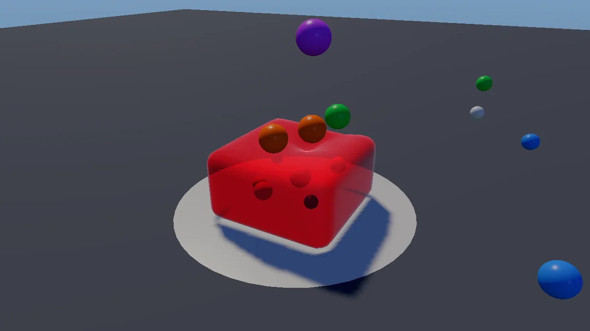
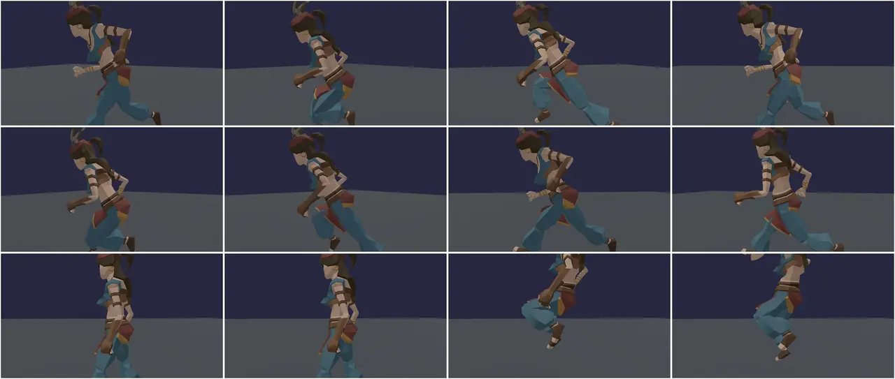

# Jiggle demo

Two scenes about secondary motion: things that lag, overshoot and settle
when what they are attached to moves.

- **Jelly.** A strawberry jelly with fruit set in it stands on a plate.
  Coloured balls rain onto it; they dent it, it wobbles, and it throws them
  back. You can drop a big ball, squish it from above, change how firm it
  is and change its flavour and look.
- **Body.** A Synty character, given extra curves and soft-tissue bones
  in code, runs a circle on animation clips: stand, jog, jump, sprint,
  stop dead, jump, walk. Her breasts, glutes, belly and thighs jiggle,
  and a twin with the same body and clips but no jiggle can run with her
  to compare.

The demo teaches the engine's jiggle physics
([docs/JIGGLE.md](../../docs/JIGGLE.md)): `kke::JellyBody` (a whole soft
object by lattice shape matching), `kke::JiggleRig` (bone chains that chase
the animated pose), `kke::JiggleSkin` (jiggle on the skin with no bones)
and `kke::addHumanoidSoftTissue` (adding shape and soft-tissue bones to a
rig that has none). Start here for characters with hair, tails, capes,
antennae or soft bodies; for slimes, jelly or gummy creatures; or for any
cartoon squash-and-stretch.





## Run it

The executable is `jiggle_demo` (`kke_add_game(jiggle_demo ...)` in
[CMakeLists.txt](CMakeLists.txt): `add_executable` on desktop, a shared
library on Android). The root `CMakeLists.txt` always adds it; it needs
no optional library. The jelly scene needs no files. The body scene needs
a Synty character pack (see [Assets](#assets)) and
`assets/animations/UAL1_Standard.fbx`, which is in the repository.

```bash
cmake --build build --target jiggle_demo
cd build/bin
./jiggle_demo
KKE_SKIP_INTRO=1 ./jiggle_demo                 # skip the logo intro
KKE_JIGGLE_SCENE=body KKE_JIGGLE_TWIN=1 ./jiggle_demo
```

| Variable | Effect |
|---|---|
| `KKE_JIGGLE_SCENE=body` (or `character`) | start in the body scene (default: jelly) |
| `KKE_JIGGLE_MOVE=0..4` | the move: 0 idle, 1 walk, 2 jog, 3 sprint, 4 tour (default) |
| `KKE_JIGGLE_TWIN=1` | show the twin without jiggle |
| `KKE_JELLY_LOOK=0..5` | the flavour: strawberry, lime, blue raspberry, orange, panna cotta, clear gelatin |
| `KKE_JIGGLE_CHARACTER=SK_...` | any character name from the Synty packs found |
| `KKE_JIGGLE_VIEW=yaw,pitch,distance` | a set camera angle (radians, metres), for screenshots |
| `KKE_JIGGLE_TRACE=1` | log time, speed, jump height, swing and stretch every frame |
| `KKE_ASSETS_DIR`, `KKE_SYNTY_DIR` | where the Synty packs are (else `assets/synty/`) |
| `KKE_ANIMATIONS_DIR` | where `UAL1_Standard.fbx` is (else `assets/animations/`) |

The benchmark suite runs it with `KKE_JIGGLE_MOVE=4`
([benchmarks/suite.yaml](../../benchmarks/suite.yaml)). Rebindings are
saved to `jiggle_demo_input.json`.

## Controls

The actions are made in `JiggleDemoModule::defineInput`
([JiggleDemoModule.cpp](JiggleDemoModule.cpp)), in the "Jiggle" group and
the `game` input context.

| Action | Scene | Keyboard / mouse | Controller |
|---|---|---|---|
| Switch jelly / body (`jiggle.scene`) | both | Tab | LB (left shoulder) |
| Rain balls on / off (`jiggle.go`) | jelly | Space | A (south) |
| Jump (`jiggle.go`) | body | Space | A (south) |
| Drop a big ball (`jiggle.ball`) | jelly | B | X (west) |
| Squish from above (`jiggle.squish`) | jelly | P | Y (north) |
| Reset the jelly (`jiggle.reset`) | jelly | R | B (east) |
| Next move (`jiggle.move`) | body | M | RB (right shoulder) |
| Pick a move: idle, walk, jog, sprint, tour | body | 1 to 5 | the panel's "Move" row |
| Turn the camera (`camera.orbit`) | both | left-drag | right stick |
| Pan the camera | both | right-drag | no controller binding yet |
| Zoom (`camera.zoom`) | both | mouse wheel | d-pad up (closer) / down (further) |
| Settings panel (`panel.toggle`) | both | F3, or click it | View (Back) |
| Developer panels (ImGui) | both | F1, developer builds only | no controller binding yet |

Notes from the code:

- `readInput` only reads `jiggle.ball`, `jiggle.squish` and
  `jiggle.reset` in the jelly scene, and `jiggle.move` only in the body
  scene.
- Keys 1 to 5 are raw key events in `onEvent`, not actions: they cannot
  be rebound. On a pad, RB cycles through the same five moves.
- The camera uses the orbit camera's default `Viewer` controls and
  `setPadControls(true)` ([main.cpp](main.cpp)). In the body scene with
  "Camera follows" and "Side view" on, the demo sets the camera's yaw
  every frame to look at her side, so turning left and right is
  overridden; pitch and zoom still work. Turn "Side view" off to orbit
  freely while it follows.
- Button names are positions: on a PlayStation pad A is Cross, B is
  Circle, X is Square, Y is Triangle.

### The settings panel

The settings are a `kke::DemoPanelModule` titled "Jiggle physics" on the
right edge (`Side::Right`), drawn with RmlUi
([docs/DEMO_PANEL.md](../../docs/DEMO_PANEL.md)). It starts open with the
game keeping the controls; the mouse can click and drag any row.
`panel.toggle` (View on a pad, F3 on the keyboard) makes it Active: up and
down pick a row, left and right change it (hold to sweep), A presses, B or
Esc hands control back. On the keyboard it reads the arrows, Enter and Esc
directly. While it is Active, player 1's `game` context is off, so A does
not also toggle the rain and B does not reset the jelly. The last row,
"Hide panel", collapses it.

Rows that belong to one scene hide in the other (`sectionIf`, `showIf`):

| Section | Rows |
|---|---|
| Jiggle physics | Scene (Jelly / Body); a Tab / LB prompt, shown in the jelly scene |
| Jelly | controls line; Rain balls; Every (0.15 to 2 s); Big ball; Squish; Reset; Firmness (0.03 to 1); Iterations (1 to 8); Damping (0 to 0.2); Look: Flavour, Translucent, Fruit inside, Density (0 to 4), Milkiness (0 to 1); status (particles, triangles, balls, deformation in mm, solve time) |
| Body | the character's name, or why it could not load; controls line; Twin without jiggle; Move; Jump; Show points; Camera follows; Side view; Breasts: Stiffness, Soften, Stretch, Drag, Gravity, Blend; Glutes: Stiffness, Drag, Blend; status (bones, zones, points, time per frame, asleep, peak swing, stretch) |

When no character could be loaded, the Body section shows only the reason
(the other rows return a null value and hide).

## How it plays

It is a sandbox with no goal. In the jelly scene a ball of 7 to 12 cm
falls from 1.4 to 2 m every 0.7 s; at most 14 balls exist, the oldest
removed first. Balls that roll off the plate and stop, fly more than 4 m
away, or go non-finite are removed. The big ball is 16 cm, dropped from
2.2 m. Reset makes a fresh jelly but keeps the firmness, iterations and
damping you set.

In the body scene, the tour (move 5) repeats every 17 s:

| Time (s) | Target speed | Event |
|---|---|---|
| 0 to 2.5 | stand | |
| 2.5 to 6.5 | jog (3.6 m/s) | jump at 5 |
| 6.5 to 10 | sprint (6.2 m/s) | |
| 10 to 13 | stand: a dead stop | jump at 11.5 |
| 13 to 17 | walk (1.6 m/s) | |

The comment above it: "Starts and stops are where jiggle shows (and
where bad jiggle shows most)."

## How it works

### Startup and the frame

[main.cpp](main.cpp) creates the `Application` (1280 x 720), sets the mood
`playful` (a gradient sky, "a bright cartoon sky for bouncy things"), sets
the far plane to 100 m and adds the modules in this order:

1. `InputModule` (`jiggle_demo_input.json`)
2. `UiModule` (RmlUi, for the panel)
3. `OrbitCameraModule` (distance 2.6 m, pitch -0.45, yaw 0.5, target (0, 0.3, 0)), `setPadControls(true)`
4. `ModelModule`: draws and skins the characters
5. `kke_jiggle::JiggleDemoModule`, the demo; it declares `ModelModule` as a
   required dependency ("draws the characters")
6. `DemoPanelModule("Jiggle physics", Side::Right)`
7. `DebugControlModule`, its ImGui window hidden
8. `StatsModule`

`JiggleDemoModule::init` builds the plate (a 48-sided disc of 0.8 m) and
the floor (a square of 24 m) as `DynamicMeshRenderer`s, makes the jelly
(`resetJelly`), loads and prepares the character (`setupBodies`), reads
the environment variables, picks the scene (`setScene`, which also places
the camera), defines the input and builds the panel.

`update` reads the input, caps the frame time at 0.1 s, then runs either
`updateJelly` or `updateBodies`: only the visible scene is simulated.
`render` draws the floor, then the jelly scene (plate, balls and fruit as
sphere impostors, then the jelly over them) or, in the body scene, the
debug points when "Show points" is on. The characters themselves are
drawn by `ModelModule`. `renderShadow` adds the jelly to the shadow map.

### The jelly: `kke::JellyBody`

[kke/JigglePhysics.h](../../engine/include/kke/JigglePhysics.h),
[JigglePhysics.cpp](../../engine/src/JigglePhysics.cpp). A box filled with
a lattice of particles. `resetJelly` sets it up:

```cpp
p.min = glm::vec3(-0.42f, 0.0f, -0.42f);
p.max = glm::vec3(0.42f, 0.5f, 0.42f);
p.cells = glm::ivec3(7, 4, 7);
p.stiffness = 0.22f;
p.iterations = 3;
p.damping = 0.015f;
```

7 x 4 x 7 cells means 8 x 5 x 8 = 320 particles. Each step, every 2 x 2 x 2
cell finds the rotation that best fits its eight particles to their rest
shape, and pulls them toward that rotated rest shape by `stiffness`.
Cells overlap, so the whole lattice holds its shape but can bend and
dent locally (lattice shape matching: Muller et al. 2005, per-cell
regions after Rivers and James 2007). The bottom layer is glued to the
plate (`pinBottom`). The body steps internally at 120 Hz
(`Params::stepHz`).

Balls collide with the particles, and with the top of the jelly as a
height field, so a fast ball dents it but never ends up inside. The
collision is two-way: the ball pushes the jelly, the jelly throws the
ball back.

After `step`, `deform()` moves the render surface. The surface is a
rounded mesh (14 quads per box face, `buildSurface(14)`) embedded in the
lattice by trilinear weights. The fruit is the same idea: each piece has a
rest position, and `deformedPoint(rest)` says where the jelly has carried
it this frame.

`squish()` is one call: `poke` at the middle of the top with an impulse of
6 m/s downward over a 0.35 m radius.

The demo uploads the surface every frame with each vertex's `uv` holding
the look's density and milkiness, because that is where
`DynamicMeshRenderer::drawTranslucent` reads them:

```cpp
// drawTranslucent reads uv.x = density, uv.y = milkiness.
for (size_t i = 0; i < pos.size(); ++i) v[i] = kke::Vertex{ pos[i], look.tint, nrm[i], glm::vec2(m_density, m_milkiness) };
```

`drawTranslucent` is a reusable material in two passes over the front
faces: the first multiplies what is already drawn by the transmittance
(Beer-Lambert through a thickness that grows toward the silhouette, so
edges look richer), the second adds Fresnel reflection, light scattered
inside and light shining through from behind. That is why `render` draws
the plate, balls and fruit first and the jelly last. With "Translucent"
off it is drawn as an ordinary opaque mesh.

### The character: `setupBodies`

This runs once, at start:

1. Find `UAL1_Standard.fbx` with `kke::findAssetFolder("assets/animations", {"KKE_ANIMATIONS_DIR"}, ...)`.
2. Find the Synty folder (`KKE_ASSETS_DIR`, `KKE_SYNTY_DIR`, else
   `assets/synty` near the working directory or the executable), scan it
   into a `kke::AssetCatalog`, and pick the character: `KKE_JIGGLE_CHARACTER`
   if set, else the first found of `SK_Character_Female_Gypsy`,
   `SK_Character_Female_Peasant_01`, `SK_Character_HipsterGirl`,
   `SK_Character_Female_Druid`, `SK_Character_Dummy_Female_01`.
3. Load both models. The Synty one gets its pack's texture through
   `kke::packLoadOptions`.
4. Reshape and add bones: `kke::addHumanoidSoftTissue(body, m_tissue)`,
   with `bust = 0.075`, `glutes = 0.06`, `hips = 0.03` (metres of extra
   volume). It finds the chest, pelvis and thighs by bone name, pushes the
   skin out, adds two breast and two glute bones, moves the nearby skin
   onto them, and returns the rig chains and the skin zones (belly and
   thighs). Anything it cannot find is logged.
5. Retarget the UAL clips onto the reshaped body (`kke::matchBones`,
   `kke::retargetAnimations`). This comes after step 4 on purpose: the
   comment says "the new bones have no UAL counterpart and stay at rest in
   them", which is what lets the jiggle move them.
6. Register the model with `ModelModule::add`, build an `Animator` with a
   1D blend space `move` (idle 0, walk 1.6, jog 3.6, sprint 6.2 m/s) and
   clip states for jump start, fall loop and land.
7. Spawn two instances. The second (`jiggle = true`) gets a
   `kke::JiggleRig` from the chains and a `kke::JiggleSkin` from the zones.
   The first is the twin without jiggle.

If a step fails, `m_bodyStatus` says why and the panel shows it; the jelly
scene is unaffected.

### The character each frame: `updateBodies`

1. Pick the target speed (the tour's schedule or the chosen move) and
   ease toward it: 5 m/s2 speeding up, 9 m/s2 slowing down ("real people
   take a moment to speed up and slow down").
2. Move around a circle of 2.3 m radius. A jump is a simple ballistic
   height (3.6 m/s up, 9.81 down) with the jump-start, fall and land
   clips.
3. Feed the speed to the blend space and update the `Animator`.
4. For each instance: place it on the circle (the two are half a lap
   apart), facing along it, and take the animated `Pose`. For the jiggle
   one:

   ```cpp
   d.rig.apply(m_rig, pose, toWorld, dt);
   d.skin.apply(m_rig, pose, toWorld, dt);
   m_models->setSkinJiggle(d.instance, d.skin.offsets());
   ```

   `JiggleRig::apply` moves verlet points toward where the pose puts
   them, then turns (and with `stretch`, lengthens) the soft-tissue bones
   in the pose to follow the points. `JiggleSkin` does the same for
   points that displace the skin near them after skinning. Then
   `kke::poseToLocals` writes the pose into the instance's bone locals.
5. The camera follows the jiggling one at 1 m height. With "Side view" it
   looks from outside the circle at her side, "across the direction she
   runs: where lag and bounce show best".

`JiggleRig` steps at a fixed 90 Hz inside `apply` and interpolates the
offset from the pose, not the positions, so it looks the same at any
frame rate ([docs/JIGGLE.md](../../docs/JIGGLE.md) "How it's built").

"Show points" draws each simulated point (pink, glowing) and the point
the pose wants it at (blue). The distance between the two is the jiggle.

### The body panel's sliders

The panel edits the live `JiggleSettings` of the rig through `Ref`
functions that return a pointer, or null to hide the row. Both breasts
share one setting and both glutes another, so the sliders edit chain 0 or
2 and the `share` callback copies it to chain 1 or 3:

```cpp
for (size_t c = 1; c < m_bones && c < 2; ++c) rig->settings(c) = rig->settings(0);
if (m_bones >= 4) rig->settings(3) = rig->settings(2);
```

## Design decisions

- **Jiggle driven by the difference from animation.** From
  [docs/JIGGLE.md](../../docs/JIGGLE.md): points chase where the pose puts
  them, so the authored pose always wins, nothing drifts, and a character
  standing still does not bounce on its own.
- **Its own light solver instead of FEMFX.** JIGGLE.md "Why not FEMFX":
  FEMFX costs about 0.2 ms per body per step and needs a tet mesh; the
  rig costs tens of microseconds for a whole character and needs only the
  skeleton. The jelly (`JellyBody`, about 0.8 ms) also works on builds
  without FEMFX, which is the default.
- **Soft-tissue bones added in code.** Most game rigs, Synty's included,
  have no such bones. `addHumanoidSoftTissue` adds them at load time, so
  any humanoid can use the demo without an artist changing the model.
- **Clips retargeted after the new bones exist.** The new bones then stay
  at rest in every clip, and the jiggle alone moves them.
- **A tour with starts, stops and jumps.** The comment in `updateBodies`:
  starts and stops are "where jiggle shows (and where bad jiggle shows
  most)", so the default move is built to show it.
- **A twin without jiggle.** The note in the panel: it runs "with the same
  body and clips, but no jiggle, to compare". Seeing both is how you judge
  whether the settings help.
- **A camera from the side.** The comment in `updateBodies`: "the camera
  follows the jiggling one (not her jumps: that would hide them)", and
  the side view is "where lag and bounce show best".
- **Translucency in two passes without sorting.** JIGGLE.md: no sorting
  and no extra render targets; draw it after the opaque scene.
- **Only the visible scene is simulated.** `update` steps the jelly or
  the bodies, never both.
- **A fixed ball budget.** At most 14 balls (`kMaxBalls`); the oldest
  goes.
- **The settings panel is RmlUi, with rows per scene.** Commit 944d596
  moved the ImGui window to `kke::DemoPanelModule` so a controller can
  reach every setting ([docs/DEMO_PANEL.md](../../docs/DEMO_PANEL.md)).
  The comment above `buildPanel`: "Rows for the other scene hide."

## Tuning

| What | Where | Effect |
|---|---|---|
| jelly box, `cells = (7, 4, 7)` | `resetJelly` | size and particle count; cost grows with particles |
| `stiffness = 0.22` ("Firmness") | `resetJelly`, panel | higher = firmer, less wobble |
| `iterations = 3` | `resetJelly`, panel | more = stiffer and costlier |
| `damping = 0.015` | `resetJelly`, panel | higher = settles sooner |
| ball radius 0.07 to 0.12, height 1.4 to 2, every 0.7 s, restitution 0.55 | `updateJelly`, `dropBall` | how hard and how often it is hit |
| `kMaxBalls = 14` | [JiggleDemoModule.cpp](JiggleDemoModule.cpp) | the ball budget |
| `kLooks`: tint, density, milkiness | [JiggleDemoModule.cpp](JiggleDemoModule.cpp) | the flavours; density is absorption, milkiness is cloudiness |
| `m_tissue.bust = 0.075`, `glutes = 0.06`, `hips = 0.03` | `init` | extra volume in metres; 0 keeps the artist's shape |
| `HumanoidSoftTissue::breast` / `glute` / `skin` settings | [kke/JigglePhysics.h](../../engine/include/kke/JigglePhysics.h) | the starting jiggle; the panel changes breasts and glutes live |
| `kWalkSpeed 1.6`, `kJogSpeed 3.6`, `kSprintSpeed 6.2` | [JiggleDemoModule.cpp](JiggleDemoModule.cpp) | must match the UAL clips' own speeds, or the feet slide |
| acceleration 5, deceleration 9 m/s2 | `updateBodies` | faster stops = bigger jiggle |
| jump speed 3.6 m/s | `jump` | higher jumps = bigger landings |
| circle radius 2.3 m | `updateBodies` | tighter circles add sideways lean and sway |

The jiggle settings themselves (stiffness, soften, stretch, drag, air
drag, gravity, blend, limits) are explained in
[docs/JIGGLE.md](../../docs/JIGGLE.md) "Settings".

## Engine features it uses

| Feature | Header / module | Doc |
|---|---|---|
| Soft object by lattice shape matching | `kke::JellyBody` ([kke/JigglePhysics.h](../../engine/include/kke/JigglePhysics.h)) | [JIGGLE.md](../../docs/JIGGLE.md) |
| Jiggle bone chains | `kke::JiggleRig`, `kke::JiggleSettings` | [JIGGLE.md](../../docs/JIGGLE.md) |
| Jiggle on the skin | `kke::JiggleSkin`, `ModelModule::setSkinJiggle` | [JIGGLE.md](../../docs/JIGGLE.md) |
| Curves and soft-tissue bones for any humanoid | `kke::addHumanoidSoftTissue` | [JIGGLE.md](../../docs/JIGGLE.md) |
| Translucent material | `DynamicMeshRenderer::drawTranslucent` ([kke/SphereImpostors.h](../../engine/include/kke/SphereImpostors.h)) | [JIGGLE.md](../../docs/JIGGLE.md) |
| Sphere impostors | `kke::SphereImpostorRenderer` | |
| Skinned models, bone locals | `kke::ModelModule` ([kke/modules/ModelModule.h](../../engine/include/kke/modules/ModelModule.h)) | |
| Animation state machine, blend space | `kke::Animator`, `kke::AnimationSet` ([kke/Animator.h](../../engine/include/kke/Animator.h)) | [MOVEMENT.md](../../docs/MOVEMENT.md) |
| Retargeting clips | `kke::matchBones`, `kke::retargetAnimations` ([kke/AnimRig.h](../../engine/include/kke/AnimRig.h)) | |
| Finding packs and assets | `kke::findAssetFolder`, `kke::AssetCatalog` ([kke/AssetCatalog.h](../../engine/include/kke/AssetCatalog.h)) | [SCENES.md](../../docs/SCENES.md) |
| Actions, bindings, prompts | `kke::InputModule` | [INPUT.md](../../docs/INPUT.md) |
| Settings panel | `kke::DemoPanelModule` | [DEMO_PANEL.md](../../docs/DEMO_PANEL.md) |
| Orbit camera with pad controls, `setView`, `setTarget` | `kke::OrbitCameraModule` | [DEMO_PANEL.md](../../docs/DEMO_PANEL.md) |
| Sky and colour look | `Application::setMood("playful")` | [MOODS.md](../../docs/MOODS.md) |

## Assets

The jelly scene uses no files: the jelly, plate, floor, balls and fruit
are built in code.

The body scene uses ([docs/SCENES.md](../../docs/SCENES.md) "Jiggle demo,
body scene"):

| What | Source | In the repo? |
|---|---|---|
| The clips: `Idle_Loop`, `Walk_Loop`, `Jog_Fwd_Loop`, `Sprint_Loop`, `Jump_Start`, `Jump_Loop`, `Jump_Land` | Quaternius Universal Animation Library, `assets/animations/UAL1_Standard.fbx`, CC0 ([docs/DEPENDENCIES.md](../../docs/DEPENDENCIES.md)) | yes |
| The character: `SK_Character_Female_Gypsy`, falling back to `SK_Character_Female_Peasant_01` or `SK_Character_Female_Druid` | Synty POLYGON Fantasy Characters | no |
| or `SK_Character_HipsterGirl` | Synty POLYGON City Characters | no |
| or `SK_Character_Dummy_Female_01` | Synty POLYGON Prototype | no |
| The character's texture | the same pack's atlas, via `packLoadOptions` | no |

Synty packs are never committed. Put the pack in
`assets/synty/POLYGON_Fantasy_Characters/` (a symlink works) or set
`KKE_ASSETS_DIR`. When no character is found, the demo logs it at info
level (the pack is optional), the panel's Body section shows the message
("No female Synty character found. Put POLYGON Fantasy Characters (or City
Characters) in assets/synty/ or set KKE_ASSETS_DIR."), and the body scene
shows only the floor. The jelly scene works either way. If
`UAL1_Standard.fbx` is missing, the demo logs a warning and says so in the
panel.

The `playful` mood is a gradient sky with no picture and no ambience.

## Make a game like this

1. **Copy the folder.** `cp -r games/jiggle_demo games/my_soft`, rename the
   target in [CMakeLists.txt](CMakeLists.txt) (including the `game.json`
   copy), the namespace `kke_jiggle` and `name()`, and add
   `add_subdirectory(games/my_soft)` to the root `CMakeLists.txt`.
   `tools/new_game` makes Lua-only games from `games/template`; jiggle has
   no Lua bindings, so this starts from C++.
2. **Pick one scene.** For characters keep `setupBodies` and
   `updateBodies`; for soft objects keep the jelly half. Delete the other.
3. **Hair, tails, capes.** No new bones needed: make a
   `JiggleRig::Chain{ firstBone }` on the rig's own bones (JIGGLE.md
   "Use") and call `rig.apply` after the Animator, every frame.
4. **Your own character.** Load it, call `addHumanoidSoftTissue` before
   retargeting, and pass 0 volume to keep the artist's shape. Check the
   log for "soft tissue: no ..." lines: bone names it could not find.
5. **Drive it from your gameplay.** Replace the circle with your
   character controller: the rig only needs the pose, the instance's world
   transform and `dt`. A teleport farther than `teleportDistance` resets
   the rig instead of whipping it across the map.
6. **Soft objects in play.** A `JellyBody` takes balls (`Ball`) for
   collision; `poke` is an explosion or a stomp; `deformedPoint` carries
   anything embedded in it (eyes on a slime).
7. **Read next:** [JIGGLE.md](../../docs/JIGGLE.md),
   [DEMO_PANEL.md](../../docs/DEMO_PANEL.md),
   [SCENES.md](../../docs/SCENES.md) for asset packs.

Pitfalls the code shows:

- Add soft-tissue bones before retargeting clips, or the clips may try to
  drive bones they know nothing about.
- Run the rig after the Animator and before `poseToLocals`, on the same
  `Pose`, every frame.
- Draw translucent things after everything opaque.
- The body panel's sliders assume the chain order breasts left, right,
  then glutes left, right, which is what `addHumanoidSoftTissue` returns
  when it finds both.
- Cap the frame time (`std::min(ctx.dt, 0.1f)` here) so a hitch does not
  hand a huge step to the soft body.

## Files

| File | What is in it |
|---|---|
| [main.cpp](main.cpp) | The application, the mood, the module list and the camera |
| [JiggleDemoModule.h](JiggleDemoModule.h) | The module, scenes, moves, the `Dancer` struct, all state |
| [JiggleDemoModule.cpp](JiggleDemoModule.cpp) | Flavours, fruit, the jelly and balls, loading and reshaping the character, the tour, jiggle per frame, drawing, input actions, the settings panel |
| [game.json](game.json) | Marketplace manifest (id, title, tags, modules) |
| [CMakeLists.txt](CMakeLists.txt) | The executable, its shaders (including `translucent_absorb`, `translucent_light`), the manifest, and `kke_use_ui` (the RmlUi shaders and fonts) |
