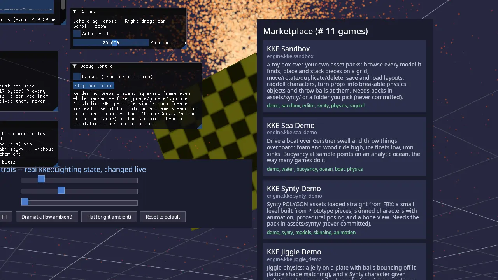

# KKE Basics (kke_basics)

The engine's first demo: a spinning checkered cube on a reference grid, a
fountain of 20,000 GPU particles, a cube that "shatters" into 16 pieces
when you press a button, an orbit camera, and a set of panels (lighting,
the list of installed games, performance, pause and step). It is not a
game. It shows how the engine is put together: everything you see is a
separate `kke::Module`, and `main.cpp` only picks which ones to add.

Start here if you want to write C++ for KKE: your own rendering module
(own Vulkan pipeline, own shaders), a GPU compute system, a module that
talks to others without including their headers, or a deterministic effect
that replicates by sending a seed. For a game with a character and a
level, start from [games/showcase](../showcase/README.md) or
`tools/new_game` instead.



## Run it

The executable is `kke_basics` (`add_executable(kke_basics ...)` in
[CMakeLists.txt](CMakeLists.txt)). The folder is always built: the root
`CMakeLists.txt` adds `games/kke_demo_game` with no option guard.

```sh
cmake --preset default && cmake --build build
cd build/bin && ./kke_basics
KKE_SKIP_INTRO=1 ./kke_basics    # no logo intro
```

With `KKE_ENABLE_FEMFX=ON` (the `everything` preset) it also adds
`PhysicsModule` and a material grid panel. `KKE_HIDE_UI=1` starts with all
panels hidden (engine switch).

## Controls

| Action | Keyboard and mouse | Controller |
|---|---|---|
| Orbit the camera | Left mouse drag | no controller binding yet |
| Pan | Right mouse drag | no controller binding yet |
| Zoom | Mouse wheel | no controller binding yet |
| Turn, zoom (touch screen) | Two-finger drag, pinch, twist | |
| Use the panels | Mouse | no controller binding yet |
| Quit | Esc | no controller binding yet |

The camera controls are `OrbitCameraModule`'s defaults ("Viewer" mode).
The module has a `nudge()` method for a gamepad's right stick, but this
demo adds no `InputModule` and nothing calls `nudge()`, so a controller
does nothing here. Esc quits because `Window::setQuitOnEscape` defaults to
true and this demo does not change it.

## How it plays

There are no rules. Things to try, all in the panels:

- **Cube**: stop the spin, change its speed (-180 to 180 degrees a
  second), slide Metallic and Roughness and watch the highlight change.
- **Destruction**: press Trigger. Sixteen small cubes fly out of the
  centre and settle on the grid. Reset puts it back.
- **Network (stub)**: shows every module that offers replicated state and
  how many bytes it would send (17 for the destruction).
- **Particles**: pause the fountain.
- **Camera**: auto-orbit and its speed.
- **Lighting** (RmlUi panel): sliders and four presets (warm key and cool
  fill, dramatic, flat, reset).
- **Marketplace** (RmlUi panel): every `game.json` found in
  `bin/marketplace/`, which is every game the build copied there.
- **Debug Control**: pause the simulation and step one frame at a time.
- **Performance**: frame time and FPS.

## How it works

### Startup and the frame

[main.cpp](main.cpp) is the whole program:

1. Creates a `kke::Application` (1600 x 900), sets the `studio` mood, and
   turns off `sky.lightsScene` so the Lighting panel's flat ambient is in
   charge of the fill light.
2. Runs a hardware check: it loads its own manifest from
   `marketplace/kke_demo_game/game.json` (CMake copies [game.json](game.json)
   there), calls `kke::checkHardwareRequirements`, and logs warnings. It
   never blocks: "informational, not a block".
3. Adds the modules. The comment: "Opaque geometry first, then
   transparent (grid, particles)":

```cpp
app.addModule<kke_demo::CubeModule>();
app.addModule<kke::GridModule>();
app.addModule<kke::OrbitCameraModule>();
app.addModule<kke::ParticleModule>(20000);
app.addModule<kke_demo::DestructionModule>(16, 1234);
app.addModule<kke_demo::NetworkModule>();
app.addModule<kke::UiModule>();
app.addModule<kke::MarketplaceUiModule>("marketplace");
app.addModule<kke::LightingControlsModule>();
app.addModule<kke::DebugControlModule>();
// FEMFX builds: PhysicsModule, MaterialGridModule(40, 640)
app.addModule<kke::StatsModule>();
```

4. `app.run()`. Modules are initialised in this order (none of the demo's
   own modules declare dependencies). Each frame the engine calls
   `fixedUpdate` at 60 Hz and `update` on every module, then `renderUi`
   (the ImGui panels), `compute` (GPU work recorded before the render
   pass), `renderShadow` and `render`. While paused (Debug Control),
   `fixedUpdate`, `update` and `compute` stop; drawing goes on.

Three modules live in this folder. The rest are engine modules any game can
add.

### The cube (CubeModule)

[CubeModule.h](CubeModule.h) says it is "the module to copy when starting
a new gameplay system: it owns its own GPU resources (mesh + pipeline),
updates its own state each frame, and draws itself". It shows the full
raw-Vulkan path, with no engine renderer class in between:

- **Mesh**: `kke::Mesh::createCube`.
- **Texture**: a 64 x 64 checkerboard of 8 x 8 squares made in code and
  uploaded as a `kke::Texture`. The comment explains why generated: a
  checkerboard "immediately, visibly proves UV mapping is correct" and
  needs no asset file.
- **Descriptor set**: its own one-set `VkDescriptorPool` for that texture,
  destroyed by hand in `shutdown()` because the pool has no RAII wrapper.
- **Pipeline**: `cube.vert`/`cube.frag`, three descriptor sets (lighting,
  shadow map, material texture) and a push constant block:

```cpp
struct CubePushConstants {
    glm::mat4 model;
    float metallic;
    float roughness;
};
```

  The comment notes the push constant limit (128 bytes) as the reason the
  view-projection matrix comes from the shared lighting buffer instead.
- **Shadow pipeline**: a second `kke::Pipeline` from
  `ShadowMap::casterConfig()`, with `shadow.vert`/`shadow.frag`, no
  descriptor sets, and the shadow map's render pass. `renderShadow` draws
  the same mesh with the light's view-projection.
- **Culling is off** (`VK_CULL_MODE_NONE`). The long comment in `init`
  records why: with back-face culling one triangle of the top face went
  missing at some angles, the cause was not found, and turning culling off
  fixed it in six screenshots.

`update` adds `dt * speed` to the angle; `render` rotates round the axis
(0.3, 1, 0) and pushes the metallic and roughness values from the panel.

### The grid (GridModule, engine)

A fading reference grid on the y = 0 plane. Its header calls it "the
minimal shape a rendering module takes: own a Pipeline, implement
render(), draw with no vertex/index buffers at all". The lines are made in
`grid.vert`/`grid.frag`. It is drawn after the cube because it does not
write depth.

### The particle fountain (ParticleModule, engine)

20,000 particles that live only on the GPU. The header: "the reference for
how do I get a compute shader talking to a graphics pipeline through a
shared buffer".

1. One storage buffer holds every particle: position plus remaining life,
   velocity plus maximum life.
2. `compute(cmd)` dispatches `particle.comp` in groups of 256. Each
   invocation owns one particle: it counts down its life, applies gravity
   (4 m/s²) and moves it, and when it dies respawns it at (0, 0.05, 0)
   with a random upward cone velocity and a life of 1.2 to 2.8 s. The
   random numbers come from a Wang hash of the particle index and time.
3. A buffer memory barrier (compute write to vertex read) makes the new
   positions visible to the draw.
4. `render` draws `particleCount` points with `particle.vert`/`.frag`; the
   vertex shader reads the same buffer. The CPU never touches a particle.

### Destruction by seed (DestructionModule)

[DestructionModule.h](DestructionModule.h) shows "generate from a seed,
replicate the seed instead of the result". Each fragment's transform is a
pure function of the seed, the fragment index and the time since the
trigger tick:

```cpp
glm::mat4 fragmentTransform(uint64_t seed, uint32_t index, float elapsed) {
    uint32_t base = static_cast<uint32_t>(seed) * 747796405u + index * 2891336453u;
    float angle = hashFloat(base) * 6.2831853f;
    ...
    glm::vec3 position = velocity * elapsed;
    position.y += -0.5f * 4.0f * elapsed * elapsed;
    position.y = std::max(position.y, 0.08f); // rest on the grid
```

Nothing is integrated frame to frame. `fixedUpdate` only stores the tick
index; `render` computes `elapsed = (currentTick - triggerTick) * fixedDt`
and draws each fragment with the cube shaders. So a peer that receives
only `{seed, triggered, triggerTick}` (17 bytes, `serializeReplicatedState`)
draws exactly the same pieces at the same moment, whatever its frame rate.
`deserializeReplicatedState` ignores data shorter than 17 bytes.

It uses a closed-form throw (position = v t + ½ g t², clamped at the
floor) instead of physics, which is also why the pieces pass through each
other and do not bounce.

### Finding each other (NetworkModule)

[NetworkModule.h](NetworkModule.h) is a stub with no transport: "no socket
is opened, nothing actually leaves the process". In `init` it asks the
application for every module that implements `kke::INetworkReplicable`:

```cpp
for (auto* replicable : app.findCapability<kke::INetworkReplicable>())
    m_replicables.push_back({ replicable, replicable->replicationChannelName(), 0 });
```

Once a second it calls `serializeReplicatedState()` on each and shows the
channel name and payload size. It never includes `DestructionModule.h`,
and `DestructionModule` never includes it. The interface is in
[kke/Capabilities.h](../../engine/include/kke/Capabilities.h);
`findCapability` is a `dynamic_cast` over every module
([kke/Application.h](../../engine/include/kke/Application.h)). The comment
in `main.cpp`: comment out the NetworkModule line "and DestructionModule
still works exactly the same".

The real networking is `kke::NetModule` ([NETWORKING.md](../../docs/NETWORKING.md)),
used by the showcase and other demos. This stub only shows the discovery
pattern.

### The camera (OrbitCameraModule, engine)

Writes `Application::camera()` every frame from yaw, pitch and distance
round a target. Defaults (distance 3.5, pitch 0.5, yaw -0.6 radians) were
tuned for this demo's unit cube. Distance is clamped to 0.5 to 30, pitch
kept clear of the poles. Mouse sensitivity follows the engine settings.

### The panels

- `UiModule` owns the RmlUi context. `LightingControlsModule` and
  `MarketplaceUiModule` add their own RmlUi documents to it. The
  marketplace scans the folder once at start and is a static list (its
  header: "nothing can be clicked, so there is no launch this game
  button").
- `DebugControlModule`, `StatsModule`, and the demo modules' `renderUi`
  are ImGui windows.
- FEMFX builds: `MaterialGridModule` at (40, 640), placed under the
  lighting panel because a screenshot showed the marketplace panel hiding
  anything behind it (comment in `main.cpp`).

## Design decisions

- **Everything is a module; `main` only chooses.** The comment at the top
  of `main.cpp`: "Nothing engine-specific happens here". A game is a list
  of modules, and removing one does not break the others.
- **Modules talk through capabilities, not headers.** `NetworkModule`
  finds `DestructionModule` through `INetworkReplicable`, so each works
  alone. The engine offers `getModule<T>()` for a hard dependency and
  `findCapability<T>()` for this loose "recognise each other if both are
  present" case.
- **Replicate the seed, not the result.** 17 bytes describe every fragment
  because their motion is a pure function of seed, index and tick. The
  cost: the effect cannot react to anything that is not in those inputs.
- **The particle simulation never leaves the GPU.** No readback, no CPU
  array; the header calls this the pattern "most non-trivial GPU-driven
  systems need (skinning, culling, destruction fragments, cloth)".
- **A generated checkerboard, not a picture.** It shows UV mistakes at
  once and needs no asset file.
- **Culling off on the cube**, as a tested fix for a missing triangle
  whose cause was not found (comment in `CubeModule::init`).
- **The hardware check warns, never blocks.** It reads the requirements
  the developer wrote in `game.json` and reuses the copy already in
  `marketplace/` "rather than a second copy of the file".

## Tuning

| What | Where | Effect |
|---|---|---|
| `ParticleModule(20000)` | `main.cpp` | Particle count (GPU memory and time) |
| `DestructionModule(16, 1234)` | `main.cpp` | Fragment count and seed; another seed, another pattern |
| Gravity 4, speeds, 0.15 scale, 0.08 floor | `fragmentTransform` in `DestructionModule.cpp` | How the pieces fly and where they rest |
| Emitter, cone speeds, life 1.2 to 2.8 s, gravity 4 | `shaders/particle.comp` | Fountain shape and height |
| `m_spinSpeedDegPerSec` 45, `m_spinAxis`, `m_metallic` 0.1, `m_roughness` 0.4 | `CubeModule.h`, Cube panel | Cube motion and material |
| `kCheckerSize` 64, `kCheckerSquares` 8 | `CubeModule::init` | Texture size and squares |
| `OrbitCameraModule(distance, pitch, yaw, target)` | `main.cpp` (defaults used) | Start view; pass values for content at another scale |
| Window 1600 x 900, mood `studio` | `main.cpp` | Window size, sky and light |
| `requirements` | [game.json](game.json) | What the hardware check compares against |

## Engine features it uses

| Feature | Header / module | Doc |
|---|---|---|
| Application and modules | [kke/Application.h](../../engine/include/kke/Application.h), [kke/Module.h](../../engine/include/kke/Module.h) | [HISTORY.md](../../docs/HISTORY.md) ("Adding a module", "Cross-module communication") |
| Capabilities | [kke/Capabilities.h](../../engine/include/kke/Capabilities.h) | |
| Pipelines, meshes, textures | [kke/Pipeline.h](../../engine/include/kke/Pipeline.h), [kke/Mesh.h](../../engine/include/kke/Mesh.h), [kke/Texture.h](../../engine/include/kke/Texture.h) | [RENDERING_PRINCIPLES.md](../../docs/RENDERING_PRINCIPLES.md) |
| Shadow map | [kke/ShadowMap.h](../../engine/include/kke/ShadowMap.h) | |
| GPU particles | [kke/modules/ParticleModule.h](../../engine/include/kke/modules/ParticleModule.h) | |
| Grid | [kke/modules/GridModule.h](../../engine/include/kke/modules/GridModule.h) | |
| Orbit camera | [kke/modules/OrbitCameraModule.h](../../engine/include/kke/modules/OrbitCameraModule.h) | |
| RmlUi panels | `UiModule`, `LightingControlsModule`, `MarketplaceUiModule` | |
| Game manifest and hardware check | [kke/GameManifest.h](../../engine/include/kke/GameManifest.h), [kke/HardwareCheck.h](../../engine/include/kke/HardwareCheck.h) | |
| Pause and step, performance | `DebugControlModule`, `StatsModule` | |
| Moods | `Application::setMood` | [MOODS.md](../../docs/MOODS.md) |

## Assets

No asset packs. Everything is made in code except:

- Fonts: `NotoSans-Regular.ttf` and `NotoColorEmoji.ttf` (SIL Open Font
  License 1.1, `assets/fonts/`), copied next to the executable.
- Shaders from `shaders/`: cube, shadow, grid, particle (vert, frag,
  comp), and the RmlUi shaders.
- The `studio` mood (`assets/moods/studio.yaml`).
- Its own `game.json`, copied to `bin/marketplace/kke_demo_game/`.

Licences: [DEPENDENCIES.md](../../docs/DEPENDENCIES.md).

## Make a game like this

This demo is the template for engine-level C++, not for a game. To use it:

1. **For a game, start elsewhere.** `tools/new_game my_game` copies
   `games/template/` (a Lua-first game with a `PlayerModule`). The name
   `kke_basics` is reserved by `tools/new_game.cmake`.
2. **To write a new module**, copy `CubeModule.h`/`.cpp` into your game,
   rename the class and `name()`, and add it in your `main.cpp` with
   `app.addModule<YourModule>()`. Read
   [skills/cpp-module](../../skills/cpp-module/SKILL.md) and
   [AI_GUIDE.md](../../AI_GUIDE.md) first.
3. **Add shaders** with `engine_add_shader(your_exe ...)` in your
   `CMakeLists.txt`, like this folder does; the pipeline loads
   `shaders/<name>.spv` from next to the executable.
4. **For many things on the GPU**, copy `ParticleModule`'s pattern:
   storage buffer, `compute()`, barrier, draw.
5. **For optional cross-talk**, define an interface like
   `INetworkReplicable`, implement it in one module, and find it with
   `findCapability<T>()` in another.
6. **For effects everyone must see the same**, make them a pure function
   of a seed and a tick, and send only those.
7. Check with `KKE_SKIP_INTRO=1 ./your_exe` and read the log: zero
   warnings.

Pitfalls the code shows:

- `NetworkModule` collects the replicables in `init`, so a module that
  implements the capability must be in the application before `run()`.
- Draw order matters for things that do not write depth: add opaque
  modules before the grid and the particles.
- A raw `VkDescriptorPool` must be destroyed in `shutdown()`; keep the
  `VkDevice` from `init` for that.
- `DestructionModule` has no `renderShadow`, so its fragments cast no
  shadows.
- `MaterialGridModule` exists only in FEMFX builds; guard it with
  `#if KKE_ENABLE_FEMFX` like `main.cpp` does.

## Files

| File | What is in it |
|---|---|
| [main.cpp](main.cpp) | Application, hardware check, the module list |
| [CubeModule.h](CubeModule.h), [CubeModule.cpp](CubeModule.cpp) | Textured PBR cube with its own pipeline, shadow pipeline and panel |
| [DestructionModule.h](DestructionModule.h), [DestructionModule.cpp](DestructionModule.cpp) | Seed-based shattering and its 17-byte replicated state |
| [NetworkModule.h](NetworkModule.h), [NetworkModule.cpp](NetworkModule.cpp) | Discovery stub: lists replicable modules and payload sizes |
| [game.json](game.json) | Manifest: title, modules, hardware requirements |
| [CMakeLists.txt](CMakeLists.txt) | The `kke_basics` executable, fonts, shaders, manifest copy |
