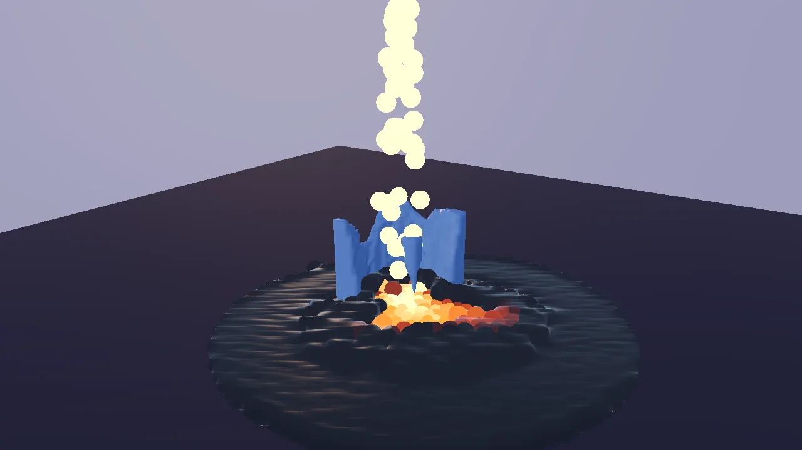

# Melt demo

Lava pours from a spout onto a half-metre block standing on dark stone.
The block's material decides what happens: ice melts into water that runs
off and chills the lava into black crust; wax and chocolate soften, slump
and harden again as they cool; aluminium soaks up heat, glows, and only
then melts. The liquid is drawn as one smooth, glowing surface, and one
button switches back to the raw particles underneath.

The demo teaches two engine pieces that work together: a particle liquid
with temperature (`kke::ParticleFluid`, Position Based Fluids) and a voxel
solid that heats up and melts into more liquid (`kke::MeltVolume`), plus
screen-space fluid rendering (`kke::FluidSurfaceRenderer`) to make
particles read as a liquid. Start here for lava, water, slime, mud or
honey in a game, for things that melt, burn away or erode, or for any
effect where a solid turns into a liquid.



## Run it

The executable is `melt_demo` (`kke_add_game(melt_demo ...)` in
[CMakeLists.txt](CMakeLists.txt): `add_executable` on desktop, a shared
library on Android). The root `CMakeLists.txt` always adds it: it needs no
optional library (not FEMFX, not Jolt) and no asset pack.

```bash
cmake --build build --target melt_demo
cd build/bin
./melt_demo
KKE_SKIP_INTRO=1 ./melt_demo      # skip the logo intro
KKE_MELT_PRESET=3 ./melt_demo     # start with the aluminium block
```

| Variable | Effect |
|---|---|
| `KKE_MELT_PRESET=0..3` | the starting block: 0 ice, 1 wax, 2 chocolate, 3 aluminium (clamped to that range) |
| `KKE_SKIP_INTRO=1` | skip the logo intro (engine-wide) |

Rebindings are saved to `melt_demo_input.json` (the name passed to
`InputModule` in [main.cpp](main.cpp)).

## Controls

The actions are made in `MeltDemoModule::defineInput`
([MeltDemoModule.cpp](MeltDemoModule.cpp)), in the "Melt" group and the
`game` input context.

| Action | Keyboard / mouse | Controller |
|---|---|---|
| Pour lava on / off (`melt.pour`) | Space | A (south) |
| Next block, and start over (`melt.block`) | B | RB (right shoulder) |
| Smooth liquid surface on / off (`melt.smooth`) | L | Y (north) |
| Reset (`melt.reset`) | R | X (west) |
| Turn the camera (`camera.orbit`) | left-drag | right stick |
| Pan the camera | right-drag | no controller binding yet |
| Zoom (`camera.zoom`) | mouse wheel | d-pad up (closer) / down (further) |
| Settings panel (`panel.toggle`) | F3 or Esc, or click it | View (Back) |
| Developer panels (ImGui) | F1, developer builds only | no controller binding yet |

The camera uses the orbit camera's default `Viewer` controls (left-drag
orbits, right-drag pans, scroll zooms) and `setPadControls(true)` in
[main.cpp](main.cpp) for the right stick and d-pad. Button names are
positions, so on a PlayStation pad A is Cross, Y is Triangle and X is
Square.

### The settings panel

The settings are a `kke::DemoPanelModule` titled "Melt", drawn with RmlUi
([docs/DEMO_PANEL.md](../../docs/DEMO_PANEL.md)). It starts open at the
left edge with the game keeping the controls; the mouse can click and drag
any row. `panel.toggle` (View on a pad, F3 on the keyboard) makes it
Active: up and down pick a row, left and right change it (hold to sweep),
A presses, B or Esc hands control back. On the keyboard it reads the
arrows, Enter and Esc directly. While it is Active, player 1's `game`
context is off, so A does not also toggle the pour and the d-pad does not
zoom. The last row, "Hide panel", collapses it.
Esc works like a pause menu: it opens the panel with the keyboard on
it, and Esc again goes back to the game. So Esc does not close the
window; the panel's "Quit" row, just above "Hide panel", does.
`setEscapeMenu(false)` gives Esc back to a game that needs it.

| Row | Kind | Range |
|---|---|---|
| Controls line | text | the four actions as button prompts for the device in hand |
| Block | choice | the four presets; changing it resets |
| Pour lava | toggle | |
| Smooth liquid surface | toggle | |
| Smoothing | slider, shown only while the surface is smooth | 0.01 to 0.2 m, step 0.01 |
| Pour rate | slider | 30 to 400 drops/s, step 10 |
| Lava temperature | slider | 800 to 1400 C, step 20 |
| Reset | button | |
| Status | live text | block left (%), liquid particles / 3,000 |
| Budget warning | text, shown only when full | "Liquid budget full: reset to pour again" |
| Timings | live text | fluid and melt ms per step, block surface triangles |
| Note | note | what each material does |

With a `DemoPanelModule` in the app, the engine's ImGui windows start
hidden; F1 shows them in developer builds.

## How it plays

It is a sandbox with no goal. Lava pours at 120 drops a second from 1.5 m
above the block. The block is 0.5 m on each side. What you should see:

| Block | Melts at | Starts at | What happens |
|---|---|---|---|
| Ice (melts to water) | 0 C | -15 C | eats inward from where the lava lands; the water runs off and cools the lava around it into crust |
| Wax (softens, re-hardens) | 60 C | 20 C | slumps; the molten wax stiffens as it cools and sets again below 45 C |
| Chocolate | 35 C | 18 C | melts fastest (highest melt rate); sets again below 25 C |
| Aluminium (glows, then melts) | 660 C | 20 C | conducts heat quickly, so the whole block warms and glows before any of it runs; the melt glows too |

Lava itself cools as it gives its heat away and crusts over below 550 C:
it turns dark and rough and stops flowing.

The liquid has a budget of 3,000 particles (`kMaxParticles`), shared by
the lava and the melt. When it is full, no more lava comes out of the
spout and melted voxels stop turning into particles; the panel says so.
Reset (or picking another block) starts over.

## How it works

### Startup and the frame

[main.cpp](main.cpp) creates the `Application` (1280 x 720), sets the mood
`dusk` (the comment: "the hot, glowing melt reads best against a darker
sky") and adds the modules in this order:

1. `InputModule` (`melt_demo_input.json`)
2. `UiModule` (RmlUi, for the panel)
3. `OrbitCameraModule` (distance 2.8 m, pitch -0.35, yaw 0.6, target (0, 0.45, 0)), `setPadControls(true)`
4. `kke_melt::MeltDemoModule`, the demo
5. `DemoPanelModule("Melt")`
6. `DebugControlModule`, its ImGui window hidden
7. `StatsModule`

`MeltDemoModule::init` defines the input, creates the sphere and fluid
surface renderers (the surface's blur radius set to 2.5 particle radii),
builds a 6 x 6 m ground quad at y = 0, reads `KKE_MELT_PRESET`, calls
`reset()` and builds the panel.

Each frame:

| Hook | What it does |
|---|---|
| `fixedUpdate` (fixed step) | emit lava from the spout, `ParticleFluid::step`, `MeltVolume::step`, time both |
| `update` | read the actions; if the block melted, rebuild its surface mesh and upload it |
| `prepass` | colour every particle from its material and temperature; render the particles into the fluid surface's offscreen targets |
| `renderShadow` | the block only |
| `render` | the ground, the block, then the smooth surface or the raw spheres |

### Setting up a block: `reset()`

`reset()` throws away the old simulation and builds a new one from the
current preset:

1. A `ParticleFluid` with 3 cm particles, container walls from
   (-2.8, -1, -2.8) to (2.8, 10, 2.8), the ground plane at y = 0, 2
   substeps, low contact friction (0.02) and slow cooling to 20 C air.
2. Two liquid materials: `kLava` (0) and `kMelt` (1). Lava is runny at
   1200 C, thicker as it cools, and solid below 550 C. The melt gets the
   preset's own `FluidMaterial`.
3. A `MeltVolume` of 24 x 24 x 24 voxels of 2.5 cm, filled with a
   20 x 20 x 20 block (`fillBox`) at the preset's start temperature, with
   the preset's melting point, heat capacity, melt rate and conduction.
   Melted matter comes out as `kMelt` particles at 2 C above the melting
   point.
4. The block becomes a collider of the fluid: a lambda that returns the
   block's signed distance.

```cpp
kke::MeltVolume* block = m_block.get();
m_fluid->addCollider([block](const glm::vec3& pos, glm::vec3& n) { return block->signedDistance(pos, n); });
```

That one line is the whole coupling for collisions: the fluid does not
know what a voxel is, only a distance and a normal.

### The liquid: `kke::ParticleFluid`

[kke/ParticleFluid.h](../../engine/include/kke/ParticleFluid.h),
[ParticleFluid.cpp](../../engine/src/ParticleFluid.cpp). Position Based
Fluids (Macklin and Muller, SIGGRAPH 2013), the method behind NVIDIA Flex.
Each substep:

1. Apply gravity and predict every particle's new position.
2. Sort particles by grid cell (a counting sort), so neighbours sit next
   to each other in memory, and build a neighbour list once. The kernel
   radius is 4 particle radii (12 cm here).
3. Run a few Jacobi iterations that move each particle to bring its
   density back to the rest density (1000 kg/m3). This is what keeps the
   liquid from compressing.
4. Collide with the ground, the container walls and every collider (the
   block's distance field).
5. Set velocity from the change in position, then apply XSPH viscosity:
   each particle shares some of its neighbours' velocity. The share goes
   from `viscosityHot` to `viscosityCold` as the particle cools.

Each particle also carries a temperature. It diffuses between neighbours
(`heatDiffusion = 3`) and cools toward the air (`coolingRate = 0.05`).
This is how water from the ice chills the lava: they are in the same
simulation, so their temperatures mix. Below its material's
`solidifyTemperature` a particle is "frozen": its velocity is damped
every substep and it moves with its neighbours, but it still falls if
nothing holds it up. That is the crust.

Lava is emitted in `fixedUpdate` as a stream about 8 cm wide leaving the
spout at 1.5 m/s. An accumulator (`m_emitAccum`) turns the pour rate into
whole particles per step. `ParticleFluid::add` returns false at the
budget, and the loop stops.

### The solid: `kke::MeltVolume`

[kke/MeltVolume.h](../../engine/include/kke/MeltVolume.h),
[MeltVolume.cpp](../../engine/src/MeltVolume.cpp). A voxel grid holding
density (1 solid, 0 empty) and temperature. `step(dt, fluid)` does three
things:

1. **Heat exchange with the liquid.** Every particle within reach of a
   solid voxel (its radius plus 1.5 voxels) trades heat with it, both
   ways. The voxel's change is divided by `heatCapacity`, the particle's
   by `liquidHeatCapacity`. So the lava cools as it melts the block,
   which is why it crusts on top of it.
2. **Conduction.** Each solid voxel moves toward the average of its solid
   neighbours at a rate set by `conduction`. Aluminium's high conduction
   (4) spreads heat through the whole block before any of it melts.
3. **Melting with latent heat.** A voxel above its melting point loses
   density in proportion to the excess, and its temperature is set back
   to the melting point. The comment in the header: "a voxel at its
   melting point can't get hotter; extra heat goes into losing density
   instead. That one rule is why melting looks gradual and eats inward
   from the contact." Lost density accumulates per voxel; each time it
   adds up to one particle's worth, a new `kMelt` particle is added at
   that voxel.

For collisions the volume keeps a signed distance field, built with a
two-pass chamfer transform over the voxels. It is rebuilt only when a
voxel crosses from solid to empty (density 0.5), not on every step that
melts a little ([docs/OPTIMIZATION.md](../../docs/OPTIMIZATION.md) #32).
Outside the grid the distance keeps growing, so the grid's own edge is not
an invisible wall (BUG-049 in BUGS.md).

### The block's surface

`update()` calls `MeltVolume::rebuildMesh()`, which only does work when
something melted. It extracts the surface at density 0.5 by marching
tetrahedra: each cell is split into six tetrahedra, which needs 16 cases
instead of marching cubes' 256-entry tables and never leaves cracks.
Normals come from the density gradient, so the surface is smooth. Each
vertex also gets a `glow` value (0 cold to 1 at the melting point).

The demo turns that into vertex colours: aluminium keeps its colour and
puts the glow in `uv.x` (the dynamic mesh shader reads `uv.x` as
incandescent glow); the other materials are tinted toward their liquid
colour, so they look wet as they near melting. The mesh is drawn with
`kke::DynamicMeshRenderer` (metallic 0.8 for aluminium).

### Drawing the liquid

The colours are worked out once per frame in `prepass`:

- Lava above 550 C mixes from dark to deep orange and glows in
  proportion to `(T - 550) / 650`. Below 550 C it is dark rock with
  roughness 0.95 and no glow.
- Melt particles take the preset's liquid colour; molten aluminium also
  glows above 550 C.

Then one of two paths draws them:

- **Smooth surface (default).** `kke::FluidSurfaceRenderer`
  ([kke/FluidSurface.h](../../engine/include/kke/FluidSurface.h)),
  screen-space fluid rendering (van der Laan, Green and Sainz, 2009). In
  `prepass`, the particles are drawn as spheres of 1.6 radii into an
  offscreen linear depth and colour target; a compute pass blurs the
  depth with a bilateral filter of a fixed size in world units that stops
  at depth jumps, so touching particles fuse and separate blobs stay
  apart. In `render`, a full-screen pass rebuilds positions and normals
  from the blurred depth, lights them with Fresnel and glow, and writes
  real depth so the block and ground still hide it.
- **Raw particles.** `kke::SphereImpostorRenderer` draws each particle as
  a lit sphere impostor of 1.25 radii ("a little overlap reads as one
  liquid, not marbles").

`prepass` returns early when `ctx.sceneCovered` is set (a full-screen
opaque menu is up), because its work only feeds `render()`
([docs/RENDERING_PRINCIPLES.md](../../docs/RENDERING_PRINCIPLES.md)).

## Design decisions

- **Position Based Fluids for the liquid.** The header says PBF is
  "stable at large time steps, no pressure explosions, and it 'feels'
  right long before it is physically exact, which is the goal".
- **A separate liquid solver, not FEMFX.** docs/HISTORY.md says "FEMFX
  has no liquids, so this is separate from it". Both engine pieces are
  pure CPU and know nothing about drawing, so they are unit-tested
  (`tests/test_particle_fluid.cpp`, `tests/test_melt_volume.cpp`) and can
  be reused with any renderer.
- **Latent heat as one rule.** See "The solid" above: a voxel at its
  melting point spends extra heat on losing density. It gives gradual,
  inward melting without a thermodynamics solver; the header says "it
  isn't a thermodynamics solver".
- **Marching tetrahedra, not marching cubes.** 16 cases, no lookup
  tables, no ambiguous cases, watertight
  ([docs/OPTIMIZATION.md](../../docs/OPTIMIZATION.md) #19).
- **A real signed distance field for collisions.** The header: "a
  particle that lands deep inside is pushed straight back out in one
  step instead of shooting up".
- **The liquid surface in screen space instead of a mesh.** OPTIMIZATION
  #20: meshing particles costs CPU every frame and grows with volume; the
  screen-space method costs per pixel. The trade-off, from
  docs/HISTORY.md: the surface is opaque (no thickness-based transparency
  or refraction yet) and shows some vertical streaking from the separable
  blur. `L` switches to raw particles to compare.
- **Small XSPH factors.** The comment in `reset()`: large values "average
  every particle's velocity with its neighbours so hard that a whole blob
  moves like one rigid body: a column of lava could never slump".
- **Lava holds more heat than it passes on.** `liquidHeatCapacity = 3`;
  the comment says "at 1.0 every drop crusted on touch and sealed the
  block in a black shell". It was tuned headless in simulated time: ice
  about 60% left at 5 s, about 8% at 25 s.
- **Two substeps.** The comment: "a 1.5 m drop reaches ~6 m/s: 120 Hz
  keeps it from tunnelling".
- **Low contact friction.** The comment: "high contact friction made
  piles stand with vertical walls".
- **A fixed particle budget.** 3,000 particles, "the liquid budget
  (docs/OPTIMIZATION.md rule 5)". When full, pouring and melting stop
  adding particles instead of the frame rate falling.
- **Tuned by eye.** The comment above `kPresets`: "values tuned by eye to
  'feel' right in a ~1 minute pour, not measured from real materials
  (relative melting points and behaviour are real)".
- **The settings panel is RmlUi.** Commit 944d596 moved the ImGui window
  to `kke::DemoPanelModule` so a controller can reach every setting
  ([docs/DEMO_PANEL.md](../../docs/DEMO_PANEL.md)).

## Tuning

| What | Where | Effect |
|---|---|---|
| `kPresets`: melting point, start temperature, heat capacity, melt rate, conduction | [MeltDemoModule.cpp](MeltDemoModule.cpp) | per material: higher heat capacity or lower melt rate = slower melting; higher conduction = heat spreads before it melts |
| each preset's `FluidMaterial` (viscosity hot / cold, hot and solidify temperatures) | `kPresets` | how runny the melt is and whether it sets again |
| lava `solidifyTemperature = 550`, viscosity 0.03 / 0.15 | `reset()` | higher solid point = crusts sooner |
| `liquidHeatCapacity = 3` | `reset()` | lower = lava crusts on contact; higher = lava melts more before cooling |
| `coolingRate = 0.05`, `heatDiffusion = 3` | `reset()` | how fast particles lose heat to the air and to each other |
| `friction = 0.02`, `substeps = 2` | `reset()` | higher friction = sand-like piles; fewer substeps = fast streams tunnel |
| `kParticleRadius = 0.03` | [MeltDemoModule.cpp](MeltDemoModule.cpp) | smaller = finer liquid, many more particles for the same volume |
| `kMaxParticles = 3000` | [MeltDemoModule.cpp](MeltDemoModule.cpp) | the budget; cost grows about linearly |
| block grid 24^3, cell 2.5 cm | `reset()` | finer = smoother melting, cost grows with the cube |
| `m_pourRate = 120`, `m_lavaTemperature = 1200` | [MeltDemoModule.h](MeltDemoModule.h) | the panel's starting values |
| `blurWorldRadius = 2.5 r`, `depthFalloff = 2 r` | `init()` | how much particles merge; the "Smoothing" slider sets the first |
| `kSpout = (0, 1.5, 0)`, stream 8 cm wide at 1.5 m/s | `fixedUpdate` | where and how the lava arrives |

## Engine features it uses

| Feature | Header / module | Doc |
|---|---|---|
| Particle liquid with temperature | `kke::ParticleFluid` ([kke/ParticleFluid.h](../../engine/include/kke/ParticleFluid.h)) | [OPTIMIZATION.md](../../docs/OPTIMIZATION.md) #18 |
| Meltable voxel solid | `kke::MeltVolume` ([kke/MeltVolume.h](../../engine/include/kke/MeltVolume.h)) | [OPTIMIZATION.md](../../docs/OPTIMIZATION.md) #19, #32 |
| Screen-space liquid surface | `kke::FluidSurfaceRenderer` ([kke/FluidSurface.h](../../engine/include/kke/FluidSurface.h)) | [OPTIMIZATION.md](../../docs/OPTIMIZATION.md) #20 |
| Offscreen work before the main pass | `Module::prepass`, `PrepassContext::sceneCovered` ([kke/Module.h](../../engine/include/kke/Module.h)) | [RENDERING_PRINCIPLES.md](../../docs/RENDERING_PRINCIPLES.md) |
| Sphere impostors, meshes updated from the CPU | `kke::SphereImpostorRenderer`, `kke::DynamicMeshRenderer` ([kke/SphereImpostors.h](../../engine/include/kke/SphereImpostors.h)) | |
| Actions, bindings, prompts | `kke::InputModule` | [INPUT.md](../../docs/INPUT.md) |
| Settings panel | `kke::DemoPanelModule` | [DEMO_PANEL.md](../../docs/DEMO_PANEL.md) |
| Orbit camera with pad controls | `kke::OrbitCameraModule` | [DEMO_PANEL.md](../../docs/DEMO_PANEL.md) |
| Sky, sun, colour look | `Application::setMood("dusk")` | [MOODS.md](../../docs/MOODS.md) |
| Performance and pause panels (F1) | `kke::StatsModule`, `kke::DebugControlModule` | |

None of the liquid or melting pieces are exposed to Lua
([docs/SCRIPTING.md](../../docs/SCRIPTING.md) has no fluid functions).

## Assets

None. The ground, the block and the liquid are all built in code. The
only file it loads is the mood's sky picture (Poly Haven "Qwantani Dusk 2
(Pure Sky)", CC0), fetched by the build for every demo
([docs/SCENES.md](../../docs/SCENES.md) "Moods"). No Synty pack is used.

The `dusk` mood names an ambience loop (`night_crickets`), but only
`AudioModule` plays mood ambience and this demo does not add one, so it
is silent.

## Make a game like this

1. **Copy the folder.** `cp -r games/melt_demo games/my_lava`, rename the
   target in [CMakeLists.txt](CMakeLists.txt) (including the `game.json`
   copy), the namespace `kke_melt` and `name()`, and add
   `add_subdirectory(games/my_lava)` to the root `CMakeLists.txt`.
   `tools/new_game` makes Lua-only games from `games/template`; liquids
   have no Lua bindings, so this starts from C++.
2. **Decide on your liquids.** Up to eight `FluidMaterial`s share one
   `ParticleFluid`. Water: low viscosity, no solidify temperature. Honey
   or mud: high cold viscosity. Lava: a solidify temperature.
3. **Give the liquid a world to hit.** Anything that can return a signed
   distance and a normal can be a collider (`addCollider`): a box, a
   ramp, a heightfield. Set `boundsMin` / `boundsMax` to your level's size.
4. **Add meltable things.** One `MeltVolume` per object, positioned by its
   `origin`. Each needs its own `step` call and its own collider line.
   Keep the grid small: its cost grows with the cube of its size.
5. **Choose a look.** Keep `FluidSurfaceRenderer` for a liquid, or draw
   the spheres for a granular look (sand, pellets).
6. **Add rules.** `solidFraction()` tells you how much of a block is left,
   so "melt the ice door to get through" is a check against it.
7. **Read next:** [OPTIMIZATION.md](../../docs/OPTIMIZATION.md) (rule 5 on
   budgets), [DEMO_PANEL.md](../../docs/DEMO_PANEL.md),
   [RENDERING_PRINCIPLES.md](../../docs/RENDERING_PRINCIPLES.md).

Pitfalls the code shows:

- The fluid's budget is shared: melt particles count against it too. A
  game that pours forever must remove old particles (`removeIf`) or it
  stops pouring.
- Keep XSPH viscosity at or below about 0.15, or blobs move as rigid
  lumps.
- Fast streams need substeps (or smaller time steps), or they pass
  through thin colliders.
- Timings here come from `std::chrono` around each step and are smoothed;
  the demo was tuned on a software GPU at about 8 FPS
  ([docs/HARDWARE_TESTS.md](../../docs/HARDWARE_TESTS.md) HW-012), so
  check speed on real hardware.
- Prepass work must check `sceneCovered` if it only feeds the 3D scene.

## Files

| File | What is in it |
|---|---|
| [main.cpp](main.cpp) | The application, the mood, the module list and the camera |
| [MeltDemoModule.h](MeltDemoModule.h) | The module, the `BlockPreset` struct, all state |
| [MeltDemoModule.cpp](MeltDemoModule.cpp) | The four presets, reset, pouring, stepping, the block mesh, particle colours, drawing, input actions, the settings panel |
| [game.json](game.json) | Marketplace manifest (id, title, tags, modules) |
| [CMakeLists.txt](CMakeLists.txt) | The executable, its shaders (including `fluid_depth`, `fluid_blur`, `fluid_composite`), the manifest, and `kke_use_ui` (the RmlUi shaders and fonts) |
