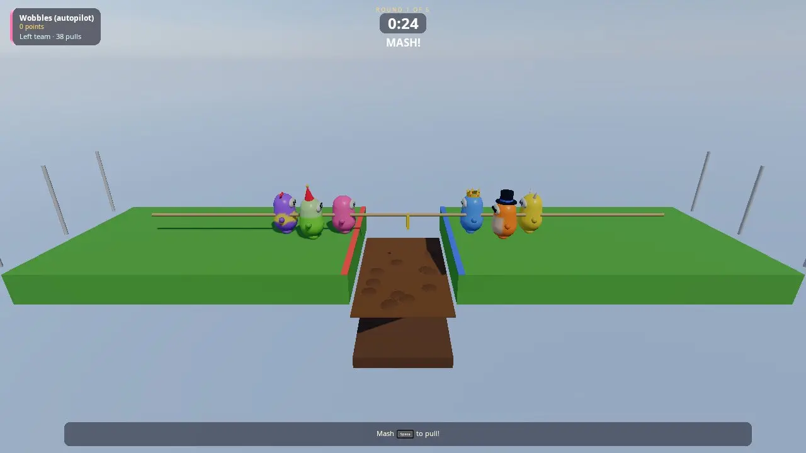

# Party

A friendslop party game: a show of short minigames for friends on one
couch and online, in the spirit of Fall Guys, Mario Party and Squid Game.
Everyone is a wobbly jelly bean you dress up in the start menu (or, with
the Synty City pack, one of eleven everyday people). Each round
is a random (or voted-for) minigame with its own level, mood and rules; places give
points (10, 8, 6, 5, 4, 3, 2, 1), and after the last round the top three
climb the podium. There are eight minigames: an obstacle course, a
flaming jump rope, a glass bridge you really fall through, a button-mash
tug of war, red light green light, falling hex floors, sumo and hot
potato. Up to four people play on one screen in split screen, with CPU
beans filling the show; one machine hosts and others join over the
network, with voice chat anyone can turn off or mute. One game mode
plays a single minigame on its own, to practise or to try it out.

It is the starting point for **any game made of many short rounds** (a
minigame is one file with a small interface; the party does the rest),
for **physics-driven silliness** (characters that get knocked, tumble and
squash; glass that shatters into Jolt shards; floors that fall away), and
for **couch plus online party games** (the same show, host-run, with any
mix of local players, remote players and CPUs). Climb Race is the other
party game to read next to it: this one copies its start menu, split
screen and online pattern.



## Run it

The executable is `party` ([CMakeLists.txt](CMakeLists.txt)). It is built
when `KKE_ENABLE_JOLT` and `KKE_ENABLE_NET` are on (both are by default):
the beans and levels are Jolt bodies, and main.cpp always adds
`kke::NetModule` and `kke::VoiceModule`.

```sh
cmake --workflow --preset default
cd build/bin && ./party
KKE_SKIP_INTRO=1 ./party                      # skip the engine's logo intro
KKE_PARTY_GAME=glass_bridge ./party           # one game, over and over, no menu
```

Run it from `build/bin`: the HUD (`ui/party_hud.rml`), its theme and the
fonts are copied next to the executable by the build. It uses no asset
packs: every bean, hat and level is built in code.

Switches for testing (read with `kke::dev::env`, so a shipping build
ignores them):

| Switch | What it does |
|---|---|
| `KKE_PARTY_GAME=<id>` | One game: play only this minigame (ids below), again and again, skipping the menu |
| `KKE_PARTY_VOTE=1` | Pick each game by vote (the menu's Next game: Vote) |
| `KKE_PARTY_LOBBY=0` | Skip the start menu: player 1 and the CPU beans start at once |
| `KKE_PARTY_CPUS=<n>` | How many CPU beans (0 to 5) |
| `KKE_PARTY_ROUNDS=<n>` | Rounds in the show |
| `KKE_PARTY_SEED=<n>` | The show's seed (the playlist and every level) |
| `KKE_PARTY_AUTOPILOT=1` | Player 1 is a CPU too: the whole show plays itself |
| `KKE_PARTY_START=<s>` | Start from the menu after this many seconds, as if player 1 chose Start (with `KKE_LOBBY_JOIN=<n>` and virtual pads: split screen without hands) |
| `KKE_PARTY_QUIT=<s>` | Quit after this many seconds, logging where it got to |
| `KKE_OBSTACLE_FROM=<n>` | Obstacle Dash: start everyone at checkpoint n (to test one part of the course) |
| `KKE_NET=host`, `KKE_NET=join:ADDRESS` | Host or join without the menu |
| `KKE_VOICE=off` | No microphone (headless runs) |

## Controls

Everything can be rebound and is saved in `party_input.json`; the hint
line at the bottom always shows the buttons of the device you use.

| | Controller | Keyboard and mouse |
|---|---|---|
| Run | Left stick | WASD |
| Turn the camera | Right stick | Mouse |
| Jump (and mash) | A | Space |
| Dive (Sumo: hold to wind up, let go to dive) | X or RB | E or right mouse |
| Push whoever is in front of you | B | F |
| Watch someone else when you're out | A / X | Space / E |
| Pause menu (settings, controls, back to the start menu, quit) | Start or Select | Esc |
| Party and voice panel (voice, mutes) | the pause menu's Demo settings | F3, or the pause menu |
| Back to the start menu | | M |
| Vote for a game (between rounds, with Vote) | Left stick left/right, A | A/D, Space |
| Developer panels | | F1 |

Settings > Camera > Distance behind your bean (3 to 9 m) sets how far
back your camera sits.

In the start menu every controller presses A to join (up to four), then
picks a name, colour, pattern, face, hat and body (Bean, or a person when
the pack is there). Player 1 sets the CPU beans (0 to 5) and:

| Row | Choices | |
|---|---|---|
| Mode | Party, One game | A party of rounds with points and a podium, or one minigame on its own |
| Game | the eight minigames | One game only: which one |
| Rounds | 3, 5, 8 | Party only |
| Next game | Random, Vote | Party only: the shuffled playlist, or everyone votes before each round |
| Voice chat | On, Off | Off: you hear nobody and nobody hears you |
| Online | Off, Join, Host | |

## How it plays

### The show

A party is a playlist: the minigames shuffled with the show's seed, so a
game only repeats once all eight have been played. Each round goes:

1. **The round card** (5 s): the title, one line on what to do, the
   controls. Everyone stands at their start.
2. **The countdown** (3 s), then **GO**.
3. **Play** until the minigame says it's over or its clock runs out.
4. **Round over** (2.5 s), then **the results** (7 s): each bean's place
   and points, and the total so far.

With **Next game: Vote**, before each round everyone stands on the stage
and three minigames come up (ones not played yet this party first).
Point at one with the stick and vote with jump; you can change your mind
until the 12 s are up (or a moment after the last vote). CPU beans vote
too. The most votes wins; a coin settles a tie.

In **One game** mode there is one round and no podium: after the results,
jump plays it again (with a new level from a new seed), and the pause
menu goes back to the start menu.

After the last round come the standings on the **podium**: the top three
on the steps waving, everyone else in front. Jump (A, Space), or 30 s
without one, goes back to the menu (or starts a new party when the menu
is off). On a phone held upright the round card and the tables take the
screen's width (`body.kke-portrait` in the HUD).

A round ranks beans in three groups: those who **finished** (by who was
first over the line), then those **still standing** (by the minigame's
score: how far they got, how many pulls), then those **out** (the last one
out ranks best). Ties share a place and its points.

### The minigames

| Id | Minigame | What you do | Ends |
|---|---|---|---|
| `obstacle` | Obstacle Dash | Race through sweepers, sliding platforms, hammers, a spinning disc, a wall of doors (some are fake and break) and rolling balls on a slope, to the finish arch. Falling puts you back at the last checkpoint. | 60% have finished, or 2:30 |
| `jump_rope` | Flaming Jump Rope | Everyone on a narrow bridge over lava; two giant beans swing a burning rope round it. Jump it. It speeds up and now and then turns round. | One left, or 1:40 (survivors share the win) |
| `glass_bridge` | Glass Bridge | Eight steps of three glass panes each: one tempered, the others shatter, and now and then a row is all fake (jump and dive over it). Shoving is allowed; dive the moment the glass goes for a save. | Everyone has crossed or fallen |
| `tug` | Mash Tug of War | Two teams, one rope over a mud pit. Mash jump to pull. | A team is dragged in, or 0:30 (the rope's side wins) |
| `red_light` | Red Light, Green Light | Run for the line while the giant doll's back is turned. When it turns round, freeze: anyone still moving is out. | Everyone has finished or is out, or 1:15 |
| `tiles` | Hex-a-Gone | Three floors of hexagons; a tile drops a moment after you step on it. Keep moving. | One left, or 2:00 |
| `sumo` | Bean Sumo | Barge and dive into the others to knock them off a round floor whose edge crumbles away ring by ring. | One left, or 1:30 |
| `hot_potato` | Hot Potato | Someone has a bomb; touch someone to pass it on (not straight back). Whoever holds it at the bang is out. Holding it makes you faster. | One left, or 2:30 |

### Beans

A bean is a capsule character (`kBeanRadius` 0.42 m, `kBeanHeight`
1.3 m) with a body, a visor face, stubby arms and feet, a pattern and a
hat. It runs at 5.2 m/s, jumps 6.3 m/s and dives: a belly slide at 8 m/s
for 0.7 s that shoves whoever it hits. A knock sends a bean tumbling for
a moment with no control. Beans bump into each other (softly in races,
hard in Sumo), squash when they land, lean into turns and waddle.

- **Jumping** always lifts off when you're on the ground: a press counts
  for 0.15 s before you land, and for a little while after you run off an
  edge. A jump straight after landing goes less high (85%, then 72%...,
  never under 60%), so bunny hopping doesn't build speed.
- **Stamina** (the bar on your panel): jumping, diving and pushing use it;
  standing on the ground fills it back up. On an empty tank jumps are
  lower and you can't dive or push.
- **Dive** has a cooldown of 1.1 s after the slide.
- **Push** (B / F) shoves the nearest bean in front of you, once every
  0.7 s. It works in every game, online too (a Knock event to the bean's
  own machine).
- **Before GO** nobody can leave the start area: move about and shove
  inside it, but no head start and nobody pushed off the start.
- **Sumo's charged dive**: hold dive to wind up (you slow down and
  squash), let go to dive up to twice as hard. Two beans diving head-on at
  the same power clash: both mash jump for 2 s and the loser flies off at
  twice the power they met with (both beans on one machine; online beans
  just bump).

### Cameras and split screen

Every game uses a third-person camera over your shoulder (right stick to
turn); Settings > Camera sets how far back it sits. Two to four people on
one screen get the screen split (`kke::splitScreen`); with three, the
fourth quarter shows the whole arena. When you are out you watch someone
still playing; jump or dive to switch who.

### Online

Player 1 picks Host or Join in the menu (Join lists games found on the
network, or type an address). Anyone at any screen can play: every
person is a network player, and the host's CPU beans are the host's own
players. The host runs the show (which game, the seed, the phases);
every machine moves its own beans and reports when one finishes or goes
out, and the host puts those in order. Voice chat is proximity chat
(push to talk, [docs/NETWORKING.md](../../docs/NETWORKING.md)): beans
within 30 m are heard from where they stand, a ring over a talking bean's
head (or an arrow at the screen's edge) shows where a voice comes from,
and a list of nearby talkers has a mute for each slot in the pause menu
(`kke::VoiceHudModule`). It is always up to each player: Voice chat Off in the start menu or the
pause menu stops it both ways, and the pause menu mutes anyone (or
everyone) just for you. The host runs the vote too: each player's pick
goes to the host, which sends the vote as it stands to everyone.
A party holds 12 beans online.

## How it works

### Startup and the frame

[main.cpp](main.cpp) adds the modules in order: settings, input (the
controls file), rigid bodies (Jolt), RmlUi, audio, the start menu
(`kke::LobbyModule`), networking, voice, the game (`PartyModule`) and the
stats overlay.

`PartyModule::update` ([PartyModule.cpp](PartyModule.cpp)) each frame:

1. Runs the show's phase (the host moves it on and tells the others).
2. Reads each local player's controls (`readPlayer`, camera-relative
   movement) and asks the minigame for each CPU bean's (`Minigame::bot`).
3. Lets the minigame run its level and rules (`Minigame::update`). It can
   change a bean's input here (tug of war holds everyone still).
4. Moves each bean (`moveBean`), bumps them apart (`bumpBeans`), catches
   falls (`checkFalls`: below `Minigame::killY`, `Minigame::fell` decides).
5. Animates, spawns particles, sends this machine's beans online, moves
   the cameras and fills the HUD.

Drawing is the stage (lobby and podium), the level mesh, the parts, the
minigame's own extras, the beans, the particles, and last the glass (see
through, `DynamicMeshRenderer::drawTranslucent`).

### A minigame ([Minigame.h](Minigame.h))

A minigame is a class with:

- `id`, `title`, `goal`, `controls`, `mood`, `timeLimit`, `camera` (follow
  or one overview) and `killY`;
- `build(Arena&)`: the level. Static boxes (`staticBox`: one mesh for the
  whole level, plus a Jolt body each), decoration (`levelMesh`), and parts:
  pieces with their own mesh that move, fall or go (`addPart` with a Jolt
  body, `addVisual` without);
- `spawn`: where bean *i* of *n* starts;
- `update`: moving parts (`movePart` for kinematic ones, so beans riding
  them move along), rules (`finish`, `eliminate`, `knock`, `respawn`),
  effects (`burst`, `flame`, `sound`, `flash`, `status`);
- `bot`: a CPU bean's stick and buttons, with its `difficulty` (Easy to
  Expert) making it better or worse;
- `over`, `timeUp` (settle the scores), `beanStatus` (the line in your
  panel), `bumpStrength`, `touched`;
- `onEvent`: something every machine must see (a pane broke). Call
  `Arena::event(kind, a, b)` and `onEvent` runs here now and on every
  other machine when it arrives.

`Arena` is what the party gives a minigame (the world, the beans, the
clock, two random generators: `rng()` is seeded per round and the same on
every machine, `botRng()` is for CPU brains and effects).

### The minigames ([minigames/](minigames/))

- **Obstacle Dash**: kinematic sweepers turned by `movePart` (their
  velocity comes from the move, so they shove beans), platforms sliding
  on sine waves, hammer pendulums, a convex-hull disc, doors (a fake one
  breaks on an event), balls rolling down a slope on a kinematic path.
  Checkpoints: `fell` respawns instead of eliminating.
- **Flaming Jump Rope**: the rope's angle is the integral of its speed
  (which rises and flips sign at seeded times), a formula of the clock,
  so it is at the same place on every machine. Each machine checks its
  own beans against the rope's line. Bots estimate when it reaches their
  feet and jump with a reaction error.
- **Glass Bridge**: which pane of each row holds, and which rows are all
  fake (never two in a row, never the first or last), comes from the
  round's seed. Either side of an all-fake row the rows are 4.4 m apart,
  6.8 m to clear: more than a running jump, so it takes a dive at the top.
  A dive within 0.3 s of the glass breaking under you lifts you 5.5 m/s
  (`Minigame::airDiveLift`). Stepping on a fake pane sends an event with the spot you stepped
  on; every machine then removes the pane and cuts it into Voronoi cells
  round that spot ([Shatter.h](Shatter.h): half-plane clipping, seeded,
  so the same shards everywhere), each a thin convex-hull Jolt body that
  falls with you to the floor far below. Bots remember panes seen to
  hold, wait for someone braver, then guess, and never share a pane.
- **Mash Tug of War**: teams by roster order. Each machine counts its
  beans' presses as their score, which goes online with their pose, so
  every machine computes the same rope. A short team pulls as if it were
  full: its presses count times (biggest team / its size), so 1 against 2
  pulls with the power of 2, and each of 2 against 3 with 1.5 each. The
  HUD shows both teams' pull per second and a gold arrow over the pit
  points where the rope is going, longer the bigger the difference. The host calls the win (an event);
  the losers are dragged in and tumble into the mud.
- **Red Light, Green Light**: a seeded schedule of greens and reds (greens
  get shorter). The doll takes 0.45 s to turn round (the warning), then
  there's 0.3 s of grace; after that anyone moving faster than 0.6 m/s is
  out. Bots have a reaction time per switch; slower bots sometimes get
  caught.
- **Hex-a-Gone**: 3 floors of 91 hexagon tiles, each a kinematic hull.
  A tile stepped on (an event) shakes harder for 0.55 s, then sinks
  0.3 m over 0.45 s shedding rubble and is removed, its last pieces
  falling as particles (`Arena::rubble`). It stays kinematic to the end,
  so a going tile never throws anyone into the air. Bots
  hop to solid tiles a few steps away, nearer the middle.
- **Bean Sumo**: a hex floor whose outer rings shake then crumble at set
  times (like Hex-a-Gone's tiles); `chargedDive` turns on the wind-up dive
  and the clash (`PartyModule::startClash`); `bumpStrength` 6.5 makes every bump a shove. Bots pick a target
  (nearer and nearer the edge is juicier), come at it from the middle's
  side and dive.
- **Hot Potato**: the host lights each bomb (a new holder and when it
  goes off, from a fuse that shortens each time); the holder's own
  machine sees them touch someone and passes it (an event). Everyone but
  the holder runs at 90%.

### The start menu ([Lobby.cpp](Lobby.cpp))

`kke::LobbyModule` ([docs/LOBBY.md](../../docs/LOBBY.md)) with look fields
(name, colour, pattern, face, hat, body), a CPU count and the options
above; `updateModeRows()` shows Game or Rounds and Next game for the Mode
picked. `wantedRoster()` turns the menu into beans: the people, then CPU
beans with the names, colours and outfits nobody took. While the menu is
up, the beans stand on the stage above their cards and hop.

### The HUD ([Hud.cpp](Hud.cpp), [ui/party_hud.rml](ui/party_hud.rml))

An RmlUi data model `party`: a panel per local player (name, points, the
minigame's status line), the clock and the round, the round card, the
results and podium table, the vote's three cards (with a dot of each
voter's colour) and the prompt line with button glyphs
(`kke::ButtonPrompts`). Who is talking, and from where, is
`kke::VoiceHudModule`'s.

### Networking ([Net.cpp](Net.cpp), [NetParty.h](NetParty.h))

Event kinds from `0x5000`: **Round** (host to all: the minigame, the seed,
every seat's player, name, look and points; 12 seats fit one 512-byte
event), **Phase** (host to all), **Result** (a machine's claim that its
bean finished or went out; the host orders them and passes them on) and
**Game** (a minigame's own event, relayed by the host), **Vote** (host to
all: the choices, every ballot, the time left, the winner), **Ballot**
(a player's pick, to the host) and **Knock** (a push on another machine's
bean: its velocity and stun; the host relays it to the bean's machine). Before a vote the host sends a Round with
no game: who plays and the points. Each bean's pose
is its `NetPlayerState`, with its look and minigame score in `extra`.
Remote beans are drawn smoothed toward where their machine says they are,
and kept as characters so local beans bump into them. Every message
carries the round number; old ones are dropped.

## Design decisions

- **C++, not Lua**: split screen, the start menu, networking and dozens
  of moving Jolt parts per level. A minigame is still small: one file,
  one class, 200 to 400 lines.
- **Beans made in code**: no asset packs needed anywhere, looks sent
  online as four small numbers, and bodies that squash and stretch.
- **Rules as formulas of the clock and the seed** wherever possible (the
  rope, the doll, the crumbling ring), so machines agree without
  messages; events only for what players cause (a pane, a tile, the bomb).
- **Each machine is the authority on its own beans** (where they are,
  when they finish or fall): nobody is ever "out" because of lag on
  someone else's machine. The host orders the claims.
- **The show is plain data** ([Show.h](Show.h)): places, points, the
  playlist and standings are unit tested (`tests/test_party.cpp`).

## Tuning

| Where | What |
|---|---|
| `Beans.cpp`, `moveBean` | Run and dive speeds, jump, coyote time, knocks |
| `Beans.cpp`, `bumpBeans` | How beans push apart and shove |
| `Show.cpp`, `pointsFor` | Points per place |
| `PartyModule.cpp` | Phase lengths (the card, countdown, results) |
| Each minigame | Its constants at the top of its file |

## Engine features it uses

Jolt characters, kinematic and dynamic bodies, convex hulls and
`setMotion` (`kke/RigidWorld.h`); split screen (`kke/Viewports.h`); the
start menu (`kke::LobbyModule`); networking and voice (`kke::NetModule`,
`kke::VoiceModule`); RmlUi with button glyphs; the camera rig; moods;
impact sounds and earcons (`kke/ImpactSynth.h`); translucent glass
(`DynamicMeshRenderer::drawTranslucent`).

### People ([People.h](People.h), [People.cpp](People.cpp))

The Body row's other choice: a POLYGON City Characters person
(`kke::ModelModule`), animated with the Universal Animation Library's
clips retargeted onto their skeleton (`kke::matchBones`,
`kke::retargetAnimations`): idle, walk, jog and sprint blended by speed,
jump, fall, land, a roll for the dive, a hit for a tumble and a dance on
the podium. Each is loaded the first time someone picks it. The physics
is the same capsule, so nobody is bigger or faster for their look. A
machine without the pack draws a person picked elsewhere as a bean.

### The pause menu ([Pause.cpp](Pause.cpp))

The pause menu is the shared one (`kke::GameShellModule`, Esc, Start or
Select); its Main menu goes back to the start menu. Its Demo settings row
opens `kke::DemoPanelModule` ("Party and voice", F3 too): Back to the
start menu, Voice chat on or off, a player to mute or unmute
(the other screens' players; CPU beans have no microphone), Mute
everyone and who is talking. Below it, `kke::VoiceHudModule` adds
"Voices nearby": a mute for each numbered slot of the nearby talkers list,
hold-to-talk or voice activated, and the voice markers on or off. It
hides while the start menu is up.

## Assets

None needed. Beans, hats and levels are built from boxes, spheres,
cylinders and lathes in [Bean.cpp](Bean.cpp) and the minigames; the skies
and ambient sounds are the moods' ([docs/MOODS.md](../../docs/MOODS.md)).
With the Synty packs (`assets/synty` or `KKE_ASSETS_DIR`) and the
animation library (`assets/animations/UAL1_Standard.fbx`) the people are
there too ([docs/SCENES.md](../../docs/SCENES.md) lists them).

## Make a game like this

1. **Add a minigame** before anything else: copy the closest one in
   [minigames/](minigames/), change the `id`, add its make function to
   [Minigames.cpp](Minigames.cpp) and a row to the table above. Try it
   with `KKE_PARTY_GAME=<id> KKE_PARTY_AUTOPILOT=1`.
2. **Write the bot early.** A minigame nobody can test alone doesn't get
   tuned; CPU beans also fill a party of two.
3. **Decide what every machine must agree on.** If it can come from the
   clock and `Arena::rng()`, compute it; if a player causes it, make it
   an event; never let two machines decide the same thing.
4. **A new kind of game** (a board, teams across rounds): the show is
   `Show` plus the phases in PartyModule; add a phase rather than a
   second module.

Pitfalls the code shows:

- `Arena::rng()` only in `build` and `start`: using it in `update` would
  make machines drift apart. Anything random per frame uses `botRng()`.
- Don't destroy a part's mesh yourself: `removePart` hands it to
  `renderer().retire()` so frames in flight can still draw it.
- A game event's numbers fit ±2^24; pack small ones together (Glass
  Bridge packs where you stepped into one).

## Files

| File | What is in it |
|---|---|
| [main.cpp](main.cpp) | The modules, the net and voice settings |
| [PartyModule.h](PartyModule.h), [PartyModule.cpp](PartyModule.cpp) | The show's phases, loading a round, the Arena for minigames, the frame, drawing |
| [Minigame.h](Minigame.h) | `Bean`, `Part`, `Arena` and `Minigame`: everything a minigame sees |
| [Minigames.cpp](Minigames.cpp) | The list of minigames |
| [minigames/](minigames/) | One file per minigame, and Common.h (steering, hex grids, glass) |
| [Beans.cpp](Beans.cpp) | Controls, moving, bumping, animating and drawing beans; cameras; particles |
| [Bean.h](Bean.h), [Bean.cpp](Bean.cpp) | The bean's looks and mesh, `MeshBuilder` |
| [Lobby.cpp](Lobby.cpp) | The start menu, the roster, CPU beans |
| [Vote.cpp](Vote.cpp) | Picking the next game by vote, online too |
| [Pause.cpp](Pause.cpp) | The pause menu: voice chat and mutes |
| [People.h](People.h), [People.cpp](People.cpp) | Synty people as bodies, with retargeted animation |
| [Hud.cpp](Hud.cpp), [ui/party_hud.rml](ui/party_hud.rml) | The HUD |
| [Net.cpp](Net.cpp), [NetParty.h](NetParty.h), [NetParty.cpp](NetParty.cpp) | Online: menu rows, the show over the network, the wire format |
| [Show.h](Show.h), [Show.cpp](Show.cpp) | Places, points, the playlist, standings, the seeded random numbers |
| [Shatter.h](Shatter.h), [Shatter.cpp](Shatter.cpp) | Cutting a pane into Voronoi shards |
| [CMakeLists.txt](CMakeLists.txt) | The executable and the files copied next to it |
| [game.json](game.json) | The marketplace listing |
