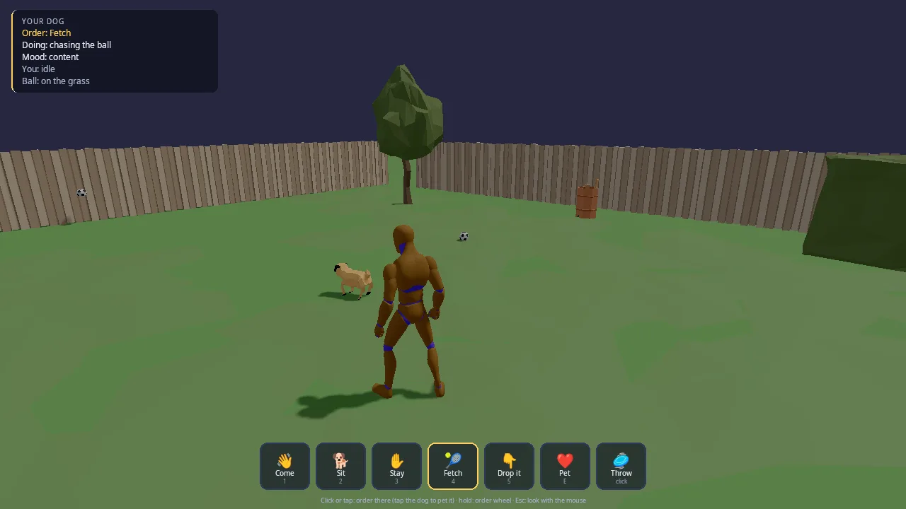

# Pet Companion

You and a pug in a fenced garden. Tell it to come, sit, stay, fetch, drop
it or go somewhere, pet it, or throw its ball, with a mouse and keyboard, a
controller or a finger. Leave it alone and it lives its own life: it sniffs
about, rests and watches you. Walk off and it trots along; look at a ball
and it goes to have a look; walk up to it and it waits for a pat; throw a
ball and it fetches without being told.

This demo is the starting point for any game with a companion: a pet, a
sidekick, a horse that comes when called, a follower in an RPG. It shows
the three parts a good companion needs and how they fit together:

- **Orders**: the engine's command layer (`kke/Orders.h`,
  [docs/COMMANDS.md](../../docs/COMMANDS.md)), with the same `order.*` Lua
  and nodes every game has.
- **A brain**: the AI core's built-in `dog` species (`kke/ai/AiWorld.h`,
  [docs/AI.md](../../docs/AI.md)), made pug-sized. Orders reach it through
  `kke::AiOrderBridge`.
- **A body**: a Jolt character that moves where the brain wants, with
  procedural legs (`kke::ProceduralGait`), a look-at head and a procedural
  sit ([docs/PROCEDURAL_ANIMATION.md](../../docs/PROCEDURAL_ANIMATION.md)).

The input, HUD, people and scenery come from the shared
[command kit](../command_kit/README.md), which the [platoon](../platoon/README.md)
demo uses too.



## Run it

```sh
cmake --build build --target pet_companion
cd build/bin && ./pet_companion
```

The executable is `pet_companion` ([CMakeLists.txt](CMakeLists.txt)). The
root `CMakeLists.txt` only builds it when `KKE_ENABLE_JOLT` and
`ENGINE_ENABLE_LUA` are both on (both default to ON).

| Variable | Effect |
|---|---|
| `KKE_SKIP_INTRO=1` | skip the logo intro |
| `KKE_ASSETS_DIR=/path/to/packs` | where the packs are (default `assets/synty/`; `KKE_SYNTY_DIR` also works) |
| `KKE_ANIMATIONS_DIR=/path` | where `UAL1_Standard.fbx` is (default `assets/animations/`) |
| `KKE_PET_DEMO=1` | plays through every order by itself, logs what the dog did, then quits (after 90 s at most unless `KKE_PET_QUIT` says otherwise) |
| `KKE_PET_QUIT=30` | quits after 30 seconds |

## Controls

| Action | Mouse and keyboard | Controller | Touch |
|---|---|---|---|
| Move | WASD (Left Shift runs, Left Alt walks) | left stick (click it to toggle running) | no touch binding yet |
| Jump | Space | A | no touch binding yet |
| Look | the mouse, once Esc has captured it | right stick | no touch binding yet |
| Capture / free the mouse | Esc | none needed | a finger frees it |
| Order at the pointer (the context order) | left click while the mouse is free; right click any time | RB (at the reticle) | tap |
| Pet | click or right click the dog, or E | Y | tap the dog, or the Pet button |
| Order wheel | hold Tab or the middle button, or hold the left button half a second; the mouse picks | hold LB, the right stick picks, B cancels | hold a finger, drag to pick |
| Force modifier (ground: stay there) | hold Left Ctrl | hold LT | none |
| Come / Sit / Stay / Fetch | 1 / 2 / 3 / 4 | D-pad up / down / left / right | the buttons |
| Drop it | 5 | X | the Drop it button |
| Pick up / throw the ball | left click while the mouse is captured | RT | the Throw button |
| Navigation ping (hear the walls) | Q | View / Back | none |
| Developer panels | F1 | none (developer tools) | none |
| Every button on the HUD bar | click it | its button: the prompt under it (Pet is Y, Throw is RT) | tap it |

What the context order does depends on what the pointer is on
(`kke::contextOrder`): a ball is Fetch, the player is Follow, the ground is
Go there (Stay there with the force modifier). The dog itself is a pat
(`giveContext` checks for the dog first).

All game actions are rebindable and saved to `pet_companion_input.json`.
The HUD shows each prompt as the button on the device you used last
(`{pet.come}` in the prompt text becomes the right glyph).

## How it plays

There is no score and no end. The HUD panel (top left) shows five lines:

- **Order**: the dog's current order, or none.
- **Doing**: what it is doing in words ("chasing the ball", "trotting
  along", "sniffing about"), from `PetModule::doing()`.
- **Mood**: content, happy, excited or over the moon.
- **You**: what the dog thinks you are doing (idle, walking, running,
  looking at a ball, approaching the dog).
- **Ball**: on the grass, in your hand, or in the dog's mouth.

Orders and what they do:

| Order | The dog |
|---|---|
| Come (Follow) | stays beside and a little behind you, never in your way |
| Sit | stops and sits until the next order |
| Stay | holds its spot |
| Fetch | runs to the nearest ball nobody is holding, brings it to you, puts it down in front of you |
| Drop it | lets go of the ball it carries |
| Go there (Move) | runs to the point, then stays there |
| Pet | comes to you; you kneel, it sits, the pat lasts 2.4 s |
| At ease (Free) | back to its own life |

A good fetch or a pat makes it jump for joy for 1.2 s and raises its
happiness. When a ball it brought lands at your feet (within 1.3 m, more
than 2 s after you threw it, and you hold no ball), you pick it up
automatically. A ball that leaves the garden (30 m out, or falls below
-5 m) comes back to the middle.

## How it works

### Startup and the frame

[main.cpp](main.cpp) adds, in order: `SettingsModule("settings.json")`,
`InputModule("pet_companion_input.json")`, `RigidBodyModule` (Jolt),
`ModelModule`, `UiModule` (RmlUi), `AudioModule` (panel hidden),
`ScriptModule`, `pet_companion::PetModule` and `StatsModule` (panel
hidden). The mood is `clear_day`.

`ScriptModule` loads `scripts/` from the source folder when it exists
(`GAME_SCRIPTS_SOURCE`, so saving [scripts/pet.lua](scripts/pet.lua)
reloads it while the game runs), else the copy next to the executable.

`PetModule::init`:

1. Defines the actions: the character set (`defineCharacterActions`), the
   command kit's (`CommandInput::defineActions`), and the quick orders
   (`pet.come` .. `pet.drop`, `pet.mouse`, `panels`). Turns off quit on Esc.
2. Builds the garden (`buildGarden`).
3. Adds the player (a Jolt character with `kke::Locomotion` and a UAL
   mannequin `command_kit::Humanoid`) and the dog (a smaller Jolt
   character: radius 0.2 m, height 0.55 m, 12 kg).
4. Loads the pug (`loadDog`) and adds two balls.
5. Hooks the order board's listener and sets up the AI (`setUpAi`).
6. Creates the Lua `kke::OrderScript` and the RmlUi `CommandHud`.

Each frame `PetModule::update` (with `dt` clamped to 0.05 s):

1. Handles F1 and Esc.
2. `m_cmd.update(...)` turns raw input into a `Frame`: a pointer, a click,
   a context order, a wheel pick. Clicks, context orders and wheel picks
   become orders. Quick-order keys work while the wheel is closed.
3. `runDemo` in self-play.
4. `updatePlayer`: moves you, the camera, and feeds the intent reader.
5. `updateDog`: the AI decides and the Jolt body follows.
6. `updateBalls`: ball positions, carrying, the auto pick-up.
7. `animateDog`: gait, sit, head, jump clip.
8. `m_script->fireEvents()`: queued order events reach Lua.
9. `updateHud`.

### Orders: board, bridge, brain

The dog's orders live on a `kke::OrderBoard` (`m_board`). `give()` builds a
`kke::Order` for unit `kDog` (2), issued by `kPlayer` (1), and fills in the
blanks: Follow and Pet target the player; Fetch with no target picks the
nearest ball nobody holds (or shows "You have the ball: throw it first").

```cpp
m_bridge = std::make_unique<kke::AiOrderBridge>(m_board, m_ai);
m_bridge->followDistance = 1.6f;
m_bridge->pickUp = [this](uint32_t, uint32_t thing) {
    Ball* b = ball(thing);
    if (!b || b->held != Ball::Held::No) return false; // you picked it up first
    grab(*b);
    return true;
};
```

The bridge turns every new board order into an `ai::Order` for the agent
(the mapping table is in [docs/COMMANDS.md](../../docs/COMMANDS.md)) and
the AI's `Arrived` events back into "done". The game fills in only the
steps it alone can do: `pickUp` (take the ball out of the physics world),
`deliver` (put it down, praise, joy), `drop`, and `petStart` (start the
2.4 s pat). Each frame `updateDog` calls `m_ai.update(dt)` and then
`m_bridge->handle(m_ai.takeEvents())`.

The board listener adds one rule: when a Move finishes well, it issues a
Stay at the same point, so the dog waits where you sent it.

### The brain: the AI core's dog

`setUpAi` copies the built-in `dog` species and makes it a pug: label
"Pug", walk 1.2 m/s, run 4.5 m/s, radius 0.25 m, home radius 7 m. It adds a
`ball` species with no needs and no scent: something to see and fetch with
no life of its own. The player is an actor of species `farmer`; the balls
are actors too. The doghouse, trees, hedge and barrel are `addObstacle`
circles (there is no navmesh; the fence is only a physics wall).

A carried ball is disabled in the AI (`m_ai.setEnabled(b.id, false)` in
`grab`): "a ball in a mouth or a hand isn't a thing on the lawn", so the dog
neither sees it nor steps away from it.

### Reading you: soft orders

When the dog has no order (or At ease), it plays along with what you do.
`updatePlayer` feeds a `kke::IntentReader` your position, velocity and view
direction, with the free balls and the dog as candidates. `updateDog` turns
the result into a **soft** AI order: it goes straight to `m_ai.order`, never
onto the board, so the HUD still says "Order: none".

```cpp
if (in.kind == kke::Intent::Kind::Approaching && in.thing == kDog) {
    soft.kind = kke::ai::Order::Kind::Hold; // you're coming over: it waits for a pat
    soft.position = dog;
} else if (in.kind == kke::Intent::Kind::LookingAt && in.thing != kDog && exists(in.thing)) {
    soft.kind = kke::ai::Order::Kind::Follow; // what are you looking at?
    soft.target = in.thing;
    soft.distance = 1.0f;
} else if (in.kind == kke::Intent::Kind::Walking || in.kind == kke::Intent::Kind::Running) {
    soft.kind = kke::ai::Order::Kind::Follow; // off somewhere: it trots along
```

The soft order is only re-sent when the intent changes (`m_reflex`), and an
idle intent clears it so the dog goes back to its own wants.

One more reflex: with no order, At ease or Come, a ball you threw less than
a second ago gets a real Fetch order ("the dog goes after the ball on its
own").

### The body: Jolt character driven by the AI

The AI plans; Jolt moves. Before `m_ai.update`, `updateDog` writes the real
positions and velocities of you, the dog and the free balls into the AI
with `setTransform`. After it, the dog's `Agent::desiredVelocity` becomes
the Jolt character's move input. The dog stands still while it sits, is
petted, rests or jumps for joy.

Facing: it faces where it runs; standing, it faces what it attends to
(`lookAt`, its `focus`, the thing you look at, or the ball it is sent for),
else you. The yaw eases there with `1 - exp(-8 dt)`, and the turn rate is
kept for the gait.

### Legs, sit and head

`loadDog` finds the pug in Quaternius' Farm Animals, scales it to 0.55 m
tall, and sets up:

- an `Animator` with its `Idle` and `Jump` clips (Jump for joy);
- `kke::quadrupedLegChains` and `kke::legsFromSkeleton` into a
  `kke::ProceduralGait` with a 0.3 step height. The comment notes the pug
  already faces +Z like the gait's body, so only its scale lies between;
- `kke::LookAt::quadruped` for the neck and head.

`animateDog` layers them on the Idle pose each frame:

1. The gait plans steps on the flat lawn (a ground query that always
   answers y = 0) and `kke::applyGait` puts the feet there, weighted by
   `1 - sit` and switched off during the joy jump.
2. The sit (`m_sit` eases 0 to 1): the whole body drops 6 cm and pitches
   24 degrees nose up, the back legs fold (upper leg -55 degrees, knee 95),
   the front legs straighten (24 degrees).
3. `LookAt` turns the head to `m_lookTarget` in model space.
4. `kke::poseToLocals` writes the pose into the model's bone locals.

### The player and the camera

`updatePlayer` reads `move`, `sprint`, `walk` and `jump`, makes the move
relative to the `CameraRig` (third person, arm 4.2 m, pitch -16 degrees),
and runs `kke::Locomotion`. While petting, input is ignored, you face the
dog and play the `Fixing_Kneeling` clip. The camera ray-casts against the
Jolt world so it pulls in in front of walls. Throwing plays
`Spell_Simple_Shoot`, picking up plays `PickUp_Table`.

### Balls

A ball is a Jolt sphere (radius 0.11 m, 0.06 kg, restitution 0.6) while it
is on the grass. `grab` removes the body; `release` adds a new one with a
velocity. A throw starts 1.5 m up, 0.5 m in front, at 10 m/s forward plus
4 m/s up, the way the camera faces. While carried, a ball is placed in your
hand or the dog's mouth each frame. The soccer ball model is 0.3 m across,
so it is drawn at `0.11 / 0.15` scale.

### Picking

`pick()` turns the pointer into a ray (`kke::screenToRay`) and tests
generous boxes with `kke::rayAabb`: 0.7 m cubes around free balls ("a ball
is small, and a finger is big"), a box around the dog and one around you.
If none is hit, it ray-casts the Jolt world, then the ground plane. The
result is a `kke::PointerTarget` with a relation (Item, Own, Self) that
`kke::contextOrder` reads.

### The HUD

`command_kit::CommandHud` is an RmlUi document (`ui/command_hud.rml`). The
game sets five status lines, seven buttons (Come, Sit, Stay, Fetch, Drop
it, Pet, Throw; the current order's button is highlighted), the eight wheel
items and a hint line that changes with the device: touch, controller or
captured mouse, or free mouse. See the [command kit README](../command_kit/README.md).

### Lua

`PetModule` is a `kke::IOrderHost`: `player()` is 1 and `selected()` is
always the dog, so `order.sit(...)` and friends in Lua go to the dog.
[scripts/pet.lua](scripts/pet.lua) counts fetches, prints every order, and
sits the dog after every third good fetch:

```lua
hook.Add("OrderDone", "praise", function(e)
    if e.order == "fetch" and e.ok then
        fetches = fetches + 1
        if fetches % 3 == 0 then order.sit(e.unit) end
    end
end)
```

Events queue during the frame and fire once in `m_script->fireEvents()`.

### Self-play

`KKE_PET_DEMO=1` runs `runDemo`, ten steps that log what happened: pick up
a ball, throw it, wait for the fetch (20 s time-out), sit (logs how far it
sat), stay while you walk off (logs how far the dog moved), come while you
run (counts frames it was in your way with `kke::inLeadersWay`), pet (logs
happiness), go to (4, 0, -4) (logs how close it got and checks it switched
to Stay), then quit. The camera turns toward the dog because nobody is at
the controls. (CI's headless smoke run starts the game for 8 seconds
with virtual controllers, without self-play.)

## Design decisions

- **Orders and brains are separate.** The board says what the dog was told;
  the AI core decides how. [docs/COMMANDS.md](../../docs/COMMANDS.md) states
  the split: the command layer "never moves anyone". The same board, Lua and
  nodes then work for a pet and a platoon.
- **The dog is the built-in `dog` species, tweaked**, not new AI code. With
  no order it already sniffs about, rests and watches.
- **Reading the player makes soft AI orders, not board orders.** The header
  says "never a command: the board stays empty". A real order the player
  gave always wins, and the HUD never shows an order the player did not give.
- **Following uses the AI core's follow slot.** Commit 2ed140d removed a
  game-side sidestep once `AiWorld` Follow learned to keep out of the
  leader's way (`kke::followSlot`).
- **A carried ball is disabled in the AI** instead of removed and re-added.
  The same commit replaced that workaround with `setEnabled`.
- **The AI plans, Jolt moves.** The dog is a physics character reading
  `desiredVelocity`, so it collides with the fence and props like you do.
  docs/AI.md describes this pattern for games that move their own bodies.
- **Procedural legs instead of walk clips.** The pug only has Idle and Jump
  clips; `ProceduralGait` gives it a real walk, trot and gallop on its own
  skeleton.
- **Left click means two things.** The comment in `update` says it: "Left
  mouse throws while the mouse turns the camera; RT always". With a free
  mouse, left click is the context order, like a strategy game.
- **Everything has a fallback.** Missing packs give a block garden, a block
  dog and block balls, so the demo and its CI run work without paid art.
- **GPU and UI resources are released in `shutdown()`**, before the modules
  that own them go ("Everything holding GPU or UI resources goes before the
  modules that own them").

## Tuning

| What | Where | Value | Effect of raising it |
|---|---|---|---|
| Pug speeds | `setUpAi`, `dog.walkSpeed` / `runSpeed` | 1.2 / 4.5 m/s | a quicker dog |
| Home radius | `setUpAi`, `dog.homeRadius` | 7 m | roams further on its own |
| Follow distance (order) | `m_bridge->followDistance` | 1.6 m | walks further from you |
| Follow distance (soft) | `updateDog`, `soft.distance` | 1.8 m walking, 1.0 m to a looked-at thing | |
| Pat length | `petStart`, `m_petTime = m_kneel = 2.4f` | 2.4 s | longer pats |
| Joy jump | `m_joyTime = 1.2f` | 1.2 s | longer celebration |
| Throw | `throwBall`, `fwd * 10 + up * 4` | 10 and 4 m/s | throws further |
| Pick-up reach | `throwBall`, `best = 1.8f` | 1.8 m | pick up from further |
| Auto pick-up | `updateBalls` | 1.3 m, after 2 s | |
| Ball bounce | `restitution` | 0.6 | bouncier |
| Step height | `loadDog`, `gs.stepHeight` | 0.3 (a share of leg length; the default is 0.25) | higher steps |
| Dog height | `kDogHeight` | 0.55 m | a bigger dog (also the Jolt capsule) |
| Mood drift | `updateDog`, `approach(...)` | happy to 0.55 at rate 0.02 | |
| Camera | `m_rig.settings.armLength`, `m_rig.pitch` | 4.2 m, -16 deg | |
| Intent thresholds | `kke::IntentSettings` defaults | walk 0.5 m/s, run 4 m/s, look 0.6 s | pass your own to `IntentReader` |

## Engine features it uses

| Feature | Header / module | Doc |
|---|---|---|
| Orders, selection, context orders, intent reading, follow slot | `kke/Orders.h` | [COMMANDS.md](../../docs/COMMANDS.md) |
| Orders to AI | `kke/OrderBridge.h` | [COMMANDS.md](../../docs/COMMANDS.md) |
| `order.*` in Lua | `kke/OrderScript.h`, `kke/modules/ScriptModule.h` | [COMMANDS.md](../../docs/COMMANDS.md), [SCRIPTING.md](../../docs/SCRIPTING.md) |
| AI core (species, soft orders, obstacles) | `kke/ai/AiWorld.h` | [AI.md](../../docs/AI.md) |
| Procedural gait, look-at | `kke/ProceduralAnim.h` | [PROCEDURAL_ANIMATION.md](../../docs/PROCEDURAL_ANIMATION.md) |
| Clips | `kke/Animator.h`, `kke/AnimRig.h` | |
| Physics characters and balls (Jolt) | `kke/RigidWorld.h`, `kke/modules/RigidBodyModule.h` | |
| Player movement | `kke/Locomotion.h` | [MOVEMENT.md](../../docs/MOVEMENT.md) |
| Picking rays | `kke/Picking.h` | |
| Rebindable input, button prompts | `kke/modules/InputModule.h`, `kke/ButtonPrompts.h` | [INPUT.md](../../docs/INPUT.md) |
| RmlUi HUD | `kke/modules/UiModule.h` via the command kit | |
| Moods | `Application::setMood` | [MOODS.md](../../docs/MOODS.md) |

## Assets

Not in the repository unless marked. Put packs in `assets/synty/` or set
`KKE_ASSETS_DIR`; `tools/fetch_assets.sh POLYGON_Town` downloads the Synty
pack from the owner's share.

| Pack | Files | If missing |
|---|---|---|
| **POLYGON Town** (Synty) | `SM_Env_Fence_Wood_Straight_01`, `SM_Prop_Doghouse_01`, `SM_Env_Tree_01`, `SM_Env_Tree_02`, `SM_Env_Hedge_01`, `SM_Prop_Barrel_01`, `SM_Env_Grass_01`, `SM_Item_Ball_Soccer_01` | the fence, doghouse and first tree become coloured blocks; the second tree, hedge, barrel and grass are left out; balls are yellow cubes |
| **Farm Animals Animated by Quaternius** (CC0) | `Pug` (looked up in a pack folder named `Farm Animals Animated  by Quaternius`, then any pack) | the dog is a brown block with a nose, with no gait or head turn |
| **Universal Animation Library** mannequin by Quaternius (CC0, in the repository) | `assets/animations/UAL1_Standard.fbx` | you are drawn as a block (the command kit logs a warning) |

Fonts (Noto) and the RmlUi theme are copied next to the executable by
`command_kit_game()`. The log lists every pack asset used
(`Scenery::logUsed`).

## Make a game like this

1. Copy `games/pet_companion` to `games/<your_game>`. Rename the
   executable, the namespace and `PetModule`, and give `game.json` a new id.
   Keep `target_link_libraries(... kke_command_kit)` and
   `command_kit_game(<target>)` in `CMakeLists.txt`, and add the folder to
   the root `CMakeLists.txt` inside the `KKE_ENABLE_JOLT AND
   ENGINE_ENABLE_LUA` block (the command kit is only built there).
2. Pick your companion's species. Copy a built-in one like `setUpAi` does,
   or define one in YAML ([docs/AI.md](../../docs/AI.md), "Species").
   Give it a friend: the player's actor species decides how it feels
   about you.
3. Decide which orders it takes. Change the quick-order actions, the wheel
   (`kWheel`, `kWheelIcons`, `kWheelLabels`) and the HUD buttons together.
   `UnitAbilities` in `giveContext` says what a click can mean (a pet fetches
   but does not attack).
4. Fill in the bridge hooks for your game's physical steps (`pickUp`,
   `deliver`, `drop`, `petStart`). Read the bridge table in
   [docs/COMMANDS.md](../../docs/COMMANDS.md) first.
5. Decide what the companion reads from the player: the `if` chain in
   `updateDog` that turns an `Intent` into a soft order is the place.
6. Give it a body. A rigged quadruped with Quaternius-style bone names gets
   legs from `quadrupedLegChains`; other rigs need `kke::QuadrupedBones`
   ([docs/PROCEDURAL_ANIMATION.md](../../docs/PROCEDURAL_ANIMATION.md)).
7. Put rules in Lua (`scripts/*.lua`, `hook.Add("OrderDone", ...)`) so they
   reload while you play.
8. Add a `KKE_<GAME>_DEMO` self-play like `runDemo` so CI can check it.

Pitfalls the code shows:

- Call `m_board.markRunning` for new orders and feed the bridge the same
  events you read yourself: `takeEvents()` empties the list.
- Write real positions and velocities into the AI with `setTransform`
  before `m_ai.update`, or the brain plans from last frame's spot.
- Disable carried things in the AI, or the carrier avoids them.
- Two yaw conventions meet here: the AI's (0 = +Z) and the camera rig's
  (0 = -Z). `aiYaw` and `kke::yawOf` convert.

## Files

| File | What is in it |
|---|---|
| [main.cpp](main.cpp) | the app, the mood, the module list, where scripts load from |
| [PetModule.h](PetModule.h) | the module (also a `kke::IOrderHost`), the ball struct, all state |
| [PetModule.cpp](PetModule.cpp) | input, garden, dog and balls, orders, AI setup, intent reflexes, body and animation, HUD, self-play |
| [scripts/pet.lua](scripts/pet.lua) | the Lua rules: praise every fetch, sit after every third |
| [CMakeLists.txt](CMakeLists.txt) | the `pet_companion` executable, script and `game.json` copies, `command_kit_game` |
| [game.json](game.json) | the marketplace entry |
| [../command_kit/](../command_kit/README.md) | shared input, RmlUi HUD, mannequin people, pack scenery |
