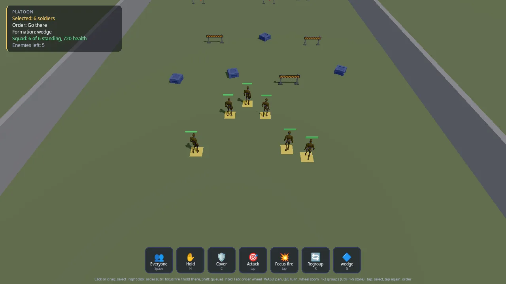

# Platoon

A squad of six on a training ground, five enemies dug in behind barriers
across it. Select soldiers and order them, all together or one at a time,
with a mouse and keyboard, a controller or a finger: go there in a line,
wedge, column or circle, hold position, take cover, attack a target, focus
fire, follow a soldier, regroup, and queue orders with Shift. Without
orders your soldiers fight whatever they see; the enemy holds its line.

This demo is the starting point for real-time strategy and squad games:
anything where the player selects units and tells them what to do instead
of steering them. It shows how the pieces split:

- **Orders**: the engine's command layer (`kke/Orders.h`,
  [docs/COMMANDS.md](../../docs/COMMANDS.md)): selection, formations with
  slots matched to soldiers so paths do not cross, queues, and the same
  `order.*` Lua and nodes every game has.
- **Brains**: every soldier on both sides is an agent of the AI core
  (`kke/ai/AiWorld.h`, [docs/AI.md](../../docs/AI.md)), one `soldier`
  species with the team deciding who is an enemy. Orders reach it through
  `kke::AiOrderBridge`.
- **This game's layer**: cover spots behind the crates and barriers, and
  the shots. The AI says who fires at whom; the game rolls the hit (line of
  sight and cover count) and deals the damage.

The input, HUD, people and scenery come from the shared
[command kit](../command_kit/README.md), which the
[pet companion](../pet_companion/README.md) demo uses too.



## Run it

```sh
cmake --build build --target platoon
cd build/bin && ./platoon
```

The executable is `platoon` ([CMakeLists.txt](CMakeLists.txt)). The root
`CMakeLists.txt` only builds it when `KKE_ENABLE_JOLT` and
`ENGINE_ENABLE_LUA` are both on (both default to ON).

| Variable | Effect |
|---|---|
| `KKE_SKIP_INTRO=1` | skip the logo intro |
| `KKE_ASSETS_DIR=/path/to/packs` | where the packs are (default `assets/synty/`; `KKE_SYNTY_DIR` also works) |
| `KKE_ANIMATIONS_DIR=/path` | where `UAL1_Standard.fbx` is (default `assets/animations/`) |
| `KKE_PLATOON_DEMO=1` | plays a whole assault by itself, logs it, then quits (after 150 s at most unless `KKE_PLATOON_QUIT` says otherwise) |
| `KKE_PLATOON_QUIT=60` | quits after 60 seconds |

## Controls

| Action | Mouse and keyboard | Controller | Touch |
|---|---|---|---|
| Select one soldier | left click it | A with the reticle on it | tap it (each tap adds or removes) |
| Add or remove from the selection | Shift + click | none | tap |
| Select by box | drag with the left button (Shift adds) | none | drag |
| Select everyone | Space, or the Everyone button | D-pad up | the Everyone button |
| Next / previous soldier (the camera jumps there) | . / , | D-pad right / left | none |
| Recall group 1 to 9 (1 = all, 2 = Alpha, 3 = Bravo) | 1 to 9 | none | none |
| Store the selection as a group | Ctrl + 1 to 9 | none | none |
| Context order at the pointer | right click | RB (at the reticle) | tap the ground or an enemy with soldiers selected |
| Focus fire (on an enemy) / hold there (on the ground) | Ctrl + right click | hold LT + RB | the Focus fire button, then tap an enemy |
| Queue after the current order | Shift + right click | none | none |
| Order wheel | hold Tab or the middle button, or hold the left button half a second | hold LB, the right stick picks, B cancels | hold a finger, drag to pick |
| Hold position | H | X | the Hold button |
| Take cover | C | Y | the Cover button |
| Regroup | R | D-pad down | the Regroup button |
| Next formation | G | View / Back | the formation button |
| Attack an enemy | right click it | RB on it | the Attack button, then tap the enemy |
| Pan the camera | WASD | left stick | no touch binding yet |
| Turn the camera | Q / E | right stick left / right | no touch binding yet |
| Zoom | mouse wheel | right stick up / down | no touch binding yet |
| Developer panels | F1 | no controller binding yet | none |
| Quit | Esc | none | none |

What the context order does depends on what is under the pointer
(`kke::contextOrder`): an enemy is Attack (Focus fire with the force
modifier), one of your soldiers is Follow them, the ground is Go there
(Hold there with the force modifier). Soldiers never fetch.

The HUD bar buttons are clickable with the mouse and tappable; a
controller reaches the same orders through its buttons and the wheel. All
game actions are rebindable and saved to `platoon_input.json`, except the
Ctrl held for storing groups, which is read straight from SDL. Esc closes
the game (the engine default; the platoon does not turn it off).

## How it plays

Your six soldiers (Alpha 1 to 3 and Bravo 1 to 3, blue, 120 health) start
at the south end. Five enemies (red, 100 health) hold posts behind four
barriers at the north end, with a back wall behind them. Between you lie
crates and barriers to hide behind. Concrete side walls close the range.

Select soldiers, give orders, and clear the field. When the last enemy
falls the HUD says "Area clear!". There is no lose screen: if your squad
falls, nothing more happens. The HUD panel shows the selection, the first
selected soldier's order and target, the formation, how many of your
soldiers stand with their total health, and how many enemies are left.

In the world: a yellow ring marks each selected soldier, a red ring marks
the enemy your selection is told to shoot, a health bar floats over every
head, tracers show each shot, and a blue marker flashes where you sent
them.

## How it works

### Startup and the frame

[main.cpp](main.cpp) adds, in order: `SettingsModule("settings.json")`,
`InputModule("platoon_input.json")`, `RigidBodyModule` (Jolt),
`ModelModule`, `UiModule` (RmlUi), `AudioModule` (panel hidden),
`ScriptModule`, `platoon::PlatoonModule` and `StatsModule` (panel hidden).
The mood is `clear_day`. Scripts load from the source folder when it
exists, so saving [scripts/platoon.lua](scripts/platoon.lua) reloads it.

`PlatoonModule::init`:

1. Defines the actions: the character set (`move` pans, `look.rate` turns),
   the command kit's, and the `rts.*` ones.
2. Builds the field (`buildField`) and loads the mannequin kit.
3. Defines the `soldier` species and the line-of-sight test.
4. Adds six soldiers (team 1) and five enemies (team 2). Each enemy gets
   its own AI Hold order at its post.
5. Stores groups 1 (everyone), 2 (Alpha) and 3 (Bravo), then selects
   everyone.
6. Sets up the order board, its listener, the bridge, Lua, the ring and bar
   meshes, and the RmlUi HUD.

Each frame `PlatoonModule::update` (with `dt` clamped to 0.05 s):

1. `m_cmd.update(...)` turns input into a `Frame`: click, drag-box, context
   order, wheel pick, force and queue modifiers.
2. Clicks select or order (`click`), a finished box selects your soldiers
   inside it (`kke::unitsInRect`), context orders and wheel picks become
   orders, and the `rts.*` keys run while the wheel is closed.
3. `runDemo` in self-play.
4. New board orders are marked running, `m_ai.update(dt)` runs, and its
   events go to both `m_bridge->handle` and `handleEvents` (the shots).
5. The "Area clear!" check, then `updateCamera`, `updateBodies`, Lua events
   and the HUD.

### Soldiers: one species, two teams

```cpp
kke::ai::Species s;
s.id = "soldier";
s.walkSpeed = 1.6f;
s.runSpeed = 4.2f;
s.senses.sightRange = 30.0f;
s.senses.fovDegrees = 200.0f;
s.senses.eyeHeight = kEye;
s.attackRange = 11.0f;
s.attackCooldown = 1.6f;
```

Needs, food, drink and scent are cleared: soldiers do not get hungry. The
temperament is bold and aggressive (`{ 0.95, 0.1, 0.9, 0.3 }`). Both sides
are this species; `m_ai.setTeam(id, 1 or 2)` makes them enemies, because
the AI's attitude rules treat different nonzero teams as hostile
([docs/AI.md](../../docs/AI.md), "Species").

`m_ai.lineOfSight` is set to `clearShot`, a Jolt ray cast, so soldiers only
see through gaps. Soldiers are moved kinematically by the AI (the comment:
"no bodies to push: the field is flat"); `updateBodies` copies each agent's
position onto its mannequin.

### The field and cover

`buildField` makes a 90 x 90 m ground, then calls `addCover` for seven
pieces on your side (crates and barriers at z = 0 to 9.5) and four barriers
on the enemy side (z = -12 to -14). Each piece:

- is a POLYGON Prototype model with a static collider, or a brown block;
- becomes an AI obstacle circle (radius = its larger half size + 0.1 m);
- on your side, gets one cover spot (two for wide barriers) on the side
  away from the enemy, 0.75 m behind it, facing -Z.

Enemy-side barriers get no cover spots: `addCover` works them out but only
stores friendly-side ones. The enemies' protection comes from the barriers
blocking line of sight. The back wall and side walls are plain blocks; the
side walls also get a row of 0.8 m obstacle circles every 1.5 m so the AI
steers clear of them.

### Giving orders

`give()` makes one `kke::Order` for the whole selection, with the current
formation and 2.2 m spacing. When there is a point more than 1 m from the
squad's centre, it sets `yawDegrees` so the formation faces the way they
travel. Regroup with no point gathers in a circle around the first
selected soldier. `m_board.issue` then hands each soldier its slot; the
board uses the Hungarian method (`kke::assignSlots`) so the total walk is
the least and paths rarely cross.

`takeCover()` is this game's own order: for each selected soldier it picks
the nearest free cover spot (near the pointer when given from the wheel,
plus 0.3 x the soldier's own distance to it), claims it, and issues a Stay
at that spot. The board listener frees a soldier's spot when any new order
arrives, except the Stay that put it there:

```cpp
if (Soldier* s = soldier(unit); s && s->coverSpot >= 0 && !(o.kind == kke::OrderKind::Stay && o.hasPoint &&
                                                            glm::length(o.point - m_cover[size_t(s->coverSpot)].pos) < 0.1f)) {
    m_cover[size_t(s->coverSpot)].taken = 0;
    s->coverSpot = -1;
}
```

Follow from the wheel: everyone else selected follows the soldier under the
pointer (it is taken out of the selection for the order, then put back).

The Attack and Focus fire buttons have no key: they "arm" (`m_armed`) and
the next click or tap on an enemy is the target.

### Selecting

- `screenUnits()` projects every living soldier's chest point to the screen.
- `pick()` finds the soldier within 34 pixels of the pointer
  (`kke::unitNear`, "a finger's width"), else the ground point under it.
- `click()` selects (Shift or touch toggles), clears on empty ground, or,
  for a finger with soldiers selected, gives the context order (a finger has
  no right button).
- `kke::Selection` stores and recalls groups.

### The fight

The AI decides when to shoot: an `Attack` event means a soldier is in
range and its cooldown is over. `handleEvents` passes each one to `shoot`,
which does everything else:

1. Plays `Pistol_Shoot` and aims at the target's chest (1.25 m up).
2. Works out whether the target is **covered**: it holds a cover spot, is
   within 0.8 m of it, and the shooter is on the cover's far side. Then only
   the head shows, so the aim drops to 1.05 m.
3. The hit chance is 0.45 for your soldiers and 0.38 for enemies, times
   0.35 when covered, and 0 if `clearShot` says the ray hits something.
4. The roll is a seeded LCG, not `rand()`: "the same fight every run
   (replays, the self-play)".
5. A tracer is added for 0.09 s (off to the side on a miss). A hit takes
   20 health and plays `Hit_Chest`; at 0 the soldier dies.

`kill()` plays `Death01`, frees its cover spot, removes it from the AI, the
selection and the board, and calls `m_board.targetGone(id)` so every attack
or focus fire on it ends as done. The body stays for 6 s, then hides.

### Bodies and stances

`updateBodies` eases each soldier's yaw toward: its target while it has
shot in the last 2.5 s and stands still, else its cover facing, else the
AI's yaw. It picks a stance clip unless a shot or hit clip is still
playing: moving (no clip, the mannequin's locomotion), `Crouch_Idle_Loop`
in cover, `Pistol_Idle_Loop` for 6 s after a shot or while the AI has a
`focus`, else at ease.

### The camera

A top-down orbit around `m_focus`: 48 degrees down, 19 m away (10 to 50 m).
`move` pans it relative to its yaw, faster when zoomed out; the pan is
kept inside the field (x -20..20, z -28..30). The right stick turns (90
degrees a second) and zooms; Q/E turn; the mouse wheel zooms in
`onEvent`. Next/previous soldier moves the focus to that soldier.

### The HUD

`command_kit::CommandHud` (RmlUi, `ui/command_hud.rml`): five status lines,
seven buttons (Everyone, Hold, Cover, Attack, Focus fire, Regroup,
formation), the eight-item wheel (Go there, Attack, Focus fire, Hold, Take
cover, Regroup, Follow, Formation), toasts ("Alpha 1, Attack: Enemy 2"),
and a hint line for controller or mouse. See the
[command kit README](../command_kit/README.md).

### Lua

`PlatoonModule` is a `kke::IOrderHost` whose `selected()` is the current
selection, so `order.*` in Lua acts on whoever you have selected.
[scripts/platoon.lua](scripts/platoon.lua) prints when a soldier reaches
its spot and every focus-fire order:

```lua
hook.Add("OrderDone", "in position", function(e)
    if e.order == "move" and e.ok then print("soldier " .. e.unit .. " in position") end
end)
```

### Self-play

`KKE_PLATOON_DEMO=1` runs `runDemo` with the camera following the squad:
everyone moves to (0, 0, 13) in a wedge and the log reports the closest
two soldiers' distance; everyone takes cover and 9 s later the log counts
who is behind cover; Alpha 1 alone attacks the nearest enemy; after 6 s
everyone focuses fire on one enemy until it is down (40 s time-out); then
everyone focuses on the nearest remaining enemy, one at a time, until the
field is clear or the squad is lost (90 s time-out); then regroup, log the
result and quit.

## Design decisions

- **Orders and brains are separate.** The board knows what each soldier was
  told; the AI core decides how. [docs/COMMANDS.md](../../docs/COMMANDS.md)
  says the platoon keeps "formations, cover spots and the hit rolls" in the
  game while the AI "moves and decides who to shoot".
- **One species for both sides; teams make enemies.** The header comment:
  "one species for both sides; the team makes them enemies". Balancing
  friend against foe is then only the numbers in `shoot` and the health.
- **The AI says when to shoot; the game rolls the hit.** docs/AI.md: on
  `Attack` "the game deals damage". Hit chance, cover and damage are game
  rules, so they live here.
- **Cover is the game's, not the AI's.** docs/AI.md: "Group formations and
  cover are the platoon demo's to build on top of this." A cover order is a
  Stay on a spot the game picked.
- **Formation slots are assigned with the Hungarian method** so paths do
  not cross ([docs/COMMANDS.md](../../docs/COMMANDS.md), "Squads and
  formations").
- **Deterministic rolls**, for replays and a self-play that gives the same
  result every run.
- **No physics bodies for soldiers.** The field is flat, so the AI moves
  them kinematically; Jolt is used only for line of sight and cover
  colliders.
- **Picking works on screen, in pixels.** A 34 pixel radius is the same
  size for a mouse and a finger at any zoom.
- **Every input device reaches every order**: mouse and keys, a controller
  through the reticle and wheel, touch through taps, holds and the button
  bar ([docs/COMMANDS.md](../../docs/COMMANDS.md), "Controls").
- **Everything has a fallback.** Without the packs, cover is blocks and
  soldiers can be blocks, so the demo runs in CI.

## Tuning

| What | Where | Value | Effect of raising it |
|---|---|---|---|
| Soldier speeds | `init`, `s.walkSpeed` / `runSpeed` | 1.6 / 4.2 m/s | a faster fight |
| Sight range, field of view | `s.senses` | 30 m, 200 deg | they spot enemies sooner |
| Attack range, cooldown | `s.attackRange`, `s.attackCooldown` | 11 m, 1.6 s | longer-range, faster shooting |
| Run beyond | `m_bridge->runBeyond` | 6 m | they walk further before running |
| Health | `addSoldier`, `maxHp` | 120 yours, 100 enemies | longer fights |
| Damage per hit | `shoot`, `at.hp -= 20` | 20 | shorter fights |
| Hit chance | `shoot`, `chance` | 0.45 yours, 0.38 enemies | |
| Cover factor | `shoot`, `chance *= 0.35f` | 0.35 | cover protects less |
| Formation spacing | `give`, `o.spacing` | 2.2 m | a looser formation |
| Cover spot distance | `addCover`, `half.z + 0.75f` | 0.75 m behind | |
| Pick radius | `pick`, `unitNear(..., 34.0f)` | 34 px | easier to hit a soldier |
| Camera | `m_camPitch`, `m_camDistance`, clamp | 48 deg, 19 m, 10 to 50 m | |
| Turn speed | `updateCamera` | 90 deg/s | |

## Engine features it uses

| Feature | Header / module | Doc |
|---|---|---|
| Orders, selection, formations, context orders, groups | `kke/Orders.h` | [COMMANDS.md](../../docs/COMMANDS.md) |
| Orders to AI | `kke/OrderBridge.h` | [COMMANDS.md](../../docs/COMMANDS.md) |
| `order.*` in Lua | `kke/OrderScript.h`, `kke/modules/ScriptModule.h` | [COMMANDS.md](../../docs/COMMANDS.md), [SCRIPTING.md](../../docs/SCRIPTING.md) |
| AI core (species, teams, Hold, Attack events, line of sight, obstacles) | `kke/ai/AiWorld.h` | [AI.md](../../docs/AI.md) |
| Ray casts for line of sight and colliders (Jolt) | `kke/RigidWorld.h`, `kke/modules/RigidBodyModule.h` | |
| Picking rays | `kke/Picking.h` | |
| Rebindable input, button prompts | `kke/modules/InputModule.h`, `kke/ButtonPrompts.h` | [INPUT.md](../../docs/INPUT.md) |
| RmlUi HUD | `kke/modules/UiModule.h` via the command kit | |
| Moods | `Application::setMood` | [MOODS.md](../../docs/MOODS.md) |
| Debug boxes (rings, bars, tracers) | `DynamicMeshRenderer` (`kke/SphereImpostors.h`) | |

## Assets

Not in the repository unless marked. Put packs in `assets/synty/` or set
`KKE_ASSETS_DIR`; `tools/fetch_assets.sh POLYGON_Prototype` downloads the
Synty pack from the owner's share.

| Pack | Files | If missing |
|---|---|---|
| **POLYGON Prototype** (Synty) | `SM_Prop_Crate_01`, `SM_Prop_Crate_02`, `SM_Prop_Crate_03`, `SM_Prop_Barrier_01` | each piece of cover is a brown block of the same size |
| **Universal Animation Library** mannequin by Quaternius (CC0, in the repository) | `assets/animations/UAL1_Standard.fbx` | soldiers are blocks (the startup log says so) |

The clips used from the mannequin are `Pistol_Shoot`, `Pistol_Idle_Loop`,
`Crouch_Idle_Loop`, `Hit_Chest` and `Death01`, plus its locomotion. Fonts
(Noto) and the RmlUi theme are copied next to the executable by
`command_kit_game()`.

## Make a game like this

1. Copy `games/platoon` to `games/<your_game>`. Rename the executable, the
   namespace and `PlatoonModule`, and give `game.json` a new id. Keep
   `kke_command_kit` and `command_kit_game(<target>)` in `CMakeLists.txt`,
   and add the folder to the root `CMakeLists.txt` inside the
   `KKE_ENABLE_JOLT AND ENGINE_ENABLE_LUA` block.
2. Define your unit species (or several). Clear the needs for units that
   should not eat or sleep, and set teams with `setTeam`.
3. Set `m_ai.lineOfSight` to a real ray cast against your level.
4. Handle `Attack` events with your own damage rules, and on death call
   `m_ai.remove`, `m_selection.remove`, `m_board.forget` and
   `m_board.targetGone`, in that spirit, so nothing keeps ordering or
   targeting a dead unit.
5. Add game-specific orders the way `takeCover` does: work out a point per
   unit, then issue a standard order (Stay, Move) for it.
6. Change the wheel (`Wheel`, `kWheelIcons`, `kWheelLabels`) and the
   button bar (`Button`, `setButtons`) together with the `rts.*` actions.
7. Put reactions in Lua with `hook.Add("Ordered", ...)` and
   `hook.Add("OrderDone", ...)`.
8. Keep a `KKE_<GAME>_DEMO` self-play like `runDemo`: it is how you check a
   change to the rules without playing by hand.

Pitfalls the code shows:

- Pass the AI's events to the bridge and to your own handler from one
  `takeEvents()` call; a second call returns nothing.
- Mark new orders running (`m_board.markRunning`) before the AI update.
- A formation faces `yawDegrees` in the camera's convention (0 = -Z, see
  `kke::yawForward`), while AI yaws are 0 = +Z.
- A ray at ankle height hits the ground; `clearShot` ignores hits below
  2 cm for that reason.

## Files

| File | What is in it |
|---|---|
| [main.cpp](main.cpp) | the app, the mood, the module list, where scripts load from |
| [PlatoonModule.h](PlatoonModule.h) | the module (also a `kke::IOrderHost`), soldier, cover spot and tracer structs |
| [PlatoonModule.cpp](PlatoonModule.cpp) | input, field and cover, species and soldiers, orders, selection and picking, shots, camera, bodies, HUD, self-play |
| [scripts/platoon.lua](scripts/platoon.lua) | Lua reactions to orders |
| [CMakeLists.txt](CMakeLists.txt) | the `platoon` executable, script and `game.json` copies, `command_kit_game` |
| [game.json](game.json) | the marketplace entry |
| [../command_kit/](../command_kit/README.md) | shared input, RmlUi HUD, mannequin people, pack scenery |
