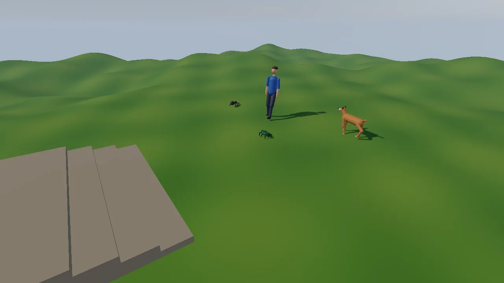

# Procedural animation demo

Four creatures with no animation clips at all: a spider (8 legs), a beetle
(6), a dog and a person. Each is a skeleton generated in code and moved
every frame by the procedural animation blocks
([docs/PROCEDURAL_ANIMATION.md](../../docs/PROCEDURAL_ANIMATION.md)):
`kke::ProceduralGait` places the feet on the hills and the steps,
`kke::LookAt` turns the heads toward the camera, FABRIK wags the dog's tail,
and `kke::ActiveRagdoll` (Jolt joint motors) makes the dog and the person
stagger when hit, fall when hit hard, and get up again. Creatures are drawn
from their bones as capsules and ellipsoids, so no art packs are needed.

This demo is the starting point for games with creatures that must walk on
uneven ground without a clip for every case: insects and spiders, robots
and mechs, animals of any size, and characters that react physically to
hits instead of playing a canned flinch. It is also the smallest complete
example of the order the layers go in: controller, gait, arm swing, tail,
look-at, then physics on top.



## Run it

```sh
cmake --build build --target procedural_demo
cd build/bin && ./procedural_demo
```

The executable is `procedural_demo` ([CMakeLists.txt](CMakeLists.txt)).
The root `CMakeLists.txt` only builds it when `KKE_ENABLE_JOLT` is on (the
default): the ground and the ragdolls are Jolt bodies.

| Variable | Effect |
|---|---|
| `KKE_SKIP_INTRO=1` | skip the logo intro |
| `KKE_PROC_VIEW=yaw,pitch,distance` | camera angle (degrees) and distance (metres); the default is `-35,-25,6.5` |
| `KKE_PROC_FOCUS=spider\|beetle\|dog\|person` | the camera follows that creature |
| `KKE_PROC_GAIT=walk\|trot\|gallop` | the dog's gait (any name `kke::gaitFromName` knows) |
| `KKE_PROC_HIT=<seconds>` | hit the focused dog or person (else the person) from the side at that time |
| `KKE_PROC_HIT_SPEED=<m/s>` | how hard that hit and a normal click are (default 3; about 4 and up knocks them down) |
| `KKE_PROC_QUIT=<seconds>` | quit after that long, logging each creature's gait, speed and state every 2 s |
| `KKE_PROC_TRACE=1` | log a hit body's balance, weakest joint and lean every frame |

## Controls

The mouse and the keys 0 to 3 are read as raw SDL events in
`ProceduralDemoModule::onEvent`. Everything else is an action from
`ProceduralDemoModule::defineInput` (player 1, the "Creatures" group, the
default `game` context) or from the orbit camera, so it works on a
controller and can be rebound; rebindings are saved to
`procedural_demo_input.json`.

A controller has no cursor, so it aims with the middle of the screen: the
panel draws a small crosshair there (`setPadCrosshair(true)` in
[main.cpp](main.cpp)) while you use a pad and the panel is not Active.
The pad buttons do exactly what a click at the crosshair would.

| Action | Keyboard and mouse | Controller |
|---|---|---|
| Call everyone to a flag (`proc.call`) | left click the ground | A (south): a flag at the crosshair |
| Hit the dog or the person (they stagger) (`proc.hit`) | left click them | X (west), aimed at the crosshair |
| Hard hit (they fall, then get up) (`proc.hard`) | Shift + left click them | Y (north), aimed at the crosshair |
| Scare a bug (it runs off) | left click it | X or Y at the crosshair |
| Dog: next gait (`proc.gait`: auto, walk, trot, gallop) | G | RB (right shoulder) |
| Dog: auto / walk / trot / gallop | 0 / 1 / 2 / 3 | the panel's "Dog gait" row |
| Orbit the camera (`camera.orbit`) | right drag | right stick |
| Pan the camera (`camera.pan`) | middle drag | left stick |
| Zoom (`camera.zoom`) | mouse wheel | d-pad up (closer) / down (further) |
| Move the camera target | WASD (Q / E down / up, Shift faster) | the left stick (above) |
| Settings panel (`panel.toggle`) | F3, or click it | View (Back) |
| Engine developer panels (ImGui) | F1, developer builds only | no controller binding yet |
| Quit | Esc | none |

Notes from the code:

- A is "call" only: `click(..., groundOnly = true)` skips the creatures
  (the comment: the pad's 'call' is "never a hit"). X and Y do what a left click does,
  so X or Y with nothing under the crosshair also plants the flag.
- A left click on the panel does not reach the scene: `onEvent` returns
  when `m_app->uiCapturesMouse()` (or ImGui wants the mouse).
- The camera is `OrbitCameraModule` in `Editor` controls (left click is
  free for the demo), with `setPadControls(true)` (right stick turns,
  d-pad zooms) and `setPadPan(true)` (the left stick moves the point it
  looks at across the ground). `KKE_PROC_FOCUS` sets the target every
  frame, which overrides panning.
- Button names are positions: on a PlayStation pad A is Cross, X is
  Square, Y is Triangle.
- Esc closes the window (the engine's default; the demo does not call
  `setQuitOnEscape(false)`). That includes pressing Esc to leave the
  panel, so on the keyboard leave it with F3 instead.

On a touch screen, two fingers turn and zoom the camera (the
`OrbitCameraModule` default).

### The panel

The panel is a `kke::DemoPanelModule` titled "Procedural animation" on
the left edge, drawn with RmlUi
([docs/DEMO_PANEL.md](../../docs/DEMO_PANEL.md)). It starts open with the
game keeping the controls; the mouse can click and drag any row.
`panel.toggle` (View on a pad, F3 on the keyboard) makes it Active: up and
down pick a row, left and right change it, A presses, B hands control
back. While it is Active, player 1's `game` context is off, so the sticks
and A, X and Y rest. The last row, "Hide panel", collapses it.

`buildPanel` adds one section, "Procedural animation":

| Row | What it does |
|---|---|
| note | "No animation clips: every step is planned." |
| hint | the controls for the device you hold (a mouse and keyboard line, a controller line) |
| Dog gait | Auto, Walk, Trot, Gallop (the same as 0 to 3, G and RB) |
| Hit strength | 1 to 9 m/s in steps of 0.5: the speed of a normal hit (click, X, and the timed `KKE_PROC_HIT`); starts at `KKE_PROC_HIT_SPEED` or 3 |
| one line per creature | name, gait, speed, head turn, and "(staggering)", "(down)" or "(getting up)" while it is a ragdoll |

## How it plays

It is a toy, not a game: no goal and no end. The creatures wander between
random spots in a 18 x 18 m area in the middle of the meadow. Click the
ground (or press A with the crosshair on it) and a red flag appears for
20 seconds; everyone walks to a ring around it. The dog cycles through walk (6 s), trot (6 s) and gallop (6 s)
by itself unless you pick a gait. Heads turn toward the camera when it is
within 7 m, and the dog wags faster when the camera is within 4 m.

The panel lists each creature's gait, speed, head turn and state
(staggering, down, getting up).

## How it works

### Startup and the frame

[main.cpp](main.cpp) sets the mood `morning` and adds, in order:

1. `SettingsModule("settings.json")`
2. `RigidBodyModule` (Jolt)
3. `InputModule` (`procedural_demo_input.json`)
4. `UiModule` (RmlUi, for the panel)
5. `OrbitCameraModule`, with `setPadControls(true)` and `setPadPan(true)`
6. `procedural_demo::ProceduralDemoModule`
7. `DemoPanelModule("Procedural animation")` with `setPadCrosshair(true)`
8. `StatsModule`, its window hidden

`ProceduralDemoModule::init` builds the ground, makes the four creatures,
places them, reads the `KKE_PROC_*` switches, and puts the orbit camera in
`Editor` controls (left click is free for the demo) with a distance of 0.6
to 30 m and a pitch that never goes above level. Last it defines the input
actions (`defineInput`) and builds the panel (`buildPanel`).

Each frame `update` first calls `readInput` (the pad's call, hit, hard
hit and next gait), then, with `dt` clamped to 1/20 s:

1. For each creature: if it has a ragdoll, `updatePhysical`; else `think`
   (where to go, how fast), `move` (the controller) and `animate` (the
   pose).
2. The timed hit (`KKE_PROC_HIT`), and the camera follow (`KKE_PROC_FOCUS`).
3. Every creature and the flag are appended into one vertex list and
   uploaded to a single `DynamicMeshRenderer`.
4. The `KKE_PROC_QUIT` log and quit.

`render` stores the frame's view and projection (for clicks) and draws the
ground and the creatures; `renderShadow` draws both into the shadow map.

### The ground

`groundHeight(x, z)` is flat near the middle and hilly further out:

```cpp
const float r = std::sqrt(x * x + z * z);
const float amp = glm::smoothstep(7.0f, 14.0f, r);
return amp * (0.9f * std::sin(0.28f * x + 0.4f) * std::cos(0.23f * z) + 0.35f * std::sin(0.9f * x) * std::sin(0.8f * z + 1.0f)) +
       0.04f * std::sin(2.3f * x) * std::cos(1.9f * z);
```

`buildGround` samples it on a 48 x 48 m grid every 0.4 m, with normals from
finite differences, and adds it to Jolt as a static triangle mesh. A
flight of four steps (0.12 m each) up to a platform at x = 3.25 to 6.5 m
gives the feet something sharp to find. The steps are both drawn and added
as static Jolt boxes.

Feet find the ground with `ground()`, a Jolt ray cast straight down that
only accepts **static** bodies, so a foot never lands on a ragdoll lying
on the grass.

### Building a creature

Each creature is a `kke::ModelData` with bones only (no meshes), built with
`addBone(model, name, parent, offset)`:

- **Spider and beetle** (`makeSpider`): `kke::makeLegs(8 or 6, length,
  width, hipHeight)` lays out mirror pairs of legs. For each leg the code
  adds an upper, lower and foot bone, putting the knee where
  `kke::kneePosition` says, and records a `TwoBoneChain`. The gait comes
  from `kke::legsFromSkeleton`, and `LookAt` turns the head bone (50
  degrees yaw, 30 pitch at most).
- **Dog** (`makeDog`): bones named like Quaternius' farm animals (`Hips`,
  `Torso`, `FrontUpLeg.L`, `BackLowLeg.R`, `Tail1..4`, ...). The comment
  says why: "so buildQuadrupedRagdoll and quadrupedLegChains find
  everything". `kke::findIkChain(m, "Tail1", "Tail4")` makes the tail
  chain; `LookAt::quadruped` finds Neck and Head.
- **Person** (`makePerson`): Synty / Unreal-style names (`Pelvis`,
  `spine_01..03`, `neck_01`, `head`, `Thigh_L`, `calf_l`, `Foot_L`, ...),
  which `buildHumanoidRagdoll` and `LookAt::humanoid` know.

Each creature also gets a list of `Part`s: a capsule between two bones, or
an ellipsoid at one bone with an offset and radii. Those are what you see.
The rest pose comes from `kke::AnimationSet(rig).restPose()`.

### Think and move: the controller

The gait never moves a creature; a controller does, like a player's input
or an AI would. Here it is a point on the ground with a heading:

- `think` picks the goal: keep the flee spot while fleeing, a slot on a
  0.7 m ring around the flag while called, else a new random spot every 3
  to 7 s (plus 3 s for everyone but the dog). The wanted speed is the
  creature's `cruise`, slowing near the goal and to 35% when the goal is
  more than 60 degrees off; the turn rate is 4 x the angle, up to
  `maxTurn`. The dog's cruise comes from its gait: 1.1 m/s walk, 2.6 trot,
  5.5 gallop. A fleeing bug goes 2.5 x faster.
- `move` turns and moves the point, keeps it inside x, z = -20..20, and
  sets its height from the ground ray.

### Animate: the layers

`animate` builds the body frame from position and yaw, then:

1. `c.gait.update(body, velocity, turnRate, ground, dt)`: the gait plans
   steps. Each foot stays planted until its turn, then swings to where it
   will be needed, found by ray-casting the ground.
2. `animatedPose` starts from the rest pose and applies, in order:
   - `kke::applyGait`: the body sways and every foot goes onto its planned
     spot with two-bone IK;
   - arm swing (person only): the upper arms rotate against the gait phase,
     up to 30 degrees at 1.6 m/s;
   - the tail (dog only): `kke::solveFabrik` toward a target that swings
     side to side, with a pole above the tail root;
   - `LookAt::apply` toward the camera, or back to forward when the camera
     is more than 7 m away.
3. `kke::poseToModel` turns the pose into model-space matrices, and the body
   transform puts them in the world. `appendCreature` draws the parts from
   those matrices.

### Hits: the active ragdoll

`click(x, y, hard, groundOnly)` is shared by the mouse and the pad. A left
click passes the mouse position; `readInput` passes the middle of the
window (the crosshair) for A, X and Y:

```cpp
const float cx = float(w) * 0.5f, cy = float(h) * 0.5f;
if (m.pressed("proc.call")) click(cx, cy, false, true);
if (m.pressed("proc.hit")) click(cx, cy, false, false);
if (m.pressed("proc.hard")) click(cx, cy, true, false);
```

It builds a ray from that point through the stored view and projection
(the comment notes Vulkan's clip space: y down, depth 0 to 1). Unless
`groundOnly` is set, it finds the nearest creature whose body bone passes
within a radius of the ray (0.45 m person, 0.35 m dog, 0.2 m bug). No
creature means the ground: a Jolt ray cast places the flag.

`hit()` on a bug starts a 2.5 s flee to a spot 4 m away from the camera.
On the dog or the person:

1. If there is no ragdoll yet, it builds one from the current bone
   positions (`kke::buildQuadrupedRagdoll` or `buildHumanoidRagdoll` with
   the creature's mass, 25 or 70 kg), binds the skeleton to it
   (`bindSkeletonToRagdoll`), creates it in Jolt with the creature's
   current velocity, and starts a `kke::ActiveRagdoll` aimed at the current
   pose.
2. It finds the ragdoll body nearest the click, calls
   `c.active.hit(body, push)` (weakens the muscles there and knocks the
   balance), pushes that body in Jolt, and pushes the pelvis with 30% of
   the push.

The push is along the click ray, flat, at the panel's "Hit strength"
(`m_hitSpeed`: `KKE_PROC_HIT_SPEED`, else 3 m/s) for a normal hit or
9 m/s for a hard one, plus 0.5 m/s up.

While a creature has a ragdoll, `updatePhysical` runs instead of think and
move:

```cpp
c.active.setTargets(c.binding, animWorld);   // where the muscles aim
c.active.update(dt, bodies);                 // balance, strength, state
if (c.active.physical()) {
    m_rigid->driveRagdoll(c.handle, c.active.drive());
    ...
} else {
    m_rigid->destroyRagdoll(c.handle);
```

- The target pose is the creature standing where its pelvis is now (the
  gait is reset there each frame), so "once down, it gets up wherever it
  ended up". While it is still in the `Active` (staggering) state, the
  controller point stays put, so the muscles pull back toward where it
  stood.
- The drawn pose is the ragdoll's (`kke::poseFromRagdoll`); while getting
  up it blends toward the animated pose with `getUpBlend()`.
- When the state machine returns to animated, the ragdoll is destroyed and
  the gait resets under the body.

The state machine (`Animated -> Active -> GettingUp`, or `Active -> Fallen
-> GettingUp`) and the Jolt motor drive are explained in
[docs/PROCEDURAL_ANIMATION.md](../../docs/PROCEDURAL_ANIMATION.md),
"Active ragdoll".

### Input, the camera and the panel

`defineInput` makes four actions. Three have only a pad button, because
the mouse and Shift already do them as clicks; `proc.gait` has G and RB:

```cpp
action("proc.call", "Call everyone to the middle of the screen", SDL_GAMEPAD_BUTTON_SOUTH);
action("proc.hit", "Hit what's in the middle of the screen", SDL_GAMEPAD_BUTTON_WEST);
action("proc.hard", "Hit it hard", SDL_GAMEPAD_BUTTON_NORTH);
m.defineAction({ "proc.gait", "Dog: next gait", "Creatures" });
```

`commitDefaults()` then lets a saved rebinding file override them. The
dog's gait is kept twice: `m_dogGait` (a `kke::Gait`, what `think` uses)
and `m_gaitIndex` (0 to 3, what the panel's choice edits). `gaitOf(index)`
turns one into the other; the keys, G, RB and the panel all set the index
and then the gait, so every control and the panel agree.

`OrbitCameraModule` in `Editor` mode does the mouse orbit, pan, zoom and
WASD target moves; with pad controls on it also reads `camera.orbit`,
`camera.zoom` and `camera.pan`. `KKE_PROC_FOCUS` calls `setTarget` every
frame, which overrides the WASD moves and the left stick.

`buildPanel` builds the rows listed under [The panel](#the-panel). The
creature lines are live text: a lambda per creature that formats its
state each frame, so the panel needs no update code.

## Design decisions

- **No clips at all.** The header says every creature is "a generated
  skeleton driven by kke::ProceduralGait + kke::applyGait". It proves the
  gait alone gives a walk, trot and gallop, and CMakeLists.txt notes there
  is "nothing to download".
- **The controller moves, the gait follows.** docs/PROCEDURAL_ANIMATION.md:
  "The controller (AI, player input, kke::Locomotion) moves the creature as
  a point with a heading." `think` and `move` stand in for any AI or
  player.
- **Real bone names on generated skeletons.** The dog uses Quaternius
  names and the person Synty names, so the same ragdoll builders, leg
  finders and look-at presets that work on real models work here.
- **Feet only land on static ground**, never on a ragdoll (`ground()`,
  comment "Only the level: not a ragdoll lying on it").
- **The ragdoll exists only while it is needed.** It is created on the
  first hit and destroyed when the creature is animated again, so standing
  creatures cost no physics.
- **Motors, not a limp ragdoll.** The first commit's message: calm is
  judged by sway so a stagger settles back through getting up, and an
  assist on the pelvis (and chest on four legs) with gravity fed forward is
  what keeps a hit character on its feet. A world without motors (FEMFX)
  would only go limp.
- **One mesh for all creatures, rebuilt every frame** from capsules and
  ellipsoids. Simple and dependency-free; fine for four creatures.
- **Headless switches instead of input for tests.** `KKE_PROC_HIT`,
  `KKE_PROC_QUIT` and `KKE_PROC_TRACE` let a script take the screenshots and
  check that a hit character falls and gets up, with no one at the mouse.
  The pad controls can be scripted too: the same commit that added them
  (a9d24ad) made `KKE_VIRTUAL_PAD_SCRIPT` accept SDL axis names (`leftx`,
  `righty`, ...), so a script can move the sticks
  ([docs/INPUT.md](../../docs/INPUT.md) "Testing without hardware").
- **A controller aims with the middle of the screen.** A pad has no
  cursor, so the panel draws a crosshair (`setPadCrosshair`; its header comment: what 'click' means without a
  mouse, "the demo acts on the middle of the screen") and
  the left stick moves the view under it (`setPadPan`). The same `click`
  function serves both, so a pad hit and a mouse hit behave the same.
- **A pad button that only calls.** A mouse click decides between flag and
  hit by what is under the cursor. On a pad the crosshair often sits on a
  creature, so A passes `groundOnly` (the comment: the pad's 'call' is "never a hit") and
  X and Y are the hits.
- **The panel is RmlUi, not ImGui.** Commit a9d24ad: "the ImGui HUD is
  now a DemoPanel with a pad crosshair". The rule in
  [docs/DEMO_PANEL.md](../../docs/DEMO_PANEL.md): ImGui (F1) is for
  developers, what a player uses is RmlUi, so a controller reaches every
  setting.

## Tuning

| What | Where | Value | Effect of raising it |
|---|---|---|---|
| Cruise speed | `makeSpider` / `makeDog` / `makePerson`, `c.cruise` | spider 0.55, beetle 0.35, dog 1.2, person 1.3 m/s | faster creatures (the gait picks longer strides and changes gait) |
| Dog gait speeds | `think` | 1.1 / 2.6 / 5.5 m/s | |
| Turn limit | `c.maxTurn` | 120 to 240 deg/s | tighter turns |
| Acceleration | `think` | dog 5, others 2.5 m/s^2 | snappier starts |
| Leg layout | `makeLegs(count, length, width, hipHeight)` in `makeSpider` | scaled by `size` | bigger bugs |
| Gait feel | `GaitSettings` via `c.gait.settings()` | engine defaults (step 0.25, lean 0.5, bob 0.04, ...) | see [the doc](../../docs/PROCEDURAL_ANIMATION.md) |
| Look limits | `LookAt::Settings` in `makeSpider` | 50 deg yaw, 30 pitch | |
| Look distance | `animatedPose`, `< 7.0f` | 7 m | heads turn from further away |
| Tail wag | `animatedPose` | 7 to 14 rad/s, 0.1 to 0.18 m | |
| Normal / hard hit | the panel's "Hit strength" (1 to 9) or `KKE_PROC_HIT_SPEED`; `hard ? 9.0f` in `click` | 3 / 9 m/s | more falls |
| Mass | `c.mass` | dog 25, person 70 kg | harder to knock over |
| Hills | `groundHeight` | amplitude 0.9 + 0.35 m from 7 to 14 m out | steeper ground |
| Flag time | `think`, `update` | 20 s | |

## Engine features it uses

| Feature | Header / module | Doc |
|---|---|---|
| Gait, leg layout, look-at, FABRIK, two-bone chains | `kke/ProceduralAnim.h` | [PROCEDURAL_ANIMATION.md](../../docs/PROCEDURAL_ANIMATION.md) |
| Active ragdoll, ragdoll builders, skin binding | `kke/ProceduralAnim.h`, `kke/Ragdoll.h` | [RAGDOLLS.md](../../docs/RAGDOLLS.md), [PROCEDURAL_ANIMATION.md](../../docs/PROCEDURAL_ANIMATION.md) |
| Poses and rest poses | `kke/Animator.h`, `kke/AnimRig.h` | |
| Jolt ground, ray casts, ragdolls with motors | `kke/RigidWorld.h`, `kke/modules/RigidBodyModule.h` | |
| Orbit camera with pad turn, zoom and pan | `kke/modules/OrbitCameraModule.h` (`setPadControls`, `setPadPan`) | [DEMO_PANEL.md](../../docs/DEMO_PANEL.md) |
| Actions, bindings, button prompts | `kke::InputModule` | [INPUT.md](../../docs/INPUT.md) |
| Settings panel with a pad crosshair | `kke::DemoPanelModule` (`setPadCrosshair`) | [DEMO_PANEL.md](../../docs/DEMO_PANEL.md) |
| Generated meshes | `DynamicMeshRenderer` (`kke/SphereImpostors.h`) | |
| Moods | `Application::setMood` | [MOODS.md](../../docs/MOODS.md) |

## Assets

None. Every creature, the ground and the steps are generated in code. The
build copies `game.json`, the shaders it needs (`cube`, `glow`, `shadow`)
and, through `kke_use_ui`, the RmlUi shaders and the Noto fonts the panel
uses (in `assets/fonts/`, SIL Open Font License 1.1,
[docs/DEPENDENCIES.md](../../docs/DEPENDENCIES.md)).

## Make a game like this

1. Copy `games/procedural_demo` to `games/<your_game>`, rename the
   executable, namespace and module, give `game.json` a new id, and add the
   folder to the root `CMakeLists.txt` inside an `if(KKE_ENABLE_JOLT)`.
2. Use real models when you have them. For a rigged animal with
   Quaternius-style bones, `kke::quadrupedLegChains` and
   `kke::legsFromSkeleton` give you the gait, as the
   [pet companion](../pet_companion/README.md) does with its pug. For a
   generated creature, copy `makeSpider` or `makeDog`.
3. Replace `think` and `move` with your controller: player input,
   `kke::Locomotion`, or the AI core. Feed the gait a real velocity and a
   turn rate every frame.
4. Give the gait a ground query that ignores anything that is not the
   level, like `ground()`.
5. Keep the layer order of `animatedPose`: gait, then extra motion (arms,
   tail), then look-at last so the head turns from the final body pose.
6. Add hit reactions with `ActiveRagdoll` only when something hits, and
   copy `updatePhysical` for the target pose and the blend back.
7. Keep the input on the `InputModule` like `defineInput`, so it is
   rebindable and works on a controller ([docs/INPUT.md](../../docs/INPUT.md)).
   If your game aims at things in the world, copy the crosshair idea:
   `setPadCrosshair(true)`, `setPadPan(true)`, and call your mouse code
   with the middle of the window.

Pitfalls the code shows:

- Call `gait.reset(...)` after placing or teleporting a creature, and after
  a ragdoll ends, or the feet try to walk from their old spots.
- The ragdoll builders look bones up by name. A missing bone gives no
  ragdoll and a log line naming it (`hit()`).
- Clamp `dt` (here 1/20 s): a long frame would ask the gait for one
  impossible stride.

## Files

| File | What is in it |
|---|---|
| [main.cpp](main.cpp) | the app, the mood, the module list, the camera's pad controls, the panel and its crosshair |
| [ProceduralDemoModule.h](ProceduralDemoModule.h) | the module, the `Part` and `Creature` structs, the switches in a comment |
| [ProceduralDemoModule.cpp](ProceduralDemoModule.cpp) | mesh helpers, ground and steps, the four creature builders, think / move / animate, hits and the active ragdoll, clicks, input actions (`defineInput`, `readInput`), the RmlUi panel (`buildPanel`) |
| [CMakeLists.txt](CMakeLists.txt) | the `procedural_demo` executable, `game.json` and shader copies, `kke_use_ui` (the RmlUi shaders and fonts) |
| [game.json](game.json) | the marketplace entry |
