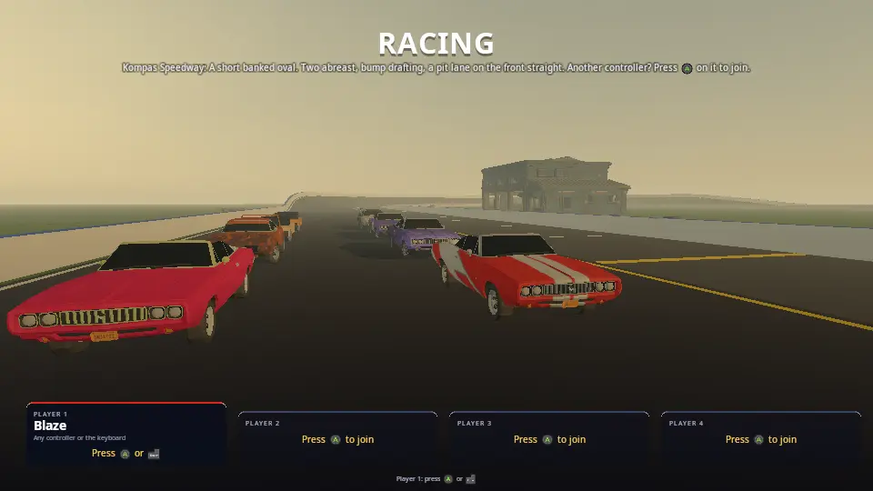

# Racing

Five kinds of race on Jolt's vehicle physics, from a start menu where
players join locally or online:

- **Oval**: laps of a banked speedway with a big field (up to 24 cars),
  two abreast, bump drafting and a pit lane. Every hit hurts: cars dent
  where they are struck, lose power and grip, and can be totalled, so you
  drive carefully to finish.
- **Drift**: a twisty loop round the docks. Cars leave the line one after
  another; sliding through the corners scores points, longer and faster
  slides build a combo, and hitting anything loses it.
- **Drag**: a straight quarter mile, eight lanes. Hold the brake and the
  throttle for a burnout while the ambers count down, launch on green
  (early is a red light) and change gear yourself at the top of the revs.
- **Destruction derby**: a walled dirt pen, everyone round the edge
  facing in. Wreck the others; the last car running wins. Points for the
  damage you deal decide the rest. The engine's in the front, so the
  clever ones reverse into people.
- **Rally**: a gravel stage over forest hills, no walls, one car at a
  time against the clock. A jump, a hairpin, and trees and rocks for
  anyone who runs wide.

Tyre smoke from burnouts and slides, sparks off metal, skid marks that
stay on the road, bits of bodywork that fly off, smoke and fire from a
wrecked engine. With the Synty **POLYGON Street Racer** pack the cars,
paint jobs and trackside props are Synty's; without it every car is a
coloured block of the right size, and the game plays the same.



## Run it

```
cmake --build build --target racing
./build/bin/racing
```

The start menu opens on the grid. Press **A** (or Enter) to join, pick a
name, car, body kit and paint, and start. Player 1 picks the track (which
picks the event), how many cars, laps, how good the CPU drivers are and
how much damage hurts.

For demos and tests:

| Variable | What it does |
|---|---|
| `KKE_RACE_AUTOPILOT=1` | the CPU drives player 1; races start by themselves and restart 10 s after the finish |
| `KKE_RACE_TRACK=speedway` | this track (`speedway`, `harbour_drift`, `quarter_mile`, `scrapyard_bowl`, `forest_stage`, or any file in `tracks/`) |
| `KKE_RACE_CARS=16`, `KKE_RACE_LAPS=3` | the field and the laps |
| `KKE_RACE_DAMAGE=0/1/2` | damage off, normal, brutal |
| `KKE_RACE_CRASH=1` | the damage test: CPU drivers aim at the car in front |
| `KKE_RACE_BENCH=pileup` | the worst case, for benchmarks: 24 cars (or `KKE_RACE_CARS`) in the derby pen, brutal damage, launched head-on at 108 km/h into the middle every 7 s (`kke_benchmark` runs it as `racing_pileup`) |
| `KKE_RACE_CAMERA=0..4` | chase, far chase, bonnet, TV, wheel |
| `KKE_RACE_FEMFX=0` | dents by hand even in a FEMFX build (for comparison) |
| `KKE_RACE_LOBBY=0` | straight into a race, no start menu |
| `KKE_RACE_QUIT=60` | quit after 60 s, printing where every car is every 5 s |
| `KKE_ASSETS_DIR=...` | where the Synty packs are (docs/SCENES.md) |

## Controls

Up to four players on one screen (split screen), each with a gamepad or
the keyboard.

| | Gamepad | Keyboard |
|---|---|---|
| Steer | left stick | A / D or the arrows |
| Gas / brake | right / left trigger | W / S (S reverses once stopped) |
| Handbrake (start a slide) | A | Space |
| Gear up / down (drag strip) | B / X | E / Q |
| Look back | LB | B |
| Back on the track | D-pad up | T |
| Camera | Y | C |
| Race again / next track | Start / D-pad right | R / N |
| Pause menu (settings, controls, main menu, quit) | Start while driving, or Select | Esc |
| Start menu (players, cars, track) | the pause menu's Main menu | M, or the pause menu |
| How to play | D-pad down | H |
| Developer panels | | F1 |

On a touch screen: the left half of the screen steers (where your finger
is, left or right of the middle of that half), the right quarter is the
gas and the strip left of it the brake.

The hint bar at the bottom always shows the buttons of the device you
last used (Xelu's prompts, docs/INPUT.md).

## How it plays

### The start menu

`kke::LobbyModule` (docs/LOBBY.md): each seat picks a name, one of six
cars (stock car, sports, exotic, sedan, hatch, ute: each with its own
power, weight, drive and grip), one of four body kits and a paint job.
Player 1's options: the track, how many cars (2 to 24; 8 on the strip),
laps, the CPU drivers (Easy to Expert), damage (Off, Normal, Brutal) and
Online. Behind the menu the grid waits on the chosen track with every car
as it will race, so changing a paint job shows it at once.

### The oval

A rolling grid two abreast behind the line; the lights count down and
everyone is held on the brake until green. The CPU drivers pick a lane,
change lanes only when nobody is beside them, go round a slower car when
there is room and sit behind it when there isn't, brake for the tightest
corner within braking distance (grip, curvature and banking) and pit
when hurt. The pit lane on the front straight has a 50 km/h limiter and
repairs a stopped car at 30% a second.

After the leader finishes everyone else finishes as they next cross the
line; the race ends when every car is home or out, or a minute after the
winner.

### Damage

Every hit is measured by how fast the two surfaces met (not how fast you
were going: a tap in a pack costs little, a head-on everything). It takes
health, dents the body where it landed (the mesh itself moves in, deeper
for harder hits), may bend a wheel (the car pulls to that side and that
tyre grips less), throws sparks and, above 40 km/h, bits of bodywork.
Health sets the engine's power (half at zero); below 45% the engine
smokes, and a totalled car stops where it is. Scraping along a wall or
another car wears it down slowly with a trail of sparks.

A hit at a corner can puncture that tyre (it goes down over a few
seconds) or blow it; driven on flat it shreds off the rim and the bare
rim sparks on the road. A corner already bent all the way can lose its
wheel, which rolls away on its own. The tyres also get hot: a burnout or
a long slide cooks them (they smoke more, then grip less), and cold ones
slide. The pit box fits a fresh set and bolts lost wheels back on.

### Drift

Cars leave the line three seconds apart, so every run has room. A slide
counts when three wheels are on the road, the car is at 12 to 80 degrees
to where it is going and faster than 7 m/s. Points come from the angle
times the speed, times a combo that grows every two seconds held (up to
x5); a second out of the slide banks the chain. Hitting anything loses it.
Most points wins.

The drift cars have looser rear tyres, and every car's tyres follow a
friction circle: a wheel that spins or locks has less to give sideways,
so a handbrake pull or a burnout steps the rear out and the throttle
holds it there.

### Drag

Eight lanes, the lights count down four seconds; the ambers come on for
the last one and a half, and from then on the brake is yours: moving
0.4 m before green is a false start (a red light, last place). The
gearbox is manual; "Perfect shift" at the top of the revs. Your reaction
time and your speed through the line are on the results.

### Destruction derby

Up to 12 cars start round the edge of the pen facing the middle; damage
is always on. A hit takes health as anywhere else, but where it lands
matters: the front (the engine) takes 1.4x, the boot 0.6x, and derby cars
are braced to take about twice the knocks of a road car, so a bout lasts
minutes. Driving into someone scores the damage you did to them (their
hit into you scores for them); finishing a car off is 50 more. Ninety
seconds without driving into anyone and you're out (until only two are
left: they fight it out). The last car running wins;
if several are still going after four minutes, the most points wins.

The CPU drivers pick a victim every few seconds (close, hurt, in front of
them), drive at where it's going to be, and the better ones put it in
reverse when it's close behind and back into it. They lift off before
the wall, three-point-turn off it when they end up nose first against
it, and back out of a jam.

### Rally

Up to 10 cars queue behind the start and leave eight seconds apart; each
car's clock starts as it crosses the line and stops at the finish.
Fastest time wins. The road is gravel (two thirds of tarmac's grip, and
the tyres keep most of it when they slide, so the car goes round
sideways), the verge is grass, and there are no walls: run wide and
you're into the fields, the trees or a rock. Far off the road for a few
seconds, or upside down, puts you back on it.

### Online

Player 1 sets Online to Host or Join in the start menu (or
`KKE_NET=host`, `KKE_NET=join:ADDRESS`); games on the local network show
up by themselves, and the join codes and relay in docs/SERVER_HOSTING.md
work too. Everyone on each screen drives. The host picks the track and
starts every set of lights.

## How it works

### Startup and the frame

`main.cpp` adds the modules (input, Jolt, models, RmlUi, audio, the
start menu, networking) and `RacingModule`. In `init()` it reads the
tracks, scans the asset folder for the Street Racer pack, sets up the
start menu and networking and builds the first grid.

Every physics step (`fixedUpdate`, after Jolt's step) each car here is
read (position, speed, wheels, where it is on the track), driven (a
player's input or the CPU's) and the race clock moves on. Every frame
(`update`) handles contacts and damage, effects, the cameras and the
HUD. Drawing interpolates each car between the last two physics steps,
so a car at 200 km/h is smooth at any frame rate.

### Tracks (Track.h, Track.cpp)

A track is a YAML (or JSON, kke::datafile) file in `tracks/`: an oval, a
loop through points or a straight strip, its width, banking, walls and
laps (every key is in `Track.h`). It becomes a centre line sampled every
2 m, each sample with its own frame (forward, left across the banked
road, up) and curvature. From that come the road and walls (triangles
drawn with `DynamicMeshRenderer` and given to Jolt as static meshes),
the lane markings, the grid slots, and `locate()`: where any point is on
the track, as distance along it (`s`) and across it (`u`). Laps,
positions, the CPU drivers and the "back on the track" reset all use
`s` and `u`.

Two more shapes. An **arena** (the derby) is an oval pen `size` across
and along: the centre line is the wall's line, the floor is the ground
slab (its `ground`), and `insideArena()` says what's in it. A **stage**
(the rally) is an open road through points that may carry a height,
`[x, z, y]`: the samples follow the hills and a height grid round the
road (`terrain()`, 4 m squares) sits at the road's height beside it and
rises and falls by `hills` metres from about 40 m out. It is drawn, given
to Jolt as one mesh, and `groundHeight()` stands the trees and rocks on
it. Each track's `ground` and `verge` set what the tyres find there
(`setGround`, docs/VEHICLES.md "Tyres").

### Cars (Cars.h, Cars.cpp)

`Garage` makes a car's art: the Street Racer car (`SK_Veh_Preset_<type>_0<kit>`),
split into the body (one mesh part per material) and a left and right
wheel, with where the four wheels sit and a convex hull for the chassis.
A paint job is a whole texture of the pack (the colour up top, badges,
plates and lights below), so both the body and livery materials get it.
Without the pack a block car of the type's size stands in.

`RacingModule::buildCar` turns it into a Jolt vehicle
(`RigidWorld::addVehicle`, docs/VEHICLES.md): the hull, the mass and
torque of its type, rear, front or all-wheel drive, suspension, brakes
biased to the front (so brake and throttle together spin the rears: a
burnout) and a handbrake on the rears. On the drag strip the gearbox is
manual. Cars from other machines are kinematic hulls that move where
their owner says.

### Driving (Driving.cpp)

`readPlayer`: steering that ramps in (a keyboard's full lock over a
fifth of a second) and gets less at speed, so a key press doesn't spin a
car at 150 km/h. `readCpu`: the lane, overtaking or following, the
corner speed, pitting, the drift technique (a flick of the handbrake
into a bend, then held sideways on the throttle with the front wheels
along the slide and aimed down the road) and the drag launch and
shifts. `driveCar` applies the rules on top: held on the grid, the pit
limiter and repairs, a bent wheel's pull, a totalled car's stop.

### The derby (Derby.cpp)

`updateDerby` counts who's still running, knocks out anyone who hasn't
driven into someone for 90 s, and ends the bout when one car is left
or the clock runs out (the survivors are finished there and the table
places them). `hitCar` passes the other car to `derbyHit`, which credits
it only if it was the one moving into the hit (its speed along the push
a few steps before, `velocityBefore`, is more than the victim's: after
the step they've already bounced). `readDerbyCpu` is the rammers' AI.

### Damage (Damage.cpp)

Jolt reports new contacts (`RigidBodyModule::frameContacts()`); a car's
contacts with another car or the walls become `hitCar`. The dent moves
the body's vertices near the hit inwards along the hit's direction,
fading with distance and never past the car's middle, then recomputes
normals; `ModelModule::setDeformedVertices` draws the dented copy. Debris
are small boxes on Jolt that fade after 14 s. Online, a dent is an event
so everyone sees the same car.

### Crumpling (Crumple.cpp)

In a FEMFX build (`KKE_ENABLE_FEMFX`, desktop) the dent isn't pushed in
by hand: every car's body is also an AMD FEMFX solid, a box of 288
tetrahedra the car's size, soft steel with a low yield (it stays bent).
Jolt keeps driving the car; a hit is replayed into the solid as a shove
where it landed, the way it pushed, and FEMFX works out how the metal
gives: the dent spreads, panels buckle round it, a hard hit folds a
corner in. The Synty body is skinned to the solid (`kke::embedPoints`,
`PhysicsModule::deformEmbedded`). The solids sit far from the track on
FEMFX's own ground, held still (each step their motion as a whole is
taken out, leaving only the change of shape), and are awake only for a
moment after a hit: about 0.1 ms a step with nothing hit, 1-3 ms in a
pile-up. Without FEMFX (Android) the dents are the hand-made ones above.

### Wheels (Wheels.cpp)

The tyre model is the engine's (docs/VEHICLES.md "Tyres": heat, wear,
pressure, load, the ground, flats). This file draws it:

- **Squash and bulge.** The nearest six cars' tyres flatten where they
  meet the road, as far as the load pushes them (a landing, a banked
  turn), and the sidewalls bulge out; a flat one sits down on its
  sidewalls. It moves each tyre vertex in the wheel's spinning frame
  every frame the wheel turns, so it's the cars near a camera only
  (from further away a 3 cm flat spot can't be seen). BeamNG gets this
  from a soft-body tyre; this is the cheap trick of the same look.
- **Wobble.** A bent wheel runs out of true (its plane tilted in its own
  frame, so the tilt goes round as it turns); a flat one flops.
- **Rims and lost wheels.** A bare rim throws sparks on the road; a torn
  off wheel is a Jolt body of its own (a 12-sided drum), spinning as it
  was, and rolls away.
- **The ground.** On loose ground (grass, gravel, dirt, mud, snow) tyres
  throw up dust at speed and a cloud and stones where they slide or spin,
  instead of smoke and marks. `setGround` in `Race.cpp` says which body
  is which ground.

The wheel camera (**C** until it comes round) sits on the side sill
looking back at the front tyre.

### Effects

`kke::ParticleEffects` (docs/PARTICLE_EFFECTS.md): tyre smoke where a
wheel spins or slides, engine smoke and fire, sparks off hits and
scrapes. Skid marks are one growing `DynamicMeshRenderer` mesh of quads
laid under sliding tyres (up to 3000). Contact sounds come from the
audio module's impact synthesis (docs/AUDIO.md), from the bodies'
materials.

### Sound (Sound.cpp)

Every car near you is heard from where it is: its own engine, made by
`kke::EngineSound` from its revs and throttle (a V8 for the stock car, a
V10 for the exotic, sixes and fours for the rest), and its tyres
squealing when they slide or spin. The players' cars always have one;
the other seven go to the cars nearest the camera. Hits and scrapes are
the audio module's impact sounds.

### Split screen and cameras

One view per player (`kke/Viewports.h`): stacked for two, quarters for
three and four; with three players the fourth quarter is a TV camera
that follows the leader. Each player's camera is a chase, far chase,
bonnet, TV or wheel camera; the chase camera widens its field of view
with speed.

### The HUD (Hud.cpp, ui/racing_hud.rml)

RmlUi with a data model: each player's panel in their view's corner
(place, lap, times, drift points and notes such as "Perfect shift") and
dash (speed, gear, revs, the car's health), the standings, the lights,
banners and the results table. Menus and HUD keep to the screen's safe
area (docs/INPUT.md "Phone, PC and console").

### Networking (Net.cpp, NetRace.h, NetRace.cpp)

Modelled on Climb Race. The host sends a Setup event (the track, laps,
damage and every seat: who drives which car), a Go event to start the
lights, and its CPU cars 15 times a second. Each machine sends its own
cars in `NetPlayerState` (position, velocity) with the rest packed into
its 32 extra bytes (rotation, speed, steering, revs, health, lap,
progress, which tyres smoke). Finishes and dents are events. Remote cars
are dead-reckoned from their last pose.

## Design decisions

- **Jolt's vehicles, not our own.** Jolt's `WheeledVehicleController`
  has suspension, tyre friction curves, an engine, a gearbox, limited
  slip differentials and anti-roll bars, tested in many games. The
  engine adds only what it lacks: a friction circle (wheelspin and
  locked wheels lose sideways grip), per-wheel grip for damage and a
  power scale.
- **Damage from the closing speed.** Racing in a pack means constant
  touches; measuring the speed the surfaces met at makes bumping cheap
  and crashing expensive, like the real thing.
- **Dents in the mesh, not swapped parts.** Works on any car, block or
  Synty, and shows exactly where the hit was.
- **Drift runs one after another.** Eight cars sliding into the first
  corner together is a pile-up, not a drift contest.
- **The race runs on the physics clock.** Lap times and the countdown
  use the same steps as the cars, so a slow frame never changes a result.

## Tuning

| What | Where |
|---|---|
| A car type's weight, power, drive, grip, lock | `carTypes()` in `Cars.cpp` |
| Suspension, brakes, tyres | `buildCar` in `Driving.cpp` / `Cars.cpp` |
| How much a hit hurts, dent depth | `hitCar` in `Damage.cpp` |
| How the metal gives (FEMFX) | `bodyMaterial()` and `m_crumpleShove` in `Crumple.cpp` |
| Punctures, lost wheels, the tyre's squash | `damageWheel`, `kTyreStiffness` in `Wheels.cpp` |
| Tyre heat, wear, grip of each ground | `kke::TyreDesc`, `kke::GroundGrip` (docs/VEHICLES.md) |
| Drift scoring | `updateDrift` in `Damage.cpp` |
| CPU pace, lanes, drifting | `readCpu` in `Driving.cpp`; skill in `resetRace` (`Race.cpp`) |
| Pit limiter and repair rate | `kPitSpeed`, `driveCar` in `Driving.cpp` |
| A track | a file in `tracks/` |

## Engine features it uses

Jolt vehicles and their tyres (`kke/Vehicle.h`, `kke/Tyre.h`, docs/VEHICLES.md),
FEMFX plastic solids with an embedded mesh (docs/PHYSICS_BRIDGE.md), `kke::ParticleEffects`
(docs/PARTICLE_EFFECTS.md), model deformation (`ModelModule::setDeformedVertices`),
`DynamicMeshRenderer`, the start menu (docs/LOBBY.md), networking
(docs/NETWORKING.md), split screen and button prompts (docs/INPUT.md),
moods (docs/MOODS.md), engine and impact sounds (docs/AUDIO.md), data files
(docs/DATA_FILES.md).

## Assets

The Synty **POLYGON Street Racer** pack, and **POLYGON Nature** for the
rally stage's trees and rocks, from `KKE_ASSETS_DIR` (never in the
repository); docs/SCENES.md lists every asset used. Without it the
cars are blocks, the tracks have no props, a line in the log (info) and
on screen says so, and everything else is the same.

## Make a game like this

- **Another track**: copy a file in `tracks/`, change the numbers or the
  points; it's in the start menu next time.
- **Another event**: a new `Event` in `Track.h`; its rules in
  `updateRace`/`crossLine` (`Race.cpp`) and its HUD in `Hud.cpp`.
  `Derby.cpp` is a whole event in one file: start there.
- **Another stage or pen**: `tracks/forest_stage.yaml` with your own
  points and heights (`ground: snow`, `hills: 20`), or
  `tracks/scrapyard_bowl.yaml` with another `size` and `ground: mud`.
- **A car game of your own**: `RigidWorld::addVehicle` with a
  `VehicleDesc` is all the physics (docs/VEHICLES.md has a complete
  example); `ParticleEffects` for smoke.

## Files

| File | What |
|---|---|
| `main.cpp` | the modules |
| `RacingModule.h`, `RacingModule.cpp` | the game: state, the frame, drawing |
| `Track.h`, `Track.cpp` | tracks from `tracks/*.yaml`: the road, walls, where a car is |
| `Cars.h`, `Cars.cpp` | car types, paint jobs, the car art (Synty or blocks) |
| `Race.cpp` | the field, the grid, the race rules, laps and results, scenery |
| `Driving.cpp` | players, CPU drivers, touch, the rules on top, cameras |
| `Damage.cpp` | hits, dents, debris, smoke, sparks, skid marks, drift points |
| `Sound.cpp` | the engines and tyres |
| `Wheels.cpp` | tyres squashing, flats, rims, lost wheels, dust |
| `Crumple.cpp` | the bodies' FEMFX solids |
| `Derby.cpp` | the destruction derby: rules, points, the rammers |
| `Lobby.cpp` | the start menu |
| `Net.cpp`, `NetRace.h`, `NetRace.cpp` | online races |
| `Hud.cpp`, `ui/racing_hud.rml` | the HUD |
| `tracks/` | Kompas Speedway, Harbour Run, The Quarter Mile, Scrapyard Bowl, Pinewood Stage |
