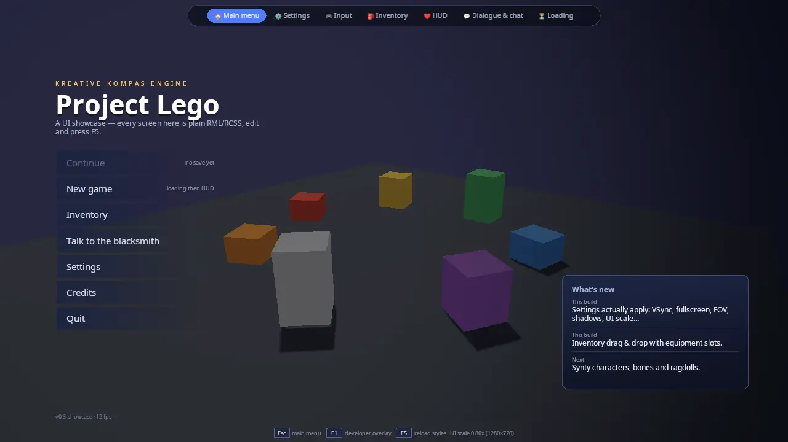

# RmlUi showcase (game UI toolkit)

A set of real game screens drawn over a small, slowly turning 3D scene:
a main menu, a settings screen that really changes the engine, a live
input tester and bindings editor, an inventory with drag and drop, an
in-game HUD, an NPC dialogue with a chat box, and a loading screen. A nav
bar at the top switches between them. Every screen is a plain `.rml`
(markup) and `.rcss` (style) file in [ui/](ui/); C++ only owns the data
and reacts to events.

This is the starting point for any player-facing UI in a KKE game: title
menus, pause and options menus, inventories, HUDs, dialogue systems,
lobbies and loading screens. The pattern it teaches (documents for layout
and style, a C++ data model for state, one document per screen) is the
one the engine's other games follow; `climb_race`, `duel`,
`goblin_horde` and `command_kit` copy this demo's `theme.rcss` as their
own base theme.



## Run it

The executable is `rmlui_demo` ([CMakeLists.txt](CMakeLists.txt)). It is
always built: no `KKE_ENABLE_*` option guards it in the root
`CMakeLists.txt`, and the `default` preset includes it
([docs/BUILDING.md](../../docs/BUILDING.md)).

```bash
cmake --workflow --preset default     # or any preset
cd build/bin
./rmlui_demo
```

Run it from `build/bin`: the documents are loaded from `ui/` next to the
executable, and the fonts from `assets/fonts/`.

| Environment variable | What it does |
|---|---|
| `KKE_SKIP_INTRO=1` | Skips the engine's logo intro (developer builds). |
| `KKE_SHOWCASE_START=<screen>` | Opens straight on one screen: `menu`, `settings`, `input`, `inventory`, `hud`, `dialog` or `loading`. Handy when you work on one `.rml` file, and for screenshots. |
| `KKE_UI_ROOT=<folder>` | Loads the documents from another folder instead of `ui/`. Point it at the source folder (`KKE_UI_ROOT=../../games/rmlui_demo/ui ./rmlui_demo`) and your `.rcss` edits show up when you press F5, without a rebuild. |
| `KKE_VIRTUAL_INPUT=pad` (or `hosas,pad`, ...) | Attaches virtual controllers, so the Input screen has something to show without hardware ([docs/INPUT.md](../../docs/INPUT.md) "Testing without hardware"). |
| `KKE_PROMPT_STYLE=xbox` (etc.) | Forces the button-prompt style. This demo does not show prompts yet (see "Button prompts" below). |

The demo can write two files next to the executable: `settings.json`
(the Settings screen's "Apply & save", via `SettingsModule`) and
`input.json` (the Input screen's "Save", via `InputModule`). Both are read
at startup. Delete them to get the defaults back.

## Controls

Everywhere:

| Action | Keyboard / mouse | Controller |
|---|---|---|
| Switch screen | Click a tab in the nav bar | LB / RB (previous / next screen, wraps around) |
| Back to the main menu, or close the Credits / Quit box | Esc | B |
| Move the focus between controls | Arrow keys, Tab (RmlUi handles them directly) | D-pad or left stick (repeats after 0.4 s, then every 0.11 s) |
| Press the focused control | Enter, or click it | A |
| Show / hide the ImGui developer panels | F1 | no controller binding yet |
| Reload every stylesheet from disk | F5 or Ctrl+R | no controller binding yet |
| Turn the 3D view behind the menus | Left-drag orbit, right-drag pan, scroll zoom (it also turns by itself) | no controller binding yet |

Per screen:

| Screen | Action | Keyboard / mouse | Controller |
|---|---|---|---|
| Main menu | Pick an entry | Click | Focus it, A |
| Settings | Change a setting | Click, drag a slider, pick from the list | Focus it, A |
| Settings | Rebind a key (Controls tab) | Click the key, then press a key; Esc cancels | no controller binding yet (keyboard keys only) |
| Input | Add a binding | Click "+ Add", then press the key, button, stick or combination | Focus "+ Add", A, then press anything |
| Input | Cancel listening | Esc or the Cancel button | Focus Cancel, A |
| Inventory | Move, equip, stack an item | Drag it to another slot | no controller binding yet (A only selects) |
| Inventory | Drink a potion / eat | Double-click it | no controller binding yet |
| Inventory | Inspect an item | Hover it | no controller binding yet (details follow the mouse only) |
| HUD | Use ability 1 to 6 | 1 to 6, or click the hotbar slot | Focus the slot, A |
| Dialogue | Skip the typewriter | Space, or click the text | Focus the text, A |
| Dialogue | Pick answer N | 1 to 9, or click it | Focus it, A |
| Dialogue | Send a chat line | Type, then Enter or Send | no on-screen keyboard: a keyboard is needed to type |
| Loading | Continue when it reaches 100% | Any key, or click | A |

## How it plays

There is no game to win: each screen is a working sample of one kind of
UI, with enough fake game state behind it to feel real.

- **Main menu.** Staggered slide-in animations, hover effects, a "What's
  new" panel, and two modal boxes: Credits (click outside to close) and
  Quit (really quits). "New game" goes to the loading screen and then the
  HUD. "Continue" is greyed out on purpose (there is no save).
- **Settings.** Four tabs (Graphics, Audio, Controls, Gameplay). Every
  control changes the engine the moment you touch it (fullscreen, VSync,
  frame-rate limit, field of view, shadows, brightness, UI scale,
  developer overlay, mouse sensitivity, invert Y, difficulty, damage
  numbers, physics catch-up steps). "Apply & save" writes
  `settings.json`, "Revert" goes back to the last saved state, "Defaults"
  resets. The footer says "Unsaved changes" until you save.
- **Input.** Left: every connected keyboard, mouse, gamepad and
  joystick. The card of the device you touch lights up; select one to
  see its buttons, axes, hats, gyro, accelerometer and touchpad live.
  Identical devices (a pair of flight sticks) are numbered, can be named
  and swapped. Right: every action with its bindings. Add as many
  bindings per action as you like, click a binding's trigger word to
  cycle it (press, hold, tap, double tap, toggle, release, while held),
  remove it with "x". A red binding means the same input does two
  things. "Left-handed keys" mirrors the keyboard, "Save" writes
  `input.json`.
- **Inventory.** A 30-slot bag with 18 starting items and six equipment
  slots. Drag items between slots; equipment slots refuse the wrong item
  type; stackable items with the same name merge. Filter chips dim the
  other categories, "Sort by rarity" reorders the bag, double-click a
  consumable to use one. The weight bar turns red above 80% of 80 kg.
- **HUD.** Health, mana, stamina and XP bars; health has a pale "ghost"
  bar that lingers after a hit, then catches up. A hotbar with cooldown
  sweeps, floating damage numbers (25% crits, shown only when "Show
  damage numbers" is on), a hit flash, a minimap with a radar sweep and
  moving blips, a compass, a quest tracker, and toasts. You take a hit by
  yourself every 5 to 10 seconds; the damage depends on the difficulty
  setting. At 0 health you respawn at full health.
- **Dialogue and chat.** Brunhild the blacksmith talks with a typewriter
  effect; seven conversation nodes with numbered answers. Answers that
  end the talk take you to the HUD. The chat box on the left takes typed
  messages and she replies 1.2 seconds later.
- **Loading.** A spinner, a progress bar, a checklist of six fake steps,
  a tip that changes every 5 seconds, then "Press any key to continue"
  (goes to the HUD).

## How it works

### Startup and the frame

[main.cpp](main.cpp) builds the application in this order:

```cpp
auto& camera = app.addModule<kke::OrbitCameraModule>(/*distance=*/9.0f, /*pitch=*/-0.35f, /*yaw=*/-0.6f, glm::vec3(0.0f, 0.6f, 0.0f));
camera.setAutoOrbit(true, 6.0f);
app.addModule<kke_demo::BackdropModule>();
app.addModule<kke::InputModule>("input.json");
app.addModule<kke::UiModule>();
app.addModule<kke::SettingsModule>("settings.json");
app.addModule<kke_demo::InputScreen>();
app.addModule<kke_demo::ShowcaseModule>();
app.addModule<kke::DebugControlModule>();
app.addModule<kke::StatsModule>();
```

It also sets the `studio` mood (a calm, neutral lighting preset from
`assets/moods/studio.yaml`) and turns off quit-on-Escape, because Esc
means "back to the main menu" here.

The order you add modules in is not the order they start in. Each module
lists what it needs in `dependencies()`, and `Application` reorders them
so the needed ones start first. This matters for one rule of RmlUi: **a
data model must exist before the document that uses it is loaded.** So:

- `InputScreen` needs `InputModule` (devices and bindings) and
  `UiModule` (the RmlUi context). It creates the `input` data model in
  its `init()`.
- `ShowcaseModule` needs `UiModule`, `SettingsModule`, and `InputScreen`.
  The comment on that last one says why: it "creates the 'input' data
  model before input.rml loads". `ShowcaseModule` is the one that loads
  all the documents, including `input.rml`.

Each frame, in the order the engine calls them:

1. **Events.** SDL events go to every module's `onEvent()`. `UiModule`
   forwards mouse, keyboard and text input to RmlUi (and handles F5).
   `ShowcaseModule::onEvent()` handles the demo's own keys (Esc, F1, 1 to
   6, Space, 1 to 9, Enter in chat, and the Settings key capture).
2. **frameStart.** `InputModule` polls devices and evaluates every
   action. `UiModule::frameStart()` turns the controller's `ui.*` actions
   into RmlUi key presses (see "Controller navigation"). `InputScreen`
   checks whether a binding capture has finished.
3. **update.** `BackdropModule` advances its clock. `ShowcaseModule`
   reads `ui.back` / `ui.prev` / `ui.next`, applies changed settings,
   refreshes the nav bar's size readout and the menu's FPS counter, and
   runs the logic of the visible screen only (`updateHud`,
   `updateDialog`, `updateLoading`). `InputScreen` rebuilds its device
   and action views.
4. **renderUi.** `UiModule` ticks RmlUi (`Context::Update()`: layout,
   animations, data bindings). It does this here and not in `update()`
   because `update()` is skipped while the simulation is paused, which
   used to freeze every menu (BUGS.md BUG-032). The ImGui panels of
   `StatsModule`, `DebugControlModule` and `OrbitCameraModule` are built
   here too.
5. **renderShadow, render.** `BackdropModule` draws the floor and blocks
   into the shadow map and the scene.
6. **renderOverlay.** `UiModule` draws every visible RmlUi document on
   top, at full window resolution.

### The documents and the screens

`ShowcaseModule::init()` loads seven screen documents plus the nav bar:

```cpp
const char* kScreens[] = { "menu", "settings", "input", "inventory", "hud", "dialog", "loading" };
const char* kDocumentFiles[] = { "main_menu.rml", "settings.rml", "input.rml", "inventory.rml", "hud.rml", "dialog.rml", "loading.rml" };
```

All of them live in one RmlUi context (owned by `UiModule`, reached
through `m_ui->context()`). A screen switch is just show one, hide the
rest:

```cpp
void ShowcaseModule::setScreen(const std::string& screen) {
    if (!m_documents.count(screen)) return;
    m_screen = screen;
    for (auto& [id, doc] : m_documents) {
        if (id == screen) doc->Show();
        else doc->Hide();
    }
    if (m_nav) {
        m_nav->Show();
        m_nav->PullToFront();
    }
```

Every document is loaded once at startup and kept; switching never
re-parses a file. `setScreen()` also resets the loading bar when you
enter the loading screen, and starts the dialogue at node 0 the first
time you open it. The nav bar is pulled to the front after each switch so
it always sits on top.

A document that fails to load is logged ("run from build/bin so ui/ is
next to the executable") and skipped; the rest of the demo still works,
and switching to the missing screen does nothing.

### The RML and RCSS files

RML is RmlUi's HTML-like markup, RCSS its CSS-like style language. The
files in [ui/](ui/):

| File | Screen | What to look at |
|---|---|---|
| [theme.rcss](ui/theme.rcss) | shared | The base theme every document links: fonts, block elements, panels, buttons, form controls, tabs, scrollbars, animations, modals, focus rings. |
| [nav.rml](ui/nav.rml) | the top bar | `pointer-events: none` on the body and `auto` on the bar, `data-class-active` for the current tab, a `@media` rule that hides labels on narrow windows. |
| [main_menu.rml](ui/main_menu.rml) | Main menu | Staggered entrance (same `slide-right` animation, delays 0.05 s to 0.35 s), a `radial-gradient` vignette, modal boxes with `data-if`, assignments in events (`data-event-click="show_credits = true"`). |
| [settings.rml](ui/settings.rml) | Settings | `<tabset>`, checkboxes (`data-checked`), sliders and a `<select>` (`data-value`), radio buttons, `data-for` over the key bindings, `data-attrif-disabled` on Revert, the `format()` filter on numbers. |
| [input.rml](ui/input.rml) | Input | Lists inside lists (`a.bindings` inside `actions`), axis bars positioned with `data-style-left` / `data-style-width`, a capture overlay shown with `data-if="capturing"`. |
| [inventory.rml](ui/inventory.rml) | Inventory | `drag: clone` on items, `:drag-hover` on slots, rarity borders with `data-class-*`, a `<progress>` weight bar, `data-attr-slot` so C++ can find the slot of a dropped element. |
| [hud.rml](ui/hud.rml) | HUD | Bars sized with `data-style-width`, a `transition` on width for smooth bars, a `conic-gradient` radar that spins forever, floating damage numbers with a `float-up` animation, `pointer-events` so only the hotbar and buttons take clicks. |
| [dialog.rml](ui/dialog.rml) | Dialogue and chat | A blinking caret, a flex row for the chat field and button, a `<form>` with `data-event-submit`. |
| [loading.rml](ui/loading.rml) | Loading | A spinner made from a `conic-gradient` circle with a hole, a gradient `<progress>` fill, `data-event-keydown` on the body for "press any key". |
| [assets/check.png](ui/assets/check.png), [assets/arrow_down.png](ui/assets/arrow_down.png) | shared | The checkbox tick and the select arrow, used by `theme.rcss` as `decorator: image(...)`. |
| [gen_icons.py](ui/gen_icons.py) | tool | Writes those two PNGs from line segments, with no dependencies. Run it from `ui/`. |

The comment at the top of `theme.rcss` holds the four rules this engine's
RmlUi setup needs; each one came from a real bug:

- **Sizes in `dp`, never `px`.** `UiModule` sets RmlUi's dp ratio every
  frame to `max(0.6, window height / 900) * UI scale`, so a `dp` layout
  looks the same at 720p, 1080p and 4K and follows the UI-scale slider
  (BUG-022).
- **Block elements need `display: block`.** RmlUi has no browser default
  stylesheet, so `div`, `p`, `h1`... are inline until the theme says
  otherwise (BUG-001).
- **Text needs a `font-family`.** The theme sets `* { font-family: Noto
  Sans; }` because relying on inheritance dropped text silently
  (BUG-015, BUG-024).
- **Edit and press F5.** `UiModule::reloadStyleSheets()` reloads the
  stylesheet of every open document.

Two more rules come from the renderer:

- **No `box-shadow`, `filter` or drop shadows.** The Vulkan RmlUi backend
  does not implement RmlUi's layer and filter path yet. A `box-shadow`
  focus ring painted the element white plus a copy at the screen origin,
  so the focus ring uses border and background colours (BUG-052).
  Gradients (`linear-`, `radial-`, `conic-gradient`), transforms and
  clip masks do work.
- **Emoji are the icons.** The inventory items, hotbar and portraits are
  emoji characters. Noto Color Emoji is loaded as a fallback font by
  `UiModule`, so any character missing from Noto Sans comes from it, in
  colour, at any UI scale, with no image files to manage.

### Data bindings: how C++ talks to the documents

Each document's `<body>` names a data model: `data-model="nav"`,
`"menu"`, `"settings"`, `"inv"`, `"hud"`, `"dialog"`, `"loading"` (all
created by `ShowcaseModule`) and `"input"` (created by `InputScreen`). A
model is built once with a `Rml::DataModelConstructor`:

```cpp
void ShowcaseModule::buildNavModel() {
    Rml::DataModelConstructor c = m_ui->context()->CreateDataModel("nav");
    c.Bind("screen", &m_screen);
    c.Bind("ui_scale", &m_uiScaleShown);
    c.Bind("width", &m_width);
    c.Bind("height", &m_height);
    c.BindEventCallback("go", &ShowcaseModule::onGo, this);
    m_navModel = c.GetModelHandle();
}
```

There are four kinds of link, and the demo uses all of them:

1. **Variables.** `c.Bind("name", &member)` gives the document a pointer
   to a C++ value. The document reads it with `{{ name }}` in text, or in
   attributes such as `data-if`, `data-class-x`, `data-style-width`,
   `data-attr-value`. Form controls write back through the same pointer
   (`data-value`, `data-checked`).
2. **Structs and arrays.** `RegisterStruct<Item>()` plus
   `RegisterMember("icon", &Item::icon)` for each field, then
   `RegisterArray<std::vector<Item>>()`. The document loops with
   `data-for="slot, i : bag"`. Only registered members are visible:
   `Item::equipType` and `Item::slotType` stay private to C++.
3. **Event callbacks.** `c.BindEventCallback("cast", ...)` is called from
   `data-event-click="cast(i)"`. The arguments arrive as a
   `Rml::VariantList`; the helpers `argString()` and `argInt()` read them
   safely.
4. **Computed values.** `c.BindFunc("dirty", ...)` runs a function when
   the document reads `dirty`. The Settings footer uses it to ask
   `SettingsModule::hasUnsavedChanges()`.

Documents can also change the model without C++: `data-event-click="filter
= f"` (inventory filter chips) and `show_credits = true` (menu) are plain
assignments that RmlUi runs itself.

**Dirty flags.** RmlUi does not watch your variables. When C++ changes
one, it must call `DirtyVariable("name")` on the model handle (or
`DirtyAllVariables()`), and RmlUi updates the views that read it on the
next tick. The HUD shows why you choose carefully:

```cpp
// Continuous values change every frame; lists only when they change,
// so RmlUi doesn't rebuild the toast/damage elements (and restart
// their entrance animations) every frame.
for (const char* v : { "hp", "ghost_hp", "mp", "sp", "xp", "abilities", "blips", "heading", "hit_flash" }) {
    m_hudModel.DirtyVariable(v);
}
if (before != m_toasts.size()) m_hudModel.DirtyVariable("toasts");
```

`InputScreen::update()` is the opposite end: it rebuilds all its views
every frame and calls `DirtyAllVariables()`. That is fine for a debug-like
tester whose values really do change every frame.

**Player text is safe by default.** The chat puts what you type into
`{{ m.text }}`. RmlUi inserts data-bound text as a text node, so typing
`<b>markup</b>` shows the tags literally. The first chat line invites you
to try. If you ever build RML strings from player text yourself, escape
them with `kke/RmlTextSafety.h` (the comment in `sendChat()` points
there).

### Settings that change the engine

`buildSettingsModel()` binds the controls straight to the live
`kke::EngineSettings` owned by `SettingsModule`
([kke/modules/SettingsModule.h](../../engine/include/kke/modules/SettingsModule.h)):

```cpp
c.Bind("fullscreen", &s.graphics.fullscreen);
c.Bind("vsync", &s.graphics.vsync);
c.Bind("fps_limit", &s.graphics.frameRateLimit);
c.Bind("fov", &s.graphics.fieldOfView);
```

A slider therefore writes the engine's own value. `ShowcaseModule::update()`
compares the settings with a copy of the last applied ones, and on any
difference calls `SettingsModule::apply()`. `apply()` sets fullscreen,
VSync, the frame cap, the camera's field of view, shadows, ambient
brightness, the ImGui overlay's visibility and the physics catch-up
limit, then tells every `ISettingsListener` (the `UiModule` picks up the
UI scale, the `OrbitCameraModule` the mouse sensitivity and invert Y).
That is the "live preview". "Apply & save" calls `apply()` and `save()`;
"Revert" calls `revert()` (back to the saved copy); "Defaults" calls
`resetToDefaults()` (this device's defaults, so a Steam Deck resets to the
Deck preset).

The Audio tab binds the volume settings too. This demo does not add an
`AudioModule`, so here they are only stored; in a game with an
`AudioModule` they set the mixer's gains (BUG-060).

The Controls tab's key list edits
`EngineSettings::controls.keyBindings`. When you click a key,
`rebind(i)` sets `m_capturing`, and the next key press in
`ShowcaseModule::onEvent()` is stored with `SDL_GetKeyName()`. This list
is separate from the `InputModule` bindings on the Input screen; nothing
in the engine reads `keyBindings` today. The Input screen is the real
rebinding system.

### The Input screen

[InputScreen.cpp](InputScreen.cpp) is a module of its own because it is
a complete tool: a device tester and the bindings editor for
`kke::InputModule` ([docs/INPUT.md](../../docs/INPUT.md)).

- **Actions to test.** `defineGameActions()` defines the standard
  character actions (`InputModule::defineCharacterActions`: move, look,
  jump, sprint, fire...) plus a few extras chosen so every trigger type
  has an example: lean left/right on Q/E as **hold**, reload on R as
  **tap** and quick reload on R as **double tap**, ammo check on Alt+T
  (a **modifier** chord) or pad X held 0.5 s, inventory on Tab or the pad
  Back button. Then `commitDefaults()` stores these as the defaults and
  loads `input.json` over them. These actions only light up on this
  screen; the other screens do not use them.
- **Devices.** `refreshDevices()` lists gamepads and joysticks first,
  then keyboards and mice, and marks a card active if the device was used
  in the last 0.3 s. `refreshLive()` fills the button cells, axis bars
  (`axisView()` turns a value into `left` and `width` percentages for the
  bar), hats, gyro/accelerometer and touch text of the selected device.
- **Capture.** "+ Add" calls `startCapture()`, which asks `InputDevices`
  to listen and turns the `game` and `ui` contexts off, so nothing else
  reacts while you press things. `frameStart()` notices when the capture
  ends and `finishCapture()` builds a `kke::Binding`: a stick captured
  for a 2D action binds both of its axes, mouse motion or gyro binds x and
  y as two bindings, an axis for a 1D action gets a 0.08 dead zone.
- **Editing.** `cycle_trigger` steps a binding through press, hold, tap,
  double tap, toggle, release, while held. `unbind`, `reset_action`,
  `reset_all`, `left_handed` (`InputModule::mirrorKeyboard`), `save`
  and `reload` map to `InputMap` and `InputModule` calls. Twins:
  `rename` sets a device alias, `swap_twin` swaps the identities of two
  identical devices, `identify` rumbles or flashes the pad's LED.

`ShowcaseModule` checks `InputScreen::capturing()` before it treats Esc
or B as "back", so pressing Esc to cancel a capture does not also leave
the screen.

### Inventory drag and drop

The items carry `drag: clone` in RCSS: RmlUi drags a copy and fires a
`dragdrop` event on the element under the pointer when you let go. The
module listens for that on the whole inventory document with one
listener:

```cpp
void ShowcaseModule::DragDropListener::ProcessEvent(Rml::Event& event) {
    auto* dragged = static_cast<Rml::Element*>(event.GetParameter<void*>("drag_element", nullptr));
    std::string from = slotIdOf(dragged);
    std::string to = slotIdOf(event.GetTargetElement());
    if (!from.empty() && !to.empty()) m_owner->moveItem(from, to);
}
```

Each slot has `data-attr-slot="'b' + i"` (bag) or `'e' + i` (equipment).
`slotIdOf()` walks up from whatever child was hit until it finds that
attribute, so dropping on the count badge works too. `moveItem()` then:

1. refuses the move if either side is an equipment slot and the item's
   `equipType` does not match the slot's `slotType` (checked in both
   directions of a swap), with a toast;
2. stacks if both are the same non-weapon, non-armour item in the bag;
3. otherwise swaps the item fields, leaving `slotLabel` and `slotType`
   with the slot;
4. recomputes the weight and dirties `bag`, `equipment` and `weight`.

`shutdown()` removes the listener before closing the documents. Without
that, RmlUi calls the listener after it is gone and the demo crashed on
exit (BUGS.md BUG-025).

### The HUD

`updateHud()` runs only while the HUD is on screen. Per frame: mana
regenerates 3 per second and health 1.5 per second, stamina follows a
sine wave, cooldowns count down, minimap blips move and bounce off the
edges at 12% and 88%, the compass turns 12 degrees per second, toasts
and damage numbers age and are removed. A hit (`takeHit()`) removes 8 to
22 health, scaled by difficulty (easy 0.5, normal 1.0, hard 1.6), and
sets a 0.6 s delay before the ghost bar catches up. Bar widths are
expressions in the RML: `data-style-width="(hp / max_hp * 100) + '%'"`,
and the RCSS `transition: width` makes them slide.

The random numbers come from a small linear congruential generator
(`random01()`, fixed seed 12345), so a run is repeatable.

### Dialogue and chat

The conversation is a vector of `DialogNode` (speaker, role, portrait,
text, choices); a `Choice` points to the next node or ends the talk. The
typewriter in `updateDialog()` reveals about 45 characters per second and
always advances whole UTF-8 code points, so an emoji or accent is never
cut in half. Choices are hidden until typing finishes (`data-if="!typing"`).

RmlUi does not submit a `<form>` when you press Enter in a text field,
so `onEvent()` checks `SDL_TextInputActive()` and calls `sendChat()`
itself. The same check stops Space and 1 to 9 from skipping or choosing
while you type.

### Controller navigation

Controller support comes from the engine, with two pieces of setup in
this demo:

1. `InputModule` defines the `ui` context actions: `ui.up/down/left/right`
   (D-pad and left stick), `ui.accept` (A), `ui.back` (B), `ui.prev` /
   `ui.next` (LB / RB). They are bound to the controller only, because
   the keyboard already reaches RmlUi directly.
2. `UiModule::frameStart()` turns them into RmlUi key presses: directions
   become arrow keys (with repeat), accept becomes Enter. If nothing has
   focus yet, the first press becomes Tab, which focuses the first
   control.
3. The end of `theme.rcss` makes controls focusable and navigable:

```css
button, .button, .tab, .menu-item, .slot, .binding, .chip, .device, [data-event-click],
input.checkbox, input.radio, input.range, input.text, select { tab-index: auto; nav: auto; }
```

   `nav: auto` lets the arrows move to the nearest control in that
   direction; `tab-index: auto` makes it focusable, so Enter (pad A)
   clicks it. The `:focus` rules draw the focus ring.

`ui.back`, `ui.prev` and `ui.next` are left to the game. Here
`ShowcaseModule::update()` makes B go back to the menu (or close a modal)
and LB / RB cycle the screens.

What a controller cannot do yet in this demo: drag items in the
inventory, see item details (they follow `mouseover`), rebind the
Settings key list, type in the chat, or turn the camera.

### Button prompts

The engine has a `<prompt>` element that shows the right button picture
for the device the player is using and changes by itself when they
switch (`<prompt action="jump" label="Jump"/>`; see
[kke/modules/UiModule.h](../../engine/include/kke/modules/UiModule.h) and
[docs/INPUT.md](../../docs/INPUT.md) "Button prompts"). **This demo does
not use it yet**: its hints are written as keyboard keycaps (`.keycap` in
`theme.rcss`, for example "Press 1 to 6" on the HUD and the Esc / F1 / F5
line under the nav bar). To show prompts, replace a keycap with a
`<prompt>` element; `UiModule` already refreshes prompts every frame.

### The 3D backdrop

[BackdropModule.cpp](BackdropModule.cpp) draws a floor and seven boxes
in a ring, each with its own colour and metallic/roughness value, each
turning at its own speed. It uses the engine's `cube.vert` / `cube.frag`
lit pipeline and `shadow.vert` / `shadow.frag` for the shadow pass, with
one push-constant block per box (model matrix, metallic, roughness). The
header says why it exists: so the Settings screen's shadows, brightness
and field of view have something visible to act on. The floor does not
cast a shadow (it is skipped in `renderShadow()`).

## Design decisions

- **Layout and style in files, state in C++.** The header of
  `ShowcaseModule` states the split: "artists and modders edit RML/RCSS
  (F5 reloads styles live), programmers own the model." The alternative,
  building documents as strings in C++ (how the engine's early panels
  worked, see `UiModule.h`), needs a rebuild for every colour change.
- **One document per screen, all loaded at startup.** Switching is
  `Show()` / `Hide()`, never a reload, so a switch is instant and each
  screen keeps its state (scroll position, chosen tab).
- **Data models, not element lookups.** C++ never searches the DOM to set
  text; it binds variables and marks them dirty. The documents can then
  be restructured freely as long as the variable names stay.
- **Settings bound to the live engine struct.** The sliders write
  `EngineSettings` directly and one comparison per frame applies any
  change. The comment says: "a slider writes the engine's value directly;
  update() notices and calls apply()". No per-control change handlers.
- **Dirty lists only when they change.** Explained in the HUD comment
  above: dirtying a list every frame rebuilds its elements and restarts
  their entrance animations.
- **Emoji instead of icon images.** The comment in `buildInventoryModel()`:
  "no image assets needed, and they render in color at any UI scale."
- **`pointer-events: none` on overlay bodies.** Every RmlUi body covers
  the whole window for hit testing. The nav bar, HUD and dialogue bodies
  opt out and re-enable only their real panels, or they would swallow
  clicks meant for the screen underneath (BUG-012, cited in `nav.rml`).
- **Focus ring from colours, not `box-shadow`.** The theme comment:
  `box-shadow` goes through a render path the Vulkan backend does not
  implement (BUG-052).
- **The Input screen is its own module.** It owns a separate data model
  and a lot of logic, and `ShowcaseModule` declares a dependency on it so
  the `input` model exists before `input.rml` loads.
- **Controller back and tab switching are the game's job.** `UiModule`
  only moves focus and clicks; the comment in `UiModule::frameStart()`
  says `ui.back` / `ui.prev` / `ui.next` "are the game's to interpret".
  Each game decides what Back means on each screen.
- **Update only the visible screen.** `update()` calls `updateHud`,
  `updateDialog` and `updateLoading` only for the current screen, so a
  hidden HUD does not keep taking hits.
- **The UI ticks while paused.** `UiModule` runs `Context::Update()` in
  `renderUi()`, so menus stay alive when the simulation is paused
  (BUG-032).

## Tuning

| What | Where | Value | Effect of changing it |
|---|---|---|---|
| dp reference height | `kReferenceHeight` in `engine/src/modules/UiModule.cpp` | 900 px (1 dp = 1 px at 900 px tall), minimum ratio 0.6 | Engine-wide: lower makes every UI bigger. Change the UI-scale setting instead for one game. |
| Controller focus repeat | `UiModule::frameStart()` | 0.4 s delay, then every 0.11 s | Shorter moves the focus faster while held. |
| Camera | [main.cpp](main.cpp) | distance 9, pitch -0.35, yaw -0.6, auto-orbit 6 deg/s | Framing and spin speed of the backdrop. |
| Frame time clamp | `ShowcaseModule::update()` | 0.1 s | Largest step the screen logic takes after a hitch. |
| Typewriter speed | `updateDialog()` | 45 characters per second | Higher types faster. |
| NPC chat reply delay | `sendChat()` | 1.2 s | |
| HUD regen | `updateHud()` | mana 3/s, health 1.5/s | |
| Automatic hits | `m_nextAutoHit` and `updateHud()` | first at 4 s, then every 5 to 10 s | |
| Hit damage | `takeHit()` | 8 to 22, times 0.5 / 1.0 / 1.6 for easy / normal / hard | |
| Ghost bar delay | `takeHit()` | 0.6 s | Longer shows the lost health longer. |
| Crits | `castAbility()` | 25% chance, double damage; Slash 18, Fireball / Frost Nova 42, times 0.85 to 1.15 | |
| Abilities | `buildHudModel()` | cooldowns 1.2 to 15 s, mana 0 to 30 | |
| HUD toasts | `addToast()` | 4 s each, at most 5 | |
| Inventory | `ShowcaseModule.h`, `buildInventoryModel()` | 30 bag slots, 6 equipment slots, 80 kg carry limit, 1250 gold | |
| Heavy warning | `inventory.rml` | above 80% of the carry limit | |
| Inventory toast | `showInventoryToast()` | 2.5 s | |
| Loading speed | `updateLoading()` | `14 + 10 * sin(step * 2.1)` percent per second | Uneven speed per step, like a real load. |
| Tip rotation | `updateLoading()` | every 5 s | |
| Input "just fired" flash | `refreshActions()` | 0.35 s | |
| Colours, sizes, animations | [ui/theme.rcss](ui/theme.rcss) and each `.rml` `<style>` | | Edit and press F5 (with `KKE_UI_ROOT` for the source folder). |

## Engine features it uses

| Feature | Header / module | Doc |
|---|---|---|
| RmlUi context, dp scaling, F5 reload, controller focus, `<prompt>` | `UiModule` ([kke/modules/UiModule.h](../../engine/include/kke/modules/UiModule.h)) | [HISTORY.md](../../docs/HISTORY.md) "The demo suite" |
| RmlUi Vulkan renderer (gradients, transforms, clip masks, images) | `RmlVulkanRenderInterface` ([kke/RmlVulkanRenderInterface.h](../../engine/include/kke/RmlVulkanRenderInterface.h)) | [RENDERING_PRINCIPLES.md](../../docs/RENDERING_PRINCIPLES.md) |
| Player settings, save / revert / defaults, `ISettingsListener` | `SettingsModule`, `EngineSettings` ([kke/modules/SettingsModule.h](../../engine/include/kke/modules/SettingsModule.h), [kke/EngineSettings.h](../../engine/include/kke/EngineSettings.h)) | [PLATFORMS.md](../../docs/PLATFORMS.md) (per-device defaults) |
| Actions, bindings, triggers, devices, capture, twins, left-handed | `InputModule`, `InputMap`, `InputDevices` ([kke/modules/InputModule.h](../../engine/include/kke/modules/InputModule.h), [kke/InputMap.h](../../engine/include/kke/InputMap.h), [kke/InputDevices.h](../../engine/include/kke/InputDevices.h)) | [INPUT.md](../../docs/INPUT.md) |
| Safe player text in RML | [kke/RmlTextSafety.h](../../engine/include/kke/RmlTextSafety.h) | |
| Orbit camera with UI mouse capture | `OrbitCameraModule` ([kke/modules/OrbitCameraModule.h](../../engine/include/kke/modules/OrbitCameraModule.h)) | |
| Lit meshes and shadow map | `Pipeline`, `Mesh`, `ShadowMap` ([kke/Pipeline.h](../../engine/include/kke/Pipeline.h), [kke/Mesh.h](../../engine/include/kke/Mesh.h)) | [RENDERING_PRINCIPLES.md](../../docs/RENDERING_PRINCIPLES.md) |
| Moods (lighting presets) | `Application::setMood` | [MOODS.md](../../docs/MOODS.md) |
| ImGui developer panels (pause, stats) | `DebugControlModule`, `StatsModule` | see [../imgui_demo/README.md](../imgui_demo/README.md) |

## Assets

- **No Synty packs.** Nothing in this demo loads a model; the backdrop is
  built from boxes in code.
- **Fonts** (copied next to the executable by
  [CMakeLists.txt](CMakeLists.txt)): `NotoSans-Regular.ttf`,
  `NotoSans-Bold.ttf`, `NotoSans-Italic.ttf`, `NotoColorEmoji.ttf` from
  `assets/fonts/`, SIL Open Font License 1.1
  ([docs/DEPENDENCIES.md](../../docs/DEPENDENCIES.md)). If Regular is
  missing, `UiModule` warns that text will not render; if the emoji font
  is missing, emoji (all item and ability icons) do not render; Bold and
  Italic are optional.
- **UI files**: every `.rml`, `.rcss` and `.png` under `ui/` is copied to
  `build/bin/ui/` and re-copied when it changes. The two PNGs are made by
  `gen_icons.py`. A missing image is logged by the renderer and the
  element is drawn without it; it does not stop the document.
- **Shaders**: `cube`, `shadow`, `rml_ui` and `rml_gradient`, compiled by
  `engine_add_shader`.
- **Mood**: `assets/moods/studio.yaml`.

## Make a game like this

1. **Decide Lua or C++.** A Lua game (`tools/new_game my_game`, from
   `games/template`) can load a document with `ui.load("file.rml")` and
   set text, classes and click handlers from Lua (the `ui` table in
   [docs/SCRIPTING.md](../../docs/SCRIPTING.md)). Lua has no data models;
   for screens as rich as these (lists, two-way bound settings), write a
   C++ module like `ShowcaseModule`.
2. **Copy the UI folder.** Copy `ui/theme.rcss` and `ui/assets/` into
   your game's `ui/`, and the `file(GLOB_RECURSE ...)` block from
   [CMakeLists.txt](CMakeLists.txt) so your files are copied next to the
   executable. Several games copy only `theme.rcss`; copy `assets/` too
   if you use checkboxes or dropdowns, since the theme's tick and arrow
   images live there.
3. **Add the modules.** `InputModule`, `UiModule` and (for an options
   menu) `SettingsModule`, like [main.cpp](main.cpp). Call
   `app.window().setQuitOnEscape(false)` if Esc should open a menu.
4. **Write one screen first.** Start from the `.rml` closest to what you
   need (a pause menu: `main_menu.rml`; an options menu: `settings.rml`).
   Keep `<link type="text/rcss" href="theme.rcss"/>` and the
   `data-model` on `<body>`.
5. **Build its model before loading it.** In your module's `init()`:
   `CreateDataModel`, `Bind` your variables, `BindEventCallback` your
   actions, then `context->LoadDocument(...)`. If another module creates
   a model you use, list that module in `dependencies()`.
6. **Dirty what you change.** After changing a bound value in C++, call
   `DirtyVariable("name")`. Dirty lists only when they change.
7. **Iterate live.** Run with `KKE_UI_ROOT=<your source ui folder>` and
   `KKE_SHOWCASE_START`-style switches of your own; edit RCSS and press F5.
8. **Make it work with a controller.** Keep the focus rules at the end of
   `theme.rcss`, give every clickable element `data-event-click` or a
   focusable class, and handle `ui.back` (and `ui.prev` / `ui.next` if
   you have tabs) in your `update()`. Do not rely on hover for anything
   the player needs to see.
9. **Show the right buttons.** Use `<prompt action="..."/>` instead of
   fixed keycaps ([docs/INPUT.md](../../docs/INPUT.md) "Button prompts").
10. **Read next:** [docs/INPUT.md](../../docs/INPUT.md) (actions,
    controller navigation, prompts, split screen) and the RmlUi rules
    in [BUGS.md](../../BUGS.md) (BUG-001, 012, 015, 022, 024, 025, 052).

Pitfalls the code and comments reveal:

- Author sizes in `dp`; `px` does not scale.
- Every overlay document's body needs `pointer-events: none`, and its
  panels `pointer-events: auto`.
- An element that shows text needs a `font-family` (the theme's `*`
  rule covers it if you link the theme).
- `box-shadow`, `filter: blur()` and drop shadows are ignored or broken
  in this renderer.
- Remove your `Rml::EventListener`s before you close a document.
- Enter does not submit a `<form>`; handle it yourself.
- Put player text in `{{ }}` bindings, or escape it with
  `kke/RmlTextSafety.h`; never paste it into RML.

## Files

| File | What is in it |
|---|---|
| [main.cpp](main.cpp) | Creates the application, sets the mood, adds the modules. |
| [ShowcaseModule.h](ShowcaseModule.h) | The showcase module: data-model structs (`Item`, `Ability`, `Blip`, `Quest`, `Toast`, `Damage`, `Choice`, `ChatMessage`) and the state of every screen. |
| [ShowcaseModule.cpp](ShowcaseModule.cpp) | Loads the documents, builds the seven data models, screen switching, settings live apply, inventory moves and drag and drop, HUD simulation, dialogue and chat, loading, keyboard and controller handling, shutdown. |
| [InputScreen.h](InputScreen.h) | The Input screen module and its view structs. |
| [InputScreen.cpp](InputScreen.cpp) | Defines the demo's actions, the `input` data model, device and action views, binding capture. |
| [BackdropModule.h](BackdropModule.h), [BackdropModule.cpp](BackdropModule.cpp) | The floor and ring of turning boxes behind the UI, with shadows. |
| [CMakeLists.txt](CMakeLists.txt) | The executable, fonts, `ui/` copy rule, shaders. |
| [game.json](game.json) | Marketplace manifest. |
| [ui/](ui/) | The documents, theme, two icon PNGs and the icon generator (table in "The RML and RCSS files"). |
