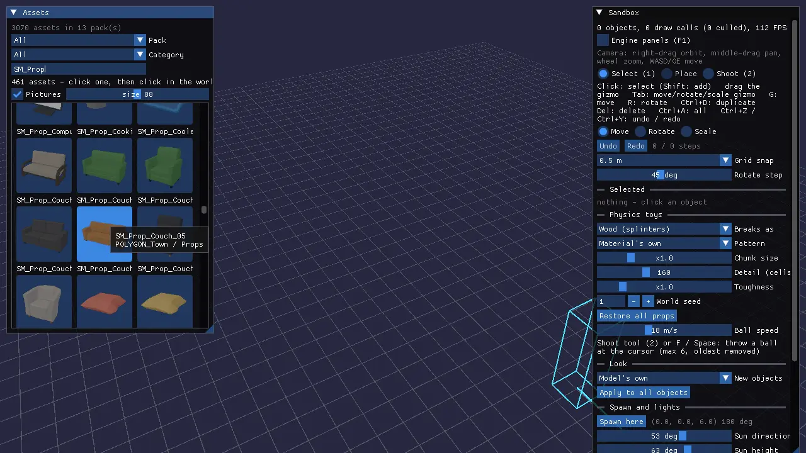
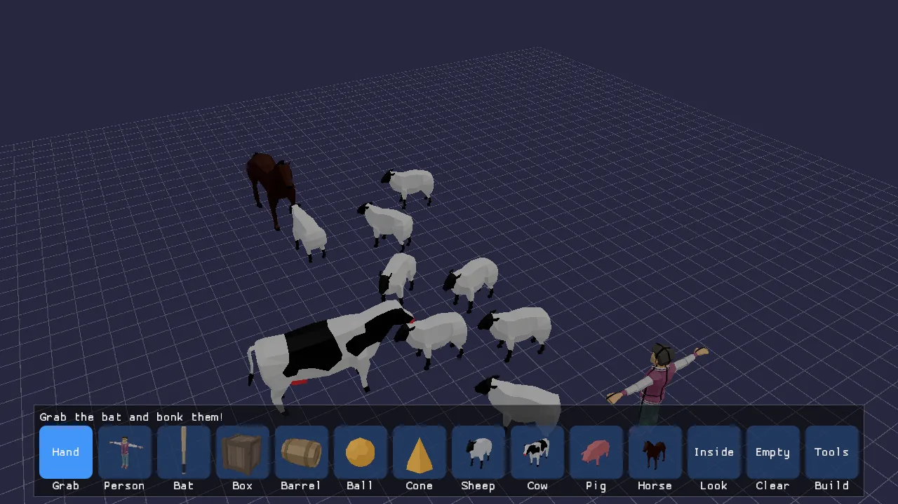
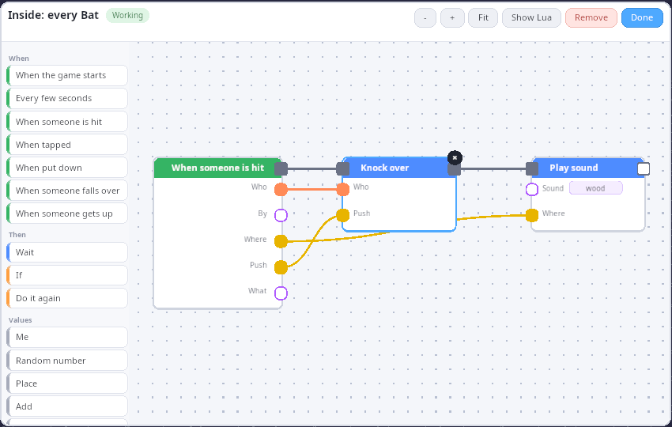

# Sandbox (play to make)

The sandbox is a toy box over your own asset packs. It opens in **Play
mode**: a row of big pictures along the bottom of the screen. Drag a
person, a box or a sheep into the world, pick up the bat and bonk the
person: they ragdoll with a wooden sound. Press **Look**, then the bat,
and you see the node graph that makes the bat work. Change it and the
bat changes while the game keeps running. Press **Build** (or F2) and
the same world becomes a level editor: an asset browser with thumbnails,
a move/rotate/scale gizmo, undo/redo, lights, breakable props, and save
and load as a `kke.scene` that other games can load.

This demo is the first working version of the engine's "make the game
while playing it" idea. Read [docs/PLAY_TO_MAKE.md](../../docs/PLAY_TO_MAKE.md)
first: it explains the three levels (tiers) of making, and this demo
builds all three on one set of building blocks:

| Tier | Who it is for | How you make things here | Where it lives |
|---|---|---|---|
| **Simple** | A child, a first-timer | Drag pictures out of the palette, click with the bat | `updatePalette()` / `palettePressed()` in [SandboxModule.cpp](SandboxModule.cpp), drawn by [PlayPalette.cpp](PlayPalette.cpp) (RmlUi) |
| **Intermediate** | Creative people who don't code | The node graph behind a block, a thing or the level (the Look tool) | [GraphEditor.cpp](GraphEditor.cpp), [PlayScripting.cpp](PlayScripting.cpp) |
| **Advanced** | Programmers | Plain Lua calling the same `play.*` functions | [kke/PlayScript.h](../../engine/include/kke/PlayScript.h), [docs/SCRIPTING.md](../../docs/SCRIPTING.md) |

It is the starting point for level editors, "build then play" games,
physics toy boxes, and any game that wants players (or designers) to
wire up behaviour without writing code.







## Run it

The executable is `sandbox` ([CMakeLists.txt](CMakeLists.txt)). It is
built in every configuration (the root `CMakeLists.txt` adds
`games/sandbox` with no option guard).

```sh
cmake --preset default && cmake --build --preset default
cd build/bin && KKE_SKIP_INTRO=1 ./sandbox
```

What each build option changes:

| Option | Default | Without it |
|---|---|---|
| `KKE_ENABLE_JOLT` | ON | No ragdolls. The bat still swings; the hint says falling over needs Jolt. |
| `KKE_ENABLE_FEMFX` | OFF (ON in the `everything` preset) | No breakable props, no thrown balls, no Throw picture, no Shoot tool. |
| `ENGINE_ENABLE_LUA` | ON | No node graphs: the Look picture is hidden and the bat knocks people over by itself (a C++ fallback in `updateBat()`). |

It needs asset packs to show anything useful. It looks in
`assets/synty/`, then the folders named by `KKE_ASSETS_DIR` or
`KKE_SYNTY_DIR` (`kke::findAssetFolder` in `init()`). With nothing
found, Play mode says "No asset packs found. Press Build to pick a
folder." and the Assets panel lists every place it searched and takes a
path. With a controller connected it also shows a keyboard on screen
(`folderKeyboardUi()`), the only place the sandbox needs typing: point
at a key and press A.

Environment variables (all read in `SandboxModule::init()` or
`initGraphs()`):

| Variable | What it does |
|---|---|
| `KKE_SKIP_INTRO=1` | Skips the logo intro (engine-wide, developer builds). |
| `KKE_ASSETS_DIR`, `KKE_SYNTY_DIR` | Where your packs are. |
| `KKE_SCENES_DIR` | Where `scenes/` is; the default save path is `scenes/sandbox.scene.json` there. |
| `KKE_SANDBOX_MODE=build` | Starts in the editor. `play` (the default) starts in Play mode; anything else logs a warning. |
| `KKE_SANDBOX_LAYOUT=file` | Loads a level at startup (screenshots, sharing). |
| `KKE_SANDBOX_SAVE=file` | Saves the level right after startup. With `KKE_SANDBOX_LAYOUT` it converts an old layout file to a `kke.scene`. |
| `KKE_SANDBOX_REPLAY=file` | Plays timed finger and virtual-gamepad input (see "Replays" below). |
| `KKE_SANDBOX_LOOK=bat` or `level` | Starts with that graph open. Any block id works (`sheep`, `person`...). Read with `kke::dev::env`, so it is compiled out of shipping builds. |

## Controls

### Play mode (Simple)

| Action | Mouse / keyboard | Finger | Controller |
|---|---|---|---|
| Point | mouse | where you touch | left stick moves a big ring cursor |
| Drag a picture into the world | press the picture, drag, let go | touch, slide, let go | hold A on the picture, move the stick, let go |
| Tap a picture, then place | click the picture, then click the spot | tap, tap | A, move, A |
| Pick up and move a placed thing | press on it (Grab tool) and drag | same | hold A on it and move |
| Tap a thing (fires "When tapped") | click it without moving (under 8 px) | tap | A |
| Swing the bat (Bat picture in hand) | click a person or the ground, or Space | tap | A |
| Next / previous picture | | | RB / LB, or D-pad right / left |
| Put it back, drop the tool | Esc | | B |
| Turn the view | right-drag | two fingers drag or twist | right stick |
| Zoom | wheel | pinch | triggers (right in, left out) |
| Pan the view | middle-drag, WASD, Q/E down/up, Shift faster | | no controller binding yet |
| Get everyone up | the Get up picture | same | Y |
| Undo | Ctrl+Z | | no controller binding yet |
| Open the editor (Build) | the Build picture, or F2 | the Build picture | Start (Start again comes back) |
| Engine debug panels | F1 | | |

Camera controls come from `OrbitCameraModule` in `Editor` mode
(`main.cpp`: `camera.setControls(kke::OrbitCameraModule::Controls::Editor)`),
so the left button is free for the palette and the bat.

### The node graph editor (Look)

| Action | Mouse / keyboard | Finger | Controller |
|---|---|---|---|
| Add a block | click it in the list on the left | tap | A on it |
| Add a block that fits a port | drag a wire from the port into empty space, pick from the menu | same | hold A on the port, move, let go |
| Wire two ports | drag from one port to another | same | hold A and move |
| Pick a wire up again | drag from a wired input | same | same |
| Select a block or wire | click it | tap | A |
| Remove the selection | Delete / Backspace, the round x, or Remove | the x | X |
| Change a value | - / + buttons, click to cycle or flip, type text | same | A on the buttons |
| Move the view | drag the empty canvas | two fingers | right stick (cursor over the editor) |
| Zoom | wheel on the canvas, the - / + buttons | pinch | triggers (cursor over the editor) |
| Show everything | Fit | Fit | Y |
| Show the Lua | Show Lua | same | A on it |
| Close | Done, Esc | Done | B |

### Build mode (the editor)

On a controller Build mode works like Play: the left stick moves the
pointer (a ring) and A is its left button, so the panels, the gizmo and
placing work as with a mouse (`updatePad()` runs in both modes); B, X,
Y, LB, RB and the d-pad are the editor's keys (`buildPadButton()`), and
Start goes back to Play. Anything without a button is a panel control
the pointer can press, because every panel is RmlUi and every control in
it is a click (see "The Build panels" below): holding A on a `-` or `+`
keeps stepping, and the right stick scrolls the panel the pointer is on.
The inspector's help lines switch to the pad's buttons for 5 seconds
after the pad was last used.

| Action | Mouse / keyboard | Controller |
|---|---|---|
| Pick an asset to place | click it in the Assets panel | point at it, A |
| Next / previous page of assets | `Next >` / `< Back` in the Assets panel | point at it, A |
| Filter the assets | the Pack and Category choices, the Search field | the choices with A; Search needs a keyboard |
| Scroll a panel | wheel over it | right stick with the pointer on it |
| Place | click in the world (Shift+click keeps placing) | A |
| Rotate while placing | R / Shift+R, Ctrl+wheel | RB / LB |
| Select | click (Shift+click adds or removes); Ctrl+A selects all | A |
| Gizmo mode | Tab cycles move, rotate, scale (or the radio buttons) | D-pad up |
| Drag a gizmo handle | left-drag; hold Shift for no snapping | hold A and move |
| Move the selection (follows the mouse) | G | the Move button in the inspector |
| Rotate the selection by the step | R / Shift+R | RB / LB |
| Duplicate | Ctrl+D (the copies follow the mouse; Esc takes them away) | Y |
| Delete | Delete or Backspace | X |
| Undo / redo | Ctrl+Z / Ctrl+Y or Ctrl+Shift+Z (100 steps) | D-pad left / right |
| Ragdoll or stand up the selected person | K | the inspector's button |
| Make the selected prop breakable, or restore it (FEMFX) | X | the inspector's button |
| Select tool / Shoot tool (FEMFX) | 1 / 2 | the inspector's buttons |
| Throw a ball at the cursor (FEMFX) | F or Space, or click with the Shoot tool | A with the Shoot tool |
| Save / load the level | Ctrl+S / Ctrl+L | the inspector's buttons |
| Stop placing, stop shooting, clear the selection | Esc | B |
| Back to Play | F2, or "Back to Play (F2, Start)" at the top | Start |
| Engine debug panels | F1, or the "Developer panels (F1)" toggle at the top of the inspector | the toggle: point at it, A |
| Camera | right-drag orbit, middle-drag pan, wheel zoom, WASD/QE move, Shift faster | right stick turns, triggers zoom |

## How it plays

**Play mode.** The palette shows only blocks whose assets are on disk
(`kke::availableAssets`). The row is: Grab (the hand), then each block
in `kke::defaultPlayBlocks()` order (Person, Bat, Box, Barrel, Ball,
Cone, Sheep, Cow, Pig, Horse), then Throw (FEMFX builds), Look (Lua
builds), Get up (only while someone is down), Clear (only when the world
is not empty) and Build. One line of hint text above the row changes
with what you hold and who is standing ("Drag a person into the
world!", "Click someone to bonk them!", "Everyone fell over! Press Get
up.").

- People turn to face the camera as you drag them out, and every person
  looks different (the Person block picks a random character from the
  ones on disk).
- Animals live their own lives on the AI core in Play mode: they wander,
  graze and may run from a bat swing, which is a noise they hear. In
  Build mode they stand still where they were put.
- Clear empties the world and Ctrl+Z brings it back. Nothing asks "are
  you sure?" (rule 3 of "What makes Simple mode simple" in
  PLAY_TO_MAKE.md).
- There is no win or lose. If a graph adds points (`play.addScore`), a
  score appears top right; `play.say` shows its words in a big bubble
  at the top of the screen for 4 seconds.

**Build mode.** A level editor: pick assets, place, stack (a new piece
lands on top of whatever is under the cursor), edit, set the spawn point,
mood, sun and up to 2 point lights, and save. The Assets panel sits on
the left, the inspector (Tools, Selected, Physics toys, Look, Spawn and
lights, Level) on the right, and "Back to Play" at the top. The saved
file is a `kke.scene` in `scenes/`, so `kke_demo` lists it in its Scenes
panel and you can walk your level there with collision.

## How it works

### Startup and the frame

[main.cpp](main.cpp) builds the app and adds modules in this order:

1. `OrbitCameraModule` (distance 14, Editor controls, distance limits 1
   to 120 m).
2. `ModelModule` (loads and draws every model), `ThumbnailModule`
   (pictures for the palette and the Assets panel).
3. `DebugDrawModule`, added before the sandbox on purpose: its
   `update()` clears last frame's lines, then the sandbox adds this
   frame's (the comment in `main.cpp` says so).
4. `RigidBodyModule` (Jolt, when `KKE_ENABLE_JOLT`): ragdolls, the floor
   and a box collider per placed piece.
5. `AudioModule` and `SoundVisualizerModule`: bonks, thuds, impacts.
6. `PhysicsModule` (FEMFX, when `KKE_ENABLE_FEMFX`), with its own ground
   drawing turned off because the sandbox draws a grid.
7. `UiModule` (RmlUi), which the palette, the Build panels and the node
   graph editor draw in.
8. `SandboxModule`, then `DebugControlModule` and `StatsModule`.

The camera, physics, audio and debug modules are handed to
`sandbox.setEnginePanels()`, which hides their ImGui panels until F1.
Escape does not quit (`setQuitOnEscape(false)`) because Esc cancels
placing. The mood is `clear_day` ([docs/MOODS.md](../../docs/MOODS.md)).

`SandboxModule::init()` finds the best ragdoll provider
(`kke::bestRagdollPhysics`: Jolt over FEMFX), adds a 400 x 400 m static
Jolt floor with its top at y = 0, loads the palette
(`kke::defaultPlayBlocks()`), sets up the graphs (`initGraphs()`,
before any level loads, because levels carry graphs), opens the gamepad
subsystem, scans the asset folder and applies the env variables above.

Each frame, `SandboxModule::update()` does, in order:

1. `updateReplay()`, then `updatePad()` (both modes): left stick to
   pointer, right stick and triggers to the view, or the right stick to
   the graph editor or the Build panel under the pointer.
2. Draws the ground grid around the camera target, snapped to twice the
   grid step so it does not swim as the camera moves.
3. `updateBreakables()`: redraws FEMFX props from their tets.
4. `updateStaggers()`, then copies every ragdoll's body transforms onto
   its character's skeleton (`kke::poseFromRagdoll`), blending back to
   the standing pose while getting up.
5. Updates the spawn marker and the point lights (engine light slots 2
   and 3; slots 0 and 1 are the sun and sky). Play mode hides the markers
   but keeps the light.
6. The current tool: gizmo drag, placement ghost, bat aim cross, ball aim
   cross, or hover picking.
7. `updateBat()`, then `updateGraphs()` (which also runs the animals).
8. Selection and hover boxes, then the gizmo.

`renderUi()` runs once a frame, after `update()`:

1. `graphUi()` hands what graphs say and the score to the palette
   (`PlayPalette::setWords`), in Play mode only.
2. `updatePalette()` shows the palette in Play and hides it in Build,
   and tells it what the row holds.
3. In Build, the three `FormPanel`s are shown and filled between
   `begin()` and `end()`: `assetBrowserUi()` fills the Assets panel
   (left), `inspectorUi()` the Sandbox panel (right; it calls
   `lookUi()` and `lightsUi()` for its Look and Spawn and lights
   sections), and `modeSwitchUi()` the "Back to Play" button (top
   centre).
4. `padCursorUi()` draws the pad's pointer ring.

All the panels are RmlUi. The only ImGui left is the pointer ring, drawn
on ImGui's foreground list so it stays on top of every panel, and the F1
developer panels.

### The Play palette (PlayPalette.cpp)

`PlayPalette` is one RmlUi document: the row of pictures along the
bottom with the hint line above it, a speech bubble at the top centre
for `play.say` and the score at the top right. Its RML and RCSS are the
`kDocument` string at the top of the file; there are no separate
`.rml` or `.rcss` files.

The sandbox talks to it in three calls. `set(hint, cells)` says what the
row holds each frame; the document is rebuilt only when the RML it makes
is different from last time. `setWords(said, score)` fills the bubbles.
`onPress` is a callback: a mouse down on a picture calls it with the
picture's id at once, on the press and not the release, so a picture
can be dragged out and let go in the world. Pictures are the cached
thumbnail PNGs, or a big word when there is no picture yet.
`contains()` and `cellCentres()` answer "is the pointer on the row" and
"where are the pictures" for `mouseOverUi()` and the pad's LB / RB.

### The Build panels (FormPanel.cpp)

`FormPanel` is immediate mode over RmlUi, so the editor code reads like
the ImGui it replaced. Each panel is its own document (the `kDocument`
string, the dark look of `DemoPanelModule` with bigger targets), placed
by the CSS given to its constructor in `SandboxModule.h`.

Every frame the sandbox calls `begin()`, then one function per row
(`section`, `text`, `button`, `toggle`, `choice`, `slider`, `number`,
`colour`, `textField`, `tile`), then `end()`. Each row call takes the
value by reference and returns true in the frame the player changed or
pressed it:

```cpp
if (p.section("Level")) {
    if (p.button("Save (Ctrl+S)")) saveLayout(m_layoutPath);
    ...
}
```

How it works inside:

- **Rows have a signature.** Each row call adds a row with a `sig` (its
  kind and label). `end()` compares every row's `sig` with what the
  document shows (`builtSig`). If any differ (a row added, a label
  renamed, a picture ready) the whole document is rebuilt (`build()`).
  Otherwise only changed values are written into the elements
  (`refresh()`), so a text field keeps the keyboard while you type.
- **Presses become events.** Every clickable element carries
  `data-row` and `data-part` (press, minus, plus, bar, text). One
  listener on the document turns a mouse down into an `Event` for that
  row. The row call in the next frame picks up its events (`take()`)
  and changes the value. A press on a row whose `sig` changed since it
  was built is dropped, so a press on a row that vanished does nothing.
- **Holding repeats.** Holding `-` or `+` steps again after 0.4 s, then
  every 0.06 s. Pressing a bar sets the value where you pressed, and
  moving with the button held drags it.
- **Sections fold.** A section title is a row too; the panel remembers
  which are folded, and `section()` returns whether it is open.
- **One undo per edit.** `slider()` and `number()` can set a `started`
  flag on the press that begins an edit (not on repeats or drags), so
  the inspector pushes one undo step per edit, not one per frame.
- **Where the pointer is.** `contains()` says whether a point is on the
  panel, `scroll()` moves it (the right stick), and `typing()` and
  `blur()` let the sandbox hold back its shortcuts while a text field
  has the keyboard.

The Assets panel shows one page of 12 pictures (`kPage` in
`assetGridUi()`) with `< Back` and `Next >` buttons, so only the
pictures on the page are asked for and a 3,000-asset catalog costs the
same as a 30-asset one. Changing a filter goes back to page 1.

### Assets and placing

`openAssetFolder()` scans a folder into a `kke::AssetCatalog` (every
`.fbx/.obj/.gltf`, grouped by pack and category), works out which play
blocks have their assets, and applies the pack's first world-grid
overlay (POLYGON Prototype's `_Grid_` textures) so the level looks like
Synty's Prototype style.

`loadAsset()` uses `kke::packLoadOptions`, the same options
`kke::loadScene` uses, so a level looks the same here and in the games
that load it. It loads synchronously: the comment says a Synty FBX loads
in a few ms and `ModelModule` caches it.

Objects are placed by their bounds, not their pivot, because Synty
pivots differ per piece (corner for walls, centre for props).
`position` is the bottom-centre of the bounds:

```cpp
glm::vec3 center = (d.boundsMin + d.boundsMax) * 0.5f;
glm::mat4 t = glm::translate(glm::mat4(1.0f), position);
t = glm::rotate(t, glm::radians(yawDegrees), glm::vec3(0, 1, 0));
t = glm::scale(t, glm::vec3(scale));
return glm::translate(t, glm::vec3(-center.x, -d.boundsMin.y, -center.z));
```

This is the same maths as `kke::SceneFile::placement`, so saved scenes
load where they were placed.

`placementPoint()` casts the mouse ray (`kke::screenToRay`) against the
ground plane y = 0 and against every object's world bounds
(`kke::rayAabb`). The nearest hit wins. X and Z snap to the grid
(`m_snap`, 0.5 m by default); Y takes the top of the object hit and never
snaps, so stacking is exact. Placing shows a "ghost": the real model with
its real texture and a green outline. Moving an existing thing moves the
real instance instead of spawning a ghost; with several selected, the
others keep their offset from it (`m_groupMove`).

Picking (`pickObject()`) is a brute-force slab test over every object's
bounds. The comment measures it: about 20 flops per object, so 2,000
objects stay well under 0.1 ms.

### Selection, gizmo and undo

`m_selection` holds every selected id; `m_selected` is the primary one
(shown in the inspector). The gizmo sits at the average bottom-centre of
the selection and is sized at 15% of the camera distance, so it looks the
same size at any zoom.

- **Move**: closest points between the mouse ray and the axis line
  (`rayLineParam`). The delta snaps to the grid; Y never goes below 0.
- **Rotate**: angle of the mouse on the plane y = pivot, snapped to the
  rotate step (45 degrees by default). A group turns around its centre.
- **Scale**: vertical mouse movement, 200 px doubles, snapped to 10%
  steps, clamped to 0.05 to 20.

Undo stores a `Snapshot`: the saved fields of every hand-placed object
(`ObjectState`). `pushUndo()` is called before each edit and keeps at
most `kMaxUndo` (100). `restore()` works by difference, by object id:
objects that did not change are left alone, so a broken prop elsewhere
keeps its pieces and a ragdoll keeps lying there. Deleted objects come
back with their old id, and their "Placed" event fires again, so a
restored animal becomes an animal again. A gizmo drag pushes a snapshot
at the start and pops it again if nothing moved ("a click on a handle is
not an edit").

### The bat

The bat is `kke::BatSwing` ([kke/PlayBlocks.h](../../engine/include/kke/PlayBlocks.h),
tested in `tests/test_play_blocks.cpp`): a right-handed horizontal swing
around a shoulder pivot, 0.26 s from -80 to 95 degrees.

1. `swingBat()` finds the standing person under the mouse. If there is
   none, it takes the ground point and looks for a standing person within
   `kBatAutoAimMeters` (1.2 m) of it, because fingers and thumbsticks are
   less exact than a mouse.
2. `swingBatAt()` starts the swing with `pivotFor()`, which places the
   shoulder so the bat's sweet spot passes through the target. It also
   makes a noise of loudness 12 at the target for the animals. The bat
   model (`SM_Prop_Bat_01`) is loaded on the first swing, and
   `kke::findLongAxis` finds its handle (the thinner end). Without the
   model the bat is drawn as a thick line.
3. `updateBat()` sweeps the bat's segment through the angles covered
   since the last frame, so a fast swing on a slow frame still hits. Each
   person is tested as a column at most 0.6 m wide, not their bounds: the
   comment says a T-posed character's bounds are mostly air between the
   arms.
4. A hit is queued as a "Hit" event for the graphs (`queueHit`). The
   bat's own recipe then knocks the person over and plays "wood". Without
   Lua, `updateBat()` plays the impact and calls `ragdoll()` itself.

The push is the swing speed at the hit point, capped at 9 m/s, at least
4 m/s, plus 2.5 m/s up (`kke::SwingSettings`).

### Ragdolls, stagger and look-at

`makeRagdoll()` builds a humanoid ragdoll from the character's current
bone pose (`kke::buildHumanoidRagdoll`, 70 kg) and binds the skeleton to
it (`kke::bindSkeletonToRagdoll`). `ragdoll()` pushes the torso and head
with the full push and the pelvis with 40% of it, so the body topples
instead of sliding. `standUp()` destroys the ragdoll and clears the bone
override, so the idle animation plays again.

`stagger()` (the `play.stagger` block, "Shove") is a ragdoll on joint
motors that hold the pose the person had (`kke::ActiveRagdoll`,
[docs/PROCEDURAL_ANIMATION.md](../../docs/PROCEDURAL_ANIMATION.md)). A
small shove makes them stumble and settle back into their animation
where they ended up; a big one knocks them over. `updateStaggers()`
drives the motors every frame and moves the object by how far the pelvis
travelled. A physics without motors gets an ordinary fall.

`lookAt()` (`play.lookAt`) installs a pose modifier
(`ModelModule::setPoseModifier`) that turns the head toward a thing, a
point or the camera using `kke::LookAt`. After `lookAway()` the layer
removes itself once the head is straight again.

### Jolt colliders for placed pieces

`syncCollider()` gives every placed piece (not people, animals or live
breakables) a static Jolt box of its world bounds, rebuilt whenever it
moves. The comment explains why boxes and not meshes: the box is only
what knocked-over people land on, and 2,000 boxes cost Jolt nothing. The
games that load the saved level use the per-object collision setting
(mesh, box or none) instead.

### Breakable props (FEMFX builds)

`makeBreakable()` turns a placed prop into a FEMFX object that breaks as
itself. The steps (from the comment above the function):

1. The prop's triangles, in world space, are voxelized into a tet volume
   (`kke::voxelizeToTets`, budget `m_detailCells`, 160 by default) and
   the outside is pulled onto the real surface (`kke::fitSurfaceToMesh`).
2. The pieces are a Voronoi diagram of the material's fracture pattern
   cut into the tets (`kke::bakeFracture`, [kke/VoronoiFracture.h](../../engine/include/kke/VoronoiFracture.h)).
   The seed is the world seed mixed with the object's own
   (`kke::fractureSeed`), so the same layout and seeds break the same way
   every time.
3. The prop's mesh is subdivided, cut where triangles straddle a crack
   (`kke::splitSoupAtPieces`) and each triangle glued to its tet
   (`kke::embedTrianglesInPieces`). `updateBreakables()` redraws it from
   the tets every frame the physics is awake, and skips it once it sleeps
   and its last pose was drawn.
4. The inside of every piece gets one colour: the texture's dominant
   colour as this prop uses it (`kke::interiorFillFromTexture`).
5. Fracture arms 2 s after spawning (`armFractureAfterSeconds`), relative
   to the resting stress, so props do not break by themselves (BUG-043 in
   [BUGS.md](../../BUGS.md)).

If the physics removes an object (its runaway guard), the prop is put
back (`restoreProp()`). `throwBall()` fires a dense 0.22 m ball from the
camera toward the cursor at `m_ballSpeed` (18 m/s); at most `kMaxBalls`
(6) exist, the oldest goes first.

### Node graphs (PlayScripting.cpp)

This is the Intermediate tier. All graphs run as Lua in one
`kke::ScriptVM`, the same VM hand-written scripts use.

- **The world the blocks see.** `PlayGraphs::World` implements
  `kke::IPlayWorld` over the sandbox: `spawn`, `remove`, `ragdoll`,
  `standUp`, `stagger`, `lookAt`, `swingAt`, `sound`, `say`, `addScore`,
  `position`, `blockOf` and so on. `kke::bindPlayBlocks` binds it as
  `play.*`. `kke::ai::bindAi` adds `ai.*` before the library is built,
  so the animal recipes' nodes exist.
- **The node library is the Lua API.** `kke::NodeLibrary::fromApi` turns
  every documented binding into a block and every documented event into
  a "When" block. Adding a `play.*` binding adds a block.
- **Four kinds of graph**, each loaded under its own source name:
  the level's (`graph:level`), one per palette block, called a recipe
  (`graph:recipe:<block>`), and one per placed thing
  (`graph:thing:<id>`). A recipe's events fire for every thing of that
  block (`me` is that thing); a thing's graph only for that thing.
- **Recipes.** `kke::playBlockRecipe` makes the default ones: the bat's
  is *When someone is hit, Knock over (who, push), then Play sound
  "wood" (where)*; each animal's is *When put down, Be a "sheep"*
  (`ai.add`). People and props have empty recipes.
- **Live reload.** When `m_graphsDirty` is set, `updateGraphs()`
  compiles every graph (`kke::compileGraph`) and reloads only the ones
  whose Lua text changed (`vm.reloadString`). Graphs that are gone are
  unloaded, which also removes what they spawned.
- **Events.** Things that happen in C++ are queued (`queueHit`,
  `queueClicked`, `queuePlaced`, `queueFellOver`, `queueStoodUp`) and
  fired at the next `updateGraphs()` through `kke::firePlayHit` and
  friends. Then timers run (`vm.updateTimers`), then the animals.
- **Removing safely.** `play.remove` only marks the thing
  (`g.removing`); it is removed after the scripts ran, because the
  thing's own graph may be what is running.
- **Errors on blocks.** Every compiled step calls `graph.ran(node)`
  (`CompileOptions::trace`), so the editor lights the block up. A Lua
  error is mapped from its line back to the block that made it
  (`CompiledGraph::nodeForError`).
- **Caps.** One graph may have at most `kMaxSpawnsPerGraph` (200) things
  out at once.

The editor edits a copy (`PlayGraphs::editing`), written back to the
level, recipe or thing on every change, because things live in a vector
that moves.

### The node graph editor (GraphEditor.cpp)

`GraphEditor` is an RmlUi document styled after Drawflow (MIT): white
blocks with a coloured head (green "when", blue "do", orange "if /
repeat", grey values), round ports coloured by type, curved wires on a
dotted canvas. The comment says Drawflow is JavaScript, so its look and
way of working are ported, not its code. The RCSS is the `kDocument`
string at the top of the file.

- `open()` fills the block list by category and shows the document.
  `rebuild()` regenerates the blocks' RML from the graph whenever
  something changed; values are shown as - / + buttons for numbers,
  cycling buttons for sounds and blocks, a Yes / No toggle for booleans,
  and text fields only for text and places.
- Wires and dots are drawn by a custom element, `<graphwires>`
  (`GraphWires::OnRender`), as triangle strips along a cubic Bezier,
  because RmlUi has no curves of its own. `layoutWires()` reads the port
  positions from the laid-out elements each frame.
- `update()` handles drags (canvas, block, wire), fades the "lit" blocks
  after 0.6 s, fits the view (`Fit`), and returns `Changed` (recompile),
  `Moved` (only positions: save, do not restart the graph) or `Closed`.
- Dropping a wire on empty canvas opens a menu of only the blocks that
  have a matching port (`openFitsMenu`, `NodeLibrary::compatible`).
- Text fields apply on Enter or when you leave the field, not on every
  letter, "so the game isn't restarted mid-word".

### Animals

In `updateAnimals()` (PlayScripting.cpp) every person is an actor
("farmer") in a `kke::ai::AiWorld`, so the animals can see them. In
Build mode, or while an animal is being carried, the sandbox leads: the
AI is told where the thing is. In Play mode the AI leads: `ai.update()`
runs, its events ("Spotted", "Scared"...) go to the graphs
(`kke::ai::fireAiEvents`), and each animal takes its position, facing and
clip from its agent (`kke::ai::clipForAnim` picks the model's clip for
the AI's animation name). See [docs/AI.md](../../docs/AI.md).

### Touch, gamepads and replays

- **Touch.** One finger is the mouse (SDL's touch-to-mouse), so
  everything that works with a mouse works with a finger. Two fingers
  belong to the camera (`kke::TouchGestures` inside
  `OrbitCameraModule`). A second finger landing drops what the first was
  dragging (`dropFingerDrag()`). Fingers that start on the graph editor
  move and zoom the graph instead (`m_graphTouch`).
- **Gamepad.** The first pad drives the real mouse pointer:
  `kke::padPointerStep` turns the left stick into a pointer step (dead
  zone 0.2, curve 2, 900 px/s on a 720 px tall screen, scaled to the
  window), and `SDL_WarpMouseInWindow` moves the mouse. A sends real
  mouse button events (`pointerButton()`), so RmlUi, ImGui, dragging and
  the bat cannot tell a pad from a mouse. A ring is drawn for 5 s after the pad
  was last used, because phones and TVs show no mouse pointer. In Play,
  LB / RB jump along the palette (`kke::stepPaletteCell`,
  `padButton()`); in Build, the buttons other than A are the editor's
  keys (`buildPadButton()`), and the right stick scrolls a Build panel
  when the pointer is on it.
- **Replays.** `KKE_SANDBOX_REPLAY=file` reads one step per line and
  pushes the same SDL events real hardware makes:

  ```text
  0.5 finger down <id> <x> <y>     (x, y: 0..1 of the window; also move, up)
  1.0 pad attach                   (a virtual gamepad the next lines drive)
  1.2 pad axis <leftx|lefty|rightx|righty> <-1..1>
  1.4 pad button <a|b|x|y|lb|rb|start|left|right> <0|1>
  ```

  The replays in `tests/sandbox_replays/` place a person with a
  gamepad, take the bat and knock them over (`gamepad_bat`), go from
  Build to Play and back with Start and move the pointer and the view
  (`gamepad_build`), and zoom and turn the view with two fingers
  (`touch_gestures`). Pushed finger events skip SDL's touch-to-mouse step,
  so one-finger dragging is only checked through the mouse path.

### Saving and loading

`toScene()` writes a `kke::SceneFile` ([kke/SceneFile.h](../../engine/include/kke/SceneFile.h),
[docs/SCENES.md](../../docs/SCENES.md)): name, description, spawn and
facing, world seed, mood, sun, ambient, point lights, and per object the
asset, position, yaw, scale, collision, texture (file name only, so it
works on another machine's pack folder), breakable material, fracture
seed and graph. Things a graph spawned are not saved: the graph brings
them out again. People are saved with collision `None` (the comment says
characters are decoration in a level). A floor is added: centred on the
origin, 20 m past the furthest object, at least 40 x 40 m. The level's
graph and every recipe that differs from the built-in one are saved too
(`graphsToScene()`).

`loadLayout()` reads JSON or YAML (`kke::datafile::parseAny`). A file
with `"format": "kke-sandbox-layout"` is an older sandbox layout and is
converted; anything else is parsed as a `kke.scene`. `fromScene()`
expands grid objects into single objects, keeps pivot placement and
non-uniform scale as bounds placement and uniform scale (and logs it),
remakes breakables with the same material and seeds, and fires "Placed"
for every object so recipes run. A failed load changes nothing and puts
the reason in the status line.

## Design decisions

- **One set of blocks, three ways to hold them.** The palette, the node
  graph and Lua all call the same `play.*` bindings. PLAY_TO_MAKE.md:
  "The three levels must not be three engines." A palette block is a
  recipe graph, a graph is Lua, so every tier leads to the next.
- **A graph compiles to Lua instead of being interpreted.** The graph is
  loaded into the same `ScriptVM` hand-written scripts use, so there is
  one runtime, "Show Lua" shows exactly what runs, and Lua errors can be
  mapped back to blocks.
- **The node library is generated from the documented API**
  (`NodeLibrary::fromApi`). Adding a binding adds a block; there is no
  second list to keep in sync.
- **The graph editor is RmlUi, not ImGui.** PLAY_TO_MAKE.md says it is
  RmlUi "so it is also there in shipping builds and on touch screens".
- **Build mode's panels moved from ImGui to RmlUi too.** The Assets
  panel, the inspector and "Back to Play" were ImGui windows. The commit
  that moved them gives the rule: making things in the game is RmlUi,
  ImGui stays for the F1 developer panels (docs/DEMO_PANEL.md). The same
  commit moved what graphs say and the score into the Play palette's
  document. So every screen a player uses to make things (the palette,
  the graph editor, the Build panels) is RmlUi and works with a finger
  and the pad's pointer. The pointer ring stays ImGui on purpose: it is
  drawn on ImGui's foreground list, on top of every RmlUi panel.
- **The Build panels are written like ImGui windows.** `FormPanel` is
  immediate mode over RmlUi: every frame `inspectorUi()` lists its rows
  (`slider()`, `choice()`, `button()`...) and a row returns true in the
  frame it was changed, so the editor code reads like the ImGui it
  replaced. The document is rebuilt only when the rows themselves change;
  values are updated in place, so a text field keeps the keyboard while
  you type. A press is matched to its row by position and what the row
  is, so a press on a row that vanished that frame does nothing.
- **Every control is a click.** Sliders have `-` and `+` beside the bar,
  a selected object's position steps by the grid snap (and its turn by
  the rotate step), and colours are three bars, because the
  pad's pointer can press and hold but can't type or drag precisely. The
  Assets panel shows one page of 12 pictures at a time for the same
  reason (and so only those pictures are made).
- **Drawflow's look, ported by hand.** Drawflow is a JavaScript library;
  the header comment says its look and way of working were ported, not
  its code.
- **The gamepad fakes the mouse.** The commit that added it ("Play mode
  on touch screens and gamepads") and the comment on `pointerButton()`:
  sending real mouse events means the palette, dragging and the bat
  "can't tell a gamepad from a mouse", so there is one input path to
  test. Build mode later got the same treatment (`buildPadButton`): the
  stick drives the pointer, A clicks, and the other buttons do what the
  editor's keys do. Start toggles between Build and Play.
- **The bat aims itself.** A tap on the ground within 1.2 m of a standing
  person swings at them; the commit message says "fingers and thumbsticks
  are less exact than a mouse".
- **Hit people by their body, not their bounds, and always push at least
  4 m/s.** From the commit "Play mode bat: Jolt ragdolls in the default
  build": a T-posed person's bounds are mostly air, so the bat used to
  hit at the very start of the swing where it barely moves; and a hitch
  on the first swing (loading the bat model) made the push nearly zero.
  Frames longer than 50 ms advance the swing by only 50 ms.
- **Jolt over FEMFX for ragdolls** (`kke::bestRagdollPhysics`): Jolt has
  joint limits and colliding limbs, and it is on in the default build, so
  the bat works for everyone. FEMFX stays for breakables.
- **Static Jolt boxes, not meshes, for placed pieces.** The comment on
  `syncCollider()`: they only have to catch falling people, and 2,000
  boxes cost Jolt nothing. Saved levels keep an exact per-object setting
  for the games that load them.
- **Place by bounds, not pivot.** Synty pivots differ per piece; bounds
  placement matches `SceneFile::placement`, so a level loads where it was
  built.
- **Undo by difference, by id.** `restore()` leaves unchanged objects
  alone, so undoing an unrelated edit does not rebuild a broken prop or
  stand up a ragdoll.
- **Brute-force picking on purpose.** Measured fine for 2,000 objects; a
  grid or BVH is in the [docs/OPTIMIZATION.md](../../docs/OPTIMIZATION.md)
  backlog (entry 12).
- **Everything that can pile up has a cap** (OPTIMIZATION.md rule 5): 6
  balls, 100 undo steps, 200 things per graph, 512 "ran" marks per update
  and 64 lit blocks at once.
- **Shortcuts are blocked only while typing** (`typingInUi()`: a text
  field in a panel has the keyboard; never "a panel has focus"). BUG-041:
  ImGui claimed the keyboard whenever one of its windows had focus, which
  silently swallowed F, Delete and R after any click on a panel. Enter or
  Esc gives the keyboard back.
- **Settle, then arm fracture.** BUG-043: FEMFX's resting stress on a
  standing prop was above the measured break thresholds, so props broke
  on spawn. They now arm 2 s later, relative to their resting stress.

## Tuning

| What | Where | Value | Effect of raising it |
|---|---|---|---|
| Bat auto-aim radius | `kBatAutoAimMeters`, SandboxModule.cpp | 1.2 m | Taps further from a person still hit them. |
| Swing time, angles, reach, pushes | `kke::SwingSettings`, kke/PlayBlocks.h | 0.26 s, -80 to 95 deg, 1.25 m, 4 to 9 m/s, 2.5 m/s up | Longer, wider or harder swings; people fly further. |
| Bat noise for animals | `animalNoise(target, 12.0f)` in `swingBatAt()` | 12 | Animals hear the swing from further away. |
| Pad cursor speed | `kke::PadPointerSettings` | dead zone 0.2, 900 px/s, curve 2 | Faster cursor; a higher curve gives finer small tilts. |
| Right stick and trigger camera speed | `updatePad()` | 2.2 yaw, 1.6 pitch, 1.5 zoom per second | Faster view turning and zoom. |
| Play mode pitch limits | `setMode()` | -1.45 to -0.12 rad | Lets the view go lower or higher. |
| Grid snap | inspector "Grid snap", `m_snap` | 0.5 m (off, 0.25, 0.5, 1, 2.5, 5) | Coarser placement. |
| Rotate step | inspector, `m_rotateStep` | 45 deg (5 to 90) | Bigger rotation steps for R and the ring. |
| Undo depth | `kMaxUndo`, SandboxModule.h | 100 | More memory for more steps. |
| Ball speed | inspector "Ball speed", `m_ballSpeed` | 18 m/s (5 to 40) | Harder hits; the material presets (`kke::breakPreset`, engine/src/Breakables.cpp) were tuned so 12 m/s breaks nothing and 18 m/s breaks all four breakable materials. |
| Max balls | `kMaxBalls` | 6 | More balls alive at once. |
| Break materials | `kke::breakPreset` (engine/src/Breakables.cpp) | Wood, Stone, Glass, Ceramic, Metal | Density, stiffness, fracture threshold, pattern and chunk size per material. |
| Chunk size, detail, toughness | inspector "Physics toys" | x1.0, 160 cells, x1.0 | Bigger pieces, closer shape (more CPU), harder to break. |
| World seed | inspector | 1 | A different seed breaks every prop differently. |
| Things per graph | `kMaxSpawnsPerGraph`, PlayScripting.cpp | 200 | More things a graph may spawn. |
| "Say" bubble time | `World::say()` | 4 s, 160 characters | Longer bubbles. |
| Graph editor zoom | `GraphEditor::zoom()` | x1.15 per step, 0.3 to 2.5 | Faster or wider zoom. |
| Assets per page | `kPage` in `assetGridUi()` | 12 | More pictures per page, and more thumbnails made at once. |
| Hold to repeat on `-` / `+` | `FormPanel::pressed()`, `FormPanel::begin()` | first repeat after 0.4 s, then every 0.06 s | Slower repeating. |
| Right stick panel scroll | `updatePad()` | 700 points per second at full tilt | Faster scrolling of the Build panels. |
| Build panel size and place | `m_assetsPanel`, `m_toolsPanel`, `m_modePanel` in SandboxModule.h | 300 dp left, 340 dp right, 200 dp top centre | Wider panels. |
| Animal size | `PlayBlock::scale` in `defaultPlayBlocks()` | sheep 0.23, cow 0.3, pig 0.2, horse 0.28 | Bigger animals. |

## Engine features it uses

| Feature | Header / module | Doc |
|---|---|---|
| Asset packs, catalog, finding the folder | [kke/AssetCatalog.h](../../engine/include/kke/AssetCatalog.h) | [SCENES.md](../../docs/SCENES.md) |
| Models, animation, texture overrides, deformed meshes, pose modifiers | [kke/modules/ModelModule.h](../../engine/include/kke/modules/ModelModule.h) | |
| Thumbnails | [kke/modules/ThumbnailModule.h](../../engine/include/kke/modules/ThumbnailModule.h) | [HISTORY.md](../../docs/HISTORY.md) "games/sandbox" |
| Debug lines, boxes, grid | [kke/modules/DebugDrawModule.h](../../engine/include/kke/modules/DebugDrawModule.h) | |
| Orbit camera (Editor controls, pitch limits, nudge, touch) | [kke/modules/OrbitCameraModule.h](../../engine/include/kke/modules/OrbitCameraModule.h) | [INPUT.md](../../docs/INPUT.md) |
| Picking (rays, AABBs, snapping) | [kke/Picking.h](../../engine/include/kke/Picking.h) | |
| Scene files and loading options | [kke/SceneFile.h](../../engine/include/kke/SceneFile.h), [kke/SceneLoader.h](../../engine/include/kke/SceneLoader.h) | [SCENES.md](../../docs/SCENES.md) |
| JSON or YAML files | [kke/DataFile.h](../../engine/include/kke/DataFile.h) | [DATA_FILES.md](../../docs/DATA_FILES.md) |
| Jolt bodies and ragdolls | [kke/RigidWorld.h](../../engine/include/kke/RigidWorld.h), [kke/modules/RigidBodyModule.h](../../engine/include/kke/modules/RigidBodyModule.h), [kke/Ragdoll.h](../../engine/include/kke/Ragdoll.h), [kke/Capabilities.h](../../engine/include/kke/Capabilities.h) | [RAGDOLLS.md](../../docs/RAGDOLLS.md) |
| Active ragdolls and look-at | [kke/ProceduralAnim.h](../../engine/include/kke/ProceduralAnim.h) | [PROCEDURAL_ANIMATION.md](../../docs/PROCEDURAL_ANIMATION.md) |
| FEMFX breakables | [kke/modules/PhysicsModule.h](../../engine/include/kke/modules/PhysicsModule.h), [kke/VoxelTets.h](../../engine/include/kke/VoxelTets.h), [kke/VoronoiFracture.h](../../engine/include/kke/VoronoiFracture.h), [kke/FracturePattern.h](../../engine/include/kke/FracturePattern.h), [kke/InteriorColor.h](../../engine/include/kke/InteriorColor.h) | [HISTORY.md](../../docs/HISTORY.md) "How breakable props work" |
| Play blocks, bat, pad pointer | [kke/PlayBlocks.h](../../engine/include/kke/PlayBlocks.h) | [PLAY_TO_MAKE.md](../../docs/PLAY_TO_MAKE.md) |
| `play.*` bindings and events | [kke/PlayScript.h](../../engine/include/kke/PlayScript.h) | [SCRIPTING.md](../../docs/SCRIPTING.md) |
| Node graphs, compiling to Lua, recipes | [kke/NodeGraph.h](../../engine/include/kke/NodeGraph.h) | [PLAY_TO_MAKE.md](../../docs/PLAY_TO_MAKE.md) "Intermediate" |
| Lua VM, documented bindings | [kke/ScriptVM.h](../../engine/include/kke/ScriptVM.h), [kke/LuaApi.h](../../engine/include/kke/LuaApi.h) | [SCRIPTING.md](../../docs/SCRIPTING.md) |
| Animal AI | [kke/ai/AiWorld.h](../../engine/include/kke/ai/AiWorld.h), [kke/ai/AiScript.h](../../engine/include/kke/ai/AiScript.h), [kke/ai/Clips.h](../../engine/include/kke/ai/Clips.h) | [AI.md](../../docs/AI.md) |
| RmlUi (palette, Build panels, graph editor) | [kke/modules/UiModule.h](../../engine/include/kke/modules/UiModule.h), [kke/RmlTextSafety.h](../../engine/include/kke/RmlTextSafety.h) | |
| Panel value formatting and look | [kke/modules/DemoPanelModule.h](../../engine/include/kke/modules/DemoPanelModule.h) (`formatValue`) | [DEMO_PANEL.md](../../docs/DEMO_PANEL.md) |
| Touch gestures | [kke/TouchGestures.h](../../engine/include/kke/TouchGestures.h) | [INPUT.md](../../docs/INPUT.md) |
| Impact sounds | [kke/modules/AudioModule.h](../../engine/include/kke/modules/AudioModule.h) | [AUDIO.md](../../docs/AUDIO.md) |
| Moods | [kke/Mood.h](../../engine/include/kke/Mood.h) | [MOODS.md](../../docs/MOODS.md) |
| Developer switches | [kke/DevTools.h](../../engine/include/kke/DevTools.h) | [ANTI_CHEAT.md](../../docs/ANTI_CHEAT.md) |

## Assets

No assets are in the repo. The sandbox lists whatever it finds in the
asset folder; the play palette looks for these names
(`kke::defaultPlayBlocks()` in `engine/src/PlayBlocks.cpp`):

| Block | Asset names (first found wins, except Person) | Pack |
|---|---|---|
| Person | `SK_Character_Jock`, `_Tourist`, `_FireFighter`, `_Paramedic`, `_Grandpa`, `_Grandma`, `_HipsterGirl`, `_PunkGuy`, `_SummerGirl`, `_Roadworker`, `_Hotdog` (random pick) | Synty POLYGON City Characters |
| Person | `SK_Character_Female_Druid` | Synty POLYGON Fantasy Characters |
| Bat | `SM_Prop_Bat_01` | Synty POLYGON Prototype |
| Box | `SM_Prop_Crate_01`, `SM_Prop_Crate_02`, `SM_Prop_Barrel_01` | Synty POLYGON Prototype |
| Barrel | `SM_Prop_Barrel_01` | Synty POLYGON Prototype |
| Ball | `SM_Primitive_SoccerBall_01`, `SM_Prop_Bowling_Ball_01` | Synty POLYGON Prototype |
| Cone | `SM_Primitive_Cone_01` | Synty POLYGON Prototype |
| Sheep, Cow, Pig, Horse | `Sheep`, `Cow`, `Pig`, `Horse` | Farm Animals Animated by Quaternius (CC0) |

The Build mode's Assets panel shows every model in every pack found.
POLYGON Prototype's `_Texture_NN` variants and `_Grid_` overlays drive the
"Look" section of the inspector (`CatalogPack::textureVariants` and
`overlayTextures`).

What happens when something is missing:

- **No folder at all:** Play mode shows only the Build picture and "No
  asset packs found. Press Build to pick a folder."; the Assets panel
  lists the searched places and takes a path. CI runs the sandbox this
  way and it must still start.
- **A block's assets missing:** that picture is not shown.
- **The bat model missing:** the bat picture is not shown, so the bat
  cannot be picked. If the model fails to load it is drawn as a line.
- **An object in a loaded level missing:** it is skipped and counted in
  the status line ("N not found in these packs").

Thumbnails are cached per pack in `KKE_THUMBNAIL_CACHE`, else
`~/.cache/kk-engine/thumbnails` (never in the repo, since they are
renders of licensed packs).

## Make a game like this

1. **Decide which tier you need.** A level editor only needs Build mode;
   a creative toy needs the palette; a game with behaviour designers
   change needs the graphs. Read [docs/PLAY_TO_MAKE.md](../../docs/PLAY_TO_MAKE.md).
2. **For a Lua game, start from the template**: `tools/new_game my_game`
   copies `games/template`. You get the same `play.*` API only if your
   game provides an `IPlayWorld`; that is C++ (see step 4).
3. **For a C++ game**, copy `games/sandbox` to `games/my_game`, rename
   the executable in `CMakeLists.txt`, the namespace `kke_sandbox`, and
   the `id` and `title` in `game.json`, and add
   `add_subdirectory(games/my_game)` to the root `CMakeLists.txt`. See
   the [cpp-module skill](../../skills/cpp-module/SKILL.md).
4. **Change the palette first.** Blocks come from
   `kke::defaultPlayBlocks()`. Your game can build its own
   `std::vector<kke::PlayBlock>` in `init()` instead (id, label, kind,
   asset names, random pick, scale, species). Give each block a recipe
   with `kke::NodeGraph` (see `kke::playBlockRecipe` for how the bat's
   is built).
5. **Add a new kind of block** (a door, a trampoline) by adding a
   documented binding to your `IPlayWorld` and to Lua: every documented
   binding becomes a node automatically.
6. **Save with `kke::SceneFile`**, so your levels load in any game
   through `kke::loadScene` ([docs/SCENES.md](../../docs/SCENES.md)).
7. **Make every player screen RmlUi.** For editor panels, copy
   `FormPanel.h` and `FormPanel.cpp` and fill a panel each frame between
   `begin()` and `end()`, as `inspectorUi()` does. For a row of big
   pictures, copy `PlayPalette`. Keep every control a click, so the
   pad's pointer and a finger can use it, and keep ImGui for developer
   panels only.
8. **Test headless** with replays (`KKE_SANDBOX_REPLAY`) and
   `KKE_SANDBOX_LAYOUT` / `KKE_SANDBOX_SAVE`, and check the log for
   warnings ([check-and-debug skill](../../skills/check-and-debug/SKILL.md)).

Pitfalls the code shows:

- **Pointers into `m_objects` go stale.** Spawning pushes into a vector,
  so `PlayScripting.cpp` copies graphs before loading them and the editor
  edits a copy. Look objects up by id (`find()`) after anything that can
  spawn.
- **Do not remove a thing from inside its own script.** Queue it and
  remove it after the scripts ran (`g.removing`).
- **Gate shortcuts on typing, not on focus** (`typingInUi()`, BUG-041).
- **"Over the UI" means where the pointer is, not what was pressed.**
  RmlUi (like ImGui) keeps the mouse while a press lasts, so a picture
  dragged out of the palette would never be let go "in the world".
  `mouseOverUi()` asks the palette, the Build panels and the graph
  editor whether the pointer is on them (`contains()`), and ImGui whether
  a window is under it.
- **RmlUi element offsets leave out transforms.** The palette is centred
  with a full-width row and `text-align: center`, not `translateX(-50%)`,
  so `contains()` and `cellCentres()` match what is drawn.
- **Do not rebuild an RmlUi document every frame.** Rebuilding takes the
  keyboard away from a text field and drops a press in progress.
  `FormPanel` rebuilds only when its rows change and writes new values
  into the elements it already has; `PlayPalette` rebuilds only when its
  RML changes.
- **Attach RmlUi documents in `init()` and close them in `shutdown()`.**
  The panels need the `UiModule`'s context, and `shutdown()` closes them
  before the `UiModule` shuts RmlUi down.
- **Add `DebugDrawModule` before your module**, or your lines are cleared
  the frame you draw them.
- **The same asset in two blocks** reports the first block in
  `blockOf()`: see the note about Barrel below.

## Files

| File | What is in it |
|---|---|
| [main.cpp](main.cpp) | Creates the app, sets the mood, adds the modules in order, hands the engine panels to the sandbox. |
| [SandboxModule.h](SandboxModule.h) | The `SandboxModule` class: modes, tools, the `Object` record, undo snapshots, every member and what it is for. |
| [SandboxModule.cpp](SandboxModule.cpp) | Asset folder, placing, picking, selection, gizmo, undo/redo, the frame, input for both modes, ragdolls, stagger, look-at, breakables, balls, save/load, what the Build panels hold (`assetBrowserUi()`, `inspectorUi()`, `lookUi()`, `lightsUi()`, `modeSwitchUi()`), what the Play palette holds and does, the bat, gamepad (`padButton()`, `buildPadButton()`, the ImGui pointer ring), touch and replays. |
| [PlayPalette.h](PlayPalette.h), [PlayPalette.cpp](PlayPalette.cpp) | The Play palette in RmlUi: the row of pictures (thumbnail PNGs from the cache, or a big word), the hint line, what graphs say and the score, presses, `contains()` and `cellCentres()`. Its RML and RCSS are the `kDocument` string in the .cpp. |
| [FormPanel.h](FormPanel.h), [FormPanel.cpp](FormPanel.cpp) | Build mode's panels in RmlUi, written like ImGui windows: sections, text, buttons, toggles, choices, sliders, numbers, colours, text fields and picture tiles, all usable with the pad's pointer. Its RML and RCSS are the `kDocument` string in the .cpp. |
| [PlayScripting.cpp](PlayScripting.cpp) | The node graphs: `IPlayWorld` over the sandbox, the Lua VM, recipes, level and thing graphs, live reload, events, errors, animals, the score and speech bubbles. |
| [GraphEditor.h](GraphEditor.h) | The `GraphEditor` interface and how it is meant to be used with mouse, finger and gamepad. |
| [GraphEditor.cpp](GraphEditor.cpp) | The RmlUi editor: the RCSS and RML, the `<graphwires>` element, the event listener, dragging, wiring, the "what fits" menu, fit and zoom, "Show Lua". |
| [CMakeLists.txt](CMakeLists.txt) | The `sandbox` executable (with `PlayPalette.cpp` and `FormPanel.cpp`), `game.json` copy, shaders. |
| [game.json](game.json) | The marketplace manifest (id `engine.kke.sandbox`). |
| `../../tests/sandbox_replays/` | `gamepad_bat.replay`, `gamepad_build.replay`, `touch_gestures.replay`. |
| `../../tests/test_play_blocks.cpp`, `../../tests/test_node_graph.cpp` | Unit tests for the bat, pad pointer, palette stepping, graphs and compiling. |

## Known limitations and issues

- **The Build panels are pointer only.** On a controller you move the
  ring onto a control and press A; there is no d-pad focus that jumps
  from control to control.
- **Text fields need a keyboard.** The Assets panel's Search and Folder
  fields have no on-screen keyboard, so a pad or a phone cannot type in
  them. The Pack and Category choices still filter.
- **Some ImGui is left.** The pointer ring and the inspector's FPS
  number (`ImGui::GetIO().Framerate`) still come from ImGui, so the
  sandbox needs ImGui even though no player panel is ImGui.
- **Barrel reports as Box.** `SM_Prop_Barrel_01` is listed in both the
  Box (`crate`) and Barrel blocks, and `blockOf()` returns the first
  match, so a barrel dragged from the Barrel picture is block `crate` to
  the graphs. The Barrel recipe never fires for it; the Box recipe does.
- **Placed pieces do not collide with FEMFX** inside the sandbox: balls
  and debris only hit the ground, physics objects and ragdolls (HISTORY.md
  "games/sandbox"). Games that load the level collide through Jolt.
- **Only 2 point lights are shown** (4 light slots, 2 used by sun and
  sky); a loaded scene keeps all of its lights.
- **No iOS build yet** (PLAY_TO_MAKE.md "On an iPhone").
- Touch feel is only checked with replays; real hardware is
  [HARDWARE_TESTS.md](../../docs/HARDWARE_TESTS.md) HW-016.
