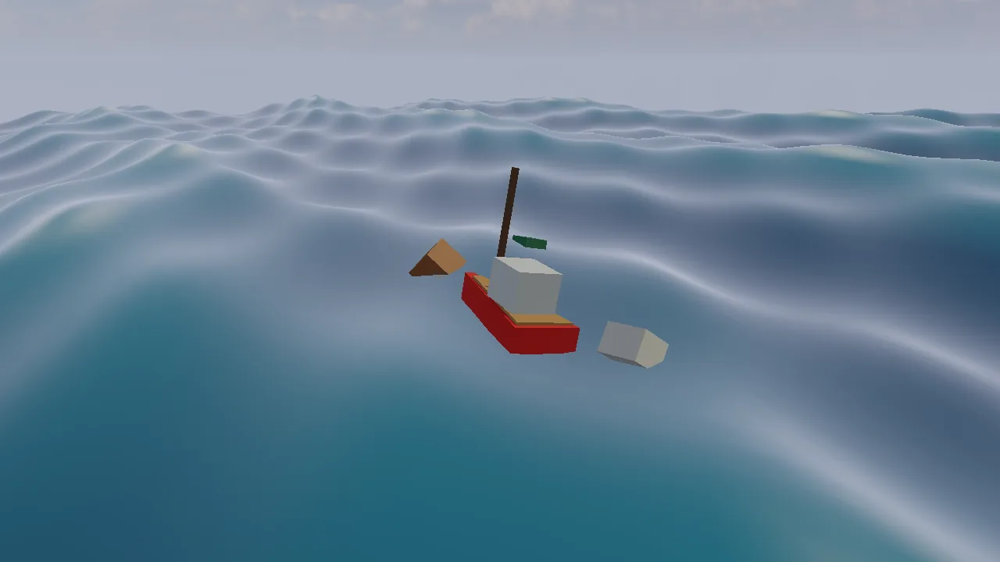

# Sea demo

A small red boat on an open sea under a bright sky. You drive it over the
swell and throw things overboard: a foam block, a wooden crate, a sealed
barrel, an ice block and an iron block. Density decides what happens:
foam and wood ride high, ice floats with little showing, iron sinks to the
sea floor. Wind speed, wind direction and choppiness reshape the waves
while you play, and every splash throws up spray.

The demo teaches the way most games do water: no fluid simulation, just
an analytic ocean surface (`kke::OceanWaves`, four Gerstner waves) and
Archimedes' law at a handful of sample points on each floating body
(`kke::FloatingBodies`). The CPU evaluates exactly the waves the GPU draws,
so things ride the water you see. Start here for a boat, sailing or
fishing game, a naval shooter, a raft survival game, or any game where
things must bob, drift and sink.



## Run it

The executable is `sea_demo` (`kke_add_game(sea_demo ...)` in
[CMakeLists.txt](CMakeLists.txt), which is `add_executable` on desktop and
a shared library on Android). The root `CMakeLists.txt` always adds it: it
needs no optional library and no asset pack.

```bash
cmake --build build --target sea_demo
cd build/bin
./sea_demo
KKE_SKIP_INTRO=1 ./sea_demo       # skip the logo intro
KKE_MOOD=stormy ./sea_demo        # the same sea under another mood
```

The demo reads no environment variables of its own. Rebindings are saved
to `sea_demo_input.json` (the name passed to `InputModule` in
[main.cpp](main.cpp)).

To check the controller path with no hardware (from
[docs/DEMO_PANEL.md](../../docs/DEMO_PANEL.md)):

```bash
KKE_VIRTUAL_INPUT=pad KKE_VIRTUAL_PAD_SCRIPT="8:back,9:dpad_down,9.6:dpad_right" ./sea_demo
```

This opens the settings panel with the virtual pad's View button 8 s in,
moves down a row and turns that row up one step.

## Controls

The boat and throwing actions are made in `SeaDemoModule::defineInput`
([SeaDemoModule.cpp](SeaDemoModule.cpp)). They are rebindable actions in
the "Boat" and "Sea" groups, all in the `game` input context.

| Action | Keyboard / mouse | Controller |
|---|---|---|
| Throttle (`sea.throttle`) | Up arrow | right trigger |
| Reverse, half strength (`sea.throttle`, negative) | Down arrow | left trigger |
| Rudder (`sea.rudder`) | Left / Right arrows | left stick, sideways |
| Throw (`sea.throw`) | left click: where the mouse points | A (south): at the middle of the screen |
| Pick what to throw: foam, crate, barrel, ice, iron (`sea.kind1` to `sea.kind5`) | 1 to 5 | the panel's "What" row |
| Next thing to throw (`sea.next`) | T | Y (north) |
| Camera follows the boat on / off (`sea.follow`) | C | right stick click |
| Reset (`sea.reset`) | R | X (west) |
| Turn the camera (`camera.orbit`) | right-drag | right stick |
| Zoom (`camera.zoom`) | mouse wheel | d-pad up (closer) / down (further) |
| Pan the camera | middle-drag | no controller binding yet |
| Move the camera target | W A S D, Q / E down and up, Shift faster | no controller binding yet |
| Settings panel (`panel.toggle`) | F3 or Esc, or click it | View (Back) |
| Developer panels (ImGui) | F1, developer builds only | no controller binding yet |

Notes from the code:

- The camera uses `OrbitCameraModule::Controls::Editor`, so left click is
  free for throwing: orbit is right-drag, pan is middle-drag, and WASD
  moves the orbit target. With "camera follows the boat" on, the target
  is pulled back to the boat every frame.
- A click over a panel does not throw: `onEvent` checks
  `ImGui::GetIO().WantCaptureMouse` and `Application::uiCapturesMouse()`.
- `sea.kind1` to `sea.kind5` are keyboard-only actions: `defineInput`
  makes one per kind, named after it, and binds keys 1 to 5. They can be
  rebound like the others and rest while the panel is Active. They have
  no pad binding; on a pad, `sea.next` (Y) cycles through the same five
  things.
- `OrbitCameraModule::setPadControls(true)` in [main.cpp](main.cpp) adds
  `camera.orbit` and `camera.zoom`. Both are `game` actions.
- Button names are positions (SDL's `SOUTH`, `NORTH`, `WEST`), so on a
  PlayStation pad A is Cross, Y is Triangle and X is Square.

### The settings panel

The settings are a `kke::DemoPanelModule` titled "Sea", drawn with RmlUi
([docs/DEMO_PANEL.md](../../docs/DEMO_PANEL.md)). It starts open at the
left edge; the game keeps the controls and the mouse can click and drag
any row. `panel.toggle` (View on a pad, F3 on the keyboard) makes it
Active: a row is highlighted, up and down pick a row, left and right
change it (hold to sweep a slider), A presses, B or Esc hands control back.
On the keyboard the panel reads Up, Down, Left, Right, Enter and Esc
directly. While it is Active, player 1's `game` context is off, so the
left stick that picks rows does not also steer the boat and the right
stick and d-pad do not move the camera. The last row, "Hide panel",
collapses it to its title.
Esc works like a pause menu: it opens the panel with the keyboard on
it, and Esc again goes back to the game. So Esc does not close the
window; the panel's "Quit" row, just above "Hide panel", does.
`setEscapeMenu(false)` gives Esc back to a game that needs it.

The rows are:

| Row | Kind | Range |
|---|---|---|
| Controls hint | text | a keyboard line and a controller line (`hint`) |
| Wind | slider | 0 to 14 m/s, step 0.5 |
| Wind direction | slider | -180 to 180 degrees, step 5 |
| Choppiness | slider | 0 to 0.95, step 0.05 |
| What | choice | the five kinds |
| Camera follows the boat | toggle | |
| Reset | button | |
| Status | live text | boat speed, how much of it is under water, bodies floating (max 40), spray drops |
| Note | note | "Water is 1025 kg/m3 ..." |

With a `DemoPanelModule` in the app, the engine's ImGui windows
(Performance from `StatsModule`, Debug Control, ...) start hidden. F1
shows them, in developer builds only (`dev::kEnabled`).

## How it plays

There is no goal and no score: it is a sandbox. The boat spawns at the
origin and the five kinds of objects spawn once each in a row beside it
(`reset`). Each throw adds one more. At most 40 bodies are alive at once
(`kMaxBodies`); the 41st throw removes the oldest thrown object, never
the boat. Reset clears everything, rebuilds the waves from the current
wind settings and spawns the boat and the starting row again.

| Kind | Density (kg/m3) | Size (m) | What it does in 1025 kg/m3 water |
|---|---|---|---|
| Foam block | 100 | 0.7 x 0.5 x 0.7 | rides on top, about 10% under |
| Wooden crate | 500 | 0.8 cube | floats about half under |
| Sealed barrel | 650 | 0.6 x 0.9 x 0.6 | floats low |
| Ice block | 917 | 1.0 x 0.7 x 1.0 | floats with about 10% showing |
| Iron block | 7800 | 0.5 cube | sinks to the floor at -6 m |

The boat itself is a box of 3.2 x 0.7 x 1.2 m at 280 kg/m3 (hull plus the
air inside), about 750 kg.

## How it works

### Startup and the frame

[main.cpp](main.cpp) creates the `Application` (1280 x 720), sets the far
plane to 400 m so the sea reaches the horizon, sets the mood `clear_day`
(`assets/moods/clear_day.yaml`: a Poly Haven sky picture reflected in the
water) and adds the modules in this order:

1. `InputModule` (`sea_demo_input.json`): actions for keyboard, mouse and pads
2. `UiModule`: RmlUi, which draws the settings panel
3. `AudioModule`, its ImGui window hidden: it plays the mood's ambience
   loop (nothing else in the demo makes sound)
4. `kke_sea::SeaDemoModule`: the game
5. `OrbitCameraModule` (distance 12 m, pitch -0.3, yaw 2.2, target (0, 1, 0)),
   distance limits 2 to 80 m, `Controls::Editor`, `setPadControls(true)`
6. `DemoPanelModule("Sea")`
7. `DebugControlModule`, its ImGui window hidden
8. `StatsModule`

The sea module comes before the camera on purpose; the comment in
[main.cpp](main.cpp) says: "its update() moves the camera target before
the orbit camera positions itself".

`SeaDemoModule::init` defines the input, builds the panel, creates the
`OceanRenderer` and the `SphereImpostorRenderer` (for spray), builds the
boat mesh and one box mesh per kind, then calls `reset()`.

Every frame the engine calls, in this order for this module:

| Hook | What it does |
|---|---|
| `fixedUpdate` (fixed step) | reads throttle and rudder, applies the engine, rudder and keel forces to the boat, steps every floating body, spawns splashes, moves the spray |
| `update` | reads the pressed actions (throw, next, the five kinds, follow, reset), eases the camera target toward the boat |
| `renderShadow` | the boat and every object into the shadow map |
| `render` | the ocean, the boat and objects, the spray |
| `onEvent` | left click throws at the mouse |

Physics runs in `fixedUpdate` so it takes the same steps at any frame
rate. One-shot presses are read in `update`, which runs every rendered
frame, so a press is never missed between fixed steps.

### The sea: `kke::OceanWaves`

[kke/Ocean.h](../../engine/include/kke/Ocean.h). The surface is the sum of
four Gerstner (trochoidal) waves. Each wave moves surface points in
circles, which gives sharp crests and flat troughs like real swell. Each
wave's speed follows deep-water dispersion (omega = sqrt(g k)), so long
waves travel faster than short ones.

`setWind(speed, direction, choppiness)` builds the four waves from the
panel's sliders ([Ocean.cpp](../../engine/src/Ocean.cpp)):

```cpp
const float lambda0 = std::max(2.0f, 0.5f * speed * speed);
const float spread[kMaxWaves] = { 0.0f, 0.55f, -0.45f, 0.9f };
const float lengthScale[kMaxWaves] = { 1.0f, 0.61f, 0.37f, 0.19f };
for (int i = 0; i < kMaxWaves; ++i) {
    ...
    w.wavelength = lambda0 * lengthScale[i];
    w.amplitude = w.wavelength / 30.0f * (i == 0 ? 1.0f : 0.8f);
    w.steepness = choppiness;
```

So the main wavelength grows with the square of the wind speed (at 7 m/s,
the demo's default, about 24.5 m), the height is a thirtieth of the
length, and three shorter waves spread around the wind direction.

Gerstner waves move points sideways as well as up, so "how high is the
water at (x, z)" is not a single formula. `OceanWaves::height` finds the
undisturbed point that lands on (x, z) with four fixed-point iterations,
then returns its height. `velocity` gives the water's own motion, which
the buoyancy uses for drag, and `normal` its slope.

### Floating: `kke::FloatingBodies`

[kke/FloatingBodies.h](../../engine/include/kke/FloatingBodies.h) and
[FloatingBodies.cpp](../../engine/src/FloatingBodies.cpp). Each body is a
box. `add` computes its mass (density x volume), its box inertia, and a
grid of sample points inside it: about 0.35 m apart, 2 to 5 per axis. The
boat gets 5 x 2 x 4 = 40 points.

`step(dt, ocean, time)` does this for every live body:

1. Start with gravity. The weight acts at `centerOfMassOffset`, so a low
   centre of mass gives a righting torque when the body tilts.
2. For each sample point: ask the ocean how deep it is, turn that into a
   submerged fraction (smoothly, over the point's own little cube, so
   bodies do not pop as points cross the surface), and add:
   - buoyancy `waterDensity * g * pointVolume * fraction`, straight up;
   - drag against the moving water, `linearDrag`, plus extra vertical
     drag `heaveDrag`.

   Both are applied at the point, so a tilted hull gets a torque from the
   difference between its low and high sides with no extra code.
3. Record `submerged` (0 to 1) and `impactSpeed` (the downward speed at
   the moment the body first touches water), which the demo uses for
   splashes.
4. Integrate with semi-implicit Euler, with angular damping in water.
5. Keep the lowest corner above the flat sea floor (`seaFloorY = -6`).

After that, overlapping bodies push apart as bounding spheres (radius 0.8
x the half diagonal), with an inelastic velocity change. That stops a
crate passing through the boat; it is not a full contact solver.

`remove` only marks a body dead (`alive = false`), so indices stay stable.
That is why the demo can keep a parallel vector `m_kindOf` (which kind
each body is; -1 for the boat) and index it with the body index.

### The boat

The boat is a floating body with three extra settings in `reset()`:

```cpp
m_boat = m_bodies.add(kBoatHalf, 280.0f, { 0.0f, 0.2f, 0.0f });
m_bodies.bodies()[m_boat].linearDrag = 0.8f;
m_bodies.bodies()[m_boat].centerOfMassOffset = glm::vec3(0.0f, -0.3f, 0.0f); // ballast keel: stays upright
```

Driving happens in `fixedUpdate`:

1. Read `sea.throttle` and `sea.rudder` from player 1's `InputMap`.
   Reverse is scaled by 0.5. Throttle eases toward the target at rate 2/s
   and rudder at 4/s, so the boat does not jerk.
2. Only when more than 10% of the hull is in the water
   (`boat.submerged > 0.1f`), apply three forces with
   `FloatingBodies::applyForce`:
   - thrust along the boat's forward axis (+x), `throttle * mass * 3`, at
     the stern and 0.2 m below the centre;
   - a rudder force sideways at the stern, `rudder * mass * 0.8 * speed`,
     with the forward speed clamped to -2..4 m/s: no speed, no steering;
   - a keel force against sideways motion, `-sideSpeed * mass * 2`, at the
     centre: water resists sliding sideways far more than going forward.
3. With throttle above 0.2, drop wake spray at the stern.

Because the thrust and rudder act at the stern, below the centre, they
also pitch and turn the hull the way a real propeller does.

### Throwing

`throwObject(kind, atMouse)` builds a ray from the camera through a
screen point with `kke::screenToRay` ([kke/Picking.h](../../engine/include/kke/Picking.h)).
The mouse throws where it points; a controller throws at the middle of
the screen, which is the boat when the camera follows it. The new body
starts 2 m along the ray, with a random orientation, a velocity of
12 m/s along the ray plus 2 m/s up, and a random spin. If 40 bodies are
already alive, the first live body that is not the boat is removed first.

### Splashes and spray

Spray drops are a plain vector of `{pos, vel, life}` in the module
(`m_spray`, at most 1,500). A body entering the water faster than
1.5 m/s calls `splash`, which adds up to 200 drops in a ring, flying
upward faster the harder the hit. Every fixed step each drop falls with
gravity and is removed when its life ends or when it falls back below the
wave height. They are drawn as 6 cm lit sphere impostors
(`SphereImpostorRenderer`), which cost one small quad each.

### Drawing

- **The sea:** `kke::OceanRenderer`
  ([kke/OceanRenderer.h](../../engine/include/kke/OceanRenderer.h)) is one
  static grid, 200 x 200 cells over 160 m, uploaded once. It follows the
  camera in whole-cell steps, so the mesh does not swim. All wave motion
  happens in `shaders/ocean.vert`, which runs the same Gerstner maths with
  the parameters from `OceanWaves::toGpu`. `shaders/ocean.frag` mixes the
  water's own colour with a sky reflection by Fresnel, adds a tight sun
  glint, foam on the highest and steepest crests, and distance haze.
- **The boat and the objects:** `kke::DynamicMeshRenderer`
  ([kke/SphereImpostors.h](../../engine/include/kke/SphereImpostors.h))
  with meshes built in code by `addBox`. The boat is four boxes: a hull
  pinched at the bow (`bowTaper`), a deck, a cabin and a mast. The iron
  block is drawn with metallic 0.8, the ice with roughness 0.15.
- **The spray:** `kke::SphereImpostorRenderer`.

The sea itself casts no shadow; bodies do (`renderShadow`).

### The camera

`OrbitCameraModule` does the orbiting, panning and zooming. When "camera
follows the boat" is on, `update` moves the camera target 10% of the way
to a point 0.8 m above the boat each frame, and the orbit camera then
places itself around that target.

## Design decisions

- **An analytic ocean and sample-point buoyancy, not a fluid
  simulation.** The comment in
  [kke/FloatingBodies.h](../../engine/include/kke/FloatingBodies.h) calls
  it "the whole trick behind most game boats (Sea of Thieves, Just Cause,
  Unity/Unreal buoyancy plug-ins): no fluid simulation, just Archimedes at
  sample points on an analytic surface". A fluid solver would cost far
  more and still not give a sea to the horizon.
- **Exactly four waves.** [kke/Ocean.h](../../engine/include/kke/Ocean.h)
  says four is what fits in the 128 bytes of push constants every Vulkan
  device guarantees, so the vertex shader needs no buffers or textures
  and the CPU and GPU compute the same surface. More waves, or an FFT
  ocean, would need a texture that the CPU would also have to read to keep
  floating objects in step.
- **Its own small solver, separate from Jolt and FEMFX.** The header
  says the floating bodies are "deliberately small and separate from
  FEMFX (which has no fluids)": semi-implicit Euler, box inertia, sphere
  contacts, a flat floor. The cost is that thrown objects do not collide
  with anything in the Jolt world, and contacts between them are
  approximate.
- **Stability from real physics, not a fake righting force.** The boat
  first capsized within seconds (BUGS.md BUG-044). The fixes were a
  correct point height, `heaveDrag` (the energy a real hull loses making
  waves) and `centerOfMassOffset` (ballast). The header explains that
  gravity at a low point "pulls it upright whenever it heels: real
  ballast, not a fake righting force".
- **A keel as a sideways drag force.** The comment in `reset()` says the
  drag is "tuned so it glides forward but resists going sideways (a keel,
  the cheap way)". The boat is still one box; no keel shape is simulated.
- **Steering that needs speed.** The rudder force scales with forward
  speed; the comment in `fixedUpdate` says "no speed, no steering, like a
  real boat".
- **A body budget.** At most 40 bodies; the oldest thrown one goes first.
  The same rule as [docs/OPTIMIZATION.md](../../docs/OPTIMIZATION.md)
  rule 5 ("fixed budgets, graceful degradation"): a player who holds the
  throw button cannot make the frame rate collapse.
- **The controller throws at the middle of the screen.** A pad has no
  pointer, and with the follow camera the middle of the screen is the
  boat, so A drops things next to it.
- **Editor camera controls.** The comment in [main.cpp](main.cpp) says
  "left click throws", so the camera's orbit moves to right-drag.
- **The settings panel is RmlUi.** Commit 944d596 moved the demo's ImGui
  window to `kke::DemoPanelModule`, following Kees's rule quoted in
  [docs/DEMO_PANEL.md](../../docs/DEMO_PANEL.md): ImGui F1 panels are for
  developers, everything a player sees is RmlUi, so a player with a pad
  can change everything a mouse user can.

## Tuning

| What | Where | Effect |
|---|---|---|
| `m_windSpeed = 7`, `m_windDir = 0.4`, `m_chop = 0.6` | [SeaDemoModule.h](SeaDemoModule.h) | the starting swell; the panel changes them live |
| `lambda0 = 0.5 * speed^2`, amplitude = wavelength / 30 | `OceanWaves::setWind` in [Ocean.cpp](../../engine/src/Ocean.cpp) | how fast waves grow with wind; higher amplitude = rougher sea |
| `kKinds` density and size | [SeaDemoModule.cpp](SeaDemoModule.cpp) | below 1025 floats, above sinks; the closer to 1025, the lower it floats |
| boat density 280 | `reset()` | lower rides higher and gets thrown about more |
| boat `linearDrag = 0.8` | `reset()` | higher stops sooner and reaches a lower top speed |
| boat `centerOfMassOffset.y = -0.3` | `reset()` | lower = harder to capsize, slower rolling |
| `heaveDrag = 6` (engine default) | [kke/FloatingBodies.h](../../engine/include/kke/FloatingBodies.h) | lower = bouncier, the boat can be launched off crests |
| thrust `mass * 3`, rudder `mass * 0.8`, keel `mass * 2` | `fixedUpdate` | acceleration, turning rate, how much it drifts sideways in a turn |
| throttle ease 2/s, rudder ease 4/s | `fixedUpdate` | lower = heavier, laggier controls |
| `kMaxBodies = 40`, `kMaxSpray = 1500` | [SeaDemoModule.cpp](SeaDemoModule.cpp) | the budgets |
| throw speed 12 m/s + 2 up | `throwObject` | how far things fly |
| splash threshold 1.5 m/s, `strength * 18` drops (max 200) | `fixedUpdate`, `splash` | how much spray a landing makes |
| follow easing 0.1 per frame | `update` | higher = the camera sticks to the boat more tightly |
| `OceanRenderer(app, 200, 160)` | [kke/OceanRenderer.h](../../engine/include/kke/OceanRenderer.h) defaults | grid detail and reach; lower for weak GPUs |

## Engine features it uses

| Feature | Header / module | Doc |
|---|---|---|
| Gerstner ocean, CPU and GPU | `kke::OceanWaves` ([kke/Ocean.h](../../engine/include/kke/Ocean.h)) | this page |
| Buoyant rigid bodies | `kke::FloatingBodies` ([kke/FloatingBodies.h](../../engine/include/kke/FloatingBodies.h)), tested in `tests/test_floating_bodies.cpp` | [cookbook: physics](../../docs/cookbook/physics.md) |
| Ocean drawing | `kke::OceanRenderer` ([kke/OceanRenderer.h](../../engine/include/kke/OceanRenderer.h)) | [RENDERING_PRINCIPLES.md](../../docs/RENDERING_PRINCIPLES.md) |
| Meshes built in code, sphere impostors | `kke::DynamicMeshRenderer`, `kke::SphereImpostorRenderer` ([kke/SphereImpostors.h](../../engine/include/kke/SphereImpostors.h)) | |
| Mouse and screen-centre rays | `kke::screenToRay` ([kke/Picking.h](../../engine/include/kke/Picking.h)) | |
| Actions, bindings, prompts | `kke::InputModule` | [INPUT.md](../../docs/INPUT.md) |
| Settings panel (RmlUi, pad + keyboard + mouse) | `kke::DemoPanelModule` | [DEMO_PANEL.md](../../docs/DEMO_PANEL.md) |
| Orbit camera with pad controls | `kke::OrbitCameraModule` | [DEMO_PANEL.md](../../docs/DEMO_PANEL.md) |
| Sky, sun, fog, colour look | `Application::setMood("clear_day")` | [MOODS.md](../../docs/MOODS.md) |
| Performance and pause panels (F1) | `kke::StatsModule`, `kke::DebugControlModule` | |

Nothing of the ocean, buoyancy or drawing is exposed to Lua yet
([docs/SCRIPTING.md](../../docs/SCRIPTING.md) has no water functions), so a
game of this kind is C++ for now.

## Assets

None. The boat and every object are boxes built in code, and the spray is
drawn procedurally. The only files it loads are the mood's: the sky
picture (Poly Haven "Kloofendal 48d Partly Cloudy (Pure Sky)", CC0),
which the build fetches for every demo, and the `meadow_day` ambience
loop (`assets/ambience/meadow_day.flac`, CC0, in the repository), which
the build copies next to every game ([docs/SCENES.md](../../docs/SCENES.md)
"Moods"). No Synty pack is used.

Only `AudioModule` plays mood ambience, which is why [main.cpp](main.cpp)
adds one (BUG-079 in BUGS.md, fixed). Without the file it logs a warning
and the sea is silent.

## Make a game like this

1. **Copy the folder.** `cp -r games/sea_demo games/my_boats`, rename the
   target in [CMakeLists.txt](CMakeLists.txt) (all three places, including
   the `game.json` copy), the namespace `kke_sea` and `name()` returning
   `"SeaDemo"`, and add `add_subdirectory(games/my_boats)` to the root
   `CMakeLists.txt`. `tools/new_game` makes Lua-only games from
   `games/template`; a water game starts from this C++ folder because the
   ocean has no Lua bindings.
2. **Replace the box boat with your own.** Keep one floating body for the
   hull (its box sets buoyancy) and draw any model at its `transform()`.
   Keep a low `centerOfMassOffset`, and read BUG-044 in BUGS.md before
   lowering `heaveDrag`.
3. **Change how it drives.** All the handling is the three forces in
   `fixedUpdate`. A sail is a force along the wind; an outboard motor is
   thrust whose direction turns with the rudder.
4. **Make the weather.** Call `OceanWaves::setWind` over time for a storm
   coming in, and change the mood (`KKE_MOOD=stormy` to try one).
5. **Add rules.** Buoys to pass (distance checks against boat positions),
   cargo to deliver (a thrown body's index), a timer; show them on a
   `DemoPanelModule` text row or an RmlUi HUD.
6. **Read next:** [DEMO_PANEL.md](../../docs/DEMO_PANEL.md),
   [INPUT.md](../../docs/INPUT.md), [MOODS.md](../../docs/MOODS.md),
   [OPTIMIZATION.md](../../docs/OPTIMIZATION.md).

Pitfalls the code shows:

- Floating bodies do not touch Jolt bodies. A dock or a shore needs its
  own handling, or a different physics path.
- `FloatingBodies::remove` never shrinks the vector: dead bodies stay in
  it until `clear()`. A game that spawns forever should reuse slots or
  clear now and then.
- Anything drawn must follow the same `m_time` the bodies were stepped
  with, or things float on waves that are not the ones on screen.
- Apply forces only when the hull is in the water, or the boat can steer
  and accelerate in the air.
- Physics belongs in `fixedUpdate`; one-shot presses belong in `update`.

## Files

| File | What is in it |
|---|---|
| [main.cpp](main.cpp) | The application, the mood, the module list and the camera setup |
| [SeaDemoModule.h](SeaDemoModule.h) | The module, the `Kind` struct, the spray struct, all state |
| [SeaDemoModule.cpp](SeaDemoModule.cpp) | The five kinds, box meshes, reset, throwing, splashes, boat forces, input actions, the settings panel |
| [game.json](game.json) | Marketplace manifest (id, title, tags, modules) |
| [CMakeLists.txt](CMakeLists.txt) | The executable, its shaders, the manifest, and `kke_use_ui` (the RmlUi shaders and fonts) |
