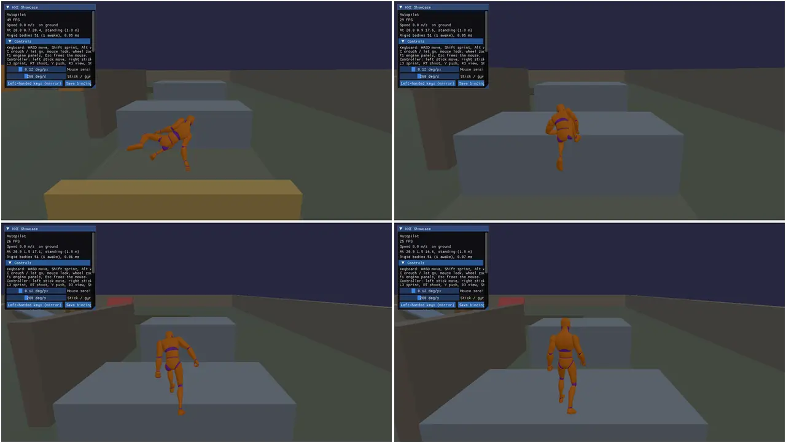

# KKE Showcase (kke_demo)

A walkable course where every spot shows one part of the engine. You run
an animated character around a 60 x 60 m yard: push and shoot crates,
break glass, wood and stone, vault fences, climb blocks, hang from ledges,
run along a wall, wade through a pool where props float on waves, and
watch lava melt a block. Up to four people can play on one machine in
split screen, and others can join over the network. Near each station the
HUD tells you what to try there.

This is the player-facing tour in [docs/SHOWCASE.md](../../docs/SHOWCASE.md).
This README is the developer deep-dive: how each station and system is
built, and why. It is the starting point for any third-person action
game: a platformer, a parkour or traversal game, a physics playground, a
co-op or online game with a character you walk around.



Other pictures from this demo: `ledge-hang.webp`, `parkour.webp`,
`crate-rain.webp` (the stress test) and `split-screen.webp`, all in
`website/static/media/`.

## Run it

The executable is `kke_demo` (`add_executable(kke_demo ...)` in
[CMakeLists.txt](CMakeLists.txt)). The root `CMakeLists.txt` only adds this
folder when `KKE_ENABLE_JOLT` is on, which is the default.

```sh
cmake --preset default && cmake --build build
cd build/bin && ./kke_demo
KKE_SKIP_INTRO=1 ./kke_demo      # no logo intro (needed when headless)
```

Build options change what you get:

| Option | Default | Without it |
|---|---|---|
| `KKE_ENABLE_JOLT` | ON | The demo is not built at all |
| `KKE_ENABLE_FEMFX` | OFF (ON in the `everything` preset) | No breaking yard, no FEMFX balls when you shoot, the stress test's impact phase fires Jolt iron blocks instead |
| `ENGINE_ENABLE_LUA` | ON | No `scripts/` folder, no `ScriptModule` (no toys, no break-the-targets) |
| `KKE_ENABLE_NET` | ON | No `NetModule`: offline only |
| `KKE_ENABLE_VOICE` | ON (needs NET) | No voice chat |

So `cmake --preset everything` is the way to see the breaking yard.

Environment variables for scripted runs (screenshots, checks). All of these
are read in `ShowcaseModule::init` unless noted:

| Variable | What it does |
|---|---|
| `KKE_SKIP_INTRO=1` | No logo intro (engine) |
| `KKE_START_AT=x,y,z[,yaw]` | Start there, facing yaw degrees (the camera too) |
| `KKE_DEMO_AUTOPILOT=1` | The character runs the parkour lane (or a scene's trail) by itself and logs each vault and climb |
| `KKE_DEMO_HANG=1` | Jump at the 3 m wall, hang, shimmy round its end, jump off. Loops every 10 s |
| `KKE_DEMO_TRICKS=1` | Wall run and wall jump, pillar leaps, the leap up to the beam. Loops every 13.5 s |
| `KKE_DEMO_BRIDGE=1` | Drops an iron ball on the yard glass, then rolls one into a crate, and logs how far the crates moved (FEMFX builds) |
| `KKE_BRIDGE=0` | Turns the FEMFX-Jolt bridge off, to compare |
| `KKE_SPLIT=2..4` | Start with that many local players |
| `KKE_OVERHEAD=1` | An overhead picture-in-picture view of player 1 |
| `KKE_MAIN_MENU=pause` | Opens the pause menu 1.5 s after start (the game shell's switch; `KKE_MAIN_MENU=0` skips the title) |
| `KKE_SCENE=town_block` | Start in the Synty scene whose path contains this text |
| `KKE_COURSE_ART=0` | Leaves the Synty art off the course |
| `KKE_CHARACTER=SK_Character_...` | Play as a Synty character, retargeted |
| `KKE_LEFT_HANDED=1` | Mirror the keyboard bindings across the G/H line |
| `KKE_STRESS_TEST=1` | Runs the 36 s stress test at start and quits when done |
| `KKE_BENCH_DIR=dir` | Where the stress report goes (default `benchmark/`) |
| `KKE_NET=host` / `KKE_NET=join:ADDRESS` | Host or join (read by `NetModule`) |
| `KKE_VOICE=off` | No microphone (read by `VoiceModule`) |
| `KKE_SCRIPTS_DIR=<repo>/games/showcase/scripts` | Run the Lua scripts from the source folder, so edits reload live |
| `KKE_ANIMATIONS_DIR`, `KKE_SCENES_DIR`, `KKE_ASSETS_DIR` / `KKE_SYNTY_DIR`, `KKE_COURSE_DIR` | Where to find the animations, scenes, Synty packs and the course art |

## Controls

Player 1. The bindings come from `InputModule::defineCharacterActions`
([InputModule.cpp](../../engine/src/modules/InputModule.cpp)) plus four
actions the showcase adds in `ShowcaseModule::init` (`reset`, `menu`,
`panels` and `zoom.pad`, the d-pad's held zoom). `init` also moves the
ping off the d-pad down and push-to-talk off B, which the showcase uses
for other things (BUG-065). Everything except Esc is rebindable and
saved in `input.json`.

| Action | Keyboard and mouse | Controller |
|---|---|---|
| Move | W A S D | Left stick |
| Look | Mouse (click the view first to capture it) | Right stick |
| Sprint | Left Shift (hold) | L3 (toggle) |
| Walk | Left Alt (hold) | Tilt the stick a little (analog speed); no button |
| Jump, vault, climb, grab a ledge | Space | A |
| Crouch, or let go of a ledge | C (toggle) | B (toggle) |
| Shoot | Left click (hold for 4 shots a second) | RT |
| Push what you look at | E | Y |
| First / third person | V | R3 |
| Camera distance | Mouse wheel (while captured) | D-pad up / down (hold) |
| Reset crates and player | R | X |
| Pause menu: settings, button remapping, quit | Esc | Start or View / Back |
| Engine panels (ImGui, developer tools) | F1 | none |
| Ping the surroundings (hear the walls) | Q | D-pad left |
| Push to talk (voice builds) | P (B is a toy) | LB |

On a ledge: A/D (or the stick) shimmies along it and round corners, Space
climbs up, back plus Space jumps off, C lets go. Jump with left or right
held leaps to the next edge. Running fast beside a wall and jumping starts
a wall run; jump again to kick off.

The pause menu is the one every KKE game shares (`kke::GameShellModule`,
[GAME_SHELL.md](../../docs/GAME_SHELL.md)): the mouse, the arrows and
Enter, or the d-pad / left stick and A; B, Esc or Start closes it. The
HUD's corner hint shows the pause button of the device in use.

Players 2 to 4 (split screen) get a controller each: move, look, sprint,
walk, crouch, jump, shoot (RT), push (Y), zoom (d-pad) and the pause menu
(Start or View / Back) all work from it; shots and pushes go along that player's own
view.

The Lua scripts add their own actions:

| Script | Action | Keyboard | Controller |
|---|---|---|---|
| `toys.lua` | Build a crate tower / throw a ball / clear | G / B / N (or hold B) | RB / View / hold View a second |
| `targets.lua` (from `games/first_lua_game`) | Start break-the-targets | T | D-pad right |

## How it plays

There is no win or lose: it is a playground. You spawn at (0, 0, 6). The
stations, with their positions from [Layout.h](Layout.h):

| Station | Where | What to try |
|---|---|---|
| Crate pile | (4, -3) | 15 crates in a pyramid, plus three big light boxes at z = 10. Push (E) or shoot |
| Breaking yard | (14, -6) | A glass pane on two supports with three small crates under it, a wooden plank bridge, a stone wall. Shoot them (FEMFX builds only) |
| Parkour lane | x = 20, z 28 down to 5 | A 1 m fence and a 0.6 m wall to vault, a 1.5 m block to climb, a 2.1 m ledge only a sprint reaches, a 3 m wall at x = 16 to hang from |
| Trick course | x = 26 | A 12 m wall to run along (z 11 to 23), three thin pillars (tops 2.9, 3.2, 3.5 m) to leap between, a thin wall under a beam to leap up to |
| Lava | (0, 20) | Lava pours onto a block that melts: ice, then wax, then aluminium. Push a crate in |
| Pool | (-18, 20) | Vault the 1 m wall and wade in (no running). Crates, planks and a raft float, a steel block sinks |
| Moving platform | (-14, 6) | Stand on it: it carries you side to side and up and down |
| Low roof | (10, 6) | 1.2 m clearance: crouch to get under |
| Stairs, ramp, steep slope, pillars | around (-8, -4), (8, -10), (-14 to -6.5, -14) | 0.25 m steps, a 24 degree ramp you walk, a 55 degree slope you slide off, pillars that push the camera in |

The pause menu (Esc / Start / View) has Resume, Back to the start, 1 to
4 players, Engine panels (developer builds), Settings, Controls, Main
menu and Quit. Offline it pauses the game; online the
others keep playing. The **KKE Showcase** ImGui window (always shown)
has the controls, a Scenes list to visit the Synty levels, and panels for
movement, performance and the stress test, character, lighting, lava,
split screen and camera. F1 shows the other modules' panels too.

## How it works

### Startup and the frame

[main.cpp](main.cpp) builds the `kke::Application` (1280 x 720, mood
`clear_day`, far plane 200 m) and adds modules in this order:

1. `SettingsModule("settings.json")`: first, so the resource budget
   (threads, frame caps) is set before physics starts its workers.
2. `InputModule("input.json")`: actions and bindings.
3. `RigidBodyModule`: Jolt collision, rigid bodies, character controllers.
4. `NetModule` (NET builds), game id `"kke_demo"`: added before the
   showcase "so a join is under way when the crates spawn".
5. `ModelModule` (the animated character), `UiModule` (RmlUi),
   `AudioModule`, `VoiceModule` (voice builds), `SoundVisualizerModule`
   (on by default here).
6. `PhysicsModule` and `PhysicsBridgeModule` (FEMFX builds). The FEMFX
   ground plane is not drawn: the course has its own floor.
7. `kke_showcase::ShowcaseModule`: the demo itself.
8. `ScriptModule("scripts")` (Lua builds), `DebugControlModule`,
   `StatsModule`.

Every module except the showcase goes into a `panels` list whose ImGui
windows start hidden; `setEnginePanels` hands the list to the showcase so
F1 can show them. Modules are initialised in dependency order:
`ShowcaseModule::dependencies()` requires `RigidBodyModule`, `InputModule`
and `ModelModule`, and optionally wants `UiModule` and `NetModule`, so
those are ready when its `init` runs.

`ShowcaseModule::init` wires the net callbacks, defines the extra input
actions, builds the level (`buildLevel`, `dressCourse`, `spawnCrates`,
`spawnBreakables`, `setupPlayer`), builds the HUD, finds the Synty scenes,
then reads the environment variables above.

Each frame the engine calls, in this order:

- `frameStart`: follows the game shell's menu (open or closed) and lets
  go of the mouse when it opens. It runs even while the game is paused.
- `fixedUpdate` (60 Hz): the lava station, the moving platform and the
  pool's buoyancy.
- `update`: stress test, crate batch, lava mesh, HUD, crouch, input, the
  scripted demos, `Locomotion::update`, animation, network state, other
  players' avatars, the model transform and IK, the camera, the split
  screen players, and the sun from the Lighting panel.
- `prepass`, `render`, `renderShadow`: level, pool, lava, scene grounds,
  the crate batch, the platform, and a box stand-in when there is no
  character model.
- `renderUi`: the ImGui window (skipped while the pause menu is open).

The code is split by topic, all methods of the one `ShowcaseModule` class
declared in [ShowcaseModule.h](ShowcaseModule.h):
[ShowcaseModule.cpp](ShowcaseModule.cpp) (level, player, animation,
networking, ImGui), [Stations.cpp](Stations.cpp) (pool, lava basin, course
art), [LavaStation.cpp](LavaStation.cpp) (its own class),
[SplitScreen.cpp](SplitScreen.cpp), [StressTest.cpp](StressTest.cpp) and
[Hud.cpp](Hud.cpp).

### The layout

[Layout.h](Layout.h) holds every station's position as `constexpr`
values in `kke_showcase::layout` (`kYard`, `kCratePile`, `kPoolCenter`,
`kLavaCenter`, `kLaneX`, `kTrickX`, `kPlatform`, `kLowRoof`). The level
builder, the stress test (which aims at the yard) and the HUD (which
decides which station you are at) all read it, so moving a station is one
edit. `course_art.scene.json` uses the same world coordinates.

### The level

The course is boxes made in code, with no asset files. Two helpers do all
of it:

- `appendBox(matrix, half, color, v, idx)` (anonymous namespace in
  `ShowcaseModule.cpp`) appends the 24 vertices and 36 indices of a box to
  a vertex list. Top faces keep the colour, sides get 85 %, the bottom
  60 %, "so shape reads better without textures". It checks each face's
  winding against its normal and flips the triangles if needed.
- `addStaticBox(Box, v, idx)` appends the box to the mesh and also adds a
  matching static Jolt body (`RigidWorld::Motion::Static`, material 1,
  "stone" for impact sounds).

```cpp
void ShowcaseModule::addStaticBox(const Box& b, std::vector<kke::Vertex>& v, std::vector<uint32_t>& i) {
    glm::mat4 m = glm::rotate(glm::translate(glm::mat4(1.0f), b.center), glm::radians(b.yaw), glm::vec3(0, 1, 0));
    appendBox(m, b.half, b.color, v, i);
    kke::RigidWorld::BodyDesc d;
    d.shape = kke::RigidWorld::Shape::Box;
    d.motion = kke::RigidWorld::Motion::Static;
    ...
    m_rigid->world().add(d);
}
```

`buildLevel` calls it for the floor (60 x 60 m, top at y = 0), four 3 m
perimeter walls, eight 0.25 m stair steps up to a 2 m platform, pillars and
the low roof, then `buildParkourLane`, `buildTrickCourse`, `buildPool` and
`buildLava`. The tilted ramp (-24 degrees round Z) and the too-steep slope
(55 degrees round X) are added by hand because they are rotated round
another axis than Y. Everything ends in one `DynamicMeshRenderer`
(`m_level`) uploaded once: the whole static course is one draw call.

The parkour lane is "not marked up": there is no "vault here" tag. Heights
are chosen so `kke::Locomotion`'s sensors classify each piece by shape: a
1 m fence and 0.6 m wall are vaults, a 1.5 m block is a climb, the 2.1 m
ledge is only reachable with the sprint sensor, and the 3 m wall is too
high to climb so you hang from it. See [MOVEMENT.md](../../docs/MOVEMENT.md).

### Crates and the moving platform

`spawnCrates` removes any old crates and adds, in this order: the 15-crate
pyramid (0.6 m, density 250, "wood"), three big light boxes (1.2 m,
density 60), the pool floaters (`spawnPoolFloaters`), and three small
crates under the yard's glass. Each is a `Crate { body, half, cube }`
where `cube` picks one of four colours. The order matters for networking
(below).

Crates are not drawn one by one. `batchCrates` rebuilds one mesh from every
body's current transform each frame and uploads it: "one draw (and one
shadow draw) instead of two per crate". The comment above it measures
about 0.1 ms for 300 crates on one core.

The platform is a kinematic body. `fixedUpdate` moves it with
`moveKinematic` along

```cpp
glm::vec3 p(-14.0f + 5.0f * std::sin(m_platformTime * 0.5f),
            0.6f + 1.2f * (0.5f + 0.5f * std::sin(m_platformTime * 0.35f)), 6.0f);
```

`moveKinematic` gives Jolt the velocity, so a character standing on it is
carried. It is drawn with `m_cubes[3]` scaled to its half extents.

### The player

`setupPlayer` adds a Jolt character (`RigidWorld::addCharacter`) at
`m_spawn` and wraps it in a `kke::Locomotion`, the movement layer that
does turning, air control, vault, climb, hang, leap and wall run.

`readActions` turns the input map into flags: `move` (2D), `sprint`,
`walk`, `crouch`, and a queued jump. The `"game"` input context is
switched off while typing in ImGui or while the menu is open. Then
`update` builds a `Locomotion::Input`:

```cpp
in.move = m_rig.forward() * m_moveInput.y + m_rig.right() * m_moveInput.x;
in.move.y = 0.0f;
if (glm::length(in.move) > 1e-3f) in.move = glm::normalize(in.move) * std::min(1.0f, glm::length(m_moveInput));
...
in.fast = m_sprint && !m_crouch && !wading;
in.slow = m_walk || wading;
in.goUp = m_jumpQueued;
```

Movement is camera-relative, and the stick's length is kept so a small
tilt walks. `goUp` means "go up": whether that is a jump, a vault, a climb
or a ledge grab is Locomotion's decision from what its sensors see.

Crouch shrinks the capsule from 1.8 m to 1.0 m with
`setCharacterHeight`, which fails if there is no headroom, so standing up
waits until you are out from under the roof (the panel shows "No room to
stand up"). While hanging, crouch means "let go" instead. Inside the pool
(`inPool`) sprint is off and walk is forced. Falling below y = -20
teleports you back to the spawn.

### The camera

A `kke::CameraRig` in third person (`m_rig`). Mouse look goes through
`addLook` scaled by `m_mouseSensitivity` (0.12 degrees per pixel), the
stick through `look.rate` times `m_stickSpeed` (200 degrees per second,
70 % of that vertically). The pivot height eases between 1.5 m and 0.85 m
when crouched.

`m_rig.update` takes a ray cast callback that uses Jolt, so the spring arm
pulls in when a wall or pillar is between the camera and the character.
During a wall run the shoulder offset swaps to the open side, because
"over the wall shoulder the spring arm would pull in to the back of the
head". In first person the body faces where you look and the model is
hidden.

### Animation

The character is Quaternius' Universal Animation Library mannequin.
`setupPlayer` looks for `assets/animations/UAL1_Standard.fbx` (with
`kke::findAssetFolder`, or `KKE_ANIMATIONS_DIR`). If it is missing, the log
says so and the character is a blue box (`m_capsule`). If `UAL2.fbx` is
next to it, `setupPlayer` loads it as CPU data only, keeps just five clips
(`SafetyVault`, `ClimbUp_1m`, `ClimbUp_2m`, `WallRun_L_Loop`,
`WallRun_R_Loop`) and drops its meshes.

`buildAnimator` creates a `kke::AnimationSet` and removes the pelvis "lift"
from the traversal clips (`removeLift`): Locomotion already moves the
capsule up the wall, so the clip must not lift the body a second time.

`addAnimatorStates` defines the same states in the same order on every
animator (ours, split-screen players', network players'), so the state
indices `m_stMove`, `m_stJump` and so on mean the same everywhere:

- `move`: a blend state of Idle (0), Walk (1.6 m/s), Jog (3.6 m/s) and
  Sprint (6.2 m/s). These are "the animations' own foot speeds, which are
  also kke::Locomotion's default walk/run/sprint/crouch speeds, so feet
  don't slide". The parameter is the measured ground speed.
- `crouch`: Crouch_Idle (0) and Crouch_Fwd (1.4 m/s).
- `jump`, `fall`, `land`: clip states.
- `vault`, `climb_up`, `hang`, `climb_over`: stand-in poses from the
  standard set, picked by name with fallbacks (`pick({"Vault",
  "Jump_Loop"})`), because volume 1 has no vault, climb or hang clips.
- `vault_clip`, `climb_low`, `climb_high`: the real UAL2 clips when
  present. `animate` calls `setProgress(Locomotion::traversalProgress())`
  so the clip is posed by how far through the move the capsule is: the
  hands meet the edge whatever the timing.
- `wall_run_l`, `wall_run_r`: UAL2 loops, or the sprint.

`animate(Animator&, MotionInfo&, dt)` is a switch on `Locomotion::State`
that picks the state and cross-fade time. A climb up a wall under 1.6 m
(`kClimbHighFrom`) uses the 1 m clip, higher uses the 2 m clip. A landing
from more than 0.6 m plays `land`. `MotionInfo` is a small struct so the
same function drives our player (from Locomotion) and remote players
(from network state).

**Other characters.** The Character panel (or `KKE_CHARACTER`) lists every
skinned `SK_Character*` in the Synty catalog. `useCharacter` loads it,
matches its bones to the mannequin's by name (`kke::matchBones`), and
retargets the UAL clips onto it (`kke::retargetAnimations`); the log says
how many bones matched. `m_modelYaw` turns the model so it faces -Z
(Synty characters face +Z).

### IK and footsteps

`applyIk` runs after the animator, on the pose, before it is written to
the model's bone locals:

- **Feet.** A `kke::FootPlacer` casts a ray down from each foot (Jolt,
  1.2 m, only surfaces with normal.y above 0.5) and plants the foot on
  stairs and slopes, lowering the hips if needed. Its weight eases to 1 on
  the ground and to 0 in the air.
- **Footsteps.** `kke::CharacterFootsteps` plays step sounds when the
  placed feet actually touch down ([AUDIO.md](../../docs/AUDIO.md)).
- **Hands.** While hanging, at the end of a leap, and in the first part of
  a climb (progress under 0.7) or vault (under 0.45), `kke::solveTwoBone`
  puts each hand on the edge, shoulder width apart, with the elbow pole
  pushed out and down. The grip point is `Locomotion::hangEdge()` or the
  last obstacle's top.

Both can be switched off in the Character panel.

### Shooting and pushing

`shoot` spawns a FEMFX iron sphere (radius 0.15 m, density 7800, 22 m/s)
1 m in front of the camera, sends a shot event online, then calls
`forcePush`. Without FEMFX `spawnBall` does nothing, so shooting only
pushes. `forcePush` casts a 30 m Jolt ray from the camera and, if it hits
a crate, applies an impulse of 60 along the view at the hit point. Fire
repeats every 0.25 s while held. The click that captures the mouse is
swallowed (`m_swallowFire`) so it is not a shot.

### The breaking yard (FEMFX builds)

`spawnBreakables` builds three FEMFX objects with `spawnPatternedBox`:

| Piece | Size (m) | Material | Fracture pattern |
|---|---|---|---|
| Glass pane | 2.1 x 0.05 x 1.2 | glass: density 2500, stiffness 7e7, breaks at 1e5 | `Radial`, from the centre |
| Plank | 2.4 x 0.12 x 0.3 | wood: 600, 1e7, 1.5e5 | `Splinters` |
| Stone wall | 1.4 x 1.0 x 0.25 | stone: 2500, 3e7, 1e5 | `Voronoi` |

The supports under the pane and plank are unbreakable FEMFX blocks
(`fractureStressThreshold = 1e12`) and also Jolt static boxes so the
character collides with them. The bridge is told to `ignore` those Jolt
boxes: "FEMFX mustn't see a second one in the same place".

`PhysicsBridgeModule` mirrors Jolt bodies near moving FEMFX pieces into
FEMFX and feeds the pushes back into Jolt, so falling shards knock the
three crates under the glass
([PHYSICS_BRIDGE.md](../../docs/PHYSICS_BRIDGE.md)). `KKE_DEMO_BRIDGE=1`
(`updateBridgeDemo`) measures it: at 3 s it drops a ball on the glass,
at 7 s logs how far each crate moved and rolls a ball into the pyramid's
first crate, at 10 s logs how far that crate went.

### The pool

`buildPool` ([Stations.cpp](Stations.cpp)) adds four 1 m stone walls
round an 8 x 8 m basin and a tile floor. The water is a
`kke::OceanRenderer` grid (40 cells, 20 cm each) drawing `m_poolWaves`, a
`kke::OceanWaves` with a light breeze (`setWind(1.5f, 0.6f, 0.3f)`) and
sea level 0.75 m.

`floatBodies` runs every fixed step. It asks Jolt for the bodies in the
basin (`bodiesInBox`) and, for each dynamic one inside it, calls
`kke::boxBuoyancy` with a `WaterSurface` callback that reads the same
waves the renderer draws. The result is a list of forces at sample points,
applied as impulses (`force * dt`). "So what bobs matches what you see."

The floaters differ only in density: pine 450 rides high, oak 750 sits
low, a 300 raft stays flat, a 500 plank, and steel 7800 sinks.

### The lava station

`buildLava` adds a low basalt basin (0.45 m walls, 2.8 m inside) and a
spout arm, then creates a `LavaStation`
([LavaStation.h](LavaStation.h), [LavaStation.cpp](LavaStation.cpp)).
It has three parts:

- **The lava**: a `kke::ParticleFluid` of at most 700 particles, radius
  4 cm, poured at 50 a second from 1.5 m up at 1200 C. Two substeps per
  fixed step "keep it from tunnelling" at the ~6 m/s the drop reaches.
  Below 550 C it turns to dark crust (`solidifyTemperature`).
- **The block**: a `kke::MeltVolume`, a 0.5 m cube of 2.5 cm voxels
  (24 x 24 x 24). Heat from the lava melts voxels into liquid particles of
  the block's own material. Three presets from `melt_demo` cycle: ice,
  wax, aluminium (which glows as it heats).
- **Colliders**: two callbacks on the fluid. One is the block's signed
  distance. The other finds the nearest dynamic Jolt box (signed distance
  to an oriented box, `boxDistance`) or character capsule in the basin,
  so crates and the player push the lava aside.

When the block is under 3 % or the particle budget is full, it waits 4 s
(`kNextAfter`) and starts the next block (`next`). The Lava panel has a
"Next block" button.

Drawing: particles are coloured by material and temperature in `prepass`.
With one view, `kke::FluidSurfaceRenderer` draws a smooth screen-space
surface. In split screen it draws `SphereImpostorRenderer` spheres
instead, because the smooth surface is "made for the one main view".

Two cost rules. The station only simulates while a camera is within 18 m
(`lavaWatched`, checks every split-screen view): "a station nobody looks
at costs nothing". And the lava runs locally on every machine, not over
the network: "what it looks like isn't gameplay state".

### Course art and scenes

`dressCourse` loads [course_art.scene.json](course_art.scene.json) (copied
to `bin/course/`) on the course itself at origin 0. It is a normal
`kke.scene` file ([SceneFile.h](../../engine/include/kke/SceneFile.h)):
50 entries (8 of them grids) placing 37 POLYGON Nature and POLYGON Town
assets, 108 instances in all. Collision per object: 26 `"box"`, 2
`"mesh"` (the rock piles), 22 `"none"` (mountains, trees beyond the walls,
grass). It stays out of the paths the stations need.

It is all or nothing: before loading, every object is looked up in the
asset catalog, and if any is missing the log says which pack is needed and
nothing is placed. The comment: "half the art would look like a bug".

`findScenes` lists `scenes/*.scene.json` (found by walking up from the
working folder, or `KKE_SCENES_DIR`). The Scenes panel's Go button calls
`visitScene`, which loads the scene the first time at its own origin
200 m along X per scene, adds a flat ground box if the file has one,
teleports you to its spawn, and copies its sun, ambient and up to two
point lights into the lighting. Missing assets are counted in the status
line. "Back to the course" returns you.

### HUD and pause menu

[Hud.cpp](Hud.cpp) uses RmlUi through `UiModule`. `buildHud` creates one
data model, `"demo"`, and binds `HudState` fields to it (`move`, `speed`,
`trick`, `station`, `station_text`, `menu_hint`, `station_live`,
`panels`, `online`, `players`). The document,
[ui/showcase_hud.rml](ui/showcase_hud.rml), shares `theme.rcss` from
`games/rmlui_demo/ui/`.

`updateHud` runs every frame. It turns the Locomotion state and speed into
a word (Standing, Walking over 0.2 m/s, Running over 2.2, Sprinting over
4.8, Vaulting, Hanging or Shimmying, and so on), then checks which station
box your feet are in and picks its title and hint. The lava adds a live
line ("Wax block, 40% left"). A small `set` lambda only marks a variable
dirty when its text changed, so RmlUi does not re-lay-out every frame.
`menu_hint` is the corner's menu prompt, `promptText("{shell.pause} menu")`:
the Esc keycap on the keyboard, the Start glyph on a controller.

Hints are written with action names in braces, such as
`"Push them {interact} or shoot them over {fire}."`, and passed through
`InputModule::promptText`, which swaps each `{action}` for the button
glyph of the device in use ([INPUT.md](../../docs/INPUT.md)).

The pause menu is `kke::GameShellModule`'s ([GAME_SHELL.md](../../docs/GAME_SHELL.md)).
`buildPauseRows` adds the showcase's rows to it: Back to the start, the
number of players on this screen, and the engine panels in developer
builds. The shell pauses the `Application` only when not online, opens on
Esc, Start or View from any local player, and Esc is a raw key there too,
"so you can never lock yourself out".

### Split screen

[SplitScreen.cpp](SplitScreen.cpp). `setLocalPlayers(count)` adds or
removes `LocalPlayer`s: each has its own Jolt character, `Locomotion`,
`CameraRig`, `Camera`, model instance and `Animator`. It calls
`InputModule::setPlayers`, which copies player 1's actions and bindings
into each new player's map.

`assignControllers` runs every frame: connected gamepads, in the order
they were plugged in, go to players 2, 3, 4. Player 1 gets every other
device (keyboard, mouse, and any spare controller). A player without a
controller runs the parkour lane by itself, starting 2.5 s after the one
before, so split screen can be tried with no controllers at all.

`updateLocalPlayers` steps each player's Locomotion and camera, animates
them with the same `animate` function (no IK), then fills
`Application::views()`: `kke::splitScreen(players, sideBySide)` gives the
rectangles, player 1 uses the engine camera. With `m_overhead` a camera
14 m above player 1 is added as a picture-in-picture
(`kke::pictureInPicture`). Up to `kke::kMaxViews` (4) views are drawn;
each module's `render` runs once per view.

Players 2 to 4 also shoot, push (along their own camera: `shoot(p.camera)`,
`forcePush(p.camera)`), zoom, reset themselves (X) and open or close the
pause menu (the game shell reads every player's map). The Lua toys and the
ping still read player 1's map only.

### Networking (NET builds)

`NetModule` ([NETWORKING.md](../../docs/NETWORKING.md)) does the transport,
host or join, LAN list and input replay. The showcase decides what is
shared:

- **Bodies.** `replicateBodies` registers the platform as network id 0 and
  the crates as 1, 2, 3... "The same bodies in the same order on every
  machine." The host simulates them; clients follow. That is why a
  client's `fixedUpdate` returns before moving the platform or floating
  the pool bodies.
- **Breakables.** The three yard pieces are registered with
  `replicateBreakable`, so when the host's glass breaks, clients break
  along the same borders.
- **Your player.** `sendNetState` fills a `NetPlayerState` (position,
  velocity, yaw, Locomotion state, speed, progress, an `aux` value that
  means obstacle height, wall side or fall height depending on the state,
  and a crouch flag). A jump of more than 3 m sets `kPlayerTeleported`.
  With input replay (`stepNetPlayer`), the host moves your character from
  your inputs and `onCorrection` teleports you if you drift.
- **Other players.** `updateAvatars` spawns a model and animator per
  remote player and feeds `animate` a `MotionInfo` rebuilt from their
  state (a jump is a Ground to Air change going up faster than 1 m/s).
- **Events.** Shots, pushes and resets are game events serialised with
  `serialize` template functions over `kke::net::WriteStream` /
  `ReadStream` (one function per message for both directions). The host
  relays shots to everyone. A client's push is applied locally and sent to
  the host, which ignores it if the crate is more than 2 m from the pushed
  point ("a stale or made-up push does nothing"). A client's reset asks
  the host.

### The stress test

[StressTest.cpp](StressTest.cpp). The Performance panel button, or
`KKE_STRESS_TEST=1` (which quits at the end). The same script on every
machine "so reports compare":

| Time (s) | Phase | What runs |
|---|---|---|
| 0 to 2 | warm-up | not recorded (teleport, first pipelines) |
| 2 to 12 | walk | autopilot on the parkour lane: animation, IK, shadows |
| 12 to 24 | crates | 300 crates rain at 30 a second over (0, -2), watched from 9 m |
| 24 to 36 | impacts | 4 shots a second: FEMFX iron balls at the glass, plank and wall, or without FEMFX, Jolt iron blocks into the crate area |

`startStressTest` saves the resource budget and vsync, then runs uncapped
("this measures the machine, not the player's cap"). A fixed random seed
makes the rain the same every run. `stressShoot` computes a ballistic
velocity that lands on the target at 18 m/s horizontal. Every frame a
`kke::FrameStats::Frame` records frame, GPU and physics time and body
count. `finishStressTest` removes the rain, restores the settings, and
writes a `kke::BenchmarkReport` (`stress_<time>_<host>.txt` and `.json`)
with the system, the settings, the list of running modules and the peak
memory. See [BENCHMARKS.md](../../docs/BENCHMARKS.md).

### The Lua scripts

`ScriptModule` runs every `.lua` in `bin/scripts/` and reloads a file when
it changes. CMake copies two sets there:

- [scripts/toys.lua](scripts/toys.lua): a small "Garry's Mod-style"
  script. It defines three actions with `input.define`, and in a `Think`
  hook builds a 12-crate metal tower in front of the camera
  (`physics.box`), throws a rubber ball (`physics.sphere`) or removes what
  it made. A `Contact` hook counts hits faster than 6 m/s. Save the file
  while the game runs and the old toys are replaced, not duplicated.
- `targets.lua` and `targets_hud.rml` from `games/first_lua_game/scripts/`:
  break-the-targets, a whole small game in one Lua file (see that game's
  README).

The copy in `bin/scripts/` is what runs. Set `KKE_SCRIPTS_DIR` to the
source folder to edit live. API: [SCRIPTING.md](../../docs/SCRIPTING.md).

## Design decisions

- **The course is boxes made in code.** It needs no asset pack, so it
  runs in CI and on a fresh clone. Synty art is an optional layer on top
  (`course_art.scene.json`), loaded only when every asset is present.
- **Station positions live in one header.** The commit that added
  `Layout.h` moved them there "so the level, the stress test and the HUD
  agree".
- **Nothing on the parkour lane is marked up.** `kke::Locomotion` reads
  the shapes with its sensors. A game built on this works on any level
  geometry, including Synty scenes (the autopilot runs their trails),
  without tagging every ledge.
- **Blend-space speeds equal Locomotion's speeds.** Idle/walk/jog/sprint
  sit at 0, 1.6, 3.6 and 6.2 m/s, the clips' foot speeds and Locomotion's
  defaults, and the blend parameter is the measured speed, so feet do not
  slide, even in turns.
- **Traversal clips are posed by progress with the lift removed.**
  The comments say it: "Locomotion moves the capsule either way, the clips
  only provide the pose", and posing by progress means "hands meet the
  edge whatever the timing".
- **Stand-in poses plus hand IK when clips are missing.** Volume 1 has no
  vault or climb clips, so the closest poses are used and IK puts the
  hands on the edge. Real clips are picked up by name when a pack has
  them. The demo never requires the optional UAL2 file.
- **One animator setup function for every character.** `addAnimatorStates`
  and `animate(MotionInfo)` serve our player, split-screen players and
  network players, so all three look the same and the state indices match.
- **All crates in one batched mesh.** One draw and one shadow draw instead
  of two per crate. The comment on `batchCrates`: "~0.1 ms for 300 crates
  on one core; far cheaper than 600 draws".
- **The lava costs nothing when nobody looks.** It simulates only within
  18 m of a camera, uses 700 particles ("a quarter of melt_demo's: one
  station of many", citing [OPTIMIZATION.md](../../docs/OPTIMIZATION.md)
  rule 5) and coarser 4 cm particles.
- **Lava is local, crates are the host's.** The lava's look is not
  gameplay state, so each machine runs its own. Crates, the platform and
  breakables are shared because players push and break them.
- **The pool's physics reads the same waves it draws.** Buoyancy samples
  `OceanWaves::height` and `velocity` at the same time value as the
  renderer, so floating props match the surface.
- **Course art is all or nothing.** "Half the art would look like a bug."
- **Esc is fixed, not rebindable.** It always frees the mouse and opens
  the menu, "so you can never lock yourself out" by rebinding.
- **The menu only pauses offline.** The game shell's rule for every game:
  online the others play on; only an offline game stops.
- **Split screen works without controllers.** Extra players with no pad
  run the lane on their own "so split screen can be tried alone".
- **The stress test is scripted and uncapped.** A fixed script and seed so
  reports compare between machines, and no vsync or frame cap so the
  numbers are the machine's, not the cap's. Settings are restored after.

## Tuning

| What | Where | Effect |
|---|---|---|
| `kWalkSpeed`, `kJogSpeed`, `kSprintSpeed`, `kCrouchSpeed` (1.6, 3.6, 6.2, 1.4) | `ShowcaseModule.cpp` top | Blend points; change with `Locomotion::Settings` speeds or feet slide |
| `kClimbHighFrom` (1.6 m) | `ShowcaseModule.cpp` | Walls at least this high use the 2 m climb clip |
| Turn rate, sprint turn rate, speed in turns, air steering, vault clearance, climb time | Movement panel (`Locomotion::Settings`) | Live feel of the character |
| `m_mouseSensitivity` (0.12 deg/px), `m_stickSpeed` (200 deg/s) | `ShowcaseModule.h`, Controls panel | Look speed |
| Arm length (1.5 to 10), shoulder (0.45), lag, field of view | Camera panel (`CameraRig::settings`) | Third-person camera |
| Capsule heights 1.8 / 1.0 m, pivot 1.5 / 0.85 m | `ShowcaseModule::update` | Standing and crouched size and camera height |
| Fire cooldown 0.25 s, push impulse 60, ray 30 m | `readActions`, `forcePush` | Shooting and pushing |
| Ball: radius 0.15, density 7800, speed 22 | `spawnBall` | How hard shots hit the breakables |
| Breakable materials and `fractureStressThreshold` | `spawnBreakables` | Lower breaks easier |
| `kPoolHalf` 4 x 4, `kPoolWall` 1, `kPoolWater` 0.75, wind | `Stations.cpp` | Pool size, depth, wave size |
| Floater densities | `spawnPoolFloaters` | Under 1000 floats; lower rides higher |
| `kLavaWatchDistance` (18 m) | `Stations.cpp` | How close a camera must be for the lava to run |
| `kMaxParticles` 700, `kRadius` 0.04, `kPourRate` 50, `kNextAfter` 4 | `LavaStation.cpp` | Lava amount, detail and cost |
| Melt presets (melting point, heat capacity, melt rate, conduction) | `kPresets` in `LavaStation.cpp` | How fast each block melts |
| `kLaneGap` 2.5 s, `kLaneMaxTime` 25 s | `SplitScreen.cpp` | Controller-less runners |
| `kPhaseEnd`, `kRainCrates` 300, `kRainPerSecond` 30, `kShotsPerSecond` 4 | `StressTest.cpp` | Stress test load (changing them makes old reports incomparable) |
| Sun direction, height, strength, colour, ambient | Lighting panel | Light 0 each frame |
| Performance: use everything, background cap, render scale, worker threads | Performance panel (`SettingsModule`) | Saved to `settings.json` |

## Engine features it uses

| Feature | Header / module | Doc |
|---|---|---|
| Module system, views, pause | [kke/Application.h](../../engine/include/kke/Application.h), [kke/Module.h](../../engine/include/kke/Module.h) | [HISTORY.md](../../docs/HISTORY.md) |
| Jolt bodies, character controller, ray casts | [kke/RigidWorld.h](../../engine/include/kke/RigidWorld.h), `RigidBodyModule` | |
| Character movement and parkour | [kke/Locomotion.h](../../engine/include/kke/Locomotion.h) | [MOVEMENT.md](../../docs/MOVEMENT.md) |
| Camera spring arm | [kke/CameraRig.h](../../engine/include/kke/CameraRig.h) | |
| Animation blending, retargeting, IK | [kke/Animator.h](../../engine/include/kke/Animator.h), [kke/AnimRig.h](../../engine/include/kke/AnimRig.h), `ModelModule` | [cookbook/animation.md](../../docs/cookbook/animation.md) |
| Footstep sounds | [kke/Footsteps.h](../../engine/include/kke/Footsteps.h), `AudioModule` | [AUDIO.md](../../docs/AUDIO.md) |
| Input actions, controllers, prompts | [kke/InputMap.h](../../engine/include/kke/InputMap.h), `InputModule` | [INPUT.md](../../docs/INPUT.md) |
| RmlUi HUD and menu | `UiModule` | |
| FEMFX breakables | `PhysicsModule`, [kke/FracturePattern.h](../../engine/include/kke/FracturePattern.h) | |
| FEMFX-Jolt bridge | `PhysicsBridgeModule`, [kke/PhysicsBridge.h](../../engine/include/kke/PhysicsBridge.h) | [PHYSICS_BRIDGE.md](../../docs/PHYSICS_BRIDGE.md) |
| Buoyancy and waves | [kke/Buoyancy.h](../../engine/include/kke/Buoyancy.h), [kke/Ocean.h](../../engine/include/kke/Ocean.h), [kke/OceanRenderer.h](../../engine/include/kke/OceanRenderer.h) | |
| Particle liquid and melting | [kke/ParticleFluid.h](../../engine/include/kke/ParticleFluid.h), [kke/MeltVolume.h](../../engine/include/kke/MeltVolume.h), [kke/FluidSurface.h](../../engine/include/kke/FluidSurface.h), [kke/SphereImpostors.h](../../engine/include/kke/SphereImpostors.h) | |
| Split screen and picture-in-picture | [kke/Viewports.h](../../engine/include/kke/Viewports.h) | |
| Networking, input replay, voice | `NetModule`, `VoiceModule`, [kke/net/](../../engine/include/kke/net) | [NETWORKING.md](../../docs/NETWORKING.md) |
| Scene files and the asset catalog | [kke/SceneFile.h](../../engine/include/kke/SceneFile.h), [kke/SceneLoader.h](../../engine/include/kke/SceneLoader.h), [kke/AssetCatalog.h](../../engine/include/kke/AssetCatalog.h) | [SCENES.md](../../docs/SCENES.md) |
| Frame stats and reports | [kke/FrameStats.h](../../engine/include/kke/FrameStats.h), [kke/BenchmarkReport.h](../../engine/include/kke/BenchmarkReport.h) | [BENCHMARKS.md](../../docs/BENCHMARKS.md) |
| Resource budget | [kke/ResourceGovernor.h](../../engine/include/kke/ResourceGovernor.h), `SettingsModule` | |
| Lua scripting | `ScriptModule` | [SCRIPTING.md](../../docs/SCRIPTING.md) |
| Moods (sky, fog, ambience) | `Application::setMood` | [MOODS.md](../../docs/MOODS.md) |

## Assets

The course itself needs no asset pack. What it loads:

- **Character and animations** (optional, the character is a box without
  them): Quaternius' Universal Animation Library, CC0.
  `assets/animations/UAL1_Standard.fbx` is in the repository.
  `assets/animations/UAL2.fbx` (volume 2) is not; put it next to the first
  for the real vault, climb and wall-run clips. Without it the log says
  "vault and climb use stand-in poses".
- **Synty course art** (optional): POLYGON Nature and POLYGON Town, in the
  git-ignored `assets/synty/`. The full list of 37 assets and counts is in
  [SCENES.md](../../docs/SCENES.md#showcase-course-art-gamesshowcasecourse_artscenejson).
  If any one is missing the course stays plain and the log names the
  missing asset and packs.
- **Synty scenes** (optional, Scenes panel): `scenes/farm.scene.json`
  (POLYGON Farm), `scenes/forest_trail.scene.json` (POLYGON Nature),
  `scenes/town_block.scene.json` (POLYGON Town). Missing assets are skipped
  and counted in the status line.
- **Synty characters** (optional): any skinned `SK_Character*` from an
  installed pack, from the Character panel.
- **Fonts**: Noto Sans Regular, Bold, Italic and Noto Color Emoji (SIL
  Open Font License 1.1, `assets/fonts/`).
- **UI theme**: `games/rmlui_demo/ui/theme.rcss`.
- **Sky and ambience**: the `clear_day` mood ([MOODS.md](../../docs/MOODS.md)).
- Licences for everything: [DEPENDENCIES.md](../../docs/DEPENDENCIES.md).

Synty packs are never committed. Get them with `tools/fetch_assets.sh`
(see [SCENES.md](../../docs/SCENES.md)).

## Make a game like this

1. **Script game or C++ game?** For a Lua game run `tools/new_game
   my_game`: it copies `games/template/` (with its own `PlayerModule`),
   names it and adds it to the build. Read
   [skills/make-a-game](../../skills/make-a-game/SKILL.md) first. For a C++
   game like this one, copy `games/showcase/` to `games/my_game/`, rename
   the executable in `CMakeLists.txt` and the namespace, and add
   `add_subdirectory(games/my_game)` to the root `CMakeLists.txt`.
2. **Keep `main.cpp`'s module order.** Settings first, input, physics,
   net before your module, then models and UI. Drop what you do not need
   (the stress test, split screen, the pool) by deleting the file and its
   calls.
3. **Put your level's positions in a `Layout.h`** before you build
   anything, so the level, HUD and any scripted tests read one place.
4. **Build the level.** Start with `addStaticBox` for blockout, then move
   to a scene file ([SCENES.md](../../docs/SCENES.md)) and `kke::loadScene`
   when you have art, like `dressCourse` and `visitScene` do.
5. **Keep the player chain**: input map to `Locomotion::Input` (camera
   relative), `Locomotion::update`, `animate`, `applyIk`, `CameraRig`.
   Tune movement in the Movement panel, then copy the numbers into
   `Locomotion::Settings`.
6. **Match the blend-space speeds to Locomotion's speeds** if you change
   either, or the feet slide.
7. **Write your HUD in RmlUi** with one data model, and write hints with
   `{action}` names through `promptText` so the right buttons show.
8. **For multiplayer, decide what is shared.** Register shared bodies in
   the same order everywhere (`replicateBody`), send one-off actions as
   events, and let the host check them. Keep effects that are only looks
   local.
9. **Give every cost a switch.** Simulate stations only when watched,
   batch many small objects into one mesh.
10. **Check it**: `KKE_SKIP_INTRO=1 ./my_game`, then read the log for
    warnings. For a Lua game, `tools/check_game`. Read
    [MOVEMENT.md](../../docs/MOVEMENT.md),
    [NETWORKING.md](../../docs/NETWORKING.md) and
    [INPUT.md](../../docs/INPUT.md) next.

Pitfalls the code shows:

- Add `NetModule` before your module, or a join is not under way when you
  spawn shared bodies.
- A client must not simulate shared bodies (`fixedUpdate` returns early
  for clients).
- A static Jolt body and a FEMFX object in the same place need
  `PhysicsBridgeModule::ignore`, or FEMFX sees the object twice.
- The pause menu must be driven from `frameStart`: `update` does not run
  while paused.
- Screen-space effects (the fluid surface) are drawn for one view; give
  split screen a per-view fallback.
- The mouse-capture click must not also count as a shot.
- `defineCharacterActions` binds keys you may use for something else
  (Q and the d-pad down ping, B talks). `clearBindings` the ones that
  clash, then bind them where they fit, before `commitDefaults`.

## Files

| File | What is in it |
|---|---|
| [main.cpp](main.cpp) | The `Application`, mood, and the modules in order |
| [ShowcaseModule.h](ShowcaseModule.h) | The one module class: every method and all state, grouped by topic |
| [ShowcaseModule.cpp](ShowcaseModule.cpp) | Input actions, the level, crates, breakables, player, animation, IK, shooting, networking, rendering, the ImGui window |
| [Stations.cpp](Stations.cpp) | The pool (walls, waves, floaters, buoyancy), the lava basin, `lavaWatched`, `dressCourse` |
| [LavaStation.h](LavaStation.h), [LavaStation.cpp](LavaStation.cpp) | The lava: fluid, melting block, colliders, presets, drawing |
| [SplitScreen.cpp](SplitScreen.cpp) | Local players 2-4, controller assignment, views, the overhead view |
| [StressTest.cpp](StressTest.cpp) | The 36 s stress test and its report |
| [Hud.cpp](Hud.cpp) | RmlUi data model, HUD updates, the pause menu's rows |
| [Layout.h](Layout.h) | Station positions |
| [course_art.scene.json](course_art.scene.json) | Synty art placed around the stations |
| [ui/showcase_hud.rml](ui/showcase_hud.rml) | The HUD: movement state, station hint |
| [scripts/toys.lua](scripts/toys.lua) | Lua toys: tower, ball, clear, hit counter |
| [game.json](game.json) | Manifest (copied to `marketplace/showcase/`) |
| [CMakeLists.txt](CMakeLists.txt) | The executable, shaders, fonts, UI, scripts and course art it copies |
