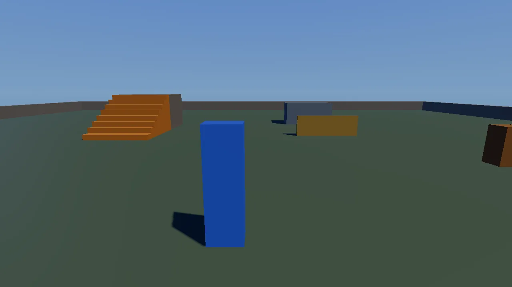

# Starter game template

The starting point for your own game: a character you walk, run, jump,
vault and climb with, a third-person camera that never goes through walls,
and a small level built in Lua: a walled floor, stairs up to a platform, a
fence to vault, a block to climb and a pile of crates to push. The level
and the rules live in `scripts/game.lua`, which reloads while the game
runs.

This folder is what `tools/new_game` copies, so it is the starting point
for **any game you make with KKE**: a platformer, an adventure, a puzzle
game, a physics toy. It is also the game every Lua recipe in
[docs/cookbook](../../docs/cookbook/index.md) is written for and tested in.
It teaches the basic shape every KKE game has: a list of engine modules,
one small C++ module of your own, and Lua for everything else.



## Run it

The template builds as the executable `starter_game` (`set(GAME_NAME
starter_game)` in [CMakeLists.txt](CMakeLists.txt)). The root
CMakeLists.txt builds it when `KKE_ENABLE_JOLT` and `ENGINE_ENABLE_LUA`
are on, which they are by default:

```sh
cmake --workflow --preset default
cd build/bin && ./starter_game
KKE_SKIP_INTRO=1 ./starter_game       # skip the engine's logo intro
KKE_MOOD=night ./starter_game         # try another mood without editing
```

To make your own game from it (from the repository root):

```sh
tools/new_game my_game     # copies this folder to games/my_game
cmake --build build
cd build/bin && ./my_game
```

To check it without looking at it (a script error fails it):

```sh
tools/check_game starter_game
```

It prints what the scripts printed, every warning and error, then `OK` or
`FAILED`.

## Controls

Click the view to take the mouse (Esc lets it go). The controls are
`InputModule::defineCharacterActions`, the engine's standard character
actions, so they can be rebound and saved in `input.json`.

| Action | Keyboard and mouse | Controller |
|---|---|---|
| Move (relative to the camera) | WASD | left stick |
| Look | mouse | right stick |
| Jump (vault a fence, climb a block in front of you) | Space | A |
| Sprint | Left Shift (hold) | click the left stick (toggle) |
| Walk | Left Alt (hold) | push the left stick part of the way (the speed follows the stick) |
| First or third person | V | click the right stick |
| Show or hide the guide card | H | d-pad down |
| Developer panels (Scripts panel and console, stats) | F1 | none: a developer tool, keyboard only |
| Let go of the mouse | Esc | (not needed) |

## How it plays

There are no rules yet: that is your job. You spawn at (0, 0.1, 6) facing
the level. Walk up the stairs, vault the fence, climb the block, push the
crates. Fall off the world (below y = -20) and you are put back at the
spawn point. The console prints a welcome line when the scripts start.

A card in the corner says what this game is for: the starting point for
yours, where the level comes from (`scripts/game.lua`) and how to make a
copy (`tools/new_game`). It is [scripts/guide.lua](scripts/guide.lua), a
small example of on-screen text from Lua (`ui.open`) and of your own
button (`input.define`); H or the d-pad down hides it, and you can delete
the file when your game no longer needs it.

## How it works

### Startup and the frame

[main.cpp](main.cpp) makes a 1280 x 720 `kke::Application` called "Starter
Game", sets the `playful` mood (sky, sun, fog and colour look from
`assets/moods/playful.yaml`, [docs/MOODS.md](../../docs/MOODS.md)) and adds
the modules in this order:

| Module | What it gives the game |
|---|---|
| `SettingsModule("settings.json")` | graphics, audio and accessibility settings |
| `InputModule("input.json")` | rebindable actions for keyboard, mouse and controllers |
| `RigidBodyModule` | Jolt physics: static level blocks, crates, the character controller (`physics.*` in Lua) |
| `ModelModule` | 3D models (`models.*` in Lua) |
| `UiModule` | RmlUi HUDs and menus (`ui.*` in Lua) |
| `AudioModule` (panel hidden) | sound; impact sounds for bodies with a material |
| `PhysicsModule` and `PhysicsBridgeModule` | only with `KKE_ENABLE_FEMFX` (the `everything` preset): things that really break (`breakable.*` in Lua) |
| `ScriptModule(folder)` | runs `scripts/*.lua` and reloads them when saved |
| `starter::PlayerModule` | your module: the character and the camera |
| `StatsModule` | frame stats in the F1 panels |

The application sorts the modules so that every module's dependencies
come before it (`Application::resolveInitOrder`, otherwise keeping the
order they were added) and uses that order for `init` and for `update`
each frame, then draws.

### Where the scripts come from

The CMakeLists.txt passes two paths to the compiler:

```cmake
target_compile_definitions(${GAME_NAME} PRIVATE
    GAME_SCRIPTS_SOURCE="${CMAKE_CURRENT_SOURCE_DIR}/scripts"
    GAME_SCRIPTS_INSTALLED="games/${GAME_NAME}/scripts")
```

main.cpp uses the source folder when it exists (you are developing: edit
the file in `games/<name>/scripts/` and the running game sees it) and the
copy next to the executable otherwise (a game you shipped). The build
copies every file in `scripts/` there. `KKE_SCRIPTS_DIR=<folder>`
overrides both (this is how `tools/docs_site/run_recipes.py` runs each
recipe in its own folder).

### Hot reload

`ScriptModule` checks the files' modification times twice a second. When
one changes it unloads that script, releasing everything it made (bodies,
models, UI documents, hooks, timers), and runs it again, so the level is
rebuilt, never built twice. An error shows the file and line in the log
and in the Scripts panel (F1), and the game keeps running. Hot reload is a
developer tool: a `KKE_SHIPPING` build compiles it out
([docs/ANTI_CHEAT.md](../../docs/ANTI_CHEAT.md)). C++ changes need a
rebuild and a restart.

### The player (PlayerModule)

[PlayerModule.h](PlayerModule.h) / [PlayerModule.cpp](PlayerModule.cpp) is
the only C++ that belongs to the game. It declares its dependencies
(`RigidBodyModule` and `InputModule` required, `ScriptModule` optional)
and in `init`:

1. defines the standard character actions on player 1's input map, plus
   `panels` on F1, and calls `commitDefaults()` (what rebinding compares
   with);
2. adds a Jolt **character capsule** at `spawn` and wraps it in a
   `kke::Locomotion`, the engine's movement
   ([docs/MOVEMENT.md](../../docs/MOVEMENT.md));
3. sets up a `kke::CameraRig` in third-person mode, pitched 12 degrees
   down;
4. builds the body: the engine's mannequin (`PlayerBody`, below), or two
   boxes (a blue torso and a dark visor on the front, so you can see
   which way it faces) when `assets/animations/UAL1_Standard.fbx` is
   missing;
5. turns off quit-on-Escape (Esc frees the mouse instead);
6. registers the Lua bindings.

Each `update`:

1. **Look**: the mouse (only while captured) at 0.12 degrees per pixel,
   plus the stick at up to 200 degrees per second (70% of that
   vertically).
2. **Camera toggle** (V): third person or first person.
3. **Move**: the stick or WASD becomes a direction relative to where the
   camera looks, flattened and clamped to length 1:

   ```cpp
   li.move = m_rig.forward() * move.y + m_rig.right() * move.x;
   li.move.y = 0.0f;
   if (glm::length(li.move) > 1e-3f) li.move = glm::normalize(li.move) * std::min(1.0f, glm::length(move));
   ```

4. **Jump** is queued when pressed and passed as `goUp`. Locomotion
   decides what it becomes from what is in front of the character: a
   jump, a vault over the fence or a climb onto the block.
5. `Locomotion::update` moves the capsule; below y = -20 it is teleported
   back to the spawn.
6. The camera rig follows the feet. It asks Jolt (a ray cast) how far it
   can go back before hitting something, so it never goes through walls.

`render` and `renderShadow` draw the body at the capsule's feet, turned to
`facingYaw()`; in first person the body is not drawn.

### The body (PlayerBody)

[PlayerBody.cpp](PlayerBody.cpp) loads the mannequin and gives it an
`kke::Animator`: a blend space from idle through walk and jog to sprint
(at Locomotion's own speeds, so the feet don't slide), and jump, fall and
land clips. Each frame it picks the clip from `Locomotion::state()`, then
`kke::CharacterIk` puts the feet flat on what is under them, the hands on
the edge of a fence or block while vaulting or climbing, and leans the
body into speeding up and turning ([PROCEDURAL_ANIMATION.md](../../docs/PROCEDURAL_ANIMATION.md)).
The model follows `characterDrawPosition`, like the camera, so it never
steps at the physics rate. In first person it is hidden.

### The `player` table in Lua

`registerLua()` adds three functions to the scripts' `player` table with
`ScriptVM::registerFunction(table, name, lambda)`. Each lambda reads its
arguments from the Lua stack, pushes its results and returns how many:

```cpp
vm.registerFunction("player", "position", [this](lua_State* L) {
    kke::ScriptVM::pushVec3(L, m_rigid->world().characterPosition(m_player));
    return 1;
});
```

| Lua | Does |
|---|---|
| `player.position()` | the feet's position, a `Vec` |
| `player.teleport(pos)` | moves the character there (to the spawn when `pos` is missing) |
| `player.facing()` | the flat direction the character faces, a `Vec` |

This is the pattern for your own bindings: when Lua needs something only
your C++ knows, add a function here. The cookbook game
([games/cookbook](../cookbook/README.md)) registers the same three, so
recipes run in both.

### The level (scripts/game.lua)

[scripts/game.lua](scripts/game.lua) builds everything with `physics.box`:
static boxes for the ground (40 x 40 m), four low walls, eight 25 cm
stairs up to a platform, a fence to vault and a block to climb, and six
dynamic 60 cm crates (density 150, wood) to push. Blocks get an audio
material from `audio.materials()` (Stone by default, Wood for the fence
and crates), so bumping them makes the right sound. A `hook.Add("Init",
...)` prints the welcome line. The full Lua API is in
[docs/SCRIPTING.md](../../docs/SCRIPTING.md).

## Design decisions

- **The level is Lua, the player is C++.** The comment in main.cpp: the
  engine's modules do the heavy lifting, `PlayerModule` is yours, and
  the level and rules live in Lua, which reloads while the game runs.
  AGENTS.md's rule "Lua first" says the same: C++ only for what Lua
  cannot do.
- **The body is the mannequin.** Quaternius' CC0 Universal Animation
  Library ships with the engine, so every game starts with a person who
  walks, runs, jumps and puts their feet on the steps, not a block (Kees,
  2026-09-28: "replace all the cubes"). `PlayerBody` is one small file to
  swap for your own character; the block stays as the fallback.
- **Scripts from the source folder while developing.** Saving the file you
  are editing is enough; no copy step, no rebuild. The copy next to the
  executable is the fallback for a shipped game.
- **The standard character actions.** `defineCharacterActions` gives
  keyboard, mouse and controller bindings in one call, rebindable by the
  player, instead of each game inventing its own.
- **Stick forward is camera forward.** Movement is relative to the camera,
  and in first person the character turns with the view.
- **`tools/new_game` edits only names.** It replaces `GAME_NAME` in
  CMakeLists.txt, the window title in main.cpp and the id and title in
  game.json, writes a short README.md that points back here, and
  appends one `add_subdirectory` line to `games/my_games.cmake`. Nothing
  else in your copy needs editing to start.

## Tuning

| What | Where | Effect |
|---|---|---|
| `spawn` (0, 0.1, 6) | PlayerModule.h | where you start and respawn |
| `m_mouseSensitivity` (0.12) | PlayerModule.h | degrees per pixel of mouse |
| `m_stickSpeed` (200) | PlayerModule.h | degrees per second at full stick |
| `m_rig.pitch` (-12) | `PlayerModule::init` | the camera's starting tilt |
| respawn height (-20) | `PlayerModule::update` | how far you fall before respawning |
| `app.setMood("playful")` | main.cpp | the sky and light; or `KKE_MOOD=<name>` |
| sizes, colours, positions | scripts/game.lua | the level; save to see it |

Walking, running, jumping and vaulting speeds are Locomotion's settings
([docs/MOVEMENT.md](../../docs/MOVEMENT.md)).

## Engine features it uses

| Feature | Header / module | Doc |
|---|---|---|
| Character movement, vault, climb | `kke::Locomotion` ([kke/Locomotion.h](../../engine/include/kke/Locomotion.h)) | [MOVEMENT.md](../../docs/MOVEMENT.md) |
| Third / first person camera | `kke::CameraRig` ([kke/CameraRig.h](../../engine/include/kke/CameraRig.h)) | [cookbook/cameras.md](../../docs/cookbook/cameras.md) |
| Jolt physics, character controller | `RigidBodyModule`, `kke::RigidWorld` | [cookbook/physics.md](../../docs/cookbook/physics.md) |
| Rebindable input | `InputModule` | [INPUT.md](../../docs/INPUT.md) |
| Lua scripts, hot reload, your own bindings | `ScriptModule`, `kke::ScriptVM` | [SCRIPTING.md](../../docs/SCRIPTING.md) |
| Moods | `Application::setMood` | [MOODS.md](../../docs/MOODS.md) |
| Impact sounds | `AudioModule` | [AUDIO.md](../../docs/AUDIO.md) |
| Breakables (optional) | `PhysicsModule`, `PhysicsBridgeModule` | [PHYSICS_BRIDGE.md](../../docs/PHYSICS_BRIDGE.md) |

## Assets

No Synty packs and no sound files: the level is boxes made in Lua and
sounds are synthesised. The body is the mannequin from
`assets/animations/UAL1_Standard.fbx` (Quaternius, CC0), which the engine
copies next to every game. The
build copies the Noto Sans fonts (`assets/fonts/`) and the shaders next to
the executable for the UI.

## Make a game like this

1. `tools/new_game my_game` (lower-case letters, digits and `_`, starting
   with a letter; names the engine already uses are refused), then
   `cmake --build build` and `cd build/bin && ./my_game`.
2. Change the level in `games/my_game/scripts/game.lua` while the game
   runs. Start with the tutorials:
   [Make your own game](../../docs/tutorials/getting-started.md), then
   [the tutorials](../../docs/tutorials/index.md).
3. Add rules, a HUD, pickups and saving in Lua. Copy the closest recipe
   from [docs/cookbook/recipes](../../docs/cookbook/recipes/) into your
   `scripts/` folder.
4. Only when Lua cannot do something, add C++: a new binding in
   `PlayerModule::registerLua`, or a module of your own added in main.cpp
   ([skills/cpp-module](../../skills/cpp-module/SKILL.md)).
5. Change the name, description and tags in `game.json` (the marketplace
   listing).

Pitfalls:

- New files in `scripts/` are picked up by the running game, but the copy
  next to the executable only updates when you build (CMake's file glob
  re-runs then).
- Scripts must build their level at the top level of the file (or in
  hooks) so that a reload can release and rebuild it; keep state you want
  to survive a reload in `store.*` or `shared`.
- `player.*` exists only because PlayerModule registers it. If you replace
  PlayerModule, register the same functions or recipes that use them stop
  working.

## Files

| File | What is in it |
|---|---|
| [main.cpp](main.cpp) | The modules the game is made of, the mood, where scripts are read from |
| [PlayerModule.h](PlayerModule.h) | The player module's class: spawn point, look speeds |
| [PlayerModule.cpp](PlayerModule.cpp) | Input, movement, camera, the `player.*` Lua functions |
| [PlayerBody.h](PlayerBody.h), [PlayerBody.cpp](PlayerBody.cpp) | The animated mannequin: which clip for what Locomotion does, feet and hands by `kke::CharacterIk` |
| [scripts/game.lua](scripts/game.lua) | The level and the rules |
| [scripts/guide.lua](scripts/guide.lua) | The card that says what this game is for (delete it when you like) |
| [CMakeLists.txt](CMakeLists.txt) | The executable (`GAME_NAME`), the script paths, files copied next to it |
| [game.json](game.json) | The marketplace listing: id, title, description, tags, modules |
