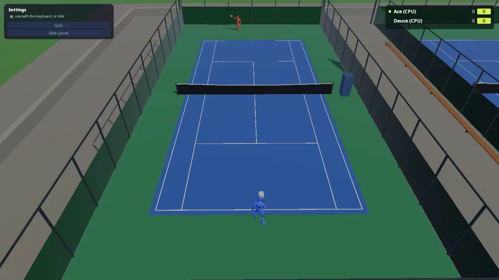

# Tennis

Singles and doubles on a hard court, in a sport center of ten courts. You
play the CPU, or up to four people play on one screen, split in two or
four, or online with people on other PCs (and their friends on the same
screen as them). The ball is a FEMFX soft body, and so are the racket's
strings: the ball flattens on them and on the court and wobbles back, and
the strings give a pocket and ring. Every swing is made on the spot, with
no animation clips: you hold a shot button to take the racket back (the
longer, the harder, if your legs have it) and let go to swing; when you
let go decides whether you meet the ball dead on, early or late. Fourteen
strokes, from topspin drives and slices to volleys, smashes and three
serves, each with its own path, speed and timing window, picked from
where the ball is. Running flat out and hitting hard tire you: tired
players run slower, hit softer and time worse. The score is real tennis: deuce and advantage, tiebreaks, lets,
double faults, changing ends.

The demo teaches how to put a FEMFX object into a game that needs exact
numbers (the ball's flight is the game's own maths; FEMFX gives it its
body), a CPU player whose footwork is pure logic you can unit-test, rules
as a small state machine the whole game listens to, procedural swings
(two-bone IK and a turning, crouching body) with no animation clips, a
FEMFX object pinned in a frame, the start menu with local players and CPU
players, and online play where every machine flies the ball from the same
hit. Start here for a sports game, any game with a ball, or any game
where a soft body has to go exactly where the rules say.



Or pick **Sport center** in the menu: walk about all ten courts, step up
to a free court's gate to play (someone else at the gate is your
opponent, or play the CPU), watch the CPU players' matches with a crowd
of up to 100 people who sit, stand and cheer, and see who has won most
on the board. Online, the host's sport center is everyone's: people from
every screen walk about together, meet at a gate and play each other.

## Run it

The executable is `tennis` (`kke_add_game(tennis ...)` in
[CMakeLists.txt](CMakeLists.txt)). The root `CMakeLists.txt` adds it when
`KKE_ENABLE_JOLT`, `KKE_ENABLE_FEMFX` and `KKE_ENABLE_NET` are all on: the
`everything` presets. FEMFX has no ARM port yet, so there is no Android
build.

```bash
cmake --build build --target tennis
cd build/bin
./tennis
KKE_SKIP_INTRO=1 ./tennis                            # skip the logo intro
KKE_TENNIS_BOTS=1 KKE_TENNIS_QUIT=120 ./tennis       # watch two CPU players, with a log
KKE_TENNIS_BALLTEST=1 ./tennis                       # the ball's test shots, logged
KKE_TENNIS_CENTER=1 KKE_TENNIS_BOTS=1 KKE_TENNIS_CROWD=100 ./tennis  # the whole sport center, CPU players only
KKE_NET=host KKE_NET_NAME=Pip ./tennis                # host an online match...
KKE_NET=join:127.0.0.1 KKE_NET_NAME=Rook ./tennis     # ...and join it from a second terminal
```

| Variable | Effect |
|---|---|
| `KKE_TENNIS_BOTS=1` | CPU players only, no menu (a demo that plays itself) |
| `KKE_TENNIS_DOUBLES=1` | four players, two a side |
| `KKE_TENNIS_LEVEL=0..3` | the CPU players' level when there is no menu: Easy, Normal (default), Hard, Expert |
| `KKE_TENNIS_GAMES=<n>` | games to win the set, over the menu's choice |
| `KKE_TENNIS_LOBBY=0` | skip the menu: you against one CPU player |
| `KKE_TENNIS_QUIT=<s>` | quit after that many seconds of play, logging the score every 10 s and every call |
| `KKE_TENNIS_SEED=<n>` | the CPU players' dice (default 1) |
| `KKE_NET=host` / `KKE_NET=join:ADDRESS` | host, or join a host, at startup ([docs/NETWORKING.md](../../docs/NETWORKING.md)); `KKE_NET_NAME=<name>` is player 1's name |
| `KKE_TENNIS_CENTER=1` | the sport center instead of one match (the menu's Play row) |
| `KKE_TENNIS_CROWD=<n>` | how many CPU people walk about the sport center and watch (the menu's Crowd row: 0, 20, 40 or 100) |
| `KKE_TENNIS_EMPTY=1` | the sport center's free courts stay empty (no CPU matches) |
| `KKE_TENNIS_WAIT=<n>` | hosting: start the match by itself once `n` people have joined (tests) |
| `KKE_TENNIS_AUTOPLAY=1` | the players at this screen are played by the CPU (tests: two copies that play each other online; in the sport center, walk to a free gate and play the CPU) |
| `KKE_TENNIS_BALLTEST=1` | no match: seven scripted shots (a drop, a groundstroke, into the net, a serve, both fences, the roof), every contact logged with how far the FEMFX body is from the flight |
| `KKE_TENNIS_SWINGLOG=1` | a log line for every hit: the stroke, the timing error and word, the spacing, the quality, the power, the stamina |
| `KKE_TENNIS_STRINGTEST=1` | one string bed on its own hit by a 30 m/s ball every 2 s, and every racket's pocket, logged in mm |
| `KKE_TENNIS_CLOSEUP=<n>` | the camera side-on to player `n` (0 = the first), close: for looking at swings |
| `KKE_TENNIS_POSE=<stroke>,<f\|b>,<t>` | player 1 held in one moment of a stroke, e.g. `drive,b,-1` (a backhand drive's full takeback) or `flat serve,f,0` (contact); names as `strokeName` in [Swing.cpp](Swing.cpp) |
| `KKE_ANIMATIONS_DIR` | where to look for `UAL1_Standard.fbx` and `UAL2.fbx` |
| `KKE_ASSETS_DIR` | also searched for `Universal Animation Library 2/Unity/UAL2.fbx` |

Rebindings are saved to `tennis_input.json` and the menu's choices to
`tennis_lobby.json` (the names passed in [main.cpp](main.cpp)).

## Controls

All bindings are made in `TennisModule::defineControls`
([TennisModule.cpp](TennisModule.cpp)), the same for players 1 to 4, and
are rebindable actions in the "Shots" and "Game" groups.

| Action | Keyboard / mouse | Controller |
|---|---|---|
| Run (`move`) | WASD | left stick |
| Topspin, the all-round shot; also the toss and the serve (`tennis.topspin`) | Space / left mouse | A (south) |
| Flat: hard and fast (`tennis.flat`) | J | X (west) |
| Slice: low and slow (`tennis.slice`) | K / right mouse | B (east) |
| Lob: over their head (`tennis.lob`) | L | Y (north) |
| Back to the menu (`tennis.menu`; online, a client leaves the game; in the sport center, leave the court, the other side winning) | Esc | Back |
| Developer panels (`panels`) | F1 | none |

- **A shot.** Press and hold a shot button as the ball comes: the racket
  goes back and the shot builds power (the power bar, bottom left; you
  move slower while you hold). Let go to swing. The forward swing takes
  0.1 to 0.25 s depending on the stroke, so let go that long before the
  ball reaches your hitting spot, a little in front of you. The word
  bottom left says how it went: Perfect, Early, Late, Very early, Very
  late. Too early or too late by more than about 0.12 to 0.18 s and you
  miss it.
- **Which stroke** is picked for you from where the ball is and the
  button: a high ball before the bounce is a smash, near the net a volley,
  just after the bounce and low a half volley, far to the side a stretch;
  otherwise Topspin is a drive, Flat a flat drive, Slice a slice, Lob a
  lob (the CPU players also play drop shots). Forehand or backhand is
  the side the ball is on.
- **Aim** with the stick (or WASD) as you hit: left and right is across
  the court, forward is deeper, back is shorter.
- **The serve.** Stand still and hold a shot button: the ball goes up and
  the racket goes back. Let go to swing; the best serve meets the ball
  near the top of the toss. Topspin and Lob serve a kick serve (high and
  safe, always the second serve's pick), Flat the fastest, Slice one that
  swings wide. Let the ball drop and you catch it and toss again.
- **Stamina** (the green bar, bottom left) goes down when you run faster
  than a jog and with every swing (more the harder), and comes back
  slowly in a rally and quickly between points. Tired, you run slower,
  can't build full power, your timing window shrinks and your aim
  wanders.
- **Swing timing** in the menu: Relaxed (a wider window), Normal, Pro (a
  narrower one), or Automatic (the swing lets go by itself at the right
  moment; you pick the shot, the power and the aim).
- The HUD's hints show the right glyph for the device each player last
  touched (`InputModule::promptText`).
- The engine's character actions this game doesn't use (jump, sprint,
  fire, look and so on, and `voice.talk`) have their bindings cleared.

## How it plays

- **The menu.** Controllers press A to join, up to four players, each
  with a name and a colour. Player 1 picks one match or the sport center
  (with its crowd and whether CPU players take the free courts), the CPU players (0 to 3, Easy
  to Expert), the match length (a short set to 4 games, a set to 6, best
  of three short sets, or quick: to 2), the teams (across the net, or all
  the people at this screen on one side against the CPU) and the helping
  hand, and the swing timing. Two players make singles; three or four make doubles (filled up
  with CPU players).
- **The sport center** (the menu's Play row). Everyone at this screen
  walks the promenade between the courts (split screen for two or more,
  the camera behind each). A court's gate is at its end by the
  promenade: stand there and press Topspin to play on it. A second person
  at the gate is your opponent (a few seconds' countdown lets a third and
  fourth join for doubles); Lob plays the CPU now, Slice leaves. CPU
  players take any court nobody wants and hand it over at the end of a
  point when someone waits (the two middle courts stay free while anyone
  here plays). The crowd (the Crowd row) strolls, picks a court with a
  match on, sits on a bench or stands beside it, and cheers or groans at
  every point. After a match its players walk off at the gate, and every
  match won goes on the board top right, "Matches won here".
- **Scoring.** Real tennis ([Rules.cpp](Rules.cpp)): 15, 30, 40, game;
  deuce and advantage (or no-ad); a tiebreak to 7, two clear, at 6 games
  all (or 4 all, or 2 all); the serve changes every game and every two
  points of a tiebreak; ends change after every odd game and every 6
  tiebreak points; in doubles the partners take turns serving.
- **The umpire.** A serve must land in the box diagonally across; out is
  a fault, two are a double fault; one that clips the net and lands in is
  a let. The return waits for the serve's bounce. In a rally the ball may
  be taken out of the air or after one bounce, never after two, and
  nobody hits it twice. Out, the fence or the roof before it bounces: the
  hitter loses the point. A ball that stops dead counts as bounced twice
  where it lies.
- **The helping hand** (on by default): when you let go of the stick
  while the ball is coming to you, you walk to meet it, your reach is
  0.45 m longer and a hit is never worse than fairly good. Off, it's all
  you.
- **The CPU players** read your shot after a reaction time, run to where
  the ball can be met, pick a shot (lobs when you're at the net, drop
  shots when brave, slices, flats, topspin) and aim away from you. Their
  levels differ in speed (3.6 to 6.2 m/s), reaction time (0.45 to 0.1 s),
  how straight they aim, how hard they hit and how close to the lines
  they go ([Bot.cpp](Bot.cpp) `BotSkill::forLevel`).

## How it works

### Startup and the frame

[main.cpp](main.cpp) sets the mood `clear_day` and adds the modules in
this order: Settings, Input, RigidBody (Jolt), Physics (FEMFX, metre
scale, no demo objects, its own ground drawing off), Model, Ui, Audio,
Lobby, Net, DemoPanel, Tennis, Stats. The order matters once: fixed
updates run in add order, so FEMFX has stepped the ball before
`TennisModule::fixedUpdate` reads it.

Each fixed step (`TennisModule::fixedUpdate`, `stepMatch` in
[Play.cpp](Play.cpp)): the ball moves and reports what it touched, the
umpire hears it, every player thinks (CPU) or reads the controls (people),
runs and maybe hits. Each frame (`update`): the menu, the controls, the
bodies' animation and IK, the cameras, the HUD.

### The ball: our flight, FEMFX's body

[Ball.cpp](Ball.cpp). The first version let FEMFX fly the ball, and the
ball test measured why that can't work for tennis: FEMFX's implicit
solver is made for soft, heavy things, and on a 57 g ball it lost most of
gravity (a 2 m drop reached the court at 1.2 m/s instead of 6.2) and
nearly all of the bounce, and a 30 m/s shot passed through a thin wall
between two steps. So the ball is two parts:

- **The flight** is worked out in `Ball::step` each fixed step, in small
  steps (2 cm at most, so a 60 m/s serve can't jump the net tape): gravity
  plus the spin's pull, air drag, the court's bounce, the net (the tape
  lets it roll over slowly; the mesh stops it and drops it), the fence
  and the invisible roof (they take most of its speed). Every rule, the
  CPU and, later, the network read this one.
- **The body** is a FEMFX tet-mesh sphere (`buildSphere(4, 0.045)`,
  rubber of 400 kg/m³ and a stiffness of 1e4) that `steerBody` pushes
  along the flight each step: every vertex gets the same push, so only
  the whole ball moves and the squash and the wobble stay FEMFX's. A hit
  (`Ball::strike`) gives every vertex the new velocity plus a turn about
  the centre (spin) and a squeeze along the hit that grows with the
  distance from the centre, so the strings flatten it and FEMFX springs
  it back. The body stays within about 5 cm of the flight (10 cm at a
  hard hit), and FEMFX's own ground plane and the court's boxes squash it
  where it lands.

The engine calls it uses are new and general
([PhysicsModule.h](../../engine/include/kke/modules/PhysicsModule.h)
"Steering a whole object"): `objectMotion`, `changeVertexVelocities`,
`translateObject`, `resetObject`.

Every court also gives FEMFX boxes for its fence walls (2 m thick),
its roof at 14 m and its net (`Ball::courtBoxes`, one
`setExternalBoxes` call for all ten courts): the flight never leaves the
court, and the body can't either.

### The maths everyone agrees on

[Shot.cpp](Shot.cpp) is pure maths, tested in
[tests/test_tennis.cpp](../../tests/test_tennis.cpp):

- `Flight`: position and velocity at any time, in closed form, with
  gravity, a spin's extra pull and linear air drag (0.4 per second: a
  25 m/s drive loses about a third by the far baseline). When it comes
  down to a height, when it crosses the net.
- `bounce`: 75% of the vertical speed back (the ITF's 2.54 m drop comes
  back to 1.35-1.47 m), 62% of the speed along the court (a medium-paced
  hard court); 40% of the spin's pull is left after.
- `planShot`: the launch velocity that lands a ball exactly on a target
  at about a speed, raising the arc until it clears the net by a margin.
- `meetPoint`, `meetOnArc`: where a player takes a ball after its bounce,
  waist high on the way down, or earlier when it would carry them too
  deep.

### Swings and hitting

[Swing.h](Swing.h) is pure maths (tested): the fourteen strokes, each a
`StrokeShape` (the racket head's path through ready, takeback, slot,
contact and finish in the body's frame, the face's angle, how far the
shoulders turn and the knees bend, how long the takeback, forward swing
and follow-through take, the timing window, how fast and how steady),
`pickStroke` (which stroke fits the ball), `racketAt` (where the racket
and body are at a moment of the swing: a curve through the slot, mirrored
for a backhand) and `Stamina`.

A swing runs on one clock, t: -2 to -1 the takeback (held as long as
the button is), -1 to 0 the forward swing (from the release, taking
`forward` seconds), 0 contact, 0 to 1 the follow-through. `stepPlayer`
and `stepSwing` in [Play.cpp](Play.cpp): on release the contact time is
known (`contactAt`); when the ball crosses the hitting plane (a distance
in front of the body, or a height for an overhead) within reach, that is
`crossAt`. The timing error is `contactAt - crossAt`; within `maxError`
it's a hit (`hitBall`), otherwise a miss. Quality is spacing (the ball an
arm and a racket to the side, between knee and shoulder) times timing
(`timingQuality`: 1 dead on, ~0.8 at the window's edge). The target is the
aim plus a wobble that grows as quality drops and with tiredness; early
pulls it across the body, late pushes it wide. The stroke scales the
speed and the wobble; `planShot` gives the velocity; the harder the hit,
the more the strings squash the ball. CPU players (and Automatic timing)
let go themselves, when the ball is `forward` seconds from the plane,
plus a timing error drawn from their level (`BotSkill::timing`: 55 ms
Easy to 18 ms Expert).

### The strings

[Strings.h](Strings.h), [Strings.cpp](Strings.cpp). Each racket's string
bed is a FEMFX slab (6 x 7 cells, 4 cm thick; thinner ones jitter)
whose rim is pinned in the frame (`TetSpawnOptions::pinnedVerts`) and
stretched 3% into it (`moveVertices`), so it has tension like strings.
The slab stays still 150 m above the sport center, never drawn; the
16 x 19 strings are ribbons drawn on the racket from points embedded in
it (`kke::embedPoints`, `deformEmbedded`), moved along the face's normal
as the slab bends. A hit pushes the slab's vertices around the contact
point in proportion to the ball's speed; FEMFX bends it into a pocket
(about 17 mm for 30 m/s, measured with `KKE_TENNIS_STRINGTEST`) and lets
it ring out over ~0.4 s, and then it is put to sleep (`sleepObject`;
FEMFX never sleeps a lone object by itself). A real pocket lasts about
5 ms, less than a frame: these strings are softer, so it can be seen.

### The CPU player

[Bot.cpp](Bot.cpp) has no engine in it: it is told where the ball is
going (a `Flight`), where it stands, where the opponent stands and what
the rules allow, and answers where to run, how urgently, and whether to
arm a shot, which, aimed where. The test drives a Hard bot at its own
speed toward what it says against 60 random shots and checks it reaches
at least 90%.

### Bodies and swings

[Body.cpp](Body.cpp). The players are the UAL mannequin with its idle,
walk, jog and sprint clips blended by speed, UAL2's side steps when that
pack is there, and sitting, cheering and groaning. There are no swing
clips: `racketAt` gives the racket head's place, and the body follows it.
The pelvis and spine turn (30% / 70%) with the shoulders, the hips drop
and two-bone IK keeps the feet planted, the right arm reaches the head
with two-bone IK, and the left hand joins the grip for a two-handed
backhand, throws the toss, points up at a smash or cradles the racket at
the ready. The racket face opens for slice and lob and closes for
topspin. The racket is POLYGON Shops' tennis racket when that pack is
there (its flat string sheet taken out: the FEMFX strings go there), or a
mesh built in code.

### The sport center

[Court.cpp](Court.cpp), [Scene.cpp](Scene.cpp). Ten courts to ITF size in
two rows of five, one scene, with a green surround, lines, net and posts,
fences with windscreens (see-through: `drawTranslucent`), an umpire's
chair, floodlights, benches along the promenade between the rows, and
spectators' seats beside every court and a standing row behind the
promenade end. The fences and floodlight poles are Jolt walls, so people
can't walk onto another court or through a pole.

[Center.cpp](Center.cpp) runs it. Everyone out of a match is a `Walker`
(a Jolt character and a `Body`): a person at this screen, moved by the
stick relative to their camera, or one of the crowd. Each court has a
`Gate` (who waits, the countdown); `startCourt` turns the people waiting
into a match (hiding their walkers and removing their capsules),
`endCenterMatch` counts the win and puts them back at the gate. Matches
come and go, so player slots are reused (`Player::alive`).

The crowd is three states: stroll to a spot on the promenade, go to a
free seat by a court with a match on (seats beside a court are in the
gap between two fences, so they walk to the gap's mouth first and back
out the same way), and watch for 25 to 75 s, facing the court. A point
on the court they watch sets them cheering (three in four) or groaning.
Each seat is held by one walker (`m_seatTaken`), so nobody stands in
anybody. The walkers' camera pulls in in front of a pole or a fence
(a Jolt raycast from the head), so it never sits inside one.

Cost, 100 in the crowd and ten matches: each person is a skinned
mannequin (skinned on the CPU by `ModelModule`) and a Jolt character;
the ten balls are ten FEMFX bodies. On the software renderer the CI uses
it runs at 3 to 4 frames a second, all of it waiting on the renderer;
a real GPU is the test that counts.

### Online

Player 1 sets **Online** in the menu to **Host** or **Join** (the games
found on the network and on this PC are listed; pick one and press Join).
Everyone at each screen plays: a second person at a screen is a
`NetModule` local player, like the menu's seats. [Net.cpp](Net.cpp) has
the game's side, [NetTennis.h](NetTennis.h) the messages (event kinds
from `0x5400`).

- **Who plays.** The host's Start builds the match: its own seats, then
  everyone online, then the menu's CPU players, then more CPU players if
  a side is short. More than four people: the first four play. Its
  **Setup** says who plays where; each client builds the same match, its
  own seats played from its own controllers.
- **The CPU players are the host's.** It sends where they all are, every
  match's in one **Cpus** event ten times a second.
- **Each machine runs its own players** and sends where they are, where
  they face and how far into which swing (`toState`, a `NetPlayerState`
  with the swing's contact packed into its extra bytes). Everyone else's
  players are kinematic capsules put where their machine says.
- **The host is the umpire.** Its **Serve** starts each point (with a
  number, so a hit that arrives after the call is dropped) and its
  **Point** ends it with the result and the call; every machine applies
  that result to the same score. A client never calls a point from its
  own ball.
- **A hit is all the ball needs.** The hitter's machine plans the shot and
  sends **Hit** (where, the velocity, spin, pull); everyone, the hitter
  too, flies the ball from the numbers as they come off the wire, so the
  flights match to the bit (a test checks the bytes). The host checks a
  client's hit could happen (their turn, this point, this shot) before it
  passes it on. A serve's **Toss** goes the same way.
- **Drift is put right.** Five times a second the host sends its ball;
  a client more than 25 cm or 1 m/s off takes it, unless a hit of its own
  is on the way to the host.
- **Someone leaves:** the host ends the match for everyone (**End**) and
  all go back to the menu; a client's menu button leaves the game.
- **The sport center online.** When the host picks Sport center, every
  client walks in too (**Board** says it's on). The host runs every court:
  each match has its own number, so every event names the match it
  belongs to, and a Hit or a Toss names the player by their place in it.
  Each machine sends where its people walk; the others see them walk.
  At a gate, a client asks the host (**Gate**: join, leave, play the CPU
  now) and the host keeps the queues; its **Board**, twice a second, has
  how many wait at each gate, the countdowns and the wins. Someone who
  joins later gets the Board and a Setup for every match on, with the
  points so far, so they see the right score. The crowd is each screen's
  own: it only watches. Someone leaving mid-match forfeits it (the other
  side wins).

Tested with two copies on one PC, both played by the CPU
(`KKE_TENNIS_AUTOPLAY=1`, the commands in "Run it" plus
`KKE_TENNIS_WAIT=1 KKE_TENNIS_LOBBY=0 KKE_TENNIS_QUIT=70`): both logs make
the same calls after the same number of shots, rallies of 6 to 15 shots.
The sport center the same way, the host with `KKE_TENNIS_CENTER=1` (no
`KKE_TENNIS_WAIT`): each copy's person walks to a different free court's
gate and plays the CPU, and both logs show every court's matches.

### Cameras and the HUD

With people playing, each gets a camera behind their own baseline, high
enough to see over the net, that swings round when ends change; two
people split the screen, three or four split it in four. With only CPU
players (and in the menu) it's the TV view: high behind one end, both
baselines in sight. The HUD is RmlUi ([ui/tennis_hud.rml](ui/tennis_hud.rml),
[Hud.cpp](Hud.cpp)): the scoreboard with who serves, the umpire's call,
"Second serve" and "Tiebreak", and the controls for whoever is at this
screen.

## Design decisions

- **The flight is ours, the body is FEMFX's.** Measured above: FEMFX on
  its own can't give a tennis ball's numbers, and the rules, the CPU and
  a network all need one flight they agree on to the millimetre.
- **Linear drag.** Real drag grows with the square of the speed; linear
  drag is close over a rally's speeds and keeps every sum closed-form, so
  `planShot` lands exactly where it aims.
- **Press early, swing on arrival.** Timing a button to the exact frame
  is not fun on a TV; arming the shot and grading how early you pressed
  keeps timing a skill without being a lottery.
- **Procedural swings.** Kees has no tennis animations (they are
  expensive) and wants the fun to be in procedural ones: every stroke is
  a path, a body turn and IK, so it bends to wherever the ball really is.
- **Hold to take back, let go to swing.** The player measures the swing
  (how long to hold: power, costing stamina) and times it (when to let
  go); the stroke itself is picked from the ball so a pad has enough
  buttons. Automatic timing keeps it playable for anyone who wants only
  the tactics.
- **Hits, not a streamed ball, online.** Sending the hit and letting every
  machine fly the same maths costs one small message per shot and looks
  smooth at any latency; the host's ball a few times a second only mops
  up. Streaming the ball's position would lag it and jitter the squash.
- **Strings far away.** Carrying a FEMFX slab on a racket swinging at
  40 m/s would cost solver time and shake it; only the pocket matters, so
  the slab stays still and its shape is copied onto the racket.
- **No Synty courts yet.** The Shopping Mall pack Kees mentioned is not on
  the share; the courts are built from boxes. The racket is Synty's.

## Tuning

| What | Where | Value |
|---|---|---|
| Bounce: vertical kept, along kept | `BounceModel` in [Shot.h](Shot.h) | 0.75, 0.62 |
| Air drag | `kDrag` in [Shot.h](Shot.h) | 0.4 /s |
| Spin pull (topspin, slice, lob, drop, serve) | `spinPull` in [Shot.cpp](Shot.cpp) | 6, -2.5, 1, -1.5, 2 m/s² |
| Shot speeds | `speedFor` in [Play.cpp](Play.cpp) | flat 25-35, topspin 20-28, slice 15-20, lob 9-10.5, serve 30-46 m/s |
| Run speed, while charging | `kRunSpeed`, `kChargeSpeed` in [Play.cpp](Play.cpp) | 5.8, 3.6 m/s |
| Reach, helping hand's extra | `kReachMin`, `kReachMax`, `kReachHelp` | 0.2, 1.5, 0.45 m |
| Stroke paths, times, windows, speed, steadiness | `shapes()` in [Swing.cpp](Swing.cpp) | forward swing 0.1-0.25 s, window 25-50 ms, miss past 100-180 ms |
| Stamina costs and effects | `Stamina` in [Swing.cpp](Swing.cpp) | swing 0.015 + 0.05 x power², recovery 0.02 /s in a rally, 0.18 /s between points |
| Swing timing choice | `setTiming` | Relaxed 1.5x, Normal 1x, Pro 0.7x the window |
| CPU timing error | `BotSkill::timing` in [Bot.cpp](Bot.cpp) | 55, 38, 27, 18 ms |
| The strings | `stringMaterial`, `kStretch`, `kPush` in [Strings.cpp](Strings.cpp) | 1e4 stiffness, 3% stretch, 0.1 x the ball's speed |
| CPU levels | `BotSkill::forLevel` in [Bot.cpp](Bot.cpp) | speed, reaction, aim, power, risk |
| A CPU's aim wandering in a long rally | `tired` in `hitBall` ([Play.cpp](Play.cpp)) | +10 cm a shot after the 3rd |
| Sport center: walking, the crowd's stroll | `kWalkSpeed`, `kCrowdSpeed` in [Center.cpp](Center.cpp) | 4.2, 1.5 m/s |
| Sport center: gate reach, countdown, a court's rest before CPU players take it | `kGateReach`, `kGateCountdown`, `kCourtRest` | 3 m, 4 s, 6 s |
| The ball's body | `ballMaterial`, `buildSphere(4, ...)` in [Ball.cpp](Ball.cpp) | 400 kg/m³, 1e4 stiffness |
| How hard the body is steered | `steerBody` in [Ball.cpp](Ball.cpp) | 25 /s blend, 20 /s pull onto the path |

## Engine features it uses

- FEMFX soft bodies and the steering calls (`PhysicsModule`, see the
  [physics demo](../physics_demo/README.md))
- Jolt characters and walls (`RigidBodyModule`)
- The start menu (`LobbyModule`, [docs/LOBBY.md](../../docs/LOBBY.md))
- Input with four players, rebinding and button glyphs
  ([docs/INPUT.md](../../docs/INPUT.md))
- Skinned models, the animator and two-bone IK (`ModelModule`,
  [docs/PROCEDURAL_ANIMATION.md](../../docs/PROCEDURAL_ANIMATION.md))
- Split screen (`kke::splitScreen`)
- RmlUi for the HUD, the demo panel (`DemoPanelModule`,
  [docs/DEMO_PANEL.md](../../docs/DEMO_PANEL.md))
- Impact sounds (`AudioModule::playImpact`)
- Moods ([docs/MOODS.md](../../docs/MOODS.md))
- Online play with local players (`NetModule`: `sendEvent`, `relayEvent`,
  `addLocalPlayer`, `setLocalPlayer`, LAN search;
  [docs/NETWORKING.md](../../docs/NETWORKING.md))

## Assets

- The mannequin and its clips: `assets/animations/UAL1_Standard.fbx`
  (Quaternius' Universal Animation Library, CC0), in the repository.
- Side steps: `UAL2.fbx` (Universal Animation Library 2, CC0) from
  `assets/animations/` or `KKE_ASSETS_DIR`. Without it the log says so
  once at info level and players turn to run sideways.
- The ball's felt and seam: [textures/tennis_ball.png](textures/tennis_ball.png),
  made by [textures/make_ball_texture.py](textures/make_ball_texture.py).
- The racket: `SM_Prop_Sport_Tennis_Racket_01.fbx` and its atlas
  `PolygonShops_Texture_01_A.png` from Synty's POLYGON Shops pack, found
  anywhere under `assets/synty` or `KKE_ASSETS_DIR` (Synty packs are
  never in the repository). Without it the racket is built in code.
- Everything else (the courts) is built in code.

## Make a game like this

1. **Build with FEMFX** (`cmake --workflow --preset everything`) and copy
   the folder: `cp -r games/tennis games/my_sport`; rename the target,
   the namespace and the input and menu files.
2. **Keep the rules pure.** A `Rules.cpp` with no engine in it that hears
   "hit", "bounce", "net", "out" and answers who won the point is easy to
   test and easy to change (badminton, squash, volleyball).
3. **Own the flight, give FEMFX the body.** For any ball that must go
   where the rules say, fly it with your own maths (`Flight`, or your own)
   and steer the FEMFX body along with `changeVertexVelocities`; kick it
   with `strike`-like velocity fields for the squash.
4. **Write the CPU as pure logic** that gets a view and returns a
   decision, then test its footwork without a window.
5. **Online, send what happened, not where things are.** A hit, a toss,
   the umpire's call: small events every machine applies the same way
   ([Net.cpp](Net.cpp)); only people's poses stream.
6. **Read next:** [the physics demo](../physics_demo/README.md),
   [Climb Race](../climb_race/README.md) for more online play with local
   guests, [docs/LOBBY.md](../../docs/LOBBY.md).

## Files

| File | What's in it |
|---|---|
| [main.cpp](main.cpp) | The modules and the mood |
| [TennisModule.h](TennisModule.h), [TennisModule.cpp](TennisModule.cpp) | Players and matches, startup, controls, the frame, the ball test |
| [Play.cpp](Play.cpp) | A match's step: points, the umpire, people's controls, CPU players, serving, hitting |
| [Scene.cpp](Scene.cpp) | The sport center's meshes and walls, bodies, cameras |
| [Hud.cpp](Hud.cpp), [ui/tennis_hud.rml](ui/tennis_hud.rml) | The scoreboard, the calls, the hints |
| [Lobby.cpp](Lobby.cpp) | The start menu's fields and options |
| [Center.cpp](Center.cpp) | The sport center: walkers, gates, the crowd, CPU matches on free courts, the win board |
| [Net.cpp](Net.cpp) | Online: Host / Join rows, who plays, events in and out, other machines' players |
| [NetTennis.h](NetTennis.h), [NetTennis.cpp](NetTennis.cpp) | The online messages and how they are packed (tested) |
| [Rules.h](Rules.h), [Rules.cpp](Rules.cpp) | The score and the umpire (pure) |
| [Shot.h](Shot.h), [Shot.cpp](Shot.cpp) | Flights, bounces, planning a shot, where to meet a ball (pure) |
| [Court.h](Court.h), [Court.cpp](Court.cpp) | Court sizes, boxes, positions, the ten-court layout, seats |
| [Ball.h](Ball.h), [Ball.cpp](Ball.cpp) | The ball: its flight and its FEMFX body |
| [Bot.h](Bot.h), [Bot.cpp](Bot.cpp) | The CPU player (pure) |
| [Swing.h](Swing.h), [Swing.cpp](Swing.cpp) | The strokes, their paths and timing, stamina (pure, tested) |
| [Strings.h](Strings.h), [Strings.cpp](Strings.cpp) | The FEMFX string beds and the strings' ribbons |
| [Body.h](Body.h), [Body.cpp](Body.cpp) | The mannequin, its clips, the procedural swings, the racket |
| [textures/](textures/) | The ball's texture and the script that makes it |
